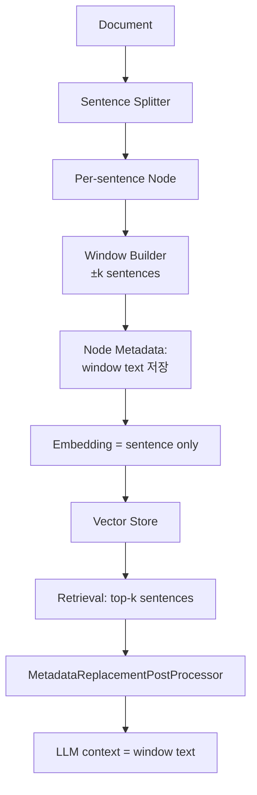

# Chunking Strategy - Sliding Window / Sentence-window Chunking

## 핵심 요약

Sliding-window chunking은 두 개의 의미로 사용된다: (1) 일반 청킹에서 인접 청크가 일정 비율 겹치도록 윈도우를 슬라이드시키는 **overlap 기법**, (2) LlamaIndex의 **Sentence-window Retrieval**처럼 검색 단위(문장)와 답변 합성 단위(문장 ± window)를 분리하는 **고급 retrieval 패턴**. 두 변형 모두 "경계에서 잘려나간 컨텍스트를 어떻게 복원할 것인가"라는 동일한 문제를 다룬다.

- **Overlap 변형**: chunk_size의 10~20%만큼 인접 청크와 겹쳐 경계 정보 손실 방지.
- **Sentence-window 변형**: 문장 단위로 색인하되 retrieval 시 ±k 문장의 윈도우를 LLM에 전달.
- **검색·합성 분리**: 작은 단위(문장)로 retrieval precision을 높이고, 큰 단위(윈도우)로 답변 컨텍스트를 풍부하게.
- **LlamaIndex `SentenceWindowNodeParser`**가 사실상 표준 구현.

## 컴포넌트 다이어그램

## 적용 단계

## 핵심 기능 및 서비스

| 기능 | 설명 |
|---|---|
| window_size | 중심 문장 좌우로 포함할 문장 수. LlamaIndex 기본 3 |
| chunk_overlap (일반) | 일반 청킹의 overlap. 10~20% 권장, 50~100 토큰이 표준 |
| MetadataReplacementNodePostProcessor | 검색된 문장을 metadata의 window text로 교체 |
| LlamaIndex 구현 | `SentenceWindowNodeParser` + `MetadataReplacementPostProcessor` |
| 효과 | retrieval precision↑(작은 단위) + answer recall↑(넓은 window) |

## 유사 기술 비교

| 항목 | Sentence-window | Recursive | Semantic |
|---|---|---|---|
| 색인 단위 | 문장 | 청크 (수백 토큰) | 의미 청크 |
| 합성 단위 | 문장 ± k | 청크 그대로 | 청크 그대로 |
| Retrieval precision | 매우 높음 | 중간 | 중간 |
| Answer context | 윈도우로 자동 확장 | overlap 의존 | 청크 크기 의존 |
| 비용 | 중간 (문장 수만큼 임베딩) | 낮음 | 중간 |

## 자주 혼동하는 개념

| 본 개념 | 혼동 대상 | 핵심 차이 |
|---|---|---|
| Sliding-window overlap | Sentence-window retrieval | 청킹 단계 overlap vs retrieval 단계 컨텍스트 확장 |
| Sentence-window retrieval | Auto-merging retrieval | 고정 윈도우 교체 vs 계층 트리에서 상위 노드로 병합 |
| Sentence-window retrieval | Semantic chunking | 검색·합성 단위 분리 vs 경계 결정 알고리즘 |

## 임베딩 모델 호환성

Sliding-window·Sentence-window는 1~3문장 수준의 짧은 청크에 중첩을 더하는 **고밀도 인덱스 구조**다. 따라서 **짧은 청크 의미 압축력**과 **저장·ANN 비용 효율**이 호환의 핵심이다.

### 호환성 좋은 임베딩 모델

| 모델 | 차원 / max tokens | 호환 이유 |
|---|---|---|
| `text-embedding-3-small` | 1536 / 8191 | 짧은 윈도우에 비용 효율 최상 |
| `bge-m3` | 1024 / 8192 | sparse 병행으로 BM25 결합 — sliding의 정확 인용과 시너지 |
| `multilingual-e5-large` | 1024 / 512 | sentence-window 단위에 충분, 다국어 |
| `KURE-v1` | 1024 / 8192 | 한국어 문장 단위 임베딩 정확도, sentence-window retrieval 적합 |

### 추천되지 않는 임베딩 모델

| 모델 | 차원 / max tokens | 비추천 이유 |
|---|---|---|
| `voyage-3-large` | 1024 / 32K | 32K 컨텍스트가 짧은 window에서 비용 낭비, ROI 낮음 |
| `text-embedding-3-large` | 3072 / 8191 | 짧은 sentence에 3072차원이 과함 — 인덱스 저장·ANN 비용 부담 가중 |

> Sliding-window는 청크 수가 많으므로 **차원이 작고 의미 압축이 강한 모델**이 비용 효율적. 큰 차원 모델은 인덱스 부피·지연 모두 누적된다.

## 실제 사례

### LlamaIndex 공식 - SentenceWindowNodeParser
LlamaIndex 튜토리얼·강의(DeepLearning.AI - "Building and Evaluating Advanced RAG")에서 sentence-window는 advanced RAG 패턴 3대장(sentence-window, auto-merging, hybrid) 중 하나로 자리잡음.

### MongoDB Atlas + LlamaIndex 가이드
ThreadWaiting의 advanced RAG 시리즈는 Atlas Vector Search와 sentence-window를 결합한 RAG 파이프라인을 게시. retrieval precision과 LLM context richness를 동시에 확보한 사례.

### Trulens 평가
Medium "Building and Evaluating a Sentence Window Retriever Setup Using LlamaIndex and Trulens"는 sentence-window 도입 전후를 TruLens RAG 평가(context relevance·groundedness·answer relevance)로 비교, window_size 3 전후가 일반적으로 최적이라 보고.

## 활용 시나리오

### 시나리오 1: 정확한 인용이 필요한 도메인
법률·정책 RAG에서 retrieval은 정확히 한 문장을 식별하면서도 답변 생성에는 앞뒤 문장 맥락이 필요한 경우, sentence-window가 두 요구를 동시에 만족.

### 시나리오 2: 짧은 사실 질의 vs 긴 컨텍스트 답변
"이 조항이 언제 시행되는가?" 같은 단문 질의는 단일 문장이면 충분하지만, "어떤 조건에서?" 같은 후속 질문에는 주변 문맥이 필요. 동일 인덱스로 두 패턴 모두 지원.

### 시나리오 3: 일반 fixed/recursive 청킹의 경계 손실 보완
overlap 변형으로 충분한 경우: chunk_size 500·overlap 50으로 운영하면 문장이 청크 경계에 걸쳐 잘려도 양쪽 청크에서 모두 검색됨.

## 장단점 및 트레이드오프

| 항목 | 내용 |
|---|---|
| 장점 | retrieval precision과 answer recall 동시 확보·인용 정확도↑·문장 경계 손실 자연 보완·LlamaIndex 기본 지원 |
| 단점 | 인덱싱 비용·저장 공간 증가 (문장 수만큼 노드)·MetadataReplacement 후처리 필요·중복 검색 가능성 |
| 트레이드오프 | "정밀도 vs 인덱스 크기". 문장 단위 인덱스는 청크 단위보다 5~10배 큼. window 교체 후처리도 latency에 영향. 코퍼스 크기·예산과 함께 평가 필요 |

## 함정 및 안티패턴

- **안티패턴 1**: sentence-window 사용 시 MetadataReplacementPostProcessor를 빼먹음 → 문장만 LLM에 전달되어 답변 품질 저하. 대안: post-processor 필수 포함.
- **안티패턴 2**: window_size를 과도하게 크게(예: 10+) 설정 → top-k 검색 결과가 컨텍스트에서 사실상 동일해져 정보 다양성 손실. 대안: 2~4 권장.
- **안티패턴 3**: 일반 overlap 변형에서 overlap > chunk_size/2 → 인덱스 부풀림·중복 검색 증가. 대안: 10~20% 권장 범위 유지.
- **안티패턴 4**: 짧은 문서·FAQ에 sentence-window 적용 → 문서 자체가 짧아 윈도우가 거의 전체와 동일. 대안: 문서 길이 임계 이상에서만 활성화.

## 참고 자료

- [Advanced Retrieval-Augmented Generation: From Theory to LlamaIndex Implementation - TDS](https://towardsdatascience.com/advanced-retrieval-augmented-generation-from-theory-to-llamaindex-implementation-4de1464a9930/) - sentence-window 이론·구현
- [Advanced RAG: Building and Evaluating a Sentence Window Retriever Setup - Medium](https://medium.com/@govindarajpriyanthan/advanced-rag-building-and-evaluating-a-sentence-window-retriever-setup-using-llamaindex-and-67bcab2d241e) - TruLens 평가 결과
- [Advanced RAG with MongoDB Atlas and LlamaIndex: Sentence Window Retrieval - Thread Waiting](https://threadwaiting.com/advanced-retrieval-augmented-generation-rag-with-mongodb-atlas-and-llamaindex-sentence-window-retrieval/) - MongoDB Atlas 통합
- [LlamaIndex SentenceWindowNodeParser 공식 문서](https://docs.llamaindex.ai/en/stable/api_reference/node_parsers/sentence_window/) - API 레퍼런스
- [Best Chunking Strategies for RAG (and LLMs) in 2026 - Firecrawl](https://www.firecrawl.dev/blog/best-chunking-strategies-rag) - overlap 권장 범위
