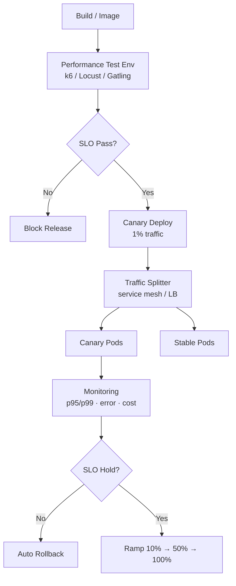
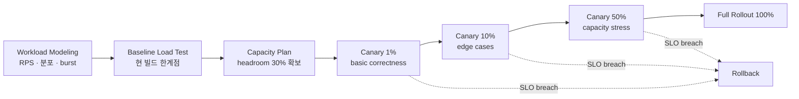

# 성능·Capa 측정 기반 배포

## 핵심 요약

성능·Capa 측정 기반 배포는 부하 테스트로 시스템의 처리 한계를 미리 측정하고, 그 결과를 SLO·error budget·canary 정책에 연결해 안전하게 release하는 방법론이다. capacity planning은 미래 부하에 필요한 자원을 예측하고, load testing은 그 예측을 검증해 실제 한계 지점과 saturation 곡선을 측정한다.

- **선 측정, 후 배포**: production 환경에 가까운 stage에서 부하 측정 → 한계점·병목 식별 → 그 한계 안에서 트래픽 단계적 노출
- **utilization 70% 가이드**: queueing theory 기반으로 latency는 utilization 70%까지 평탄, 85% 초과 시 급격히 상승, 95% 이상에서 사실상 사용 불가
- **error budget 보존**: canary 5% × 결함률 20% = 전체 영향 1% 수준으로 budget 소비를 제한
- **로그 곡선 트래픽 증가**: 1% → 10% → 50% 순으로 노출, 각 단계에서 SLO·latency·error rate 검증

## 시스템 아키텍처

CI/CD 파이프라인 안에 부하 테스트 단계가 들어가고, 통과한 빌드만 canary로 release된다. canary 트래픽은 traffic splitter(서비스 메시·로드 밸런서)가 분기하며, 모니터링 시스템은 SLO 위반·error rate spike를 감지해 자동 rollback 또는 holding을 트리거한다.

## 처리 흐름

부하 모델링과 baseline 측정에서 시작해, 단계적 트래픽 노출과 SLO 가드를 거쳐 전체 rollout로 마무리되는 흐름이다.

## 핵심 기능 및 서비스

| 기능 | 설명 |
|---|---|
| Workload modeling | 실제 트래픽의 RPS·분포·burst 패턴을 재현하는 시나리오 작성 |
| Baseline benchmark | 현재 빌드의 throughput·p95/p99·saturation 지점 측정 |
| Capacity headroom | 70% utilization 가이드 기반 예비 용량 확보 |
| Canary traffic split | 1% → 10% → 50% 로그 곡선으로 트래픽 단계적 노출 |
| SLO gating | error rate·latency·error budget 임계 위반 시 자동 holding 또는 rollback |
| Multi-tool 전략 | 레거시 프로토콜은 JMeter, 모던 API는 k6, 고부하는 Gatling 등 도구 조합 |
| Soak / stress test | 장시간 부하·임계 초과 부하로 메모리 누수·degradation 검출 |

## 유사 기술 비교

| 항목 | k6 | Locust | JMeter | Gatling |
|---|---|---|---|---|
| 특징 | Go core·JS/TS 스크립트, Grafana 통합 | Python 네이티브, 분산 부하 쉬움 | Java 기반, 20년 성숙, 1000+ 플러그인 | Scala/Java/Kotlin DSL, async I/O |
| 장점 | CI/CD 통합 최강, K8s native, JS 친화 | Python 팀에 자연스러움, 코드형 시나리오 | SOAP·JMS·LDAP·JDBC 등 광범위 프로토콜 | 인스턴스당 3-5k VU의 높은 처리량 |
| 단점 | GUI 부재, 매우 복잡한 시나리오는 한계 | 단일 머신 처리량은 낮음 | thread-per-user 모델, GUI 무거움 | Scala 진입 장벽 |
| 적합 케이스 | 모던 API, 클라우드 네이티브 신규 프로젝트 | Python 스택·복잡한 동적 시나리오 | 레거시 엔터프라이즈·다양한 프로토콜 | 고부하 마이크로벤치, 멀티 클라우드 |

## 실제 사례

### Google SRE
Google SRE 워크북은 canary 트래픽을 5% / 결함률 20% → 전체 영향 1%로 모델링하며, critical 서비스는 canary duration을 4-24시간, 일반 서비스는 최소 1시간 유지하도록 가이드. SLO·error budget을 release 결정의 객관적 근거로 사용.

### Microsoft Azure Well-Architected
performance testing 환경을 production과 최대한 동일하게 구성해야 결과의 의미가 보장된다는 원칙을 Well-Architected Framework에서 명문화, deploy 전 cycle을 의무화.

## 활용 시나리오

### 시나리오 1: 신규 API 엔드포인트 출시
새 endpoint의 부하 테스트로 단일 인스턴스 saturation 지점이 800 RPS임을 확인 → headroom 30% 반영해 인스턴스당 560 RPS로 capacity plan → canary 1%로 출시해 p99·error rate 모니터링 → 단계적 ramp.

### 시나리오 2: DB 마이그레이션 전후 회귀 검증
PostgreSQL 메이저 버전 업그레이드 전 현 버전의 baseline(throughput, p95 latency)을 측정 → stage에서 신 버전 동일 워크로드 재현 → 5% 이상 회귀 시 release 차단, 회귀 없을 때만 canary 진입.

### 시나리오 3: 비용 최적화 인스턴스 다운사이즈
m5.2xlarge → m5.xlarge로 다운사이즈 검토 시 부하 테스트로 새 사양의 한계점 측정 → 평균 utilization 65%·peak 80% 안에 들어옴을 확인 후 canary로 일부 클러스터에 적용해 실제 latency 영향 검증.

## 장단점 및 트레이드오프

| 항목 | 내용 |
|---|---|
| 장점 | release 전 한계점 객관화, SLO·error budget을 release gate로 사용 가능, 비용·성능 의사결정의 근거 마련 |
| 단점 | production 등가 환경 구축 비용, 부하 테스트 자체의 유지보수 부담, 합성 트래픽이 실제 분포를 완벽 재현 못함 |
| 트레이드오프 | 측정 정밀도 ↑ → 환경/도구 투자 ↑ / canary 기간 ↑ → 회귀 발견율 ↑ but release velocity ↓ / headroom ↑ → 안정성 ↑ but 비용 ↑ |

## 함정 및 안티패턴

- **안티패턴 1**: stage 환경 사양·데이터를 production과 다르게 구성 → 부하 테스트 결과가 production에서 재현 불가 → topology·data scale·네트워크 RTT를 최대한 동일하게 맞춤
- **안티패턴 2**: 평균 RPS만 모델링 → burst·tail latency를 못 잡음 → p99·peak burst·시간대별 분포 포함한 워크로드 모델 사용
- **안티패턴 3**: utilization 85% 이상에서 운영 → 작은 spike에도 backlog 폭증("cliff effect") → 60-70% utilization 가이드 준수, headroom 확보
- **안티패턴 4**: canary 1%에서 즉시 100%로 점프 → edge case·capacity 검증 단계 누락 → 1% → 10% → 50% 로그 곡선 ramp 적용
- **안티패턴 5**: rollback을 수동 절차로만 운영 → SLO 위반 감지 후 대응 지연 → error rate·SLO breach 시 자동 rollback 파이프라인 구성

## 참고 자료

- [Google SRE Workbook: Canarying Releases](https://sre.google/workbook/canarying-releases/) — canary 모델링·duration·error budget 사용 공식 가이드
- [Architecture Strategies for Performance Testing (Microsoft Azure)](https://learn.microsoft.com/en-us/azure/well-architected/performance-efficiency/performance-test) — Well-Architected 기반 성능 테스트 환경 원칙
- [9 Reliability-Based Best Practices for Canary Deploys (New Relic)](https://newrelic.com/blog/best-practices/canary-deploys-best-practices) — capacity headroom·자동화 임계값 best practice
- [Capacity Planning: 80% Utilization Rule (NP Blog)](https://www.npiontko.pro/2024/12/27/capacity-planning-utilization) — utilization·latency 비선형 관계 정량 설명
- [How Queueing Theory Makes Systems Reliable (One2N)](https://one2n.io/blog/queueing-theory-for-reliability-engineers-simple-guide) — queueing theory 기반 capacity 의사결정
- [Best Load Testing Tools 2026 (Vervali)](https://www.vervali.com/blog/best-load-testing-tools-in-2026-definitive-guide-to-jmeter-gatling-k6-loadrunner-locust-blazemeter-neoload-artillery-and-more/) — k6·JMeter·Gatling·Locust 도구 비교
