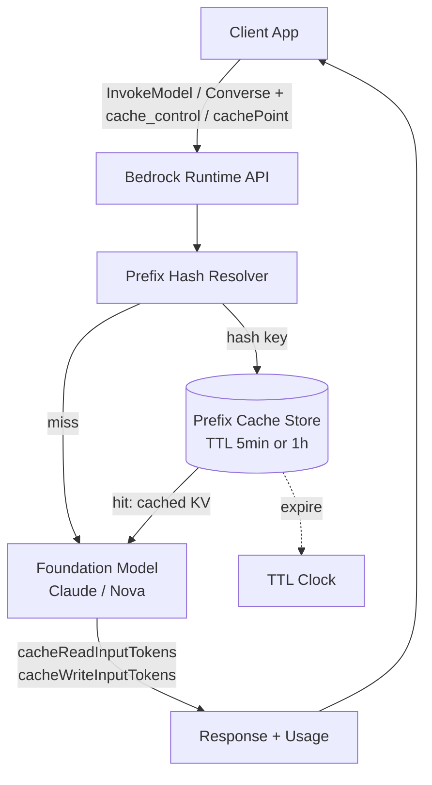
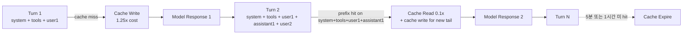

# AWS Bedrock Prompt Caching

## 핵심 요약

AWS Bedrock의 **prompt caching**은 추론 요청에서 **반복되는 prompt 접두부(prefix)** 를 모델 서버 측에 임시 저장해 두고, 후속 요청이 동일한 prefix를 가질 때 그 구간의 입력 토큰을 **재처리하지 않고 캐시에서 읽어** 비용·latency를 절감하는 기능이다. 2026-01 기준 Claude 3.5 Haiku / Claude Sonnet 4.5 / Claude Opus 4.5 / Claude Haiku 4.5 및 Nova Micro·Lite·Pro에서 GA.

- **prefix-based caching이지 server-side session이 아님** — 캐시 키는 (model + prefix 토큰 시퀀스)이고, 클라이언트가 매 요청마다 전체 prefix를 다시 보내야 한다. "대화 세션을 서버가 들고 있는" 형태가 아니다 ([Multi-turn 동작 설명은 처리 흐름 참고](#처리-흐름)).
- **명시적 cache checkpoint 모델** — `cache_control` (InvokeModel, Claude) 또는 `cachePoint` (Converse API) 필드로 캐시 경계를 직접 지정. 자동 캐싱 아님.
- **TTL 2종** — 5분(default) / 1시간(extended, Claude 4.5 계열만). 마지막 hit 시각 기준으로 갱신.
- **요금** — cache write는 base input의 1.25배(5min) 또는 2.0배(1h), cache read는 0.1배. cumulative break-even은 보통 2회 hit.
- **최소 캐시 단위** — 누적 토큰 1,024(대부분) 또는 2,048(Claude Haiku 3.5).

## 시스템 아키텍처

Bedrock prompt caching은 추론 게이트웨이 내부의 **모델별 prefix cache store**에 의존한다. 클라이언트는 캐시 경계를 명시적으로 지정하고, Bedrock runtime은 그 경계를 기준으로 토큰 시퀀스를 해시·조회한다.

## 처리 흐름

캐시 경계는 `tools → system → messages` 순서로 평가되며, 앞 섹션이 바뀌면 뒤 섹션 캐시도 무효화된다. Multi-turn에서는 각 turn마다 클라이언트가 전체 대화를 다시 보내되, 직전까지의 static 부분에 cache checkpoint를 두어 누적 캐싱한다.

## 핵심 기능 및 서비스

| 기능 | 설명 |
|---|---|
| `cache_control` (InvokeModel, Claude) | 메시지/시스템 블록에 `{"type": "ephemeral", "ttl": "5m" \| "1h"}` 부착. 최대 4개 break point. |
| `cachePoint` (Converse / ConverseStream API) | 통합 API에서 `cachePoint: {type: "default"}` 필드로 break point 지정. Claude·Nova 공통. |
| TTL 옵션 | 5분(default) 또는 1시간(Claude Opus/Sonnet/Haiku 4.5 한정). 한 요청 안에 1h를 5m보다 **앞쪽에** 배치해야 함. |
| 사용량 리포팅 | 응답 `usage`에 `cacheReadInputTokens`·`cacheWriteInputTokens` 노출 → 절감 효과 정량 측정. |
| 지원 범위(Claude) | system prompt, tools 정의, messages(여러 turn 누적) 모두 캐시 가능. |
| 지원 범위(Nova) | system + messages 캐시 가능. **tools 캐싱 미지원**. |
| 멀티 채널 호출 | InvokeModel, InvokeModelWithResponseStream, Converse, ConverseStream 모두 캐시 활용. |

### 캐시 지원/비지원 범위 (사용자 focus)

| 카테고리 | Claude | Nova | 비고 |
|---|---|---|---|
| system prompt | 지원 | 지원 | 길이 ≥ 최소 토큰일 때만 |
| tools 정의(JSON schema) | 지원 | **미지원** | Nova는 tools가 prefix에 있어도 cache key에 포함되지 않음 |
| messages — static 과거 turn | 지원 | 지원 | 매 turn cache checkpoint 갱신 필요 |
| messages — 현재 turn dynamic tail | 미지원(원리상) | 미지원 | dynamic 부분은 캐시 prefix 뒤에 둬야 함 |
| 이미지 입력 | 조건부 지원 | 조건부 지원 | 동일 이미지가 동일 위치여야 cache hit |
| 동적 변수가 섞인 prefix(timestamp, request id) | **사실상 미지원** | **사실상 미지원** | prefix가 달라져 매번 cache miss (fragmentation) |
| **세션 간 캐시 공유** | **미지원** | **미지원** | account/region 격리 + TTL 만료. cross-session "기억"이 아님. |

## 유사 기술 비교

| 항목 | Bedrock Prompt Caching | Anthropic Claude API Prompt Caching | OpenAI Prompt Caching | Bedrock Knowledge Bases (RAG) |
|---|---|---|---|---|
| 특징 | AWS-managed, 명시적 cache point | Anthropic 원본, 동일 cache_control | 자동 caching, 1024 토큰 prefix 매칭 | 벡터 DB 기반 retrieval |
| 장점 | IAM·VPC·CloudTrail 통합, Nova 지원 | 가장 빠른 신모델 반영 | 코드 변경 불필요 | 동적 대용량 코퍼스 처리 |
| 단점 | 신모델 GA 지연, Nova tools 미지원 | AWS infra 미통합 | 캐시 경계 제어 불가 | 토큰 캐시 이슈와는 결이 다름 |
| 적합 케이스 | AWS 워크로드, 규정 준수 | 멀티 클라우드 / 직접 빌링 | 빠른 PoC | 큰 외부 KB 검색이 본질일 때 |

## 실제 사례

### Anthropic (Bedrock 채널)
Claude Sonnet 4.5 / Opus 4.5 / Haiku 4.5에 대해 Bedrock에서 **1시간 TTL** 옵션을 2026-01-26 출시. 장시간 agentic workflow(tool use → retrieval → orchestration 사이 5분 이상 공백)에서 5분 TTL이 빈번히 만료되던 문제를 해결하기 위한 신규 가격 티어.

### Amazon Nova (공식 builder 사례)
Nova Pro로 긴 시스템 프롬프트 + 다회 turn chat 구축 시, system + 누적 messages에 cachePoint를 두어 **비용 ~90%, latency ~85% 절감**. 단 Nova는 tools 캐싱 미지원이므로 tool-heavy agent에는 Claude 사용 권장.

### LangChain / langchain_aws Middleware
`BedrockPromptCachingMiddleware`로 LangChain chain에 자동 cache point 삽입. 사용자가 cache 위치를 매번 수동 지정하지 않고 framework가 conversation history 끝에 checkpoint를 배치.

## 활용 시나리오

### 시나리오 1: 긴 system prompt를 가진 agent
**맥락**: 회사 정책 + 도구 사용 가이드 + few-shot 예시로 system prompt가 10K 토큰. 매 요청마다 동일.
**선택 이유**: 이 prefix를 캐시하면 첫 요청 외 모든 요청에서 system 부분이 10% 비용.
**구체적 적용**: system 블록 끝에 `cache_control: {type: ephemeral, ttl: "1h"}` 부착. TTL 1h로 사용량이 적은 사용자도 캐시 유지.

### 시나리오 2: Multi-turn 대화 RAG
**맥락**: 검색된 문서 컨텍스트 + 대화 history가 누적되는 챗봇.
**선택 이유**: 매 turn마다 직전까지의 모든 메시지를 다시 보내야 하므로, cache checkpoint를 마지막 assistant 응답 뒤에 두면 다음 turn에서 모두 cache read.
**구체적 적용**: Converse API에서 매 turn 직전 assistant message에 `cachePoint` 부착. 5분 TTL로 충분한 일반 챗봇.

### 시나리오 3: 동일 문서에 대한 다수 질의 (batch Q&A)
**맥락**: 사용자 한 명이 동일 PDF에 대해 여러 질문을 던지는 study/research 워크플로.
**선택 이유**: 문서 전체를 prefix에 두고 한 번만 cache write, 이후 N개 질문은 모두 cache read로 처리.
**구체적 적용**: messages[0]에 문서 전체 + `cachePoint`, messages[1]에 dynamic question. 1h TTL로 사용자가 천천히 질문해도 유지.

## 장단점 및 트레이드오프

| 항목 | 내용 |
|---|---|
| 장점 | 비용 최대 90% / latency 최대 85% 절감 (cache hit 시); usage 응답에 caching 토큰 노출되어 측정 용이; IAM/CloudTrail/VPC endpoint와 자연스럽게 통합. |
| 단점 | cache write가 base보다 비싸 **1회 hit으로는 손해**(BEP는 통상 2 hit 이상); 최소 토큰 제약(1,024~2,048)으로 짧은 prompt는 캐시 무효; 신규 모델 GA 지연; cross-region/cross-account 공유 없음. |
| 트레이드오프 | TTL 1h를 쓰면 read 단가 동일하되 write가 2배로 비싸짐 → 호출 빈도가 낮거나 세션이 긴 경우만 1h가 유리. 호출 빈도 높으면 5min이 더 경제적. |

## 함정 및 안티패턴

- **안티패턴 1**: prefix에 timestamp / request-id / 랜덤 nonce를 포함 → 매 요청 prefix가 달라져 **cache fragmentation** 발생, cache miss 100% → cache write 비용만 지불. **대안**: dynamic 값은 prefix 뒤(마지막 user message)로 이동.
- **안티패턴 2**: tools 정의 한 줄 수정 후 system·messages 캐시 hit을 기대 → `tools → system → messages` 순서로 chain 무효화되어 **전부 cache miss**. **대안**: tools 변경은 별도 배포 사이클로 묶고, 동일 배포 내에서는 절대 수정 금지.
- **안티패턴 3**: "1시간 TTL이니 무조건 좋다"고 1h를 default로 채택 → write 2배 부담만 떠안고 hit 없으면 손해. **대안**: 호출 간격이 5분을 넘기는 워크플로(긴 tool 실행, batch)에만 1h 적용.
- **안티패턴 4**: Bedrock prompt cache를 "대화 메모리"로 오해해 클라이언트가 history를 안 보냄 → cache는 prefix-match일 뿐 서버가 history를 기억하지 않음, **모델 입력에서 누락된 turn은 그대로 사라짐**. **대안**: 클라이언트가 항상 full history를 전송하되 cache checkpoint로 비용만 최적화.
- **안티패턴 5**: Nova 모델로 tool-heavy agent를 구축하면서 tools 캐싱 비용 절감을 기대 → Nova는 tools cache 미지원으로 **매 요청 tools 정의 풀 비용** 지불. **대안**: tool-heavy 워크로드는 Claude로 분기하거나 tools 정의를 최소화.

## 참고 자료

- [Prompt caching for faster model inference — Amazon Bedrock User Guide](https://docs.aws.amazon.com/bedrock/latest/userguide/prompt-caching.html) — 공식 문서. 지원 모델·API·최소 토큰·TTL 규약의 일차 출처.
- [Cache Prompts Between Requests — Amazon Bedrock Prompt Caching](https://aws.amazon.com/bedrock/prompt-caching/) — 제품 페이지. 90%/85% 절감 수치 및 supported models 요약.
- [Effectively use prompt caching on Amazon Bedrock — AWS ML Blog](https://aws.amazon.com/blogs/machine-learning/effectively-use-prompt-caching-on-amazon-bedrock/) — static/dynamic 배치, cache fragmentation, 측정 방법 가이드.
- [Amazon Bedrock now supports 1-hour duration for prompt caching (2026-01)](https://aws.amazon.com/about-aws/whats-new/2026/01/amazon-bedrock-one-hour-duration-prompt-caching/) — 1h TTL GA 공지. 적용 모델 범위 명시.
- [Amazon Bedrock Prompt Caching: Saving Time and Money — Caylent](https://caylent.com/blog/prompt-caching-saving-time-and-money-in-llm-applications) — 가격 모델(1.25x / 2.0x / 0.1x) 정리 및 실측 비용 분석.
- [AWS Bedrock prompt caching has a hidden cost most people miss — DEV](https://dev.to/mukundakatta/aws-bedrock-prompt-caching-has-a-hidden-cost-most-people-miss-3g73) — write/break-even pitfall 사례.
- [BedrockPromptCachingMiddleware — langchain_aws Reference](https://reference.langchain.com/python/langchain-aws/middleware/prompt_caching/BedrockPromptCachingMiddleware) — 프레임워크 통합 패턴 참고.
