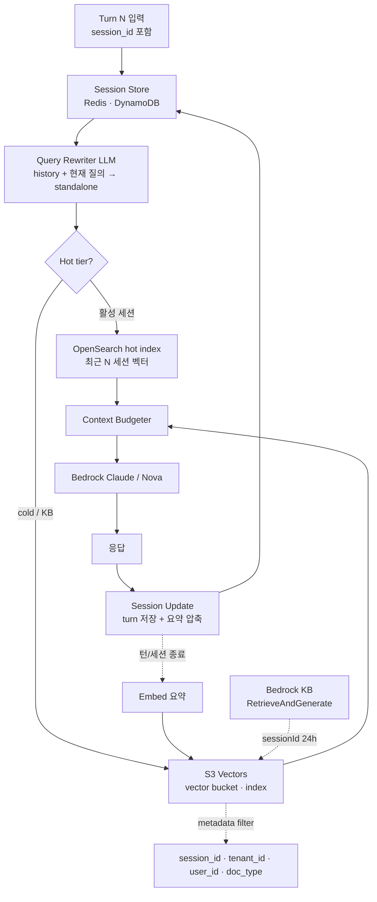
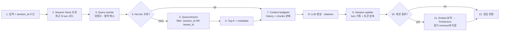

# AWS S3 Vectors Multi-turn Chat Strategy

## 핵심 요약

S3 Vectors는 **2 billion 벡터/인덱스**, **빈번 쿼리 시 100ms 이하 지연**, **OpenSearch 대비 최대 90% 저렴**한 매니지드 vector store다. 다만 native session·conversation 기능이 없으므로 multi-turn 챗에서는 **(1) 대화 상태 저장소(Redis/DynamoDB/Strands Memory Plugin) + (2) S3 Vectors(도메인 KB / 장기 요약 메모리) + (3) 외부 query rewriter** 3-layer 분리가 사실상 강제된다. Bedrock Knowledge Bases를 쓰면 `RetrieveAndGenerate`의 **24시간 sessionId**가 짧은 conversation context를 대신 관리하지만, 장기 user state·cross-session memory는 직접 설계해야 한다.

- **세 가지 표준 전략**: (a) Bedrock KB 위임(sessionId 24h, 가장 단순), (b) Strands Agents S3 Vectors Memory Plugin(대화 요약 → 벡터 저장 → 다음 세션 inject), (c) 자체 구현(metadata `session_id` filter + 외부 session store).
- **메타데이터 한도 = 스키마 설계의 천장**: filterable 2KB / 총 40KB. Bedrock KB 사용 시 추가로 custom 1KB · 키 35개. session/tenant/user 식별자는 모두 filterable에 들어가야 검색이 됨.
- **Native session 부재 = 외부 session store 필수**: S3 Vectors는 stateless. Redis/DynamoDB가 history·rewrite·턴 메타를 보유하고, S3 Vectors는 검색 backend로만 동작.
- **Hot/cold tiering이 production default에 근접**: OpenSearch에 활성 세션 hot 벡터(저지연), S3 Vectors에 cold·장기 메모리·도메인 KB(저비용). Caylent / AWS 공식 가이드 모두 이 패턴 권고.
- **BM25 없음 → query rewriting 의무**: S3 Vectors 데이터 평면은 pure kNN(+metadata filter). 키워드 매칭이 필요하면 외부 BM25 또는 OpenSearch hot tier 병행.

## 시스템 아키텍처

multi-turn 챗 위에 S3 Vectors가 들어가면 컴포넌트는 **session memory(상태)**, **vector store(검색)**, **query rewriter(맥락 해소)**, **LLM(생성)** 4축으로 분리된다. S3 Vectors는 마지막 축 직전의 검색만 담당.

## 처리 흐름

Turn N(예: 3번째 질의)이 처리되는 순서. Bedrock KB 위임 모드와 자체 구현 모드 모두 동일 골격을 따른다.

## 핵심 기능 및 서비스

| 기능 | 설명 |
|---|---|
| S3 Vectors Data Plane API | `PutVectors`/`QueryVectors`/`GetVectors`/`DeleteVectors`/`ListVectors` 5개. 챗 흐름은 대부분 `QueryVectors` + 세션 종료 시 `PutVectors` |
| Bedrock KB sessionId | `RetrieveAndGenerate`가 자동 생성, 24h 유지. 동일 sessionId로 후속 호출 시 KB 내부에서 대화 맥락 보존 |
| Strands Agents S3 Vectors Memory Plugin | 대화 종료 시 LLM 요약 → 벡터화 → S3 Vectors에 저장. 다음 세션 시작 시 유사 요약 검색 → system prompt 주입 |
| Metadata 스키마 | filterable 2KB / 총 40KB. KB 모드는 custom 1KB · 35 keys. `session_id`·`tenant_id`·`user_id`·`turn_idx`·`timestamp`·`doc_type`은 모두 filterable |
| Session store | Redis(빠른 R/W) + DynamoDB(영속). key = `session_id`, value = turn 리스트 + 마지막 rewrite + retrieved chunk ids |
| Query rewriter | history N turn + 현재 질의 → standalone query. S3 Vectors가 BM25 없는 pure kNN이라 의미 풍부한 쿼리 생성이 검색 품질의 상한선 |
| Hot/cold tiering | OpenSearch에 최근 활성 세션 벡터(p95<50ms), S3 Vectors에 장기/도메인 KB(100~300ms). 검색기는 라우팅 결정만 |
| Multi-tenant isolation | (a) per-tenant 인덱스(완전 격리, IAM/KMS 분리) (b) 공유 인덱스 + `tenant_id` metadata filter(비용 효율) |
| 처리량 한도 | 인덱스당 `QueryVectors` 수백 req/s, `PutVectors` 1,000 req/s 또는 2,500 vec/s. 챗 QPS가 한도 근접하면 인덱스 샤딩 |
| Context window budgeter | `Model_Limit − (System + Query + ExpectedOutput)` 잔여를 retrieved chunks와 history에 분배 |

## 유사 기술 비교

| 항목 | S3 Vectors only | OpenSearch only | Pinecone (SaaS) | Hybrid (OpenSearch hot + S3 Vectors cold) |
|---|---|---|---|---|
| Native session 지원 | 없음 (외부 store 필수) | 없음 | 없음 | 없음 |
| 챗 검색 지연 | 100~300ms | 10~50ms | 10~50ms | hot 10~50ms / cold 100~300ms |
| 비용 (벡터당) | 매우 낮음 (~90% 절감) | 중~높음 (OCU 시간 과금) | 중 | 낮음~중 (콜드 다수) |
| Hybrid 검색 (BM25 + kNN) | 미지원 | 지원 | sparse vector | OpenSearch 측에서 지원 |
| Filter 표현력 | 단순 metadata 조건 | DSL 풀 표현력 | metadata + sparse | OpenSearch 측에서 풍부 |
| 인덱스당 한도 | 2B 벡터 | 노드 수 비례 | 자동 스케일 | 둘 합산 |
| 적합 케이스 | 비용 우선 사내 챗봇 · 장기 메모리 archive | 저지연 고QPS · hybrid 검색 필수 | 운영 단순 SaaS · 글로벌 분산 | production default · 비용/성능 균형 |

## 실제 사례

### Strands Agents Travel Assistant (AWS samples)
`aws-samples/sample-multimodal-agent-tutorial` 리포지토리는 Strands Agents SDK + S3 Vectors Memory Plugin으로 cross-session 메모리를 구현한 reference. 사용자가 "지난번 파리 여행 같은 스타일로" 라고 말하면, 이전 세션에서 저장된 요약 벡터를 retrieve해 system prompt에 inject. context window를 부풀리지 않으면서 personalization 달성.

### AWS Multi-Tenant RAG Chatbot (Bedrock + Lambda)
SkildOps / AWS Builders 레퍼런스 아키텍처. Lambda Authorizer가 JWT에서 `tenant_id` 추출 → KB 호출 시 metadata filter로 강제. **per-tenant 데이터 소스 + per-tenant KB** 구조 권고(다른 chunking·다른 KMS 가능). 공유 인덱스 + filter 패턴은 비용은 싸지만 격리 보장이 약함.

### Caylent Hybrid Vector Storage 사례
Caylent 컨설팅 블로그에서 production GenAI 아키텍처로 **"hot = OpenSearch, cold = S3 Vectors"** 패턴 보고. 활성 24~72시간 세션 벡터는 OpenSearch, 그 이후·도메인 KB는 S3 Vectors. TCO 60% 이상 절감 사례.

## 활용 시나리오

### 시나리오 1: 비용 우선 사내 위키 챗봇 (S3 Vectors + Bedrock KB sessionId)
사내 Confluence 코퍼스 수십만~수백만 페이지. QPS 낮음(사내 한정), 지연 100~300ms 허용. S3 Vectors를 KB 백엔드로 두고 `RetrieveAndGenerate(sessionId=...)`로 24h 세션 맥락 위임. session_store 불필요(KB 위임). 단점: 24h 초과 시 history 손실 — daily summary를 별도 long-term index에 저장하는 워크플로 추가 필요.

### 시나리오 2: Hot/cold tiered 고QPS B2C 챗봇 (OpenSearch hot + S3 Vectors cold)
초/분당 수백 사용자 active. p95 < 100ms 요구. **OpenSearch Serverless**에 최근 72h 세션 벡터 + 자주 검색되는 도메인 chunk hot 캐시, **S3 Vectors**에 전체 코퍼스 + 90일+ 장기 conversation summary. 검색기는 (a) hot QueryVectors 먼저 → (b) miss / 만족 미달 시 cold fallback. 세션 종료 시 요약 → S3 Vectors PutVectors.

### 시나리오 3: Multi-tenant SaaS 챗봇 (per-tenant index + metadata filter)
tenant당 격리 + 비용 attribution 요구. **per-tenant 인덱스**(권장: 격리·IAM·KMS·삭제 단순) 또는 **공유 인덱스 + `tenant_id` filter**(권장 X if 격리 중요). 후자는 metadata 2KB 한도 내 `tenant_id`·`user_id`·`session_id`·`doc_type` 모두 squeeze 필요. **per-tenant 인덱스가 default**, 2B/인덱스 한도까지 안 차면 굳이 공유 안 함.

## 장단점 및 트레이드오프

| 항목 | 내용 |
|---|---|
| 장점 | (1) **90% 비용 절감** — 장기 conversation memory를 부담 없이 영속화 (2) 2B 벡터/인덱스 — 샤딩 거의 불필요 (3) Bedrock KB sessionId로 단순 챗 구현 시 session store 불필요 (4) Strands Memory Plugin으로 cross-session personalization을 minimal code로 구현 (5) SigV4·VPC endpoint·CloudTrail 표준 거버넌스 통합 |
| 단점 | (1) **Native session 없음** — Redis/DDB or Bedrock KB sessionId 필수 (2) **BM25/하이브리드 없음** — 키워드 매칭은 OpenSearch 병행 또는 query rewriter에 부담 (3) 100~300ms 지연 — p95<50ms 챗 UX엔 부적합 (4) Metadata filterable 2KB 빡빡 — session/tenant 식별자 다 넣으면 application metadata 여유 없음 (5) Bedrock KB sessionId 24h 한계 — 장기 conversation memory는 별도 설계 |
| 트레이드오프 | "콜드 저비용 + 단순 매니지드" vs "저지연 + 표현력". hot/cold 분리하면 best-of-both이지만 운영 컴포넌트 2배. 단일 S3 Vectors는 비용 우선·중지연 허용 워크로드에 한정. |

## 함정 및 안티패턴

- **안티패턴 1**: conversation history 벡터를 도메인 KB와 같은 인덱스에 저장 → topic distance 가까운 user 발화가 KB 검색을 오염. → **인덱스 분리**(`{tenant}-kb-docs`, `{tenant}-conv-memory`) 또는 `doc_type` filter 강제.
- **안티패턴 2**: session당 인덱스 1개 생성 → 2B/인덱스 한도 무의미하게 낭비 + 인덱스 생성/삭제 비용 폭증. → **세션은 metadata `session_id`로 식별**, 인덱스는 tenant 단위 또는 도메인 단위로만 분할.
- **안티패턴 3**: filterable metadata에 큰 JSON blob(예: 직전 retrieved chunks 전체) 저장 → 2KB 초과로 `PutVectors` 실패. → 큰 페이로드는 non-filterable에, filter 식별자만 filterable에. Bedrock KB는 1KB·35 keys 추가 한도.
- **안티패턴 4**: Bedrock KB `sessionId`가 영속이라 가정 → 24h 후 자동 만료, 후속 호출이 새 세션 시작. → **TTL 정책 + daily summary 저장** 워크플로 명시.
- **안티패턴 5**: rewrite 없이 raw "그거는?" 같은 follow-up을 QueryVectors에 직접 입력 → 의미 부족으로 top-K가 무관 결과. S3 Vectors는 BM25 fallback 없음. → **query rewriter mandatory**, optional은 OpenSearch hot tier 병행.
- **안티패턴 6**: 매 turn마다 PutVectors로 conversation 저장 → 인덱스당 2,500 vec/s 한도 압박 + 노이즈 누적. → **세션 종료 시 1회 요약 저장** 또는 K turn마다 batch.
- **안티패턴 7**: 공유 인덱스 + `tenant_id` filter만으로 multi-tenant 격리 가정 → IAM은 인덱스 단위로만 작동, 동일 인덱스 내 cross-tenant 누출 위험은 application bug 한 번이면 발생. → **격리 강도 요구 시 per-tenant 인덱스**(KMS·IAM·삭제 분리 가능).
- **안티패턴 8**: hot/cold 라우팅 없이 모든 챗 검색을 S3 Vectors로 → 100~300ms × 매 turn → 누적 UX 저하. → **활성 세션은 hot tier(OpenSearch / 로컬 캐시), S3 Vectors는 cold fallback**.

## 참고 자료

- [Amazon S3 Vectors now generally available — AWS News Blog](https://aws.amazon.com/blogs/aws/amazon-s3-vectors-now-generally-available-with-increased-scale-and-performance/) — GA 한도(2B 벡터/인덱스, 100ms 이하 지연)
- [Using S3 Vectors with Amazon Bedrock Knowledge Bases — AWS Docs](https://docs.aws.amazon.com/AmazonS3/latest/userguide/s3-vectors-bedrock-kb.html) — KB 모드 metadata 1KB·35 keys 한도
- [Metadata filtering — S3 Vectors AWS Docs](https://docs.aws.amazon.com/AmazonS3/latest/userguide/s3-vectors-metadata-filtering.html) — filterable 2KB / 총 40KB
- [Store and retrieve conversation history and context with session management APIs — Amazon Bedrock](https://docs.aws.amazon.com/bedrock/latest/userguide/sessions.html) — sessionId 24h, auto-generated
- [RetrieveAndGenerate — Amazon Bedrock API Reference](https://docs.aws.amazon.com/bedrock/latest/APIReference/API_agent-runtime_RetrieveAndGenerate.html) — multi-turn 호출 시그니처
- [S3 Vectors Memory Plugin — Strands Agents SDK](https://strandsagents.com/docs/community/plugins/s3-vectors-memory/) — 대화 요약 → 벡터 저장 → cross-session inject 패턴
- [Building Scalable Multi-Modal AI Agents with Strands Agents and Amazon S3 Vectors — AWS Builder](https://builder.aws.com/content/32RHXLdYOxqybSYaMzq4y9nmI1v/building-scalable-multi-modal-ai-agents-with-strands-agents-and-amazon-s3-vectors) — 실전 구현
- [aws-samples/sample-multimodal-agent-tutorial — GitHub](https://github.com/aws-samples/sample-multimodal-agent-tutorial) — Strands + S3 Vectors persistent memory 레퍼런스 리포
- [Multi-tenant RAG with Amazon Bedrock Knowledge Bases — AWS ML Blog](https://aws.amazon.com/blogs/machine-learning/multi-tenant-rag-with-amazon-bedrock-knowledge-bases/) — per-tenant 데이터 소스/KB 권고
- [Building a Secure, Serverless Multi-Tenant RAG Chatbot with Amazon Bedrock and Lambda — SkildOps](https://skildops.com/blog/building-a-secure-serverless-multi-tenant-rag-chatbot-with-amazon-bedrock-and-lambda) — Lambda Authorizer로 tenant 추출 패턴
- [Architecting GenAI at Scale: Lessons from Amazon S3 Vector Store — Caylent](https://caylent.com/blog/architecting-gen-ai-at-scale-lessons-from-aws-s-3-vector-store-and-the-nuances-of-hybrid-vector-storage) — hot OpenSearch + cold S3 Vectors hybrid 패턴
- [Building cost-effective RAG applications with Amazon Bedrock Knowledge Bases and Amazon S3 Vectors — AWS ML Blog](https://aws.amazon.com/blogs/machine-learning/building-cost-effective-rag-applications-with-amazon-bedrock-knowledge-bases-and-amazon-s3-vectors/) — KB+S3 Vectors 비용 모델
- [S3 Vectors best practices — AWS Docs](https://docs.aws.amazon.com/AmazonS3/latest/userguide/s3-vectors-best-practices.html) — 처리량/배치 가이드
