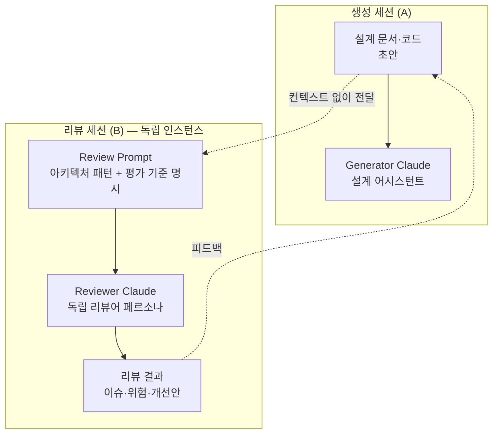

# Claude Advisor Strategy — 기술 아키텍처 리뷰

## 핵심 요약

Claude를 기술 아키텍처 리뷰어·설계 어드바이저로 활용하는 패턴. 동일 Claude 세션이 설계한 것을 스스로 리뷰하면 blind spot이 발생하므로, **독립 인스턴스 분리**(생성 vs 리뷰)와 **아키텍처 패턴 명시**(hexagonal, CQRS, event-driven 등)를 결합해 설계 품질을 높인다.

- **인스턴스 분리 원칙**: 코드/설계 생성 세션과 리뷰 세션을 별도로 유지 — 생성 컨텍스트를 공유하지 않아야 독립적 비판 가능
- **패턴 명시 효과**: system prompt에 hexagonal architecture·repository pattern·specification pattern을 명시적으로 지정하면 설계 제안 품질이 측정 가능하게 향상됨 (claude-certified-architect 실증)
- **확장 사고 모드**: Claude 3.7+의 extended thinking 모드를 활성화하면 복잡한 트레이드오프 분석에 더 깊은 추론 제공

## 컴포넌트 다이어그램

아키텍처 리뷰 세션의 구성 요소.



## 적용 단계

```
1. [페르소나 설정] "당신은 AWS certified solutions architect 수준의 시니어 리뷰어"
   + 평가할 아키텍처 패턴(hexagonal, CQRS, event-driven 등) system prompt에 명시
2. [문서 제공] ADR·설계 다이어그램·ERD를 새 세션에 붙여넣기 (생성 컨텍스트 배제)
3. [리뷰 요청] "SOLID 원칙, 확장성, 운영 복잡성, 비용 4축으로 이 설계를 평가해줘"
4. [위험 식별] "이 설계의 single point of failure와 숨겨진 coupling을 모두 찾아줘"
5. [개선 옵션] "발견한 이슈별로 3가지 해결 옵션을 트레이드오프와 함께 제시해줘"
6. [ADR 초안] 채택한 해결책을 ADR 형식(Context·Decision·Consequences)으로 정리 요청
```

## 핵심 기능 및 서비스

| 기능 | 설명 |
|---|---|
| 독립 리뷰어 인스턴스 | 생성 세션과 분리해 선택 편향 제거. 별도 창·별도 API 호출 필수 |
| 아키텍처 패턴 명시 | hexagonal, CQRS, Saga, Outbox 등 평가 기준으로 사용할 패턴을 prompt에 열거 |
| 다축 평가 | SOLID·확장성·운영성·비용·보안 등 평가 축을 명시적으로 지정해 포괄적 리뷰 |
| Extended Thinking | Claude 3.7 Sonnet 이상에서 복잡한 아키텍처 트레이드오프 분석 시 활성화 권장 |
| ADR 자동 생성 | 리뷰 결과를 바탕으로 Architecture Decision Record 초안 작성 |

## 유사 기술 비교

| 항목 | Claude 아키텍처 리뷰 | GitHub Copilot Review | 인간 아키텍처 리뷰 | SonarQube |
|---|---|---|---|---|
| 범위 | 설계 의도·트레이드오프 | 코드 품질·버그 | 전략·조직 정렬 | 코드 정적 분석 |
| 비용 | 토큰 단가 | 구독 | 수십~수백만 원 | OSS/상용 |
| 속도 | 즉시 | 즉시 | 수일~수주 | 빌드 시간 |
| 깊이 | 설계 수준 논증 | 라인 단위 | 비즈니스 맥락 포함 | 규칙 기반 |
| 한계 | 운영 경험 없음 | 설계 의도 파악 한계 | 가용성·비용 | 설계 수준 미달 |

## 실제 사례

### paullarionov — claude-certified-architect
AWS Solutions Architect Associate 수준의 역할을 부여한 Claude system prompt 템플릿. hexagonal architecture, repository pattern, specification pattern을 명시적으로 가이드라인에 포함하면 설계 제안의 패턴 준수율과 일관성이 개선됨을 오픈소스로 공개.

### 멀티 에이전트 아키텍처 리뷰 (2025 연구)
동일 모델 기반 복수 에이전트가 동일 설계를 리뷰할 때, 단순히 에이전트 수를 늘리는 것보다 역할(생성·비판·종합)의 명확한 분리가 리뷰 품질을 높임. 아키텍처 다양성 없이 에이전트를 늘리면 중복·비일관성만 증가.

## 활용 시나리오

### 시나리오 1: RAG 파이프라인 설계 리뷰
Confluence RAG 아키텍처 초안을 별도 Claude 세션에 제출. "벡터 스토어 선택, 청킹 전략, 임베딩 모델 호환성, 재인덱싱 주기 4축으로 이 설계의 위험을 평가해줘"로 리뷰 요청. 발견된 coupling 이슈를 ADR로 정리.

### 시나리오 2: 마이크로서비스 분리 경계 검토
모놀리스 분리 설계안에 대해 Claude를 "DDD 전문가" 페르소나로 설정. "각 bounded context의 응집도와 서비스 간 결합도를 평가하고, anti-pattern이 있는 경계를 지적해줘"로 Strangler Fig 패턴 적용 타당성 검토.

### 시나리오 3: ADR 품질 검증
작성한 ADR 초안을 Claude에게 제출. "이 결정의 Context가 충분히 설명되었는지, 고려한 대안이 누락되지는 않았는지, Consequences에 위험이 빠졌는지 체크리스트로 평가해줘"로 ADR 자체의 품질 보증.

## 장단점 및 트레이드오프

| 항목 | 내용 |
|---|---|
| 장점 | (1) 아키텍처 설계 단계의 저비용 사전 검증 (2) 패턴·원칙 준수 여부 즉시 확인 (3) ADR 초안 자동화로 문서화 비용 절감 |
| 단점 | (1) 운영 실전 경험 없음 — 트래픽 패턴·장애 경험 없이 추론 (2) 조직 컨텍스트 누락 — 팀 역량·정치적 제약 반영 불가 (3) 할루시네이션 — 존재하지 않는 라이브러리·API 제안 가능 |
| 트레이드오프 | 빠른 초안 검토에는 탁월, 최종 설계 승인에는 인간 아키텍트 검토 필수. Claude 리뷰를 "사전 필터"로 사용해 인간 리뷰 세션에서 기본적 이슈를 제외하고 심층 논의에 집중 |

## 함정 및 안티패턴

- **생성 세션에서 바로 리뷰 요청**: "방금 제안한 아키텍처 검토해줘" → 생성 컨텍스트를 공유한 채 리뷰하면 선택 편향 발생, 실질적 비판 어려움. 대안: 반드시 새 세션에서 설계 문서만 제공.
- **패턴 명시 없이 리뷰 요청**: 평가 기준 없이 "잘 됐나요?" 질문 → 일반적 칭찬 or 표면적 코멘트만. 대안: 평가할 아키텍처 패턴과 축을 system prompt에 열거.
- **Claude 리뷰를 최종 승인으로 대체**: Claude가 "좋습니다"라고 해도 운영 경험·비즈니스 컨텍스트가 없음 → 프로덕션 사고 예방 불가. 대안: Claude 리뷰는 pre-flight check, 최종 승인은 인간 아키텍트.
- **Extended Thinking 무조건 활성화**: 간단한 리뷰에서 extended thinking을 켜면 비용·지연 증가. 대안: 복잡한 트레이드오프(예: 분산 트랜잭션·eventual consistency) 분석에만 한정 사용.

## 참고 자료

- [claude-certified-architect GitHub — paullarionov](https://github.com/paullarionov/claude-certified-architect/blob/main/guide_en.MD) — Claude를 AWS 아키텍트로 설정하는 system prompt 템플릿
- [I Built an AI Advisory Council for Code Review — Medium](https://medium.com/@nirajkvinit/i-built-an-ai-advisory-council-for-code-review-heres-what-actually-works-c3b531ca4b65) — 독립 인스턴스 분리 구현 사례
- [Prompting best practices — Anthropic Claude Docs](https://platform.claude.com/docs/en/build-with-claude/prompt-engineering/claude-prompting-best-practices) — 구조화 프롬프트 공식 가이드
