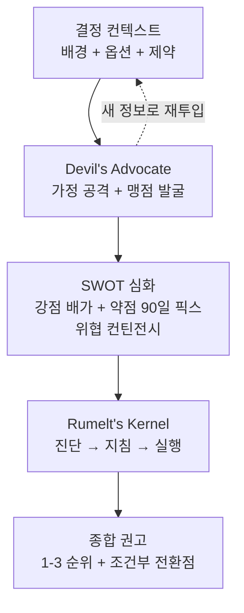

# Claude Advisor Strategy — 의사결정 지원

## 핵심 요약

Claude를 구조화된 의사결정 지원 파트너로 활용하는 패턴. **Devil's Advocate**(반론 제기), **SWOT 심화**, **Rumelt's Strategy Kernel**(진단→지침→실행) 프레임워크를 통해 확인 편향을 줄이고 의사결정 품질을 높인다. 의사결정에 대한 동의 대신 비판을 먼저 요청하는 것이 핵심.

- **확인 편향 방지**: "내 안이 맞지?"가 아닌 "내 안의 가장 큰 약점 3가지를 찾아줘"로 시작
- **Devil's Advocate 역할**: Claude에게 "전략적 반론자 역할을 맡아라. 내가 이길 수 있도록 가정·맹점을 먼저 공격해줘"로 지정
- **Rumelt's Kernel**: 진단(문제 본질 파악) → 지침 정책(선택 방향) → 일관된 행동(실행 묶음)의 3단계 구조로 전략 품질 검증

## 컴포넌트 다이어그램

의사결정 지원 세션의 구조.



## 적용 단계

```
1. [프레임 설정] "당신은 전략적 사고 파트너입니다. 동의보다 비판을 먼저 합니다"
2. [상황 제공] 결정 배경·옵션 목록·선택 기준·현재 선호안 작성
3. [Devil's Advocate] "이 결정의 숨겨진 가정과 blind spot을 공격해줘"
4. [SWOT 심화] 각 강점→배가 방법, 약점→90일 픽스, 위협→컨틴전시 플랜
5. [Rumelt's Kernel] 진단(실제 문제가 무엇인지), 지침 정책(어떤 방향), 실행 묶음(구체 행동 3-5개) 순서로 구조화
6. [Pre-mortem] "이 결정이 6개월 후 실패했다면 이유가 무엇일까?"로 잠재 실패 식별
7. [최종 권고] 1순위 선택 + 트리거 조건 (언제 2순위로 전환할 것인가) 추출
```

## 핵심 기능 및 서비스

| 기능 | 설명 |
|---|---|
| Devil's Advocate 역할 | "가장 강력한 반대 입장"으로 전환. 확인 편향 방지용 구조적 장치 |
| SWOT 심화 | 단순 나열이 아닌 S→배가 전략, W→90일 픽스, O→우선 활용, T→컨틴전시 플랜 |
| Rumelt's Strategy Kernel | 전략의 3요소(진단·지침·일관 행동)로 전략 완결성 검증 |
| Pre-mortem 분석 | "이미 실패했다고 가정"하고 원인을 역추론 → 미리 위험 식별 |
| 병렬 에이전트 검색 | Claude Code 서브에이전트로 WebSearch 병렬 실행 → 경쟁 분석·시장 데이터 수집 |

## 유사 기술 비교

| 항목 | Claude 의사결정 지원 | 컨설팅 워크숍 | ChatGPT Custom GPT | 의사결정 매트릭스(수동) |
|---|---|---|---|---|
| 속도 | 즉시 (분~시간) | 수일~수주 | 즉시 | 수시간~수일 |
| 구조화 | 프롬프트로 강제 | 퍼실리테이터 주도 | 프롬프트 | 수동 설계 |
| 비판 강도 | 역할 지정 시 중~강 | 숙련도 의존 | 유사 | 없음 |
| 조직 컨텍스트 | 제공된 것만 반영 | 현장 파악 가능 | 제공된 것만 | 작성자 판단 |
| 비용 | 토큰 단가 | 수백만 원+ | 구독 | 인건비 |

## 실제 사례

### Product Strategy with Claude Code (ccforpms.com)
경쟁 분석을 위해 병렬 WebSearch 에이전트를 실행하고, 핵심 트레이드오프를 구조화한 뒤, 각 선택에 대해 Claude의 Devil's Advocate 압박 테스트를 수행. Rumelt's Kernel로 종합 후 발표 자료까지 자동 생성하는 완전한 전략 수립 워크플로우를 공개.

### Contrarian — Claude Code 오픈소스 서브에이전트
Claude Code 플러그인으로, 제안서·설계를 입력하면 가정 공격·사전 검사(pre-mortem)·아키텍처 리뷰·결정 검증을 자동 수행. "합의가 너무 쉽게 이루어질 때" 반드시 실행하도록 권장.

## 활용 시나리오

### 시나리오 1: 기술 선택 의사결정
RAG 구현에서 Cohere Rerank vs Self-hosted BGE-reranker 선택 시, Claude에게 각 옵션의 "가장 강력한 반대 논거"를 먼저 제시하게 하고, break-even 분석 후 선택 조건(일 쿼리 수 임계값 등)을 명시한 ADR 초안 작성.

### 시나리오 2: 프로젝트 범위 조정
MVP 기능 범위가 과도하게 커졌을 때, "이 범위에서 가장 위험한 비핵심 가정은 무엇인가?"를 Claude에게 Devil's Advocate 역할로 질문. SWOT 심화로 핵심 기능과 연기 가능 기능을 구분하고 scope 조정 기준 문서화.

### 시나리오 3: 경력 결정 검토
이직·역할 전환 등 개인 의사결정에서 Pre-mortem("1년 후 이 결정이 잘못됐다면 이유는?")과 Devil's Advocate("이 선택의 숨겨진 비용은?")를 적용해 감정적 편향 없는 구조화된 검토 지원.

## 장단점 및 트레이드오프

| 항목 | 내용 |
|---|---|
| 장점 | (1) 확인 편향을 구조적으로 차단 (2) 다양한 프레임워크를 즉시 적용 가능 (3) 정서적 이해관계 없이 비판적 질문 가능 |
| 단점 | (1) 조직 역학·감정·정치적 요인 반영 불가 (2) 최신 시장 데이터 없이 추론 — WebSearch 결합 권장 (3) 결정의 품질은 사용자가 제공한 컨텍스트에 극도로 의존 |
| 트레이드오프 | Claude의 강점은 "구조화"와 "비판". 컨텍스트·데이터를 잘 제공할수록 품질 향상. 반대로 컨텍스트가 부실하면 일반적 프레임워크 나열에 그침 |

## 함정 및 안티패턴

- **동의를 요청하는 질문 형태**: "이렇게 하면 좋을 것 같죠?" → Claude가 맞장구치는 경향. 대안: "이 계획의 가장 큰 약점 3가지" 또는 "반대 입장에서 공격해줘"로 질문.
- **결론 먼저 제시**: 선호 결론을 먼저 말하고 근거를 요청하면 Claude가 그 결론을 정당화하는 방향으로 편향. 대안: 배경과 옵션만 제공하고 분석 먼저 요청.
- **Pre-mortem 생략**: "잘 될 것 같으니 바로 실행" → 나중에 반복 실패. 대안: "6개월 후 실패했다고 가정하면 이유가 무엇인가?"를 모든 중요한 결정에 필수 적용.
- **Rumelt Kernel 없이 전략 채택**: 진단·지침·실행이 연결되지 않은 전략은 실행 단계에서 일관성 파괴. 대안: 최종 권고 전에 Kernel 3단계로 구조화 확인.

## 참고 자료

- [Product Strategy with AI — Claude Code for Product Managers](https://ccforpms.com/advanced/product-strategy) — 전략 수립 워크플로우 실전 가이드
- [I Reprogrammed My AI to Disagree With Me — AI Maker Substack](https://aimaker.substack.com/p/i-reprogrammed-my-ai-chatgpt-claude-to-disagree-with-me-devil-advocate) — Devil's Advocate 역할 지정 실험
- [contrarian — Claude Code Devil's Advocate Agent (GitHub)](https://github.com/aaddrick/contrarian) — 반론 제기 자동화 오픈소스 도구
- [How I Built an AI Council with Claude Code Subagents — Galaxy.ai](https://galaxy.ai/youtube-summarizer/how-i-built-an-ai-council-with-claude-code-subagents-to-enhance-decision-making-and-planning-LpM1dlB12-A) — 멀티 에이전트 의사결정 지원 구현 사례
