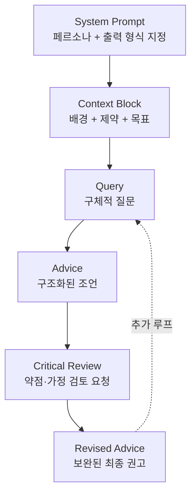

# Claude Advisor Strategy — 범용 어드바이저 패턴

## 핵심 요약

Claude를 어드바이저 역할로 구조화하는 프롬프팅 패턴. System prompt로 전문가 페르소나를 고정하고, 컨설팅 프레임워크(MECE·SWOT·옵션 비교 등)를 명시적으로 지정하며, 초안→비판→개선의 반복 검토 루프로 조언 품질을 높인다. 단순 Q&A를 넘어 도메인 전문가처럼 체계적·비판적 사고를 이끌어내는 것이 목적.

- **페르소나 고정**: `"당신은 X 분야의 시니어 컨설턴트입니다"` system prompt — Claude는 instruction hierarchy를 엄격히 따르므로 시스템 레벨 지시가 대화 전반에 지속됨
- **프레임워크 강제**: 자유 답변이 아닌 MECE, 옵션 비교 표, 장단점 요약 등 구조화된 출력 형식을 지정
- **피드백 루프**: "내 주장의 약점을 지적해줘" → "보완안을 제안해줘" → "최종 권고안으로 정리해줘" 순으로 반복

## 컴포넌트 다이어그램

Advisor 세션의 주요 요소와 관계.



## 적용 단계

```
1. [페르소나 정의] system prompt에 "역할 + 전문 분야 + 출력 형식" 명시
2. [컨텍스트 공급] 배경 상황·제약 조건·목표를 user 첫 메시지로 제공
3. [구체 질문] 열린 질문보다 구조화된 질문 ("A vs B를 3축으로 비교해줘")
4. [약점 검토] "내 전제에서 놓친 부분을 지적해줘" 로 비판 요청
5. [보완 반복] 새 정보나 제약을 추가하며 루프 → 최종 권고 추출
6. [외부 검증] 중요 의사결정은 Claude 단독이 아닌 실제 전문가 검토와 병행
```

## 핵심 기능 및 서비스

| 기능 | 설명 |
|---|---|
| 역할 페르소나 고정 | system prompt로 대화 전 범위에 걸쳐 전문가 역할 유지. Claude 3.5+의 instruction following 강점 활용 |
| 구조화 출력 강제 | "표로 정리", "3가지 옵션으로 제시", "한 줄 권고안으로 마무리" 등 형식 명시 |
| 반복 검토 루프 | 초안 → 비판 → 개선 3단계 루프. 사람 컨설턴트의 draft review 과정을 재현 |
| Claude Memory 활용 | 2025 후반 도입된 Memory 기능으로 페르소나·선호 출력 형식을 세션 간 지속 가능 |
| 멀티 인스턴스 분리 | 생성 역할 Claude와 리뷰 역할 Claude를 별도 세션으로 분리해 편향 감소 |

## 유사 기술 비교

| 항목 | Claude Advisor 패턴 | ChatGPT Custom GPT | LangChain Agent | 실제 인간 컨설턴트 |
|---|---|---|---|---|
| 역할 고정 방식 | system prompt | Custom GPT 설정 | Agent prompt | 계약·전문 자격 |
| 프레임워크 적용 | 프롬프트 내 명시 | Custom GPT 지시 | Tool + prompt | 방법론 경험 |
| 반복 검토 | 대화 루프 | 대화 루프 | ReAct loop | 리뷰 세션 |
| 비용 | 토큰 단가 | 구독/API | 인프라 | 프로젝트 수임료 |
| 한계 | 할루시네이션·컨텍스트 한계 | 같은 한계 | 도구 의존 | 인간 편향·가용성 |

## 실제 사례

### Niraj Kumar — AI Advisory Council for Code Review
동일 세션 Claude가 생성한 코드를 리뷰하면 blind spot이 생기는 문제를 해결하기 위해, 별도 Claude 인스턴스를 "코드 리뷰어" 페르소나로 설정해 독립 리뷰를 수행. 리뷰어 인스턴스는 생성 컨텍스트를 공유하지 않아 더 비판적인 평가가 가능함.

### claude-certified-architect 오픈소스 가이드
Claude를 AWS 솔루션 아키텍트 역할로 고정하는 시스템 프롬프트 템플릿 프로젝트. hexagonal architecture·repository pattern·specification pattern을 명시적으로 지정하면 Claude의 아키텍처 제안 품질이 개선되는 것을 실증.

## 활용 시나리오

### 시나리오 1: 기술 스택 선정 조언
신규 서비스의 데이터 파이프라인 기술 선택 시, Claude를 "데이터 엔지니어링 10년 경력 시니어 컨설턴트"로 고정하고 요구사항·제약을 제공. "Kafka vs Kinesis vs SQS를 운영 부담·비용·한국 리전 가용성 3축으로 비교하고, 우리 요구사항 기준 1순위 권고와 이유를 한 문장으로 제시해줘"로 구조화된 조언 추출.

### 시나리오 2: 문서 작성 품질 개선
ADR이나 설계 문서 초안을 Claude "기술 문서 에디터" 역할로 제출하고 → 논리적 허점·누락 전제 지적 요청 → 개선안 반영 → 재검토 루프 3회 반복으로 품질 향상.

### 시나리오 3: 학습 멘토링
새 기술 영역(예: AWS Bedrock RAG 아키텍처) 학습 시, Claude를 "교육 전문가 + 해당 도메인 엔지니어" 복합 페르소나로 설정. 개념 설명 → 예제 제시 → 이해 확인 질문 → 오개념 교정의 교육적 루프를 유지.

## 장단점 및 트레이드오프

| 항목 | 내용 |
|---|---|
| 장점 | (1) 비용 효율적 — 인간 컨설턴트 대비 수백~수천 배 저렴 (2) 즉시 가용 — 24/7, 대기 없음 (3) 구조화 출력 강제 용이 — 프롬프트 한 줄로 출력 형식 고정 |
| 단점 | (1) 할루시네이션 위험 — 구체 수치·최신 정보 검증 필수 (2) 컨텍스트 한계 — 장기 프로젝트에서 이전 결정 망각 (3) 책임 부재 — 조언 실패 시 귀책 없음 |
| 트레이드오프 | 속도·비용 우선 시 Claude 단독, 신뢰성·책임 우선 시 인간 전문가 병행. 중요 의사결정은 Claude를 "초안 생성 + 약점 발굴" 역할로만 한정하고 최종 판단은 사람이 담당 |

## 함정 및 안티패턴

- **페르소나 없이 자유 질문**: 역할을 지정하지 않으면 Claude가 "중립적 AI" 모드로 답변 → 깊이 있는 도메인 특화 조언 대신 일반적 설명 나열. 대안: 첫 메시지에 반드시 역할과 출력 형식 명시.
- **확인 편향 강화**: Claude에게 "내 아이디어가 맞지?"로 시작하면 동의하는 경향 → 오히려 편향 강화. 대안: "내 전제의 약점 3가지를 찾아줘" 형태로 비판 먼저 요청.
- **단일 루프 종료**: 첫 번째 답변이 좋아 보여도 반복 검토 없이 채택 → 놓친 전제가 프로덕션에서 문제됨. 대안: 최소 1회 "이 권고의 반론을 제시해줘" 루프 필수.
- **컨텍스트 과부하**: 지나치게 긴 배경 설명을 한꺼번에 투입 → Claude의 핵심 식별 능력 저하. 대안: 배경을 계층화해 단계적으로 공급.
- **최신 정보 무비판 수용**: Claude의 지식 컷오프 이후 변경된 스펙·가격·정책 정보를 검증 없이 사용. 대안: 수치·버전·단가는 반드시 공식 문서로 교차 검증.

## 참고 자료

- [Keep Claude in character with role prompting — Anthropic Claude Docs](https://platform.claude.com/docs/en/test-and-evaluate/strengthen-guardrails/keep-claude-in-character) — 역할 고정 공식 가이드
- [Prompt engineering best practices — Anthropic Claude Docs](https://platform.claude.com/docs/en/build-with-claude/prompt-engineering/claude-prompting-best-practices) — 구조화 프롬프트 설계 기법
- [I Built an AI Advisory Council for Code Review — Medium](https://medium.com/@nirajkvinit/i-built-an-ai-advisory-council-for-code-review-heres-what-actually-works-c3b531ca4b65) — 멀티 인스턴스 어드바이저 구현 사례
- [Prompt Engineering with Claude 3 on Amazon Bedrock — AWS Blog](https://aws.amazon.com/blogs/machine-learning/prompt-engineering-techniques-and-best-practices-learn-by-doing-with-anthropics-claude-3-on-amazon-bedrock/) — Bedrock에서의 역할 프롬프팅 실전
