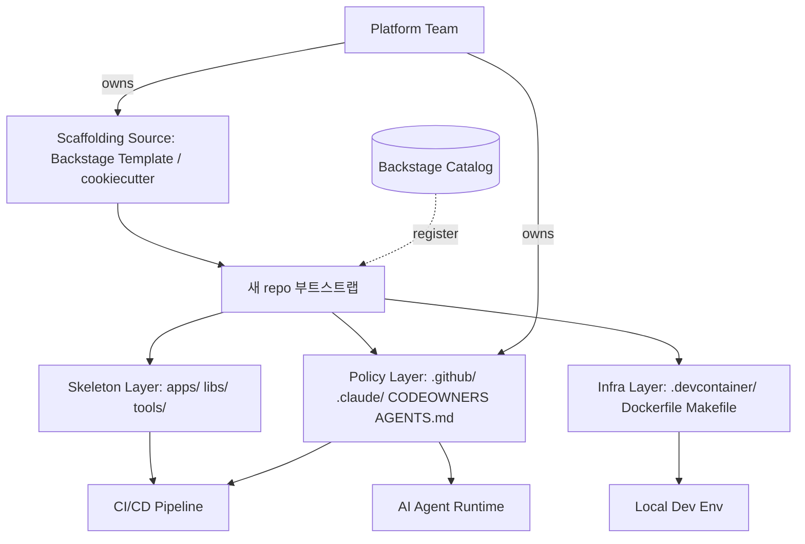
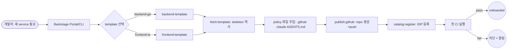

# Common Harness Engineering — Repository Directory Design Strategies

## 핵심 요약

"하네스(harness)를 git repository 디렉토리로 어떻게 펼칠 것인가"는 단일 팀 정책을 N개 프로젝트에 일관 주입하는 platform engineering의 핵심 결정이다. 큰 기업들의 사례는 두 축에서 갈린다 — (1) **monorepo vs polyrepo + scaffolding** 어느 골격을 쓰는가, (2) **하네스 파일(`.github/`, `.claude/`, `tools/`, `scripts/`)을 어디 두는가**. 두 결정 모두 "변경 한 번에 N개 프로젝트가 동시 update되는가, 별도 PR이 N개 필요한가"의 트레이드오프로 귀결된다.

- **공통 구조 3축**: `apps/` (or `services/`) — 실행 가능한 산출물, `libs/` (or `packages/`) — 도메인 무관 공유 라이브러리, `tools/` (or `scripts/`, `infra/`) — 하네스·CI·dev 환경 표준화.
- **하네스 전용 디렉터리**: root 레벨 `.github/`, `.claude/`, `.devcontainer/`, `AGENTS.md`, `CONSTRAINTS.md`, `Makefile` — agent·CI·human이 동일하게 읽는 single source of truth.
- **scaffolding 도구**: Backstage Software Template (YAML), Humanitec, cookiecutter, Yeoman — golden path를 "코드로 배포 가능한 boilerplate"로 만든다.
- **scale에 따른 분기**: 50명 미만 → polyrepo + scaffold, 50~500명 → monorepo (Nx/Turbo/Bazel), 1000명+ → custom build infra (Google Piper, Meta Sapling, Microsoft Scalar).

## 시스템 아키텍처

하네스 디렉토리는 (1) repository skeleton layer — apps/libs/tools 3축, (2) policy layer — `.github/`·`.claude/`·`CODEOWNERS`·`AGENTS.md`, (3) scaffolding source layer — template repo 또는 Backstage YAML, 의 3계층으로 구성된다. scaffolding source가 새 repo를 찍어내면 1·2가 한 번에 주입된다.

## 처리 흐름

신규 프로젝트 생성부터 표준 하네스가 강제되기까지: scaffolding 호출 → 표준 디렉토리 주입 → policy file 강제 → 첫 commit · CI 통과까지 자동.

## 핵심 기능 및 서비스

| 기능 | 설명 |
|---|---|
| Skeleton 3축 | `apps/` (또는 `services/`) — 실행 산출물, `libs/` (또는 `packages/`) — 공유 라이브러리, `tools/` (또는 `scripts/`) — 하네스·CI·dev |
| Policy 디렉토리 | `.github/` (workflows, CODEOWNERS, PR/issue template), `.claude/` (settings, hooks, skills), `.devcontainer/` (dev env) |
| 루트 메타 파일 | `AGENTS.md` (agent용 프로젝트 컨텍스트), `CONSTRAINTS.md` (불변 룰), `PROGRESS.md` (상태), `README.md`, `Makefile` |
| CODEOWNERS | path 단위 자동 reviewer 지정, 정책 파일(`.claude/`, `.github/`) 변경은 platform team에 강제 라우팅 |
| Template repo | golden path를 코드로 표현 (Backstage YAML / cookiecutter / GitHub template repo) |
| Module 단위 메타 | `src/{module}/ARCHITECTURE.md`, `CONSTRAINTS.md` — agent가 module-local 컨텍스트 로딩 |
| Build 격리 | Bazel/Buck/Nx의 `BUILD` 파일로 모듈별 의존성 가시화, 빌드 시간 격리 |
| Folder scope | Microsoft 권장 — 코드 가시성을 폴더 단위로 제한해 의도치 않은 의존성 차단 |

## 유사 기술 비교

| 항목 | Monorepo (Google/Meta) | Polyrepo + Backstage Scaffold (Spotify) | Hybrid Monorepo (Nx/Turbo) | Single Repo + Submodule |
|---|---|---|---|---|
| 정책 일관성 | 매우 강함 (1 PR로 전 repo) | 강함 (template re-scaffold 필요) | 매우 강함 | 중간 (submodule update 필요) |
| 정책 변경 비용 | 낮음 (단일 PR) | 높음 (N repo 일괄 PR / Renovate-bot 필요) | 낮음 | 중간 |
| 빌드 인프라 부담 | 매우 큼 (Bazel/Buck/Piper) | 작음 (repo별 단순 CI) | 중간 (turbo cache) | 작음 |
| 디렉토리 깊이 | 깊음 (5+ 레벨) | 얕음 (2-3 레벨) | 중간 (apps/libs/) | 중간 |
| 적합 규모 | 1000+ engineers | 50-500 services, 100+ engineers | 10-100 packages | 소규모 팀 |
| 대표 사례 | Google, Meta, Twitter, Uber (mobile) | Spotify, Funda, Netflix(polyrepo+커스텀) | Vercel, 토스(프론트), 무신사 | OSS 다중 모듈 |

## 실제 사례

### Google Piper
약 86TB 단일 monorepo. 25,000+ engineers가 single source of truth로 95% 코드 관리 (Chrome·Android만 별도). 디렉토리는 **workspace** 단위로 팀·서비스 분할, 모든 Java 개발자가 다른 팀 디렉토리 구조를 즉시 인식할 만큼 표준화. Bazel(Blaze)로 빌드 의존성 그래프 격리.

### Meta Sapling Monorepo
TB 단위 repo, 하루 수천 commits. Mercurial 기반 → Rust로 자체 재작성한 **Sapling**으로 전환. 디렉토리 단위 branch 지원 (`sl subtree copy`) — 디렉토리 전체를 다른 위치로 historical version까지 복제 가능. 디렉토리 구조 자체가 정책 단위.

### Microsoft Windows (Scalar + GVFS)
Windows를 단일 git monorepo로 관리 — 300GB·3.5M files. Scalar가 GVFS로 root만 clone하고 필요 파일 lazy download. `src/` 하위 작업 디렉토리 + `scalar/` 메타 디렉토리. 권장 원칙: **top-level 디렉토리는 단순하게**, 수년 후에도 의미가 유지되도록. **Folder scope**로 가시성 제한.

### Uber iOS Monorepo
Buck 빌드 시스템 위에 `apps/` (iphone-driver, iphone-eats, iphone-rider) + `libs/` (analytics, utilities) + `vendor/` 의 3축 구조. iOS·Android 양 platform monorepo로 통합 테스트·배포 가속.

### Spotify Backstage Golden Path
polyrepo + **Software Template** 조합. template YAML 하나가 `fetch:template` (skeleton 복사) → `publish:github` (repo 생성) → `catalog:register` (IDP 등록)의 3-step. 표준 CI/CD·observability·문서가 첫 push 시점에 이미 구성. golden path는 강제 아닌 **벗어나는 게 더 힘든 길**.

### 토스 (Toss) — 200+ 서비스 monorepo
50-60명 frontend chapter가 200+ 서비스 단일 monorepo로 관리, 일평균 60+ PR. git push → 배포 5분 유지. 디렉토리 표준화 + remote cache + affected build로 scale 흡수.

### 무신사 (Musinsa) — 3축 폴더
`apps/` + `libs/` + `packages/`의 3축. `libs/`는 도메인 무관 공유 라이브러리, `packages/`는 `libs/`를 조합한 도메인 기능 모듈. domain coupling 깊이를 폴더 레벨에서 명시.

### OpenAI Codex Harness
"harness engineering" 용어 자체를 OpenAI가 사용 — agent를 둘러싼 scaffolding(컨텍스트 전달·도구 interface·planning·verification·memory)이 모델 자체보다 성능을 결정. 권장 root layout: `AGENTS.md` + `src/{module}/ARCHITECTURE.md` + `CONSTRAINTS.md` + `PROGRESS.md` + `Makefile`. **repository에 없는 지식은 agent에게 존재하지 않는다**는 원칙.

## 활용 시나리오

### 시나리오 1: AI agent 표준 컨텍스트 주입
컨텍스트 — 모든 신규 repo에 Claude Code·Codex 같은 agent가 동일한 정책·rule·memory로 동작해야 함. scaffolding template에 `.claude/` (settings/hooks/skills) + `AGENTS.md` (프로젝트 컨텍스트) + `CONSTRAINTS.md` (불변 룰) 표준 셋을 포함. 새 repo 생성 즉시 agent가 동일한 NEVER 룰·CONFIRM 룰·workflow 진입 조건으로 동작.

### 시나리오 2: monorepo로의 점진 통합
컨텍스트 — 5+ polyrepo에서 정책 drift 누적, 동일 보안 패치를 N개 repo에 PR로 살포. monorepo(Nx/Turborepo)로 통합하며 `apps/{service}/` + `libs/shared/` 구조 도입. 정책 변경은 root `.github/`·`.claude/` 단일 PR로 전 service 적용.

### 시나리오 3: golden path scaffolding 구축
컨텍스트 — service 신규 생성 시 README·CI·observability 셋업이 사람마다 다름. Backstage Software Template YAML로 `backend-go`·`frontend-next` 등 template을 정의. 개발자가 Portal에서 폼만 채우면 표준 repo가 분 단위로 생성. drift는 Renovate-bot으로 template version 자동 PR.

### 시나리오 4: 정책 파일 ownership 강제
컨텍스트 — `.github/workflows/*.yml`, `.claude/settings.json`을 누구나 수정해 정책이 흐려짐. root `CODEOWNERS`에 `/.github/ @platform-team`, `/.claude/ @platform-team` 등록. 정책 변경 PR은 platform team 승인 필수, drift 차단.

## 장단점 및 트레이드오프

| 항목 | 내용 |
|---|---|
| 장점 | 신규 repo onboarding 분 단위 / 정책 drift 차단 / agent·CI·human이 동일 source 참조 / 변경 비용 예측 가능 |
| 단점 | scaffolding 도구 자체 유지보수 / template version drift 관리 비용 / 작은 팀에는 over-engineering / monorepo는 빌드 infra 비용 매우 큼 |
| 트레이드오프 | monorepo (변경 일관성↑·infra 비용↑) vs polyrepo+scaffold (infra↓·drift↑) / 깊은 표준화 (consistency↑·자율↓) vs 얕은 표준화 (자율↑·일관성↓) / 강제 (CODEOWNERS·hook) vs 권장 (template·docs) |

## 함정 및 안티패턴

- **안티패턴 1: 디렉토리 구조 없는 monorepo** — root 바로 아래에 50+ 폴더가 평탄하게 누적 → 신규 멤버 onboarding 30분+. `apps/` + `libs/` + `tools/`의 명시적 3축으로 시작하고, 깊이는 도메인 단위로만 추가.
- **안티패턴 2: 정책 파일 ownership 없음** — `.github/`, `.claude/`가 누구나 수정 → drift 누적. `CODEOWNERS`로 platform team 승인 강제.
- **안티패턴 3: template repo는 있지만 update path 없음** — golden path가 처음 한 번만 적용되고 이후 drift. Renovate-bot 같은 자동 PR / `cruft update` 패턴으로 template 변경을 기존 repo에도 전파.
- **안티패턴 4: agent 컨텍스트가 docs/ 외부에 분산** — `AGENTS.md`·`CONSTRAINTS.md`·`ARCHITECTURE.md`가 없거나 wiki에만 존재 → agent가 매번 처음 보는 repo처럼 행동. **repo에 없으면 agent에게는 존재하지 않는다** (OpenAI 원칙).
- **안티패턴 5: monorepo에 모든 것을 욱여넣기** — Chrome·Android처럼 별도 lifecycle이 필요한 코드까지 단일 monorepo. Google조차 95% 룰을 적용 — 명확히 다른 lifecycle은 분리.
- **안티패턴 6: 폴더 scope 없이 cross-module import 허용** — 의도치 않은 의존성 그래프 폭증. Bazel `visibility`, Nx `tags`, Microsoft 권장 folder scope로 가시성 제한.
- **안티패턴 7: scaffolding이 boilerplate만 찍어내고 정책은 따로 PR** — 첫 commit 시점에 정책이 강제되지 않으면 drift는 첫날부터 시작. template은 skeleton + policy + CI를 한 번에 주입해야 한다.

## 참고 자료

- [Why Google Stores Billions of Lines of Code in a Single Repository | Google Research](https://research.google/pubs/why-google-stores-billions-of-lines-of-code-in-a-single-repository/) — Google Piper 단일 monorepo 95% 룰·workspace 단위 표준화
- [How Google Does Monorepo | QE Unit](https://qeunit.com/blog/how-google-does-monorepo/) — Google monorepo 디렉토리·Bazel 빌드 격리 패턴
- [Branching in a Sapling Monorepo | Engineering at Meta](https://engineering.fb.com/2025/10/16/developer-tools/branching-in-a-sapling-monorepo/) — Meta Sapling의 디렉토리 단위 branch (`sl subtree copy`)
- [What it is like to work in Meta's monorepo | 3d-logic blog](https://blog.3d-logic.com/2024/09/02/what-it-is-like-to-work-in-metas-facebooks-monorepo/) — TB급 monorepo의 일상 워크플로
- [How Microsoft's Git fork scales for massive monorepos | InfoWorld](https://www.infoworld.com/article/2337202/how-microsofts-git-fork-scales-for-massive-monorepos.html) — Windows 300GB monorepo, Scalar+GVFS lazy clone
- [Working with a Monorepo | Microsoft ISE Developer Blog](https://devblogs.microsoft.com/ise/working-with-a-monorepo/) — Microsoft 권장 top-level 단순화·folder scope 원칙
- [Faster Together: Uber Engineering's iOS Monorepo | Uber Blog](https://www.uber.com/blog/ios-monorepo/) — Uber iOS `apps/` + `libs/` + `vendor/` 3축 구조
- [Onboarding Software to Backstage Software Templates | Spotify](https://backstage.spotify.com/learn/onboarding-software-to-backstage/setting-up-software-templates/11-spotify-templates/) — Backstage Software Template YAML 구조와 fetch/publish/register 3-step
- [How to Build Golden Paths in Backstage IDP | Medium](https://medium.com/@rameshavutu/backstage-idp-golden-paths-software-templates-170adce436fe) — golden path를 template으로 구현하는 절차
- [Designing Golden Paths | Red Hat](https://www.redhat.com/en/blog/designing-golden-paths) — golden path 설계 원칙 (강제가 아닌 잘 깔린 길)
- [How to design your repository structures to nail platform engineering | Humanitec](https://humanitec.com/blog/how-to-design-your-repository-structures-to-nail-platform-engineering) — application·infra repo 분리·standardization 패턴
- [Harness engineering: leveraging Codex in an agent-first world | OpenAI](https://openai.com/index/harness-engineering/) — agent 주위 scaffolding이 모델보다 성능을 결정한다는 원칙
- [Harness Engineering: Why Code Matters More Than the Model | Substack](https://bhavishyapandit9.substack.com/p/harness-engineering-why-code-matters) — root `AGENTS.md`·`CONSTRAINTS.md`·`PROGRESS.md`·`Makefile` 권장 layout
- [awesome-harness-engineering | GitHub](https://github.com/ai-boost/awesome-harness-engineering) — agent harness 패턴·도구·평가 모음
- [200여개 서비스 모노레포의 파이프라인 최적화 | Toss tech](https://toss.tech/article/monorepo-pipeline) — 토스 200+ 서비스 monorepo·5분 배포 유지
- [모노레포 이렇게 좋은데 왜 안써요? | 무신사 tech](https://medium.com/musinsa-tech/journey-of-a-frontend-monorepo-8f5480b80661) — 무신사 `apps/` + `libs/` + `packages/` 3축
- [Structuring Your Monorepo: Best Practices | Mindful Chase](https://www.mindfulchase.com/deep-dives/monorepo-fundamentals-deep-dives-into-unified-codebases/structuring-your-monorepo-best-practices-for-directory-and-code-organization.html) — `/apps`, `/libs`, `/configs`, `/scripts` 기본 구조와 DDD 그룹핑
- [Folder Structure | Nx](https://nx.dev/docs/concepts/decisions/folder-structure) — Nx 권장 `apps/` + `libs/` + tags 기반 boundary
