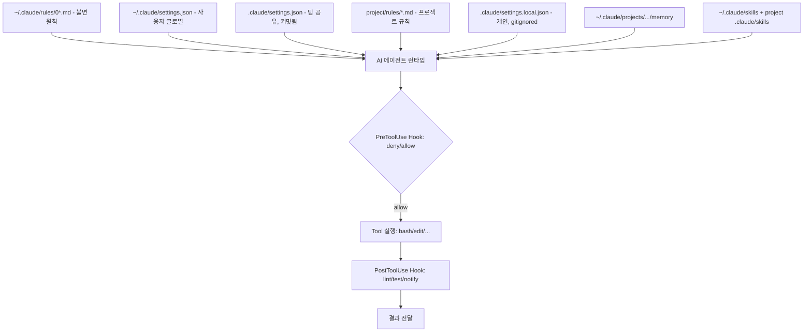
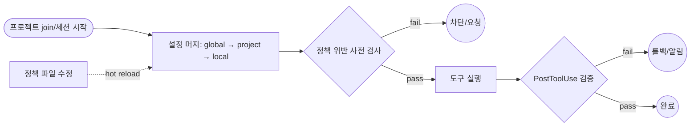

# Common Harness Engineering — Unified Team Project Management

## 핵심 요약

"하네스(harness)"는 개발 작업 위에 덧입혀 일관된 동작·정책·도구를 강제하는 **지속성 설정 레이어**다. 팀 단위로는 모든 프로젝트가 같은 hook·skill·rule·permission·template을 공유하도록 메타-레이어를 구축해 "AI 에이전트·CI·dev 환경이 어디서 작동해도 동일하게 행동"하게 만드는 엔지니어링 활동을 가리킨다.

- **단일 설정 레이어**: 팀 공통 `settings.json`/hooks/rules/skills를 사용자 home과 프로젝트 repo 두 단계로 표준화.
- **계층적 override**: user → project → local의 3계층 머지로 공통과 개인화 분리.
- **AI 에이전트 통합**: Claude Code harness가 대표 사례 — settings.json + hooks + skills + memory + permissions의 합집합이 "harness".
- **Golden path / paved road 등가**: platform engineering의 골든패스를 AI 에이전트 차원에 확장한 개념.

## 시스템 아키텍처

하네스 시스템은 (1) 글로벌 규칙 레이어, (2) 프로젝트 공유 설정 레이어, (3) 로컬·개인 오버라이드 레이어의 3계층 구조. 각 레이어는 PreToolUse/PostToolUse hook과 permission gate로 실시간 강제된다.

## 처리 흐름

신규 프로젝트 join 또는 변경 발생 시 하네스 layer 머지 → 정책 평가 → 도구 실행 → 사후 검증의 흐름. 위반은 hook에서 차단되고 정책 변경은 hot reload된다.

## 핵심 기능 및 서비스

| 기능 | 설명 |
|---|---|
| 설정 계층 머지 | user(`~/.claude/settings.json`) → project(`.claude/settings.json`) → local(`.claude/settings.local.json`) 3-tier |
| 공유 hooks | PreToolUse·PostToolUse·SessionStart 등 12개 lifecycle 이벤트에 팀 표준 스크립트 부착 |
| 공유 skills | 자주 쓰는 워크플로(/analyze, /fix, /review, /test)를 팀 표준으로 패키징 |
| 공유 rules | 자연어 가이드(00_principles, 02_guardrails 등)로 모델 행동 가이드 |
| Permissions | allowlist/denylist + ask 모드로 위험 명령 사전 차단 |
| Memory layer | 사용자·프로젝트별 메모리로 반복 컨텍스트 제거 |
| Template/scaffold | 신규 프로젝트 생성 시 표준 `.claude/` 구조 자동 시드 |
| Audit/observability | hook log·session log로 정책 적용 이력 추적 |

## 유사 기술 비교

| 항목 | Claude Code Harness | Backstage/Port IDP | Harness.io CD/CD | Monorepo (Nx/Turborepo) |
|---|---|---|---|---|
| 주요 대상 | AI 에이전트 + dev 환경 | 서비스 카탈로그·골든패스 | CI/CD·feature flag·비용 | 코드베이스 통합 |
| 표준화 단위 | settings/hook/skill/rule | software template/score | pipeline·gate | build target/cache |
| Self-service | 강함 (hook 자동 강제) | 매우 강함 (UI 포털) | 매우 강함 | 중간 (CLI 위주) |
| 학습곡선 | 낮음 (JSON + markdown) | 매우 큼 (Backend·플러그인) | 중간 | 중간 |
| 적합 케이스 | AI 협업 팀, 1~수십 명 | 100+ 서비스, IDP 전담 팀 | 대규모 CD/CD 통합 | JS/TS·polyglot 모노레포 |

## 실제 사례

### Anthropic Claude Code 공식 권장
`.claude/settings.json`을 팀 repo에 커밋해 hook·permission·env var를 전원 공유. `settings.local.json`은 gitignore. 이 패턴이 "harness engineering"이라 불리며, AI 에이전트가 매번 동일한 안전 가드·품질 게이트 하에서 동작.

### Spotify Backstage / Golden Path
"Software Template"으로 신규 서비스 부트스트랩 시 회사 표준 CI/CD·docs·observability를 한 번에 주입. golden path는 강제가 아니라 "벗어나는 게 더 힘들도록" 잘 깔린 길이라는 원칙.

### Netflix Paved Road
"포장된 도로"는 표준 도구 스택(메트릭·로깅·deploy)을 사용할 때 인프라 팀이 책임지고 지원. 벗어나면 자율은 있으되 지원이 줄어드는 트레이드오프.

### Harness.io Unified Pipeline
CI·CD·feature flag·비용 관리·chaos·보안 테스트를 하나의 파이프라인으로 묶음. "context switching = toil"이라는 진단에서 출발해 도구 통합으로 lead time 단축.

## 활용 시나리오

### 시나리오 1: 신규 프로젝트 부트스트랩
컨텍스트 — 팀에 새 repo가 추가될 때마다 hook·permission·skill 셋업이 사람마다 달라 일관성 저하. `.claude/` 표준 디렉터리와 `scaffold` 스크립트를 정의해 신규 repo 생성 즉시 표준 하네스 자동 주입. 신규 멤버는 clone 후 곧바로 동일 정책 하에서 작업.

### 시나리오 2: 위험 명령 사전 차단
컨텍스트 — `rm -rf`, `git push --force`, `.env` 커밋 등이 사람마다 다른 기준으로 통제됨. 공유 settings.json의 `permissions.deny`와 PreToolUse hook으로 시스템 차단. 모델 self-discipline 의존 0.

### 시나리오 3: 팀 표준 워크플로 강제
컨텍스트 — `Analysis → Fix → Review → Test` 같은 표준 워크플로를 사람마다 다르게 적용. `/analyze`·`/fix`·`/review`·`/test` skill을 팀 공통으로 정의하고, 03_workflow rule로 진입 조건·skip 조건을 명시. 모델 응답이 표준 단계대로 진행.

### 시나리오 4: 메모리·컨텍스트 공유
컨텍스트 — 같은 피드백을 각자 매번 모델에 다시 알려주는 비효율. project CLAUDE.md에 공통 정책·constraint를 두고 사용자 memory는 개인 선호 분리. 팀 공유 정보는 commit, 개인은 gitignored memory.

## 장단점 및 트레이드오프

| 항목 | 내용 |
|---|---|
| 장점 | 일관성·안전·onboarding 가속 / 모델 self-discipline 의존 제거 / golden path로 productivity 상승 |
| 단점 | 초기 셋업·합의 비용 / 너무 강한 강제는 자율성 저해 / hook script 자체의 유지보수 부담 |
| 트레이드오프 | 자율(off-path 허용) vs 일관성(강제) / 단순함 vs 표현력 / settings 계층 깊이 vs 디버깅 용이성 |

## 함정 및 안티패턴

- **안티패턴 1: settings를 user 글로벌에만 두기** — 팀 협업 환경에서 사람마다 정책 다름. → 공통은 반드시 `.claude/settings.json`에 커밋, 개인은 `.local.json`.
- **안티패턴 2: 모델 self-discipline 의존** — "이렇게 해줘" 자연어 가이드만으로 룰 강제. → NEVER 항목은 시스템 deny(permissions/hook)로 차단해야 신뢰 가능.
- **안티패턴 3: hook 스크립트 silent failure** — hook이 실패해도 알림 없음. → exit code·log·alert까지 정의.
- **안티패턴 4: 골든패스 강제로 자율 제거** — paved road를 mandate로 만들면 팀이 "왜 이래야 하나"에 시간 낭비. → off-path는 명시적 비용을 갖되 허용. 사용 통계로 path를 계속 개선.
- **안티패턴 5: 정책의 정책 없음** — 어떤 정책이 어디에 있고 우선순위가 뭔지 불명. → CLAUDE.md의 "Conflict Resolution" 같은 메타-정책으로 hierarchy 명시.
- **안티패턴 6: skill·hook이 너무 많음** — 학습 곡선 폭증. → 핵심 워크플로(Analysis/Fix/Review/Test 등 5~7개)에 한정, 나머지는 사례로 발견되면 추가.

## 참고 자료

- [Claude Code settings | Claude Code Docs](https://code.claude.com/docs/en/settings) — `.claude/settings.json` 계층·hook·permission 공식 레퍼런스
- [Harness Engineering: Configuring Claude Code | Restato](https://restato.github.io/blog/harness-engineering-guide-claude-code/) — "Harness Engineering" 개념 정립
- [Claude Code Hooks Complete Guide | SmartScope](https://smartscope.blog/en/generative-ai/claude/claude-code-hooks-guide/) — 12 lifecycle 이벤트·팀 공유 hook 패턴
- [Backstage | Software Catalog & Developer Platform](https://backstage.io/) — IDP·software template·golden path 대표 구현
- [What is a Golden Path? | Red Hat](https://www.redhat.com/en/topics/platform-engineering/golden-paths) — 골든패스·페이브드 로드 원칙
- [How to pave golden paths that actually go somewhere | Platform Engineering](https://platformengineering.org/blog/how-to-pave-golden-paths-that-actually-go-somewhere) — golden path 설계·도입 가이드
- [Harness Unified Pipeline | Harness.io](https://www.harness.io/) — CI/CD/feature flag/비용을 한 파이프라인으로 통합한 상용 예
- [Monorepo Explained](https://monorepo.tools/) — 코드베이스 차원의 통합 도구(Nx·Turborepo·Bazel 등) 비교
