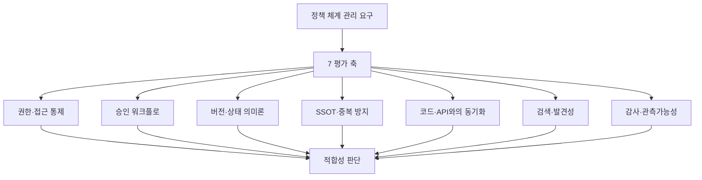
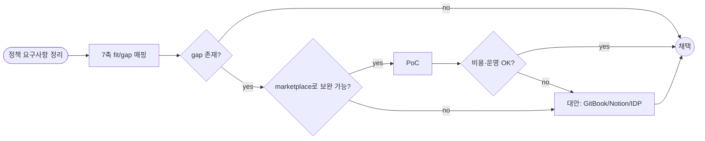

# Confluence — 공용 문서 정책 체계 관리용 적합성 판단

## 핵심 요약

Confluence가 "기획자·개발자 공용 문서의 정책 체계 관리(소유권·승인·SSOT·버전·감사)" 도구로 얼마나 적합한가에 대한 평가. **결론은 "강한 강점과 명확한 한계가 공존, 대부분 조직에서 marketplace 앱 1~2개와 결합하면 충분"**이며, 본문은 7개 평가 축으로 강·약점을 매핑한다.

- **강점 우위 영역**: 권한·공간 거버넌스, Jira 양방향 연동, PRD/요구사항 템플릿, cross-functional 인덱싱.
- **약점 명확 영역**: 네이티브 approval 워크플로 부재, 버전 의미론(`draft/approved` 등) 미지원, API spec과의 docs-as-code sync, 검색 최적화.
- **결정 룰**: API spec·코드와 1:1 동기화가 핵심이면 GitBook/IDP가 우위. PM 중심 living document + Jira 연동이 핵심이면 Confluence 우위.

## 평가 기준 (Component Diagram)

정책 체계 관리에 필요한 7개 평가 축 — 각 축마다 Confluence 네이티브 vs marketplace vs alternative 도구의 매핑이 가능하다.

## 처리 흐름 (적용 단계)

도입 검토는 요구사항 정의 → 7축 fit/gap 매핑 → marketplace 보완 → PoC → 결정의 순서로 진행한다.

## 핵심 기능 및 서비스 — 평가 축별 매핑

| 평가 축 | Confluence 네이티브 | 보완 도구·marketplace 앱 |
|---|---|---|
| 권한·접근 통제 | Space + Page 2-단계, 그룹 기반, 자식 페이지에 view 상속 (edit는 비상속) | Comala Document Control (역할 매트릭스) |
| 승인 워크플로 | 네이티브 없음, page restriction + automation으로 우회 가능 | Comala Workflow, AURA Workflow, Easy Approval |
| 버전·상태 의미론 | page version history는 있으나 `draft/approved/deprecated` 의미론 없음 | Scroll Documents (semantic versioning) |
| SSOT·중복 방지 | space 구조로 가능, smart link로 외부 참조 | 별도 governance 정책으로 보강 |
| 코드·API spec 동기화 | OpenAPI 매크로 일부 + 수동 publish | mintlify/gitbook auto-publish를 separate로 운영 |
| 검색·발견성 | CQL·label·전문 검색 | Refined·Mosaic 등 UX 강화 앱 |
| 감사·관측가능성 | audit log (Premium/EE), page activity history | Atlassian Access·Cloud Admin |

## 유사 기술 비교

| 항목 | Confluence | Notion | GitBook | Backstage TechDocs |
|---|---|---|---|---|
| PM 친화도 | 매우 높음 (Jira 통합) | 매우 높음 | 낮음 | 매우 낮음 |
| Engineer 친화도 | 중간 | 중간 | 매우 높음 (Git Sync) | 매우 높음 |
| 승인 워크플로 | 약함 (marketplace 필요) | 약함 | 강함 (change request) | git PR 기반 |
| 버전 의미론 | 약함 (marketplace 보완) | 약함 | 강함 (Git tag/branch) | 강함 |
| Jira 양방향 | 매우 강함 | 중간 (Synced DB) | 약함 | 약함 |
| docs-as-code | 약함 | 약함 | 매우 강함 | 매우 강함 |
| 가격 (50인 기준) | 중상 | 상 | 중 | 자체 호스팅 비용 |
| 적합 상황 | Atlassian 생태계, PM 중심 정책 | 스타트업·올인원 | API doc·엔지니어 중심 | 대규모 IDP 운영 |

## 실제 사례

### Atlassian 공식 PRD 가이드
Confluence + Jira 양방향 sync로 PRD를 living document로 운영. `/jira` 매크로로 epic·issue 임베드, 상태 자동 반영. PM-Engineer 협업의 산업 표준 reference.

### 우아한형제들 — Confluence 가이드 (한국)
사내 위키로 채택하며 "조직 문화·프로세스 변경 동반 필요"를 명시. 콘텐츠 매니저 역할로 깨진 링크·중복 페이지 정리 의무화. 거버넌스의 절반은 도구가 아니라 운영 정책에서 온다는 사례.

### Cotera Confluence API 통합 사례
Confluence API로 페이지 자동 갱신 도구를 만들었으나 결국 agent로 교체. CQL의 한계(텍스트 search는 contains, regex 미지원)와 페이지 versioning 한계가 운영 cost로 누적.

### Atlassian Cloud Rate Limiting (2026.03 시행)
Forge·Connect·OAuth 2.0 앱에 점수 기반 rate limit 도입. 대규모 자동화·sync 도구 운영 시 quota 설계가 추가 부담.

## 활용 시나리오

### 시나리오 1: PM 중심 living PRD + Jira 추적 (적합)
PRD를 Confluence에서 작성, Jira epic을 임베드해 상태 자동 노출, Comala Workflow로 draft → review → approved. 결정: **Confluence 강력 추천**.

### 시나리오 2: API 계약을 SSOT로 (덜 적합)
OpenAPI spec이 SSOT여야 하는데 Confluence는 native docs-as-code 미흡. GitBook Git Sync 또는 별도 IDP가 SSOT를 보유하고 Confluence는 link/embed만. 결정: **Confluence를 보조 view로만**.

### 시나리오 3: 엔지니어가 PR 형태로 문서 작성 (덜 적합)
GitBook의 change request 또는 git-based docs가 더 자연스러움. Confluence의 page restriction은 PR-like 흐름이 아님. 결정: **Backstage TechDocs 또는 GitBook 권장**.

### 시나리오 4: 50+ 팀의 cross-functional 정책 카탈로그 (적합 단, 거버넌스 운영 필요)
space 구조 + 권한 그룹으로 거버넌스 가능. 단 콘텐츠 매니저·정기 감사·marketplace approval 앱 필요. 결정: **Confluence + 운영 정책 + Comala/AURA marketplace 앱**.

## 장단점 및 트레이드오프

| 항목 | 내용 |
|---|---|
| 장점 | Jira 양방향 sync 압도적 / 권한·space 거버넌스 성숙 / PM 친화 템플릿 (PRD 등) / 엔터프라이즈 audit log / cross-functional 채택률 높음 |
| 단점 | 네이티브 approval 부재 / 의미론적 버전(`draft/approved/deprecated`) 미지원 / docs-as-code 약함 / 검색 UX 한계 / 클라우드 rate limit 부담 |
| 트레이드오프 | 즉시 도입 가능성 vs marketplace 의존 비용 / Atlassian 락인 vs 생태계 시너지 / PM-편향 vs engineer-편향 |

## 함정 및 안티패턴

- **안티패턴 1: 거버넌스 정책 없이 Confluence만 도입** — space·페이지가 무한 증식, SSOT 깨짐. → 도입 전 정책(소유권·승인·아카이브)을 먼저 정의.
- **안티패턴 2: page restriction = approval workflow 가정** — restriction은 잠금일 뿐 승인 흐름 아님. → 명시적 workflow 앱(Comala 등) 또는 외부 흐름과 결합.
- **안티패턴 3: API spec을 Confluence에 직접 작성·유지** — 코드와 분리되어 sync 실패. → SSOT는 git, Confluence는 read-only embed.
- **안티패턴 4: page version history를 의미론적 버전으로 착각** — version 17이 approved version인지 알 수 없음. → 별도 status 라벨/property 또는 Scroll Documents 도입.
- **안티패턴 5: marketplace 앱 남용** — 앱마다 라이센스·업그레이드·SLA 부담 → 운영 cost 폭증. → 핵심 2~3개로 한정, 가능하면 네이티브로 우회.
- **안티패턴 6: Atlassian 생태계 락인 미검토** — 이후 도구 이전 비용이 폭증. → 도입 시점에 export/migration 시나리오를 한 번 검증.

## 적합성 판단 (결론 요약)

| 사용 맥락 | 판단 |
|---|---|
| PM 중심 + Jira 사용 + 50인+ | **매우 적합** — marketplace 1~2개로 정책 체계 완성 |
| API spec·코드 docs가 핵심 | **부분 적합** — GitBook/IDP가 SSOT, Confluence는 보조 |
| 엔지니어 중심·PR 기반 문서 | **부분 적합** — Backstage TechDocs/GitBook 우선 |
| 5~20인 소규모 + Notion 친화 | **불적합 우려** — Notion이 cost·UX 우위 |
| Compliance·audit 의무 | **적합** — 단 Premium/EE plan + governance 운영 필요 |

## 참고 자료

- [Space Permissions Overview | Confluence Data Center](https://confluence.atlassian.com/doc/space-permissions-overview-139521.html) — 공간·페이지 2-단계 권한 모델
- [Page restrictions | Confluence Data Center](https://confluence.atlassian.com/doc/page-restrictions-139414.html) — view 상속·edit 비상속 동작
- [Managing approval workflows in Confluence | Atlassian Community](https://community.atlassian.com/forums/App-Central-articles/Managing-approval-workflows-in-Confluence-native-options-and-the/ba-p/3101833) — 네이티브 approval 부재 + working copy 패턴
- [How to Manage Versioned API Docs and Changelogs | Apidog](https://apidog.com/blog/versioned-api-docs-changelogs/) — Confluence versioning 한계와 대안
- [Confluence vs Notion vs GitBook | eesel AI](https://www.eesel.ai/blog/confluence-vs-notion-vs-gitbook) — 3-도구 사용 맥락별 비교
- [Free Product Requirements Document (PRD) Template | Confluence](https://www.atlassian.com/software/confluence/templates/product-requirements) — PM-Engineer PRD 공식 템플릿
- [Tutorial: How to Use Confluence and Jira Together | Atlassian](https://www.atlassian.com/software/confluence/resources/guides/extend-functionality/confluence-jira) — Jira 양방향 sync 핵심 강점
- [컨플루언스 위키의 단점 (한국어) | Thinking Machine](https://blog.woojinkim.org/cons-of-confluence-wikis/) — 한국 조직 운영 관점의 단점 정리
- [우아한형제들 — 소프트웨어 팀을 위한 컨플루언스 가이드](https://woowabros.github.io/woowabros/2016/09/13/confluence_guide.html) — 도입 시 조직 문화·운영 정책 동반 사례
- [Confluence API Integration Guide | Cotera](https://cotera.co/articles/confluence-api-integration-guide) — CQL·API 한계 실전 사례
