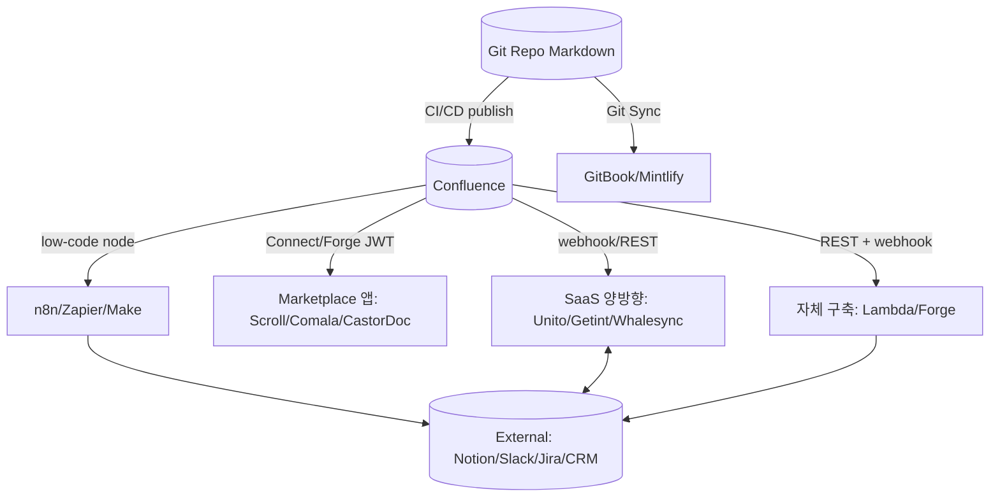
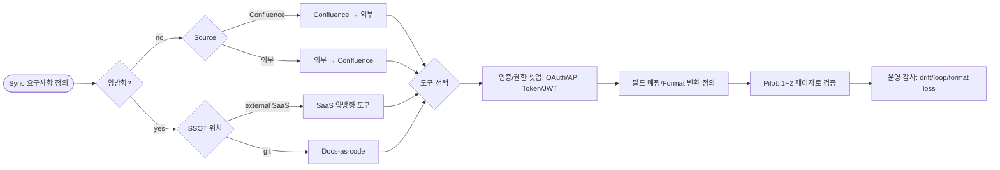

# Confluence Sync — 도구 및 방법 카탈로그

## 핵심 요약

Confluence를 다른 시스템(Notion·GitHub·Slack·git repo·KMS 등)과 동기화하는 도구·방법을 **5개 카테고리**로 분류한 도구 카탈로그. 직전 노트들(`fl-2026-06-06-confluence-wiki-sync-cdc`, `bidirectional-conflict`)이 sync **패턴**을 다뤘다면 본 노트는 **구체적 제품·방법** 매핑에 집중.

- **카테고리 5개**: (1) SaaS 양방향 sync 도구, (2) Atlassian Marketplace 앱, (3) Docs-as-code Git Sync, (4) Low-code 워크플로 자동화, (5) 자체 구축(REST API + Forge/Connect).
- **선택 기준 1줄**: 양방향이 필수면 Unito/Getint, SSOT가 git이면 GitBook/Backstage, 단순 자동화면 n8n/Zapier/Make, full control 필요면 자체 구축.
- **공통 제약**: Confluence webhook delivery는 best-effort(보장 X), ADF/Storage Format 변환 손실, REST API v2 PUT은 page body 전체 + version 증가 의무.
- **Native Atlassian만으로는**: Excerpt macro로 같은 space 내 동기 가능. cross-space·external은 불가 → 위 5개 카테고리 중 하나 필요.

## 컴포넌트 다이어그램

Confluence를 중심으로 5개 sync 카테고리가 각각 다른 방식으로 연결되는 구조. SaaS·Marketplace는 high-level, Git Sync·자체 구축은 low-level.

## 적용 단계

도구 선택 → 인증 셋업 → 동기 룰 정의 → 시범 운영 → 감사. 카테고리마다 단계 동일하지만 사용 도구가 다름.

## 핵심 기능 및 서비스

| 카테고리 | 대표 도구 | 주요 기능 | 셋업 시간 | 적합 케이스 |
|---|---|---|---|---|
| SaaS 양방향 | **Unito**, **Getint**, **Whalesync** | 양방향 룰 + loop guard + field 매핑 GUI | 10분~수 시간 | 양방향 필수, 코드 0, 60+ tool 지원 |
| Marketplace 앱 | **Scroll Versions/Content Manager**, **Comala Publishing**, **CastorDoc** | semantic versioning, approval workflow, cross-space sync | 1~2 시간 | Confluence 내부 강화 또는 단방향 cross-space |
| Docs-as-code | **GitBook Git Sync**, **Mintlify**, **docs-as-code-confluence GH Action** | git ↔ Confluence/외부 publish + PR review | 반나절~1일 | SSOT가 git, engineer 중심, code review 흐름 일치 |
| Low-code 자동화 | **n8n** (OSS), **Zapier**, **Make** | webhook/polling + 필드 매핑 GUI + 분기 로직 | 30분~수 시간 | 소규모 통합, 비-개발자, 빠른 PoC |
| 자체 구축 | **REST API v2 + webhook**, **Forge trigger**, **Connect JWT** | full control, custom format/ACL/multi-tenant | 수일~수 주 | 복잡 변환·tenant 격리·고급 ACL |

### 카테고리별 세부 비교

#### 1. SaaS 양방향 (Unito vs Getint vs Whalesync)
- **Unito**: $65/월(annual), 750 tasks 제한, 15분 업데이트 간격, 6 mapped fields 시작 플랜. 60+ tool 연결. SOC 2 Type 2.
- **Getint**: connection 수 기반 고정 fee. QuickBuild 10분 셋업. Custom script로 복잡 케이스 처리. 양방향 + custom field/comment/attachment 모두.
- **Whalesync**: no-code 2-way sync. Airtable/Webflow/Notion/Postgres/Bubble 위주. 파일 호스팅 내장.

#### 2. Marketplace 앱
- **Scroll Versions (= Scroll Content Manager로 rebrand 진행 중, 2026 v4.8.10)**: semantic versioning + draft/approved/deprecated 명시.
- **Comala Publishing (2026-05 v5.1.0)**: space 간 단방향 sync + Appfire workflow 통합.
- **Comala Document Management**: approval workflow + Scroll Exporter와 연동해 reviewed page만 export.
- **CastorDoc**: Notion ↔ Confluence 통합 knowledge base + 데이터 카탈로그.

#### 3. Docs-as-code Git Sync
- **GitBook Git Sync**: GitHub/GitLab 양방향 sync. block-based WYSIWYG + Markdown 동시. 비기술 contributor 친화.
- **Mintlify**: GitHub MDX 중심, code editor가 주 interface. 비기술 contributor 약함.
- **docs-as-code-confluence (GitHub Action)**: markdown 디렉토리를 Confluence pages로 자동 publish. 각 폴더가 parent page로 구조화.
- **Backstage TechDocs**: Confluence를 source로 직접 못 받음(issue #28203). 외부 도구로 Confluence → Markdown 변환 후 git에 두는 우회 방식.

#### 4. Low-code 자동화
- **n8n**: OSS, self-host 가능, HTTP Request 노드 + Confluence 노드. 엔지니어링 친화.
- **Zapier**: 7000+ integration, no-code, per-task 과금 (대규모 시 비쌈).
- **Make**: visual scenario + branching + transformation. Zapier 대비 3-5× 저렴.

#### 5. 자체 구축
- **Confluence Webhook**: `POST /rest/api/webhooks` + HMAC 인증 + best-effort delivery (보장 X).
- **REST API v2 PUT**: page body 전체 + version+1 의무, 409 conflict 시 re-read+retry.
- **Forge trigger**: `manifest.yml`에 trigger 등록 → Atlassian 런타임에서 자동 dispatch.
- **Connect app**: JWT 인증, page event 구독, 마크로/page extension 패턴.

## 유사 기술 비교

| 항목 | SaaS 양방향 | Marketplace 앱 | Docs-as-code | Low-code | 자체 구축 |
|---|---|---|---|---|---|
| 비용 | $$ (구독) | $ (Marketplace 단가) | $ ~ free (GitHub Action) | $ ~ $$ | dev cost |
| 셋업 시간 | 10분~수 시간 | 1~2 시간 | 반나절~1일 | 30분~수 시간 | 수일~수 주 |
| 양방향 | 매우 강함 | 약함 (단방향 위주) | 강함 (Git PR) | 가능 (룰 수동) | 가능 (자체 설계) |
| 커스터마이징 | 중간 | 약함 | 매우 강함 | 강함 | 매우 강함 |
| 유지보수 부담 | 낮음 (SaaS 위임) | 낮음 (앱이 관리) | 중간 (CI 관리) | 중간 | 매우 큼 |
| Format 변환 손실 | 중간 (ADF↔Markdown 한계) | 거의 없음 (네이티브) | 중간 | 중간 | 직접 제어 |
| 적합 케이스 | 양방향·다중 tool | Confluence 내부 강화 | engineer 중심 SSOT git | 소규모 PoC·비개발자 | 복잡 변환·tenant 격리 |

## 실제 사례

### Unito Confluence ↔ Notion 양방향 (공식 reference)
PM 팀 Notion ↔ Engineer 팀 Confluence 양방향 sync. 필드별 sync direction 설정으로 metadata는 one-way, 본문은 two-way. Duplicate·loop 0 보장.

### Getint Confluence ↔ Jira 고급 sync
Custom field·comment·attachment 모두 양방향. QuickBuild로 기본 셋업 10분, custom script로 PRD ↔ Epic 매핑 같은 복잡 케이스 처리.

### Scroll Versions — 기술 문서 버전 관리
한 Confluence space 안에서 product version별 문서를 분기·머지. Comala Workflows와 결합해 approval 흐름 통합.

### docs-as-code-confluence GitHub Action
사내 docs repo의 markdown 디렉토리가 PR 머지 시점에 자동으로 Confluence pages로 publish. CI secret에 `ATLASSIAN_API_TOKEN` 보관, 폴더 구조가 parent page tree로 변환.

### n8n self-host Confluence ↔ Slack
사내 자동화 서버에 n8n 자체 호스트. Confluence `page_updated` webhook → n8n workflow → Slack 채널 알림. 비용 0(self-host) + custom logic 자유.

### CastorDoc — Notion + Confluence 통합 KMS
지식 카탈로그가 양 도구의 페이지를 하나의 검색 가능한 layer로 통합. 양방향 sync로 SSOT 유연 유지.

## 활용 시나리오

### 시나리오 1: PM Notion ↔ Engineer Confluence 양방향
컨텍스트 — PM은 Notion에서 PRD 작성, engineer는 Confluence에서 검토·코멘트. 별도 도구 강제 불가. → **Unito** 또는 **Getint**로 양방향 sync. Field level 분리: 본문은 양방향, status·label은 PM 쪽(Notion) owner. Loop guard로 sync user 변경 자동 식별.

### 시나리오 2: API spec git SSOT, Confluence는 read-only mirror
컨텍스트 — OpenAPI spec이 git에 있고, PM·고객지원이 Confluence에서 보고 검색. → **docs-as-code-confluence GitHub Action**으로 markdown(또는 OpenAPI rendered) auto-publish. PR 머지 시점에 Confluence 미러 자동 갱신. 충돌 0, 검색은 Confluence에서.

### 시나리오 3: 소규모 팀 — Slack 알림만 필요
컨텍스트 — Confluence 페이지 변경 시 Slack 알림만 필요. 양방향·복잡 변환 불필요. → **Zapier** 또는 **n8n**. 5분 만에 Confluence trigger + Slack send 설정. 30/월 task 무료 plan으로 시작 가능.

### 시나리오 4: Multi-tenant SaaS — Tenant 격리 sync
컨텍스트 — 고객사마다 별도 Confluence space 가지고 자사 백오피스와 sync 필요. SSOT는 백오피스, Confluence는 view. → **자체 구축**: Forge app + tenant context-aware REST 호출. Marketplace 앱이나 SaaS 도구로는 tenant context 격리 어려움.

### 시나리오 5: 다국어 문서 + 버전 관리
컨텍스트 — 제품 문서를 EN/KO/JA 3개 언어로 운영. 버전별 분기 필요. → **Scroll Versions** + Marketplace의 다국어 앱 결합. 한 space에서 언어·버전 dimension 관리, Comala Workflow로 번역 approval.

### 시나리오 6: AI 어시스턴트 KB 시드 — Confluence → 임베딩 스토어
컨텍스트 — Confluence 사내 문서를 RAG 챗봇 KB로 활용. → Confluence webhook → 자체 구축 Lambda → 변경된 페이지만 chunk·embed → vector DB upsert. 직전 노트 `[[fl-2026-06-06-confluence-wiki-sync-cdc]]` 패턴 적용.

## 장단점 및 트레이드오프

| 항목 | 내용 |
|---|---|
| 장점 | 카테고리 5종으로 거의 모든 sync 요구 커버 / 각 카테고리에 검증된 도구 다수 / docs-as-code·SaaS·자체 구축 혼합 운용 가능 |
| 단점 | ADF/Storage Format 변환 손실 공통 한계 / webhook best-effort라 reconciliation 필요 / 도구 중복 시 책임 모호 / SaaS는 vendor lock-in 또는 비용 누적 |
| 트레이드오프 | 셋업 시간 ↔ 커스터마이징 깊이 / 운영 부담 ↔ 통제 / 비용 단가 ↔ 확장성 / 도구 단일화 ↔ best-of-breed 선택 |

## 함정 및 안티패턴

- **안티패턴 1: 카테고리 혼용 무계획** — 같은 페이지를 SaaS 양방향 sync + 자체 webhook이 동시에 건드림 → loop·충돌. → 카테고리당 명확한 source/target 매트릭스 작성, 한 페이지는 한 sync path만.
- **안티패턴 2: webhook delivery 보장으로 가정** — Confluence webhook은 best-effort, 미수신 발생. → 일정 주기로 REST API reconciliation 추가 (audit log polling 결합).
- **안티패턴 3: Marketplace 앱 과다** — license·업그레이드·SLA 부담이 비선형 증가. → 핵심 2~3개로 한정, 가능하면 native + 1개로 시작.
- **안티패턴 4: docs-as-code에서 Confluence를 SSOT로 착각** — markdown publish가 Confluence를 SSOT처럼 만들지 않음, git이 SSOT. PM이 Confluence에서 직접 수정 → 다음 publish 시 덮어쓰여 사라짐. → 정책 명확화: PM은 Confluence를 read-only로 다루거나 양방향 sync로 전환.
- **안티패턴 5: Zapier per-task 과금 무시** — task 수가 누적되며 월 수백 USD까지 폭증. → 트래픽 추정 후 비용 임계 넘으면 Make/n8n으로 전환.
- **안티패턴 6: 자체 구축으로 시작했다가 운영 불가** — 양방향·conflict·loop·format 변환·ACL 모두 직접 처리하다 burnout. → 핵심 use case가 명확하지 않으면 먼저 SaaS PoC, 이후 자체 구축 결정.
- **안티패턴 7: ADF 미지원 block 무시** — macro·embed·info panel 같은 Confluence 특수 block이 변환 시 사라짐. → 변환 매트릭스(원본 → 변환 결과 → fallback)를 정의해 도입 전 검증.
- **안티패턴 8: 양방향 sync에서 loop guard 없음** — sync user의 변경이 다시 트리거되어 무한 loop. → sync 액터 식별(별도 service account 또는 label `synced-by-X`).

## 참고 자료

- [Confluence Two-Way Sync | Unito](https://unito.io/connectors/confluence/) — Unito Confluence 통합 공식
- [Unito vs Getint comparison | Getint Blog](https://www.getint.io/blog/unito-vs-getint) — 두 SaaS 양방향 도구 직접 비교
- [Two-way sync | Whalesync Docs](https://docs.whalesync.com/features/two-way-sync) — Whalesync 양방향 sync 공식 문서
- [Confluence | CastorDoc Integration](https://docs.castordoc.com/integrations/knowledge-bases/confluence) — Notion ↔ Confluence 통합 KMS
- [Scroll Versions for Confluence | Atlassian Marketplace](https://marketplace.atlassian.com/apps/1210818/scroll-versions-for-confluence) — semantic versioning + draft/approved/deprecated
- [Comala Publishing | Atlassian Marketplace](https://marketplace.atlassian.com/apps/143/comala-publishing) — space 간 단방향 sync + Appfire 통합
- [Building integrations with Forge | Atlassian Developer](https://developer.atlassian.com/platform/forge/building-integrations/) — Forge 통합 패턴 공식
- [Connect patterns - Confluence Cloud | Atlassian Developer](https://developer.atlassian.com/cloud/confluence/connect-patterns/) — Connect (macros·page extensions) 패턴
- [GitBook vs Mintlify 2026 | GitBook Blog](https://www.gitbook.com/blog/gitbook-vs-mintlify) — Git Sync 도구 비교 (양방향 GitHub/GitLab)
- [Publishing Markdown to Confluence using GitHub Actions | DEV Community](https://dev.to/vearutop/publishing-markdown-to-confluence-using-github-actions-1k4g) — docs-as-code CI/CD 실전
- [Bhacaz/docs-as-code-confluence | GitHub](https://github.com/Bhacaz/docs-as-code-confluence) — markdown 폴더 → Confluence pages 자동 publish OSS Action
- [Confluence integrations | n8n](https://n8n.io/integrations/confluence/) — self-host OSS 자동화 통합
- [Zapier vs Make vs n8n 2026 | Digital Applied](https://www.digitalapplied.com/blog/zapier-vs-make-vs-n8n-automation-tools-comparison-2026) — Low-code 3-way 비교
- [Webhooks in Confluence Server and Data Center | Atlassian Developer](https://developer.atlassian.com/server/confluence/webhooks/) — webhook 등록·HMAC·best-effort delivery
- [Using webhooks - Confluence Cloud | Atlassian Developer](https://developer.atlassian.com/cloud/confluence/using-webhooks/) — Cloud webhook 공식
- [Docs as Code Confluence | DEV Community](https://dev.to/bhacaz/docs-as-code-confluence-3121) — docs-as-code 패턴 + 한계 분석
