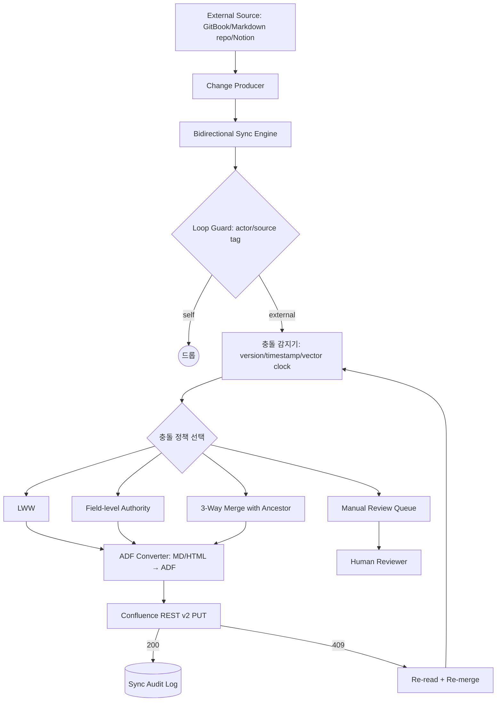
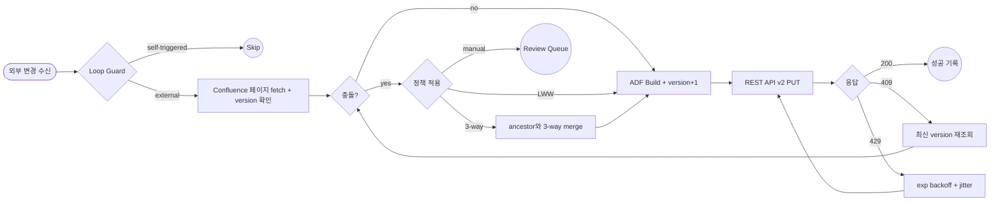

# Confluence Wiki Sync — Bidirectional & Conflict Resolution

## 핵심 요약

직전 CDC 노트가 Confluence → 외부의 단방향 push를 다뤘다면, 본 노트는 **외부 시스템의 수정도 Confluence로 되돌려 반영하는 양방향(reverse) sync**와 **두 측에서 동시에 같은 페이지를 수정했을 때의 conflict resolution**을 다룬다. 핵심은 Confluence의 optimistic locking 모델 위에 (1) 적절한 충돌 감지 메커니즘, (2) 충돌 시 정책(last-write-wins/field-level/3-way merge/manual), (3) loop 방지 가드를 결합하는 것.

- **Confluence write back**: REST API v2 PUT은 ADF(Atlassian Document Format) **전체 body + 증가된 version**을 매번 요구. mismatch면 **HTTP 409 Conflict** 반환.
- **충돌 감지의 4가지 모델**: 단순 version 비교 / timestamp(LWW) / vector clock(concurrent 식별) / 3-way merge(공통 조상).
- **충돌 해결 정책**: last-write-wins / system-priority(SSOT) / field-level authority / 3-way merge / manual queue.
- **Loop 방지**: sync user 식별, change source tag, version hop 추적으로 본인이 만든 변경에 다시 트리거되지 않도록 가드.

## 시스템 아키텍처

외부 source → 변환 → 충돌 감지 → 해결 정책 → Confluence write → 결과 처리. 직전 CDC 파이프라인(Confluence → 외부)과 한 쌍을 이루며, 양방향 sync는 두 파이프라인 + dedup·loop guard로 구성된다.

## 처리 흐름

외부 변경 수신 → loop guard → fetch latest Confluence version → 충돌 검사 → 정책 적용 → PUT → 409 시 재시도. concurrent edit이 누적되면 manual queue로 escalate.

## 핵심 기능 및 서비스

| 기능 | 설명 |
|---|---|
| Optimistic locking | Confluence PUT은 `version.number = current + 1` 요구, mismatch는 409 |
| 409 Conflict | "Version must be incremented on update. Current version is: N" 메시지 — re-read + retry |
| ADF write | REST API v2 PUT은 page body **전체**를 ADF JSON으로 전송. partial update는 미지원 |
| Loop guard | sync user 식별 (별도 service account) + change source tag (라벨 `synced-from-xxx`) |
| Version 비교 | 단순 monotonic counter, concurrent edit는 감지하지만 ordering은 모름 |
| LWW (timestamp) | 두 변경 timestamp 비교, HLV(Hybrid Logical Vector)로 wall-clock skew 보정 |
| Vector clock | per-replica 카운터로 concurrent vs causal 정확히 구분 |
| 3-way merge | 마지막 공통 동기 시점(ancestor) 기준으로 양측 diff 적용 (Git 동일 원리) |
| Manual queue | 자동 머지 불가 시 reviewer 큐로 escalate, 보존되어야 할 의미적 충돌 처리 |
| Audit log | 양쪽 변경 + 적용된 정책 + 결과를 기록, dispute 시 추적 |

## 유사 기술 비교

| 항목 | LWW (timestamp) | Vector Clock | 3-way merge | CRDT/OT |
|---|---|---|---|---|
| 충돌 감지 정밀도 | 약함 (concurrent를 감지 못함) | 매우 강함 | 강함 (ancestor 필요) | 매우 강함 |
| 데이터 손실 위험 | 큼 (loser 변경 폐기) | 정책에 따라 다름 | 낮음 (양측 변경 보존) | 거의 없음 |
| 구현 복잡도 | 매우 낮음 | 중간 | 중간~높음 | 매우 높음 |
| 사용 sample | Couchbase XDCR, Notion-Google Calendar | Dynamo·Cassandra | Git, Gearset | Google Docs(OT), Figma/Zed(CRDT) |
| 적합 케이스 | 단일 시스템 우위 SSOT | 분산·multi-master | 비-실시간 협업 wiki sync | 실시간 동시 편집 |
| Confluence 적용성 | 가장 흔함 (timestamp/version) | 별도 메타 저장 필요 | viable, 도구화 가능 | Confluence 외부에서는 어려움 (ADF 구조 제약) |

## 실제 사례

### Notion ↔ Google Calendar (2sync 패턴)
충돌은 **field 단위**로 평가. 같은 field가 양쪽에서 수정되면 last-edit-wins. 다른 field가 수정되면 양측 모두 반영. 정보·메타데이터 field는 one-way로 설정해 충돌 영역 자체를 제거하는 것이 권고 사항. Confluence ↔ Notion 양방향 sync에도 이 패턴 그대로 적용 가능.

### Unito Two-Way Sync (Confluence 양방향)
"공식적으로 duplicate·infinite loop 없음"을 보장. loop guard로 sync user의 변경을 다시 트리거하지 않음. Confluence-Confluence 간, Confluence-GitHub/Notion/Zendesk 간 양방향. 충돌 정책은 사용자 선택형 (per field).

### Google Docs (OT)
중앙 서버가 모든 operation을 받아 transformation해 다른 클라이언트에 재방송. realtime, 중앙 의존. Confluence의 native collaborative editing(Synchrony 서비스)도 비슷한 OT 기반.

### Figma / Zed (CRDT)
peer-to-peer + offline-first. concurrent operation을 commutative하게 설계해 transformation 없이 적용. Confluence 외부에서 작성된 CRDT 결과를 ADF로 import하는 것은 가능하나, Confluence 측 native 변경과 CRDT는 통합되지 않음.

### Confluence Cloud REST API v2 (community report)
"Version must be incremented on update. Current version is: 15" 같은 409 응답을 받으면 reread + retry가 표준 대응. v2는 partial update 미지원이라 매 write가 race window를 갖는다는 한계 보고.

### Gearset / Bi-directional Wiki Sync GitHub Action
Git의 3-way merge를 wiki 디렉터리와 wiki 저장소 사이에 적용해 양방향 자동 머지. Confluence는 native Git 통합은 없지만, 외부에서 ADF ↔ markdown 변환 후 git 저장소를 ancestor 역할로 사용하는 패턴이 viable.

## 활용 시나리오

### 시나리오 1: SSOT가 git이지만 PM이 Confluence에서 코멘트
컨텍스트 — API spec은 git의 OpenAPI YAML이 SSOT, Confluence는 PM 친화적 view. PM이 임시로 Confluence에서 코멘트·라벨을 추가해야 함. → field-level authority: 본문(body)은 git이 owner(LWW에서 git이 항상 승리), comment/label은 Confluence가 owner. 양쪽 모두 본인 영역에서 자유롭게 편집.

### 시나리오 2: 외부 시스템 변경 → Confluence 반영 (단방향이지만 충돌 처리)
컨텍스트 — 내부 docs repo의 markdown이 변경되면 Confluence 페이지에 미러. PM이 Confluence에서 같은 페이지를 동시에 편집한 경우. → fetch 시 version 비교, 충돌이면 ① LWW(repo가 우선) + ② Confluence 변경분을 diff comment로 별도 페이지에 보존. 데이터 손실 0, 사람의 의도는 audit으로 추적.

### 시나리오 3: 두 Confluence space 간 양방향 sync (Unito)
컨텍스트 — 글로벌 본사·한국 지사 두 Confluence 인스턴스의 정책 페이지 동기화. → Unito 같은 SaaS로 양방향 룰 정의. loop guard는 sync user 식별. 같은 페이지가 동시 수정 시 manual queue로 보내 reviewer가 머지. 자동 정책 의존을 최소화.

### 시나리오 4: 실시간 collaborative editing은 Confluence native 사용
컨텍스트 — 동시 편집 시간 충돌이 분 단위 이하로 발생. → 외부 시스템에서 양방향 sync를 시도하지 말고 Confluence native collaborative editor(OT 기반 Synchrony)에 위임. 외부 sync는 batch 모드(분~시간 단위)로 한정.

### 시나리오 5: KMS 임베딩 인덱스로의 한정 양방향
컨텍스트 — 사용자가 KMS UI에서 페이지 메타데이터(태그·요약)를 수정하고 Confluence에도 반영하고 싶음. → 본문은 단방향(Confluence → KMS), 메타데이터만 양방향. 충돌 시 Confluence 우선(SSOT) + KMS 측 변경은 diff로 reviewer 통지.

## 장단점 및 트레이드오프

| 항목 | 내용 |
|---|---|
| 장점 | PM·engineer 양측 친숙 도구 유지 / SSOT를 유지하면서 multi-tool 경험 가능 / field 단위 분리로 충돌 surface 축소 |
| 단점 | 충돌 정책 설계·운영 비용 큼 / ADF 전체 PUT으로 race window 존재 / 자동 머지의 silent loss 위험 / loop guard 누락 시 무한 sync |
| 트레이드오프 | 자동 머지 편의 vs 데이터 손실 위험 / latency 최소화 vs 충돌 빈도 / 단방향 단순성 vs 양방향 표현력 / native collaborative editing vs 외부 sync (둘은 잘 안 어울림) |

## 함정 및 안티패턴

- **안티패턴 1: 두 단방향 파이프라인을 그냥 결합** — 양방향 sync = 단방향 × 2가 아님. loop·duplicate·order 문제 폭증. → loop guard·dedup·order resolver를 명시적으로 설계.
- **안티패턴 2: timestamp만으로 충돌 감지** — wall-clock skew·서로 다른 서버 시간으로 잘못된 winner 결정. → HLV 또는 version vector·서버 단일 timestamp 사용.
- **안티패턴 3: 본문 전체 단위로만 충돌 평가** — minor 코멘트 추가도 본문 충돌로 분류되어 항상 LWW. → field/section 단위 평가로 surface 축소.
- **안티패턴 4: 409를 즉시 overwrite** — 다른 사람의 동시 편집을 무조건 덮어씀 → 데이터 손실. → re-read + re-merge + 정책 적용 후 PUT.
- **안티패턴 5: native collaborative editing(Synchrony)이 진행 중인 페이지에 외부에서 PUT** — Synchrony 세션이 dirty 상태라 race + lock 충돌. → "활성 collaborative session" 신호를 체크하거나 외부 sync는 quiet 시간대에 batch.
- **안티패턴 6: Loop guard를 timestamp 기반으로만** — sync user의 변경이 다시 트리거되어 무한 loop. → sync 액터 식별(별도 계정·label `synced`) + version hop counter.
- **안티패턴 7: ADF 변환 손실 무시** — markdown ↔ ADF 변환 시 macro/embed/info panel 등이 누락되어 외부 변경 시 Confluence 측 정보 손실. → 미지원 ADF block은 변환 안 하고 원형 보존(round-trip safe 영역만 양방향).
- **안티패턴 8: manual queue 부재** — 자동 해결 불가한 충돌도 LWW로 강제. → reviewer 큐 + Slack alert로 escalate. 빈도가 높으면 정책 자체를 재설계.

## 참고 자료

- [Confluence Cloud REST API v2 | Atlassian Developer](https://developer.atlassian.com/cloud/confluence/rest/v2/) — PUT update + version 증가 의무 + ADF body 요구사항
- [HTTP error 409 with REST API | Atlassian Community](https://community.atlassian.com/forums/Confluence-questions/HTTP-error-409-with-REST-API/qaq-p/797717) — 409 conflict 메시지·재시도 패턴
- [Lag in updating page version number v2 | Atlassian Developer Community](https://community.developer.atlassian.com/t/lag-in-updating-page-version-number-v2-confluence-rest-api/68821) — version race window 사례
- [ConflictException | Confluence API Javadoc](https://docs.atlassian.com/atlassian-confluence/6.6.0/com/atlassian/confluence/api/service/exceptions/ConflictException.html) — 충돌 예외 정의
- [Conflict Resolution | Couchbase Docs](https://docs.couchbase.com/sync-gateway/current/conflict-resolution.html) — LWW + HLV 공식 reference
- [Two-Way Sync Demystified | Stacksync](https://www.stacksync.com/blog/two-way-sync-demystified-key-principles-and-best-practices) — 양방향 sync 원칙·loop·field-level
- [The Engineering Challenges of Bi-Directional Sync | Stacksync](https://www.stacksync.com/blog/the-engineering-challenges-of-bi-directional-sync-why-two-one-way-pipelines-fail) — 두 단방향 = 양방향 아님 핵심 논거
- [Conflicts | 2sync Docs](https://2sync.com/docs/conflict-resolution) — per-field 충돌 평가·last-edit-wins 패턴
- [Confluence Two-Way Sync | Unito](https://unito.io/connectors/confluence/) — Confluence 양방향 sync SaaS + loop guard
- [Operational Transformation (OT) and CRDTs | DEV Community](https://dev.to/arghya_majumder/operational-transformation-ot-and-crdts-real-time-collaboration-systems-kdd) — OT·CRDT 비교
- [Conflict-free replicated data type | Wikipedia](https://en.wikipedia.org/wiki/Conflict-free_replicated_data_type) — CRDT 정의·convergence 보장
- [Vector Clocks in Distributed Systems | GeeksforGeeks](https://www.geeksforgeeks.org/computer-networks/vector-clocks-in-distributed-systems/) — vector clock으로 concurrent vs causal 식별
- [The Magic of 3-Way Merge | git-init.com](https://blog.git-init.com/the-magic-of-3-way-merge/) — Git 3-way merge 원리
- [Bi-directional Wiki Sync Action | GitHub Marketplace](https://github.com/marketplace/actions/bi-directional-wiki-sync-action) — wiki ↔ repo 3-way 머지 actions 구현
- [karbassi/confluence-adf-mcp | GitHub](https://github.com/karbassi/confluence-adf-mcp) — ADF native 편집 MCP server (partial-update 수준 작업 가능)
