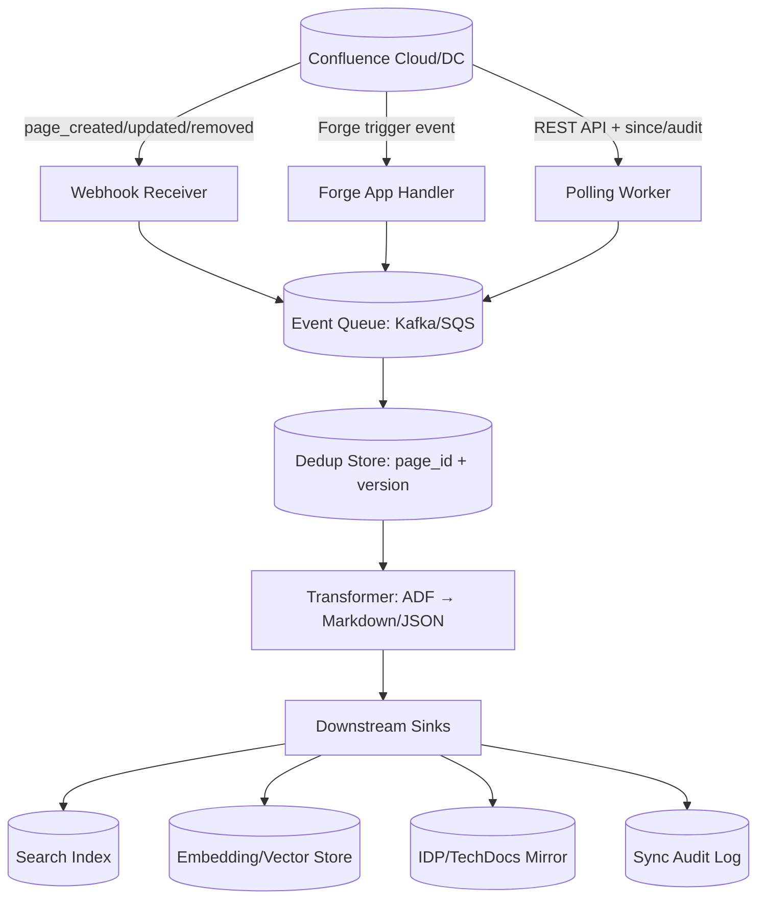
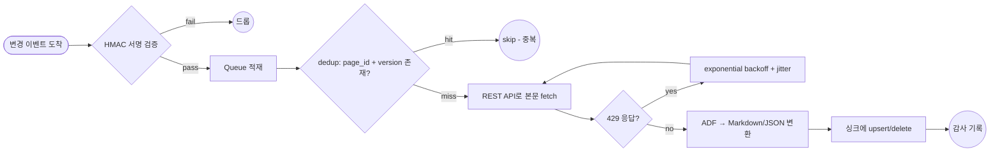

# Confluence Wiki Sync — Incremental / Real-Time CDC

## 핵심 요약

Confluence의 페이지·블록·메타데이터 변경을 외부 시스템(검색 인덱스·IDP·임베딩 스토어·다른 wiki)으로 **변경 단위(delta)로 실시간 또는 준실시간 전파**하는 패턴. 전통적인 CDC(Change Data Capture)의 사상을 wiki 도메인에 적용한 것으로, 전체 페이지 재발행(full snapshot) 대비 cost·latency·rate-limit 압박을 모두 줄인다.

- **세 가지 캡처 채널**: (1) webhook push (`page_created/updated/removed/trashed/archived`), (2) Forge `trigger` 모듈 (manifest 기반 이벤트 구독), (3) REST API + audit log polling.
- **3단계 자료 흐름**: snapshot(초기 1회) → CDC stream(이후 영구) → idempotent apply (page ID + version 기반 dedup).
- **Atlassian Cloud points-based rate limit (2026-03-02 시행)**: polling 비용이 가파르게 증가 → push/event-driven이 사실상 기본 패턴.
- **활용 대상**: 검색 인덱스(Algolia/Elasticsearch), 사내 KMS·RAG 임베딩 스토어, Backstage TechDocs 미러, 분석 DW.

## 시스템 아키텍처

캡처 → 큐 → 변환 → 적용 → 감사의 5단계. 캡처 채널은 push(webhook/Forge trigger)와 pull(polling) 두 가지가 공존하며, 큐와 dedup store가 idempotency를 보장.

## 처리 흐름

이벤트 수신 → HMAC 검증 → dedup → ADF 변환 → 싱크 적용 → 감사. 429 응답 시 exponential backoff + jitter로 재시도.

## 핵심 기능 및 서비스

| 기능 | 설명 |
|---|---|
| Webhook 이벤트 | `page_created`, `page_updated`, `page_removed`, `page_trashed`, `page_archived` 등 페이지 lifecycle |
| HMAC 인증 | 페이로드는 webhook secret으로 HMAC 서명 — 수신측에서 검증 의무 |
| Forge trigger 모듈 | `manifest.yml`에서 `trigger`로 product event 구독, Forge 함수가 자동 호출 |
| REST API v2 polling | `/wiki/api/v2/pages?since=...` + version 비교로 증분 추출 |
| Audit Log API | admin 권한 필요, 페이지 외 권한·앱·공간 변경까지 추적 |
| Optimistic locking | 페이지 update 시 version+1 강제 — 동시성 충돌 감지 |
| Snapshot + catch-up | 초기 full export 후 특정 timestamp/version부터 CDC stream 시작 |
| Idempotency key | `(page_id, version)` 또는 `event_id`로 process-level dedup |
| Rate-limit 대응 | points-based quota, 429 + Retry-After, exponential backoff + jitter |

## 유사 기술 비교

| 항목 | Confluence Wiki CDC | DB CDC (Debezium/MySQL binlog) | Periodic full re-index | Forge trigger 전용 |
|---|---|---|---|---|
| 변경 감지 정밀도 | event 단위(페이지) | row 단위 + 트랜잭션 |  전체 스캔 후 diff | event 단위 + Forge sandbox |
| Latency | 초~수십 초 | 밀리초~초 | 시간~일 | 초~수십 초 |
| 외부 인프라 | webhook 엔드포인트 + 큐 | Kafka Connect + DB 권한 | cron + 워커 | Forge runtime |
| 비용 | 낮음 (push) ~ 중간 (polling) | 중간~상 (커넥터 운영) | 매우 큼 (rate-limit·DW cost) | 낮음 (Forge 호스팅) |
| 데이터 손실 위험 | webhook 재전송 정책에 의존 | 매우 낮음 (offset commit) | 낮음 (다음 주기에 보정) | 중간 (Forge SLA) |
| 적합 케이스 | 외부 시스템·복잡 변환 | 트랜잭션 강건성 필요 | low-priority 백업 | Atlassian 생태계 내 통합 |

## 실제 사례

### Atlassian Cloud Points-Based Rate Limit (2026-03-02 시행)
점수 기반 quota 도입 — polling 부하가 직접 비용으로 환산됨. 공식 가이드는 "webhooks for event-driven updates instead of polling"을 명시. 대규모 폴링 기반 sync 도구는 webhook+queue 아키텍처로 재설계가 강제됨.

### Forge Trigger Module (공식 reference 패턴)
Forge 앱이 `manifest.yml`에 `trigger`를 선언하면 페이지 변경 이벤트가 자동 dispatch. Atlassian이 Forge 런타임에서 재시도·dedup·SLA를 부분적으로 보장. UI 없는 백그라운드 통합·검증에 가장 fit.

### Algolia Real-Time Indexing
"source of truth"의 변경을 millisecond 단위로 search index에 전파. wiki sync에 적용 시 — Confluence webhook → Algolia API의 push. 배치 모드 제공으로 burst 시 cost 최적화.

### Elasticsearch Near Real-Time Search
저장 후 1초 이내 검색 가능. Kafka + Elasticsearch ingestion sink로 wiki content를 실시간 색인. CDC stream을 그대로 다운스트림으로 흘림.

### Allganize / 한국 RAG 사례
Confluence의 페이지를 자동 인덱싱해 Knowledge Base를 최신 상태로 유지. "변경된 페이지만 재인덱싱"하는 증분 동기화 사상이 KMS RAG 도입의 표준.

### Cotera (페이지 업데이터 → 에이전트)
초기에 polling 기반 자체 업데이터를 만들었으나 CQL 한계(text search ~ contains, regex 미지원), version 추적의 가시성 부족으로 결국 agent 기반 시스템으로 교체. CDC를 직접 구현 시의 함정 사례.

## 활용 시나리오

### 시나리오 1: RAG 임베딩 스토어 실시간 갱신
컨텍스트 — Confluence의 사내 문서를 RAG 검색에 사용. 페이지가 매일 수십 건 갱신되어 매일 풀 재색인은 비용·신선도 모두 손해. webhook(`page_updated/removed`) → SQS → embedding worker가 변경된 페이지만 chunk·embed해 vector DB upsert. version key로 dedup, removed 이벤트는 vector hard delete.

### 시나리오 2: Backstage TechDocs / IDP 양방향 mirror
컨텍스트 — PM은 Confluence, engineer는 Backstage에서 docs 검색을 원함. Confluence를 SSOT로 두고 Forge trigger → IDP 포털 mirror가 markdown으로 변환·publish. removed/archived도 추적해 stale mirror 0.

### 시나리오 3: 검색 인덱스(Algolia/ES) 실시간 동기화
컨텍스트 — 사내 KMS의 search latency 개선. webhook으로 변경 페이지를 push, transformer가 ADF → 평문 + facets 메타데이터로 변환, Algolia에 indexing. burst 시 batch 모드, 평소 streaming. removed는 즉시 index delete.

### 시나리오 4: 데이터 웨어하우스 분석용 캡처
컨텍스트 — 문서 작성·승인 패턴 분석을 위해 변경 이력 자체를 분석에 활용. Audit Log API + webhook을 동시에 큐로 수집, Kafka → Snowflake/BigQuery sink. webhook은 실시간 fact, audit log는 강건한 binlog 보완.

## 장단점 및 트레이드오프

| 항목 | 내용 |
|---|---|
| 장점 | full re-sync 대비 비용·latency 대폭 절감 / 다운스트림 freshness 강함 / push 채널은 polling 대비 quota 안전 / snapshot+catch-up 패턴으로 데이터 누락 0 |
| 단점 | webhook 미수신·중복 가능성 → idempotency 인프라 필수 / Confluence 측 retry 정책에 의존 / ADF(Atlassian Document Format) 변환 비용 / Forge·webhook·polling 3채널 운영 복잡도 |
| 트레이드오프 | latency 최소화(push) vs 강건성(audit log polling) / Forge 런타임 편의성 vs vendor lock-in / 단일 채널 단순성 vs 다채널 신뢰성 |

## 함정 및 안티패턴

- **안티패턴 1: webhook만 신뢰 (audit/polling 백업 없음)** — webhook 손실 시 영구 누락. → audit log polling을 1~24h 간격 reconciliation으로 병행, drift 발생 시 자동 catch-up.
- **안티패턴 2: idempotency 부재** — webhook 재전송으로 같은 변경이 N번 인덱싱·embedding됨. → `(page_id, version)` 기반 dedup store (Redis/KV) 의무화. version이 같으면 skip.
- **안티패턴 3: full snapshot을 매 N분 polling** — 2026-03 이후 points-based quota 즉각 소진 + 429 폭증. → 초기 1회 snapshot + 이후 CDC stream만.
- **안티패턴 4: HMAC 서명 검증 생략** — 외부 페이로드 위조로 잘못된 sync 트리거. → secret 기반 HMAC 검증을 webhook receiver의 첫 단계로.
- **안티패턴 5: ADF 형식 손실 무시** — Confluence의 macro·embed가 markdown 변환 시 사라짐. → 미지원 block을 plain-text placeholder + link로 fallback, 변환 로그 알림.
- **안티패턴 6: deleted/archived 이벤트 무시** — 다운스트림에 stale 콘텐츠 영구 잔존. → `page_removed`·`page_trashed`·`page_archived` 모두 별도 핸들러로 sink에서 hard/soft delete.
- **안티패턴 7: 429 응답에 즉시 retry** — thundering herd로 quota 더 빠르게 소진. → exponential backoff + jitter, 인스턴스 간 quota 공유.
- **안티패턴 8: 권한 컨텍스트 미고려** — restricted 페이지가 다운스트림에 권한 무시하고 검색됨. → sync 시점에 페이지 restriction을 함께 캡처해 sink의 권한 모델에 반영.

## 참고 자료

- [Webhooks in Confluence Data Center | Atlassian Developer](https://developer.atlassian.com/server/confluence/webhooks/) — webhook event 정의 공식 스펙
- [Using webhooks - Confluence Cloud | Atlassian Developer](https://developer.atlassian.com/cloud/confluence/using-webhooks/) — Cloud webhook 등록·HMAC 검증
- [Confluence events - Forge | Atlassian Developer](https://developer.atlassian.com/platform/forge/events-reference/confluence/) — Forge trigger 모듈로 구독 가능한 Confluence 이벤트 목록
- [Confluence Cloud REST API v2 | Atlassian Developer](https://developer.atlassian.com/cloud/confluence/rest/v2/) — v2 endpoint·version·optimistic locking
- [Rate limiting - Confluence Cloud | Atlassian Developer](https://developer.atlassian.com/cloud/confluence/rate-limiting/) — points-based quota, 2026-03-02 시행
- [Adjusting your code for rate limiting | Atlassian Documentation](https://confluence.atlassian.com/doc/improving-instance-stability-with-rate-limiting-992679004.html) — exponential backoff + jitter 공식 가이드
- [Audit Log Events in Confluence | Atlassian Documentation](https://confluence.atlassian.com/doc/audit-log-events-in-confluence-1005333793.html) — audit log 이벤트 카탈로그
- [The Confluence Cloud REST API - Audit | Atlassian Developer](https://developer.atlassian.com/cloud/confluence/rest/v1/api-group-audit/) — audit log API endpoint
- [Change Data Capture: A Complete Guide | Medium / Vinay Sharma](https://medium.com/@vinay.georgiatech/change-data-capture-cdc-a-complete-guide-to-real-time-data-synchronization-535ecc457997) — CDC 일반 패턴 정리
- [CDC Approaches, Architectures, Best Practices | Redpanda](https://www.redpanda.com/guides/fundamentals-of-data-engineering-cdc-change-data-capture) — log-based·trigger·timestamp 비교
- [Idempotent Pipelines | DEV Community](https://dev.to/alexmercedcoder/idempotent-pipelines-build-once-run-safely-forever-2o2o) — idempotency·dedup 패턴 실전
- [Real-Time Search Updates with Algolia Live Indexing | Reintech](https://reintech.io/blog/real-time-search-updates-algolias-live-indexing) — 실시간 인덱싱 아키텍처
- [Near real-time search | Elastic Docs](https://www.elastic.co/docs/manage-data/data-store/near-real-time-search) — Elasticsearch NRT 보장 모델
- [Confluence API Integration Guide | Cotera](https://cotera.co/articles/confluence-api-integration-guide) — CQL·version 한계 실전 사례
