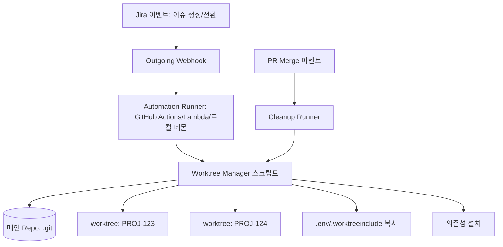
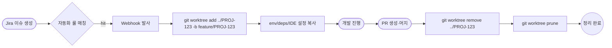

# Jira Issue Automation + Git Worktree 관리 방안

## 핵심 요약

Jira 이슈 자동화 결과로 새 작업이 트리거되면, 해당 이슈 키를 브랜치명·디렉터리명에 그대로 사용해 **이슈 1개 = git worktree 1개**를 자동으로 provisioning·정리하는 워크플로 방식. 단순 브랜치 전환·`git stash`보다 컨텍스트 스위칭 비용이 낮고, AI 에이전트(Claude Code 등) 병렬 실행과 잘 결합된다.

- **1 이슈 = 1 worktree 1대1 매핑**으로 stash·context loss 제거.
- **이슈 키 기반 명명**(예: `PROJ-123-add-login`)으로 git ↔ Jira 양방향 트레이서빌리티 확보.
- **Jira webhook + 셸 스크립트/CI**로 worktree 생성·정리 자동화.
- **AI 에이전트 isolation**: Claude Code의 `--worktree` 또는 subagent `isolation: worktree` 옵션과 자연스럽게 통합.

## 컴포넌트 다이어그램

Jira 이벤트(이슈 생성·전환)가 outgoing webhook → 자동화 스크립트 → 로컬/원격 호스트의 worktree 매니저로 흘러가는 구조. 정리는 PR merge 이벤트 또는 cron으로 트리거.

## 적용 단계

이슈 생성 시 worktree provisioning, 작업 진행 중 컨텍스트 유지, 머지 후 정리의 3단계 순환. cleanup을 누락하면 디스크·node_modules 비용이 누적된다.

## 핵심 기능 및 서비스

| 기능 | 설명 |
|---|---|
| 이슈 키 기반 명명 | `{PROJECT}-{N}-{slug}` 형식으로 브랜치·디렉터리·worktree 동시 명명 |
| Webhook trigger | Jira `Issue Created`/`Transition` 이벤트에서 outgoing webhook 발사 |
| Worktree provisioning | `git worktree add <path> -b <branch>`로 새 워크 디렉터리 생성 |
| 환경 복제 | `.worktreeinclude`·`wtp.yml`·커스텀 hook으로 `.env`, `node_modules`, IDE 설정 자동 복사 |
| Branch trigger (역방향) | git push 시 브랜치명의 이슈 키를 인식해 Jira 상태를 `In Progress`로 전환 |
| Cleanup | PR merge 후 webhook 또는 cron으로 `worktree remove` + `prune` |
| AI 에이전트 통합 | Claude Code `--worktree` 플래그, subagent frontmatter `isolation: worktree` |

## 유사 기술 비교

| 항목 | 1-이슈-1-worktree | branch + stash | 다중 clone |
|---|---|---|---|
| 컨텍스트 보존 | 매우 강함 (디렉터리 완전 분리) | 약함 (stash 누적·충돌 위험) | 매우 강함 |
| 디스크 비용 | 낮음 (`.git` 공유) | 매우 낮음 | 매우 높음 (object store 중복) |
| 셋업 시간 | 중간 (의존성·env 복사 필요) | 거의 없음 | 매우 큼 |
| AI 에이전트 병렬화 | 최적 (isolation 명확) | 부적합 | 가능하나 비효율 |
| Jira 연동 적합도 | 이슈 키 기반 1:1 매핑 자연스러움 | 매핑은 가능하나 디렉터리 컨벤션 깨짐 | 매핑 가능, 운영 비용 큼 |
| 적합 케이스 | 동시 진행 이슈 ≥ 2, AI 에이전트 활용 팀 | 1분 내 빠른 전환만 필요한 1인 작업 | fork·장기 발산 브랜치 |

## 실제 사례

### Worktree.io / Gira CLI
오픈소스 도구. Jira 이슈를 워크스페이스로 열어 자동으로 git worktree를 생성하고 이슈 상태를 `In Progress`로 전환. CLI 한 줄로 "이슈 만들기 + worktree 생성 + 시작 진행"을 1단계로 묶음.

### CodeRabbit `git-worktree-runner`
Bash 기반 매니저. 브랜치별 worktree 생성, 설정 파일 복사, 의존성 설치, 워크스페이스 셋업을 자동화. 수동 셋업 10분+ → 30초 수준으로 축소했다는 사례 보고.

### Claude Code 공식 통합
2025년 Claude Code CLI에 `--worktree` 옵션이 정식 도입. subagent frontmatter에 `isolation: worktree` 추가 시 각 에이전트가 독립 worktree에서 실행되어 동일 repo 내 병렬 편집 충돌 제거. `/team-build`처럼 다중 에이전트 dispatch 시 자동 적용.

## 활용 시나리오

### 시나리오 1: 이슈 생성 시 자동 worktree provisioning
컨텍스트 — 한 개발자가 동시에 3개 이슈를 처리하는데 stash가 자주 충돌. Jira `Issue Created` automation rule에서 outgoing webhook으로 사내 자동화 서버를 호출 → 서버가 SSH로 개발자 워크스테이션에 `git worktree add ../PROJ-{N}` + `.env` 복사 + `pnpm install` 실행. 개발자는 IDE에서 새 디렉터리를 열기만 하면 됨.

### 시나리오 2: 브랜치 푸시 → Jira 상태 동기화 (역방향)
컨텍스트 — 개발자가 worktree에서 브랜치를 만들고 push했으나 Jira 상태는 수동 업데이트. Jira `branch created` 트리거가 브랜치명에 포함된 이슈 키를 파싱해 자동으로 `Backlog → In Progress`로 전환. worktree 컨벤션이 명명에 강제되므로 동기화가 100% 일관됨.

### 시나리오 3: PR merge 후 자동 정리
컨텍스트 — 머지 후에도 워크스테이션·CI 노드에 worktree와 node_modules가 남아 디스크가 빠르게 소진. GitHub Actions가 머지 이벤트에서 Jira `Done` 전환 webhook을 호출, Jira automation이 다시 outgoing webhook으로 cleanup 스크립트를 호출 → `git worktree remove` + `prune` 실행. 누락된 워크트리는 주 1회 cron으로 garbage collection.

### 시나리오 4: AI 에이전트 병렬 작업
컨텍스트 — Claude Code 다중 에이전트를 한 repo에서 병렬 실행하면 동일 파일 동시 편집으로 충돌. 각 에이전트에 `--worktree` 옵션 또는 `isolation: worktree`를 지정하면 fresh checkout에서 작업해 conflict 0. 이슈별 에이전트 매핑 시 Jira 이슈 키를 worktree 이름에 그대로 사용해 추적성 확보.

## 장단점 및 트레이드오프

| 항목 | 내용 |
|---|---|
| 장점 | 컨텍스트 스위칭 0 / Jira ↔ git 트레이서빌리티 / AI 에이전트 isolation 최적 / `.git` 공유로 disk 효율 |
| 단점 | `node_modules`·빌드 캐시·`.env`는 worktree마다 복제 필요 / git hooks가 `.git` 공유라 worktree별 분기 불가 / cleanup 누락 시 disk leak |
| 트레이드오프 | 단기 단순 hotfix는 stash가 더 빠를 수 있음 / 동일 브랜치 동시 checkout 불가 제약 / 큰 monorepo는 설치 자동화에 추가 투자 필요 |

## 함정 및 안티패턴

- **안티패턴 1: cleanup 누락** — PR merge 후 worktree를 남겨두면 disk·node_modules가 GB 단위로 누적. → merge 이벤트에서 강제 `worktree remove` + 주기적 `worktree prune` cron 추가.
- **안티패턴 2: worktree 내부에 다시 worktree 생성** — 중첩 `.git` 인식 깨짐. → sibling directory 컨벤션(메인 clone과 같은 부모 디렉터리에 `../PROJ-N`) 강제.
- **안티패턴 3: 동일 브랜치를 두 worktree에서 checkout 시도** — git이 거부함. → 자동화 스크립트에서 `git worktree list --porcelain`로 중복 체크 후 add.
- **안티패턴 4: 공유 `.git/hooks`로 인한 worktree 무관 동작 가정** — 한 worktree에서 install한 husky hook이 다른 worktree에 영향. → hook 안에서 `git rev-parse --show-toplevel`로 현재 worktree 경로를 식별해 분기.
- **안티패턴 5: 환경 변수 누락** — fresh checkout이라 `.env`가 없어 앱이 silently 실패. → `.worktreeinclude` 파일에 필수 untracked file 목록을 명시 (Claude Code 공식 지원), 또는 자동화 스크립트의 post-add hook에서 복사.
- **안티패턴 6: 이슈 키 규칙 위반 브랜치** — 자동화 룰이 키를 파싱하지 못해 동기화 실패. → 브랜치 생성 시 pre-receive hook 또는 GitHub branch protection rule로 명명 규칙 강제.

## 참고 자료

- [git-worktree 공식 문서 | git-scm.com](https://git-scm.com/docs/git-worktree) — 명령어 스펙·동작 원리
- [Run parallel sessions with worktrees | Claude Code Docs](https://code.claude.com/docs/en/worktrees) — Claude Code `--worktree`·`isolation: worktree`·`.worktreeinclude` 공식 가이드
- [Automatic Workflow Triggers | Git Integration for Jira Cloud](https://help.gitkraken.com/git-integration-for-jira-cloud/automatic-workflow-triggers-gij-cloud/) — git 이벤트 → Jira 상태 전환 트리거
- [Worktree.io — Open issues as workspaces](https://worktree.io/) — Jira 이슈 → worktree 매핑 도구
- [coderabbitai/git-worktree-runner | GitHub](https://github.com/coderabbitai/git-worktree-runner) — per-branch worktree 자동화 Bash 스크립트
- [satococoa/wtp | GitHub](https://github.com/satococoa/wtp) — `.wtp.yml` 기반 worktree 셋업 자동화 CLI
- [Git Worktrees Deep Dive | ideia.me](https://ideia.me/git-worktrees-deep-dive) — stash·clone과의 비교, hook·node_modules 함정 분석
- [Git Worktree로 다중 브랜치 동시 작업 (한국어 가이드) | funes-days](https://funes-days.com/dev/git-worktree-multi-feature-parallel-dev-claude) — Claude AI + worktree 한국어 사례
