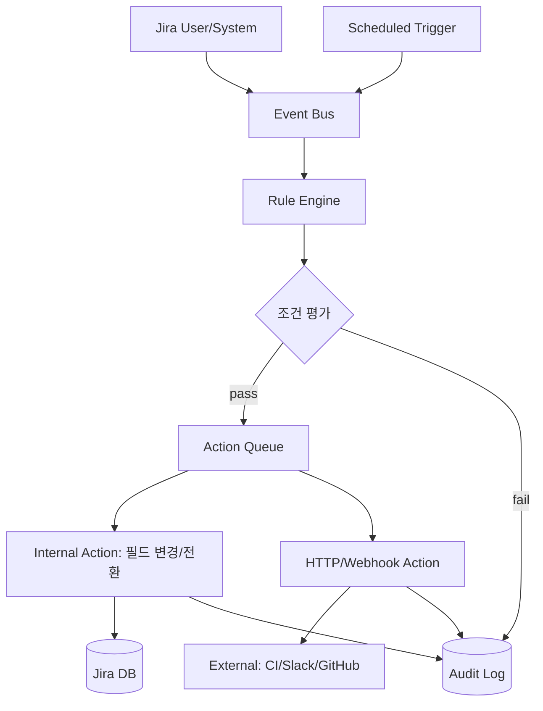
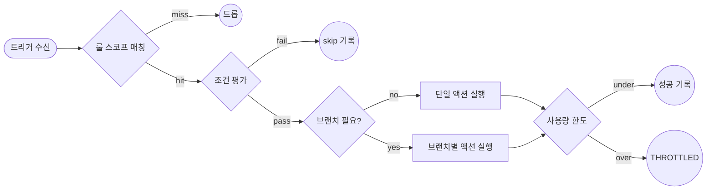

# Jira Issue Automation

## 핵심 요약

Jira 이슈 자동화는 Jira 프로젝트 내 반복 작업(이슈 할당, 상태 전환, 알림, 서브태스크 생성 등)을 **트리거 → 조건 → 액션** 3단 구조의 룰로 정의해 자동 실행하는 기능이다. Atlassian이 Code Barrel의 Automation for Jira를 인수해 Jira Cloud의 기본 기능으로 통합했으며, 이후 용어가 `rule → flow`, `component → step`으로 갱신되었다.

- **No-code 룰 빌더**: UI에서 트리거·조건·액션을 조합하면 JQL·smart value 외 별도 코딩 불필요.
- **이벤트 기반 + 스케줄 기반 트리거 공존**: 이슈 생성·필드 변경·전환 이벤트, cron 기반 주기 실행 모두 지원.
- **외부 시스템 연동**: HTTP 액션·incoming/outgoing webhook으로 GitHub Actions, CI/CD, Slack, Confluence와 양방향 통합.
- **감사 로그 + 사용량 한도**: 룰별 audit log 제공, Cloud 플랜별 monthly run quota 존재(초과 시 THROTTLED).

## 시스템 아키텍처

Jira Automation은 이벤트 버스에서 트리거를 수신해 룰 엔진이 조건을 평가한 뒤 액션 큐로 작업을 디스패치하는 구조다. 외부 시스템 연동은 HTTP/webhook 액션을 통해 비동기로 수행된다.

## 처리 흐름

룰 실행은 트리거 수신 → 조건 평가 → 액션 실행 → 감사 기록 순으로 진행된다. 액션이 다른 룰의 트리거가 되는 cascade가 발생할 수 있어 loop 방지 가드가 엔진 차원에서 적용된다.

## 핵심 기능 및 서비스

| 기능 | 설명 |
|---|---|
| Trigger | 이슈 생성/변경/전환·필드 변경·코멘트·스케줄·incoming webhook 등 25+ 타입 |
| Condition | JQL·필드 비교·smart value·정규식 기반 조건. if/else 분기 가능 |
| Action | Edit issue, Transition, Assign, Send email/Slack, Create sub-task, HTTP request, Send webhook 등 |
| Smart Value | `{{issue.summary}}`, `{{now.plusDays(5)}}` 등 동적 값 참조·연산 |
| Branch | 같은 룰 내에서 부모/자식 이슈·관련 이슈·JQL 결과 집합에 액션 분기 |
| Audit Log | 룰별 실행 결과·소요 시간·throttle 여부 조회 |
| Scope | global·project·multi-project 단위 룰 범위 제어 |
| REST API | 룰 실행 외 외부 스크립트 기반 자동화는 Jira REST API + 토큰 인증 |

## 유사 기술 비교

| 항목 | Jira Automation | GitHub Actions | Zapier |
|---|---|---|---|
| 주 도메인 | 이슈 트래커 내 자동화 | 코드 저장소·CI/CD 자동화 | 범용 SaaS 연결 (수천 개 앱) |
| 트리거 모델 | Jira 이벤트·스케줄·webhook | git push·PR·release·schedule | 앱별 webhook·polling |
| 데이터 모델 | Jira 이슈 필드 직접 접근 | 워크플로 YAML + 액션 | 표면적 필드 매핑 (custom field 약함) |
| 실행 환경 | Atlassian managed (queue) | GitHub-hosted runner / self-hosted | Zapier hosted |
| 한도 | 월간 run quota + 실행당 한도 | 분 기반 quota | Task 기반 quota |
| 적합 케이스 | Jira 내부 워크플로 단순화 | 코드 변경 → 배포·테스트 | 비기술 팀의 여러 SaaS 연결 |

## 실제 사례

### Atlassian 공식 템플릿
회사 사례 통계: 자동화 도입 팀은 주당 5시간 이상의 수작업을 절감, 한 기술 기업은 manual task 30% 감소·프로젝트 capacity 25% 증가를 보고. Cloud 전체적으로 매월 수천 시간 분량의 작업이 자동화되고 있음.

### CI/CD 파이프라인 연동
Bamboo·Jenkins·GitHub Actions에서 빌드 완료 시 Jira로 webhook 전송 → 해당 이슈를 `Ready for QA` 상태로 자동 전환. 역방향으로 Jira에서 이슈가 `In Development`로 전환되면 outgoing webhook으로 브랜치 생성 트리거.

### 서비스 데스크 자동 라우팅
JSM(Jira Service Management)에서 incoming ticket의 `Issue Type`·`Component`를 기준으로 담당 그룹 자동 할당, SLA 초과 임박 시 escalation 룰로 매니저에게 Slack 알림 발송.

## 활용 시나리오

### 시나리오 1: 이슈 자동 할당
컨텍스트 — 백로그에 들어오는 버그가 매번 PM 손을 거쳐 담당자에게 배정되어 lead time이 길어지는 경우. `Issue Type = Bug` AND `Component = Frontend` 조건에서 라운드 로빈 또는 skillset 기반 할당 룰을 설정. PM 개입 0으로 줄이고, audit log로 분배 균형 모니터링.

### 시나리오 2: 부모-자식 이슈 상태 동기화
컨텍스트 — Epic-Story-Sub-task 구조에서 자식 진행 상태가 부모에 반영되지 않아 보고서가 부정확. 자식 이슈가 `In Progress`로 전환 시 부모도 자동 전환, 모든 자식이 `Done`이 되면 부모를 `Done`으로 닫는 양방향 룰 구성. 부모 트랜지션이 다시 자식 룰을 깨우지 않도록 조건에 `actor != automation user`를 추가.

### 시나리오 3: 외부 시스템 양방향 연동
컨텍스트 — 개발자가 Jira와 GitHub PR을 따로 업데이트하는 이중 작업 발생. PR 머지 시 GitHub Actions가 Jira incoming webhook을 호출 → 해당 이슈를 `Ready for Release`로 전환 + 릴리스 노트 자동 생성. 반대로 Jira에서 `In Review`로 전환되면 outgoing webhook으로 PR 라벨 추가.

## 장단점 및 트레이드오프

| 항목 | 내용 |
|---|---|
| 장점 | No-code UI / Jira 데이터에 직접 접근 / audit log 내장 / Cloud 무료 플랜에서도 사용 가능 |
| 단점 | 월간 run quota·실행당 한도 존재 / 룰 수가 많아지면 디버깅·테스트 환경 부재 / 버전 관리(diff·rollback) 불완전 |
| 트레이드오프 | 복잡 로직은 REST API + 외부 스크립트(GitHub Actions·Lambda)가 유리, 단순 워크플로는 Jira Automation이 비용·운영 우위. Loop·과도한 브랜치는 throttle 위험 |

## 함정 및 안티패턴

- **안티패턴 1: 자동화 루프** — 룰 A의 액션이 룰 B를 깨우고 B가 다시 A를 깨움. → 트리거 조건에 `last actor != automation user` 또는 `field changed by != automation` 가드 추가. Atlassian은 동일 룰 내 self-trigger를 일정 횟수 후 자동 차단하지만 cross-rule 루프는 사용자 책임.
- **안티패턴 2: Generic catch-all 룰** — 하나의 룰로 Bug·Task·Service Request를 모두 처리하려다 분기 폭증 + 디버깅 난항. → 이슈 타입별 또는 프로젝트별로 룰을 분리하고 공통 로직만 sub-rule/webhook으로 추출.
- **안티패턴 3: Global 스코프 남용** — Global 룰은 모든 프로젝트 이벤트를 평가해 queue 부담 증가. → 가능한 한 project-scope로 좁히고 JQL을 트리거가 아닌 조건에 두어 early filter.
- **안티패턴 4: Jira Automation을 배치 처리기로 사용** — 매일 수천 건을 일괄 갱신하려다 quota 소진 + THROTTLED. → 배치 작업은 REST API + 외부 cron(Lambda/GitHub Actions schedule)으로 분리.
- **안티패턴 5: 누락된 필드/권한 가드 부재** — automation user에 프로젝트 권한이 없으면 silent fail. → audit log에 실패 알림 액션 추가 + 정기 룰 audit 권장.

## 참고 자료

- [Jira Automation: Basics & Common Use Cases | Atlassian](https://www.atlassian.com/software/jira/guides/automation/overview) — 공식 개요 (트리거·조건·액션 3요소)
- [Create automation flows in Jira | Atlassian Support](https://support.atlassian.com/cloud-automation/docs/create-and-edit-jira-automation-rules/) — 룰(flow) 생성·편집 공식 가이드
- [Webhooks - Jira Cloud platform | Atlassian Developer](https://developer.atlassian.com/cloud/jira/platform/webhooks/) — webhook 트리거 공식 스펙
- [Automation service limits | Atlassian Support](https://support.atlassian.com/cloud-automation/docs/automation-service-limits/) — 월간 quota·실행당 한도 공식 문서
- [Best practices for optimizing automation flows | Atlassian Support](https://support.atlassian.com/cloud-automation/docs/best-practices-for-optimizing-automation-rules/) — JQL 최적화·조건 순서·브랜치 최소화 가이드
- [Top 10 Mistakes People Make Using Jira/JSM Automation | Atlassian Community](https://community.atlassian.com/forums/Automation-articles/Top-10-Mistakes-People-Make-Using-Jira-JSM-Automation/ba-p/3206062) — 루프·generic 룰 등 안티패턴 사례
- [atlassian-python-api | GitHub](https://github.com/atlassian-api/atlassian-python-api) — REST API 기반 외부 자동화 라이브러리
