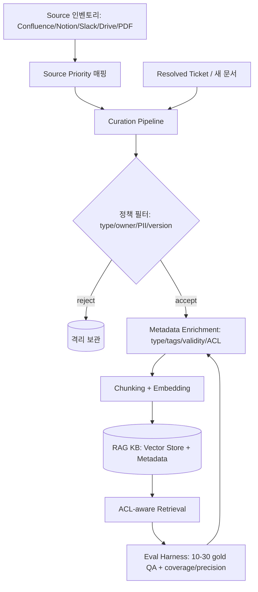
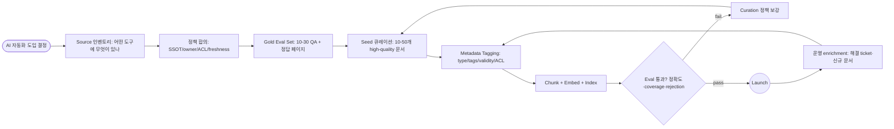

# Shared Doc Policy — Knowledge Bootstrap Strategy for AI Automation

## 핵심 요약

조직에 AI 자동화(RAG 챗봇·에이전트·assistant)를 **처음 도입할 때** 공용 문서 정책을 같이 설계해 KB(knowledge base) cold start 문제를 해결하는 전략. 핵심 통찰: "어떤 검색 알고리즘을 쓰느냐"보다 "**어떤 문서를 어떤 정책으로 시드하느냐**"가 RAG 성패의 지배적 요인이다 (vetted vs unvetted 시 hallucination 52% → near zero).

- **Curation > Retrieval**: 100+ enterprise RAG 사례 분석 결과 KB 품질이 retrieval tuning보다 압도적 영향. 시드 단계에 정책을 박지 않으면 이후 algorithm 튜닝으로 복구 불가.
- **3-5 version 흩어짐이 #1 failure mode**: SSOT 정책 없이 시드하면 같은 문서가 SharePoint/email/local에 흩어져 RAG가 stale version을 retrieve.
- **시드는 작게**: 초기 corpus는 10–50개 high-quality 문서 또는 10–30개 internal Q&A + 정답 페이지 + sample answer. 양보다 품질.
- **정책 4축 동시 설계**: (1) source priority, (2) curation criteria, (3) ACL/PII, (4) freshness SLO. 시드 시점에 박아둬야 운영 후 enrichment가 일관됨.

## 컴포넌트 다이어그램

KB bootstrap 시스템은 source 인벤토리·curation 정책·메타데이터 enrichment·ACL·평가 harness의 5개 모듈로 구성. 모든 컴포넌트가 시드 단계에 동시 가동되어야 운영 단계에서의 enrichment가 정책 준수 상태로 유지된다.

## 적용 단계

cold start 시드 6단계: 인벤토리 → 정책 합의 → eval set 구축 → 시드 corpus 큐레이션 → enrichment → 평가·반복. enrichment 루프가 운영 단계의 점진적 성장을 담당.

## 핵심 기능 및 서비스

| 기능 | 설명 |
|---|---|
| Source 인벤토리 | Confluence/Notion/Slack/Drive/PDF/Wiki/Email 등 모든 후보 소스 목록화 + 도구별 owner |
| Source priority | "검증된 docs(Confluence/Notion 등) > Slack chat" — 같은 답이 여러 곳에 있을 때 우선순위 |
| Curation 정책 | document type 분류 + subsystem tags + validity interval + obsolete 명시 |
| Gold Eval Set | 10–30 실제 사용자 질문 + 정답 페이지 + sample 답변 (출시 전·이후 모든 회귀 평가의 기준) |
| Metadata enrichment | type, tags, owner, validity, sensitivity 라벨링 — 그 자체만으로 precision +9.2pp 보고 |
| ACL-aware retrieval | metadata filter로 사용자 권한에 맞는 문서만 검색. PII 사전 redaction |
| Freshness SLO | "95% of docs searchable within 10 min of update" 같은 정량 목표 |
| Audit log | 누가 어떤 문서를 retrieve했는지 immutable 로그 — compliance + debugging |
| Continuous enrichment | 해결된 ticket·검색 실패 query → 신규 문서 생성 트리거 |

## 유사 기술 비교

| 항목 | Bootstrap-first (본 전략) | Document-first (정책 후행) | Tool-first (도구 도입 후 corpus 결정) |
|---|---|---|---|
| 정책 박힘 시점 | 시드와 동시 | 운영 후 사후 정비 | 운영 후 사후 정비 |
| Hallucination 비율 | 매우 낮음 (curated) | 매우 높음 (unvetted 52%) | 도구가 가린 부분에 따라 가변 |
| 운영 복구 비용 | 낮음 (initial 투자) | 매우 큼 (re-curation) | 매우 큼 |
| Time to first launch | 중간 (정책 합의 비용) | 빠름 (즉시 시드) | 빠름 |
| 일관성 | 매우 강함 | 약함 (3–5 버전 흩어짐) | 약함 |
| 적합 케이스 | 신규 도입, 거버넌스 중요 | PoC·hackathon | 도구 평가 우선 |

## 실제 사례

### AI Knowledge Assist (arxiv 2510.08149)
historical customer-agent 대화에서 자동으로 QA pair를 추출해 cold start KB를 시드. noisy transcript에서 cost-effective하게 생성. 신규 도입 시 "기존 자료가 부족한 상황의 대안" 사례.

### Enterprise RAG (Atlan 100+ 팀 분석)
"unvetted data에서 hallucination 52% → curated 0에 근접". metadata enrichment alone으로 precision 73.3% → 82.5% 상승. 시드 정책이 algorithm 튜닝보다 압도적 영향이라는 정량 evidence.

### Slack-first vs Confluence-first 비교 (Question Base / eesel AI)
"docs가 대부분 Slack에 있으면 Slack AI로 충분, Notion/Confluence/Salesforce에 분산되면 specialized agent 필수". source priority를 명확히 설정한 사례.

### CallSphere / OpenFn (RAG 도큐먼트 assistant)
초기 시드는 "10–30 internal 질문 + 정답 페이지 + sample answer"의 작은 eval set으로 시작. header-based chunking + 단순 vector search → eval로 검증 → hybrid search·reranking 점진 도입.

### AWS Bedrock — 민감 정보 보호
pre-ingestion PII redaction + metadata filter 기반 ACL-aware retrieval. role 단위 권한과 retrieval governance를 시드 단계에 박는 reference 아키텍처.

### Continuous Enrichment (CallSphere)
"초기엔 제한된 문서로 시작, 해결된 ticket을 새 문서로 생성하는 enrichment 루프로 점진 성장." cold start 이후의 성장 곡선 설계 사례.

## 활용 시나리오

### 시나리오 1: 사내 첫 AI 챗봇 (정책+코퍼스 동시 설계)
컨텍스트 — 회사가 처음 AI 어시스턴트(RAG 챗봇)를 도입. 기획은 PM, 도큐먼트는 Confluence/Notion·Slack에 흩어짐. → bootstrap-first 적용: (1) Source 인벤토리 → Confluence를 SSOT로 지정·Slack은 보조, (2) PRD/RFC/Runbook 3개 type만 시드, (3) gold eval set 20개 작성, (4) metadata(owner/validity/sensitivity) 시드 단계에 의무 부여. 출시 후 hallucination을 algorithm 튜닝 없이도 낮은 수준으로 유지.

### 시나리오 2: 기존 KB 위에 RAG를 얹기 (정책 retrofit)
컨텍스트 — 이미 Confluence에 수년치 문서 누적, 정책 없이 자유 작성. RAG 도입 시 stale·중복·민감 문서가 retrieve됨. → "도입 전 정책 retrofit" 패턴: (a) 핵심 type(PRD/API spec/runbook) 외 시드에서 제외, (b) `status: deprecated` 라벨 보유한 문서 격리, (c) gold set으로 회귀 평가, (d) 단계적으로 corpus 확장.

### 시나리오 3: 민감 정보·ACL 동시 설계
컨텍스트 — 보안·compliance가 엄격한 조직(금융·헬스케어). 일반 직원과 admin이 같은 KB에 접근해선 안 됨. → pre-ingestion에서 PII redaction + metadata에 `sensitivity: pii/confidential/public` 라벨 + retrieval 시 사용자 role과 비교해 metadata filter로 차단. RBAC 정책이 KB seed 정책과 동시 설계.

### 시나리오 4: 해결된 ticket → 자동 corpus 성장
컨텍스트 — 출시 후 사용자 질문 중 KB 답이 없어 escalation된 사례가 누적. → escalation log에서 "잘 해결된 ticket"의 응답을 새 문서 후보로 자동 추출 → 사람 review → policy compliant tagging → KB에 ingest. 운영 단계의 enrichment 자동화.

### 시나리오 5: 출시 readiness gate
컨텍스트 — KB 시드는 됐지만 출시 가능한지 객관적 기준 부재. → readiness gate: (1) Gold set 정확도 > 80%, (2) coverage(자동 처리율) > 60%, (3) rejection accuracy(escalation 적절성) > 90%, (4) PII leak 0건. 세 임계치 미달 시 출시 보류.

## 장단점 및 트레이드오프

| 항목 | 내용 |
|---|---|
| 장점 | hallucination·stale 답변을 시드 단계에 차단 / 운영 enrichment가 정책 준수 상태 유지 / compliance·audit 자연스럽게 통합 / launch readiness 객관적 측정 가능 |
| 단점 | 정책 합의 비용 큼 (PM·Eng·Legal 동시 참여) / 너무 엄격하면 시드 corpus 빈약해 coverage 부족 / metadata enrichment의 지속 운영 부담 |
| 트레이드오프 | 출시 속도(작은 시드) vs coverage(큰 시드) / 정책 엄격함 vs 자유 작성 / 자동 enrichment vs 사람 review 비율 |

## 함정 및 안티패턴

- **안티패턴 1: 코퍼스를 정책 없이 일괄 ingest** — Confluence space 전체 dump → stale·중복·민감 문서 혼입. hallucination 폭증. → "원천 → 검증 → 시드" 파이프라인을 first day부터.
- **안티패턴 2: Source priority 미정의** — 같은 답이 Slack·Confluence·Notion에 다른 버전으로 존재 → RAG가 semantically nearest를 retrieve. → SSOT 매트릭스(type별 정답 위치) 명시.
- **안티패턴 3: Eval gold set 없이 출시** — 정확도·hallucination 회귀를 측정할 기준 없음. → 출시 전 10–30 QA gold set 의무화, CI/CD처럼 모든 corpus 변경 시 재실행.
- **안티패턴 4: Algorithm tuning 우선** — chunking·reranker만 만지작 → curation 누락된 unvetted data 위에서 한계점 도달. → curation을 algorithm tuning보다 먼저.
- **안티패턴 5: ACL을 사후 적용** — PII·민감 문서가 이미 embedding된 후 retrieval 시 필터만 거는 패턴 — embedding leak·logs에 잔존 → 사전 redaction + metadata sensitivity 라벨로 ingestion 차단.
- **안티패턴 6: Freshness 무시** — 시드 시점의 문서만 영구 사용, deprecation 무시 → stale 답변 누적. → validity interval + `status: deprecated` 라벨 + 자동 archive cron.
- **안티패턴 7: 시드 코퍼스만 보고 launch** — coverage 부족이 사후에 드러남. → readiness gate에서 coverage 메트릭으로 사전 차단.
- **안티패턴 8: enrichment를 사람 의존** — 해결 ticket을 사람이 매번 review → 운영 부담 폭증 → 운영 정체 → KB 정체. → 자동 추출 + 라벨 자동 부여 + 샘플링된 사람 review 결합.

## 참고 자료

- [AI Knowledge Assist (arxiv 2510.08149)](https://arxiv.org/html/2510.08149) — 자동 QA pair 추출로 cold start KB 시드
- [Cold Start in Knowledge Base | Sobot Blog](https://www.sobot.io/blog/cold-start-in-knowledge-base/) — cold start 정의·증상
- [Enterprise LLM Knowledge Base: Architecture and Governance Guide | Atlan](https://atlan.com/know/enterprise-llm-knowledge-base/) — 5요건(data certification/ACL/freshness/audit/accountability)
- [LLM Knowledge Base Data Quality | Atlan](https://atlan.com/know/llm-knowledge-base-data-quality/) — curation > retrieval, hallucination 52% vs near-zero 정량 분석
- [How to Build an LLM Knowledge Base for Enterprise | Atlan](https://atlan.com/know/how-to-build-llm-knowledge-base/) — 시드 단계 best practice
- [RAG Without the Internet — Internal-Only AI Assistant | DEV Community](https://dev.to/bryanudensi/rag-without-the-internet-lessons-from-building-an-internal-only-ai-assistant-on-markdown-and-2npe) — 사내 markdown·Confluence 기반 RAG 시드 사례
- [Enterprise RAG — Building Effective AI Assistants with Internal Knowledge | Omnifact](https://omnifact.ai/whitepapers/enterprise-rag-building-effective-ai-assistants) — 정책·거버넌스 종합
- [Build an unstructured data pipeline for RAG | Databricks Docs](https://docs.databricks.com/aws/en/generative-ai/tutorials/ai-cookbook/quality-data-pipeline-rag) — corpus composition·preprocessing·dedup
- [Solving Freshness in RAG (arxiv 2509.19376)](https://arxiv.org/html/2509.19376) — freshness SLO·recency prior
- [Protect sensitive data in RAG applications with Amazon Bedrock | AWS Blog](https://aws.amazon.com/blogs/machine-learning/protect-sensitive-data-in-rag-applications-with-amazon-bedrock/) — pre-ingestion PII redaction + metadata ACL 공식 reference
- [From Transcripts to AI Agents (arxiv 2602.15859)](https://arxiv.org/pdf/2602.15859) — coverage·factual accuracy·rejection accuracy 평가 메트릭
- [Taxonomies vs. Ontologies for Enabling AI-Readiness | Enterprise Knowledge](https://enterprise-knowledge.com/taxonomies-vs-ontologies-for-enabling-ai-readiness/) — KB taxonomy/ontology 초기 설계
- [How AI Syncs Slack with Notion, Confluence, and More | Question Base](https://www.questionbase.com/resources/blog/ai-sync-slack-notion-confluence) — multi-source 시드 시 priority 결정
- [생성형 AI 시대와 기업의 준비 2편 | 삼성SDS Insight](https://www.samsungsds.com/kr/insights/enterprise-readiness-for-generative-ai-part2.html) — 한국 enterprise 도입 use case 우선순위
- [키워드 검색의 한계를 뛰어넘는 사내 지식 검색 시스템 구축 전략 | Wissly](https://www.wissly.ai/ko/blog/in-house-ai-knowledge-search) — 한국어 KB 검색·시드·보안 가이드
