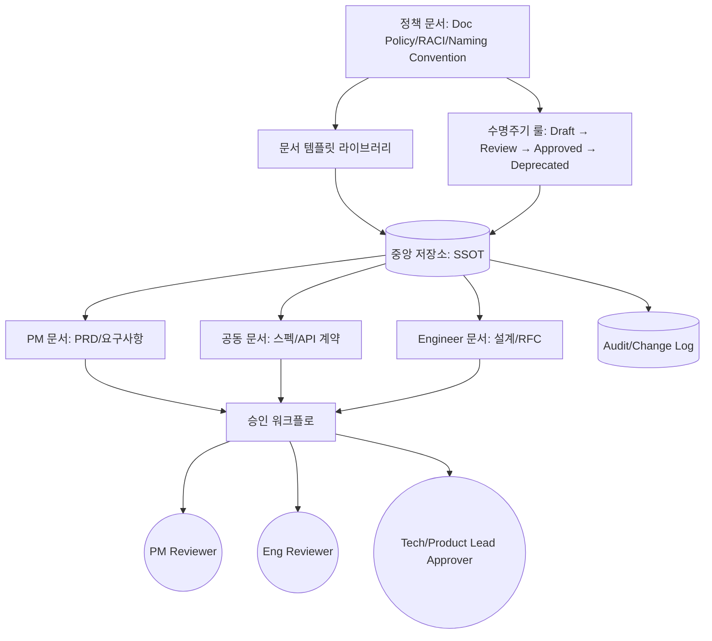

# Shared Documentation Policy — Between PM and Engineering

## 핵심 요약

기획자(PM/PO)와 개발자가 함께 사용하는 공용 문서(요구사항·스펙·정책·API 계약 등)에 **소유권·승인 흐름·버전 관리·SSOT 위치**를 명시한 거버넌스 체계를 부여하는 방법론. 핵심은 "한 사실은 한 곳에서만 정의되고 양측이 동일 ref를 참조한다"는 SSOT 원칙을 문서 수명주기 전반에 적용하는 것.

- **SSOT 위치 지정 의무**: 모든 문서 유형마다 정답 위치 1곳(예: Confluence space / Notion DB / git repo) 명시. 사본은 link로만 존재.
- **소유권 분리**: PM은 "Why·What" 담당, Engineer는 "How" 담당 — 한 문서 안에서 영역별 owner 표기.
- **승인 워크플로 정의**: 누가, 언제, 어떤 조건에서 reviewer / approver인지 RACI로 고정.
- **버전 + 변경 이력**: 살아있는 문서(living document)로 운영하되, change log·revision history 의무화.

## 컴포넌트 다이어그램

문서 거버넌스 체계는 정책(policy) 계층, 문서 저장소 계층, 거버넌스 액터(승인자/검토자) 계층으로 나뉜다. 모든 작성·수정은 정책 → 저장소 → 액터 흐름을 거친다.

## 적용 단계

정책 수립 → 문서 분류 → SSOT 위치 지정 → 승인 룰 → 운영·감사의 5단계. 각 단계는 PM·Engineer 양측이 함께 합의해야 향후 운영에서 합의 결렬을 방지한다.

## 핵심 기능 및 서비스

| 기능 | 설명 |
|---|---|
| SSOT 매트릭스 | 문서 유형별 정답 위치 1곳을 표로 고정 (예: PRD=Confluence /spec=git docs/) |
| RACI 매트릭스 | 유형별 R(작성)·A(승인)·C(자문)·I(통지) 명확화 |
| 수명주기 상태 | Draft·In Review·Approved·Deprecated 4상태 + 자동 만료 정책 |
| 템플릿 라이브러리 | 문서 유형별 표준 템플릿 (PRD, RFC, API Spec, Postmortem 등) |
| 변경 이력 | Change Log/Revision History 의무 (누가·언제·무엇) |
| 명명 규칙 | 파일/페이지 이름 컨벤션 (도메인-주제-버전) |
| 권한 매핑 | 작성·읽기·승인 권한을 역할(role)에 매핑, 사람 개별 부여 금지 |
| 정기 감사 | stale·중복·SSOT 위반·deprecated 미정리 점검 |

## 유사 기술 비교

| 항목 | SSOT 거버넌스 | Per-team 문서 사일로 | Wiki 자유 작성 |
|---|---|---|---|
| 정보 일관성 | 매우 강함 (1곳만 truth) | 매우 약함 (불일치 누적) | 약함 (중복·구버전 혼재) |
| 운영 비용 | 중간 (정책·감사 필요) | 낮음 단기·매우 높음 장기 | 낮음 단기·중간 장기 |
| 의사결정 속도 | 빠름 (참조 명확) | 느림 (어떤 문서가 정답?) | 중간 |
| 신규 합류자 onboarding | 강함 | 매우 약함 | 약함 |
| 적합 케이스 | PM-Engineer 협업 ≥ 2팀 | 1팀 단일 도메인 | 비공식 메모·자유 노트 |

## 실제 사례

### Atlassian PRD 가이드
Confluence 기반 PRD 템플릿을 표준화하고 Jira 이슈와 양방향 링크. PM이 PRD에 epic을 첨부하면 engineer가 jira에서 PRD로 역참조. "PM이 끝까지 들고 있는 문서가 아니라 공유 도구"라는 원칙을 명시.

### Target Tech 블로그 — Feature Documents
PM이 "purpose·scope·high-level"을 정의하면 engineer가 "expectations·questions"를 이어쓰는 협업 문서 컨벤션. 비동기 협업으로 정렬(alignment) 비용을 크게 절감.

### YouTube (Minal Mehta, Head of Product)
PRD를 living document로 운영하며 product lifecycle 내내 갱신. "Day 1에만 정확한 PRD는 쓸모없다"는 원칙으로 버전 관리·traceability·collaboration을 표준에 포함.

### 한국 기업 사례 (flex)
SSOT 부재 상태의 가장 흔한 패턴이 "전용 저작도구(MS Office, HWP) + Email"이며 의사소통 비용을 극대화한다고 진단. 통합 협업 도구로의 이전을 권고.

## 활용 시나리오

### 시나리오 1: 신규 기능 출시 협업
컨텍스트 — PM이 새 기능 PRD를 작성하지만 engineer가 RFC를 별도 작성, 둘이 충돌. 정책 적용 후 PRD는 Confluence(Product space, PM owner), RFC는 git repo(Engineer owner)에 위치하되 PRD 페이지가 RFC를 embed/link로 단일 참조. 승인은 Product Lead → Tech Lead 순으로 RACI 명시.

### 시나리오 2: API 계약 문서
컨텍스트 — Backend·Frontend·Mobile이 API 스펙을 각자 보유해 mismatch. OpenAPI 스펙을 SSOT로 지정하고 git repo에 두며 자동 빌드로 Confluence에 read-only 미러링. spec 변경은 PR + RFC 승인 후만 가능. 클라이언트 팀은 자동 생성된 클라이언트 SDK를 의존.

### 시나리오 3: 운영 정책 문서 (incident response, data retention)
컨텍스트 — 운영 정책이 슬랙 메시지·노션·코드 주석에 흩어져 있어 incident 시 참조 불가. 정책 카테고리(보안·데이터·이슈 대응)별 SSOT 위치를 지정하고, 모든 신규 정책은 템플릿 기반 작성 + 분기별 감사. 변경 시 owner approver 명시.

## 장단점 및 트레이드오프

| 항목 | 내용 |
|---|---|
| 장점 | SSOT 보장 / cross-team alignment cost 절감 / onboarding 강화 / audit·compliance 용이 |
| 단점 | 초기 정책 수립·합의 비용 큼 / 너무 무거운 거버넌스는 작성 속도 저해 / 정책 자체의 유지보수 필요 |
| 트레이드오프 | 자유도(빠른 작성) vs 일관성(SSOT) 사이의 균형 / 모든 문서를 정책 대상에 포함시키면 운영 마비, 핵심 유형(PRD/RFC/Spec/Policy)만 정책화 권장 |

## 함정 및 안티패턴

- **안티패턴 1: Email/HWP/MS Office 기반 협업** — 첨부파일이 정답이 되어 SSOT 깨짐, 버전 추적 불가. → 처음부터 협업 도구 기반 link로만 공유, 첨부 금지.
- **안티패턴 2: 정책 문서 자체가 SSOT 룰을 위반** — 정책이 슬랙·노션·구두로 흩어짐. → 정책 문서도 표준 카테고리에 등록·버전 관리.
- **안티패턴 3: PM 단독 소유 문서** — engineer가 읽기만 하고 갱신 못함 → "living document"가 아님. → 영역별 co-ownership 명시, PR/comment 권한 부여.
- **안티패턴 4: 명시되지 않은 deprecation** — 구버전 문서가 영원히 검색에 노출되어 잘못된 의사결정 유발. → status: deprecated 라벨·자동 archive·검색 결과에서 deprioritize.
- **안티패턴 5: 너무 무거운 승인 워크플로** — 모든 minor edit에 approver 요구 → 작성 속도 저해. → 변경 규모별 승인 단계 차등(typo는 self-approve, structural change만 lead approval).
- **안티패턴 6: 사람별 권한 부여** — 인사 변경 시 권한 재조정 비용 폭증. → role 기반 권한(group)만 사용.

## 참고 자료

- [Building a single source of truth (SSOT) for your team | Atlassian](https://www.atlassian.com/work-management/knowledge-sharing/documentation/building-a-single-source-of-truth-ssot-for-your-team) — SSOT 구축 공식 가이드 (한국어 페이지 별도 제공)
- [How to create a product requirements document (PRD) | Atlassian](https://www.atlassian.com/agile/product-management/requirements) — PRD 표준 작성·승인 가이드
- [Cultivating a Strong Product Engineering Culture Through Feature Documents | Target Tech](https://tech.target.com/blog/feature-documents-in-product-engineering) — PM-Engineer 협업 문서 운영 사례
- [How to write a PRD that engineers actually read | Plane Blog](https://plane.so/blog/how-to-write-a-prd-that-engineers-actually-read) — PRD를 living document로 운영하는 원칙
- [Creating a Documentation Governance Framework | sowflow](https://www.sowflow.io/blog-post/creating-a-documentation-governance-framework) — 거버넌스 프레임워크 구성 요소 (tech stack/folder/content/maintenance)
- [Document Lifecycle with Version Control | ClickHelp](https://clickhelp.com/clickhelp-technical-writing-blog/document-lifecycle-with-version-control-from-creation-to-archiving/) — Draft → Archive 수명주기 + 버전 관리
- [SSoT(Single Source of Truth) 이해 (한국어) | flex 공식 블로그](https://flex.team/blog/2025/11/17/ax-ssot) — 한국 기업 협업 환경의 SSOT 부재 문제 진단
