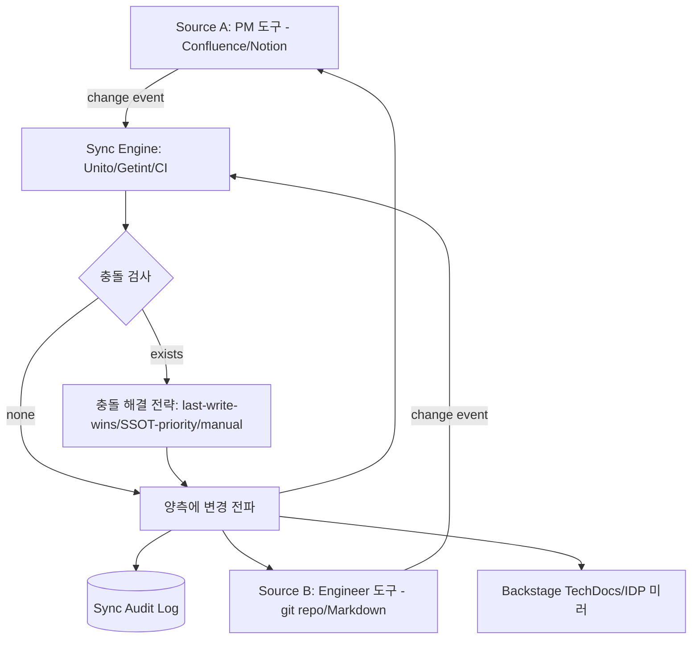
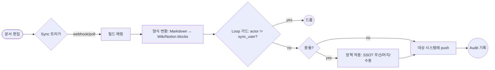

# Shared Documentation Sync — Between PM and Engineering

## 핵심 요약

기획자와 개발자가 서로 다른 도구를 선호할 때(예: PM=Confluence/Notion, Engineer=git repo/Markdown) 동일 내용을 양측 도구에서 일관되게 유지하는 **도구·메커니즘 차원의 동기화 전략**. SSOT를 한쪽에 고정하고 다른 쪽은 자동 미러링하거나, CRDT/필드 매핑 기반 양방향 동기화 등 여러 패턴이 있다.

- **SSOT-mirror 패턴**: 한 도구를 정답으로 정하고 다른 도구는 read-only 미러로 자동 생성. 충돌 0, 단방향.
- **Bidirectional sync 패턴**: Unito·Getint·n8n 등으로 양 도구의 변경을 서로에게 전파. 충돌 정책 필요.
- **Docs-as-code 패턴**: 모든 문서를 git에 두고 CI/CD로 wiki(Confluence/GitBook) 자동 publish. 코드와 동일 PR 흐름.
- **포털 통합 패턴**: Backstage TechDocs 같은 IDP에 모든 문서 인덱싱·렌더링 일원화.

## 시스템 아키텍처

동기화 시스템은 source(SSOT) → sync engine(rule·trigger·conflict resolver) → target(s) 3단계 구조. 양방향 모드에서는 sync engine이 양쪽의 변경을 큐로 받아 충돌 처리 후 재전파한다.

## 처리 흐름

문서 변경 → 트리거 → 매핑 → 변환 → 전파 → 감사. 양방향에서는 loop 방지 가드가 필수.

## 핵심 기능 및 서비스

| 기능 | 설명 |
|---|---|
| Source-target mapping | 어느 필드/섹션이 어디로 매핑되는지 룰 정의 |
| Change trigger | webhook (push) 또는 polling (pull) |
| Loop guard | sync 액터가 만든 변경을 다시 트리거하지 않도록 actor 필터 |
| Conflict policy | last-write-wins / SSOT-priority / field-level merge / manual review |
| Format converter | Markdown ↔ Confluence storage format / Notion blocks ↔ ADF |
| Selective sync | JQL/label/path 필터로 일부 문서만 sync |
| Audit log | 어떤 변경이 어디서 와서 어디로 갔는지 trace |
| Backfill | 과거 N개월 데이터 일괄 동기화 |

## 유사 기술 비교

| 항목 | SSOT-mirror | Bidirectional sync | Docs-as-code |
|---|---|---|---|
| 충돌 위험 | 없음 (단방향) | 중간~높음 | 매우 낮음 (git merge로 처리) |
| 양측 자유도 | 한쪽만 작성 가능 | 양쪽 작성 가능 | engineer 친화, PM은 wiki view만 |
| 운영 복잡도 | 낮음 | 높음 (룰·정책 필요) | 중간 (CI 파이프라인 관리) |
| 도구 예시 | OpenAPI → GitBook auto-publish, `gitbook/openapi-autodoc` | Unito, Getint, n8n, Make | GitBook Git Sync, Backstage TechDocs, MkDocs + Confluence publisher |
| PM 친화도 | SSOT가 PM 도구일 때 강함 | 양측 모두 강함 | 약함 (engineer 도구 필수) |
| 적합 케이스 | 한쪽이 명백한 정답일 때 (API spec) | 동등한 권한이 필요한 PRD/RFC | engineer 중심 조직 + 도구 단일화 가능 |

## 실제 사례

### Unito Confluence ↔ Notion 양방향 동기화
Notion에서 페이지가 생성되면 Confluence에 미러링하고 반대도 동작. 필드 단위 sync rule을 정의해 라벨·assignee·status만 sync 가능. PM 팀이 Notion, Engineer 팀이 Confluence를 쓰는 조직에서 도입.

### GitBook Git Sync + OpenAPI Autodoc
API repo에 `openapi.yaml`을 두면 GitHub Actions가 GitBook에 자동 publish. spec PR이 머지되면 즉시 docs reflect. 별도 wiki 동기화 작업 0.

### Backstage TechDocs (Spotify)
모든 docs를 코드 옆에 markdown으로 두고 CI에서 MkDocs로 빌드 → S3/GCS에 push → Backstage 포털에서 렌더링. "코드를 바꾸는 PR이 docs도 함께 갱신"하는 docs-as-code 원칙을 강제.

### Notion Synced Database
Jira 보드·GitHub PR/이슈를 Notion DB로 가져와 PM이 익숙한 화면에서 engineer 데이터 참조. 단방향 read 동기화로 시작해 PM이 코멘트만 양방향으로 확장 가능.

## 활용 시나리오

### 시나리오 1: API 계약 단방향 publish
컨텍스트 — API spec이 git에 OpenAPI YAML로 있고, PM·고객지원이 보기 어려움. GitHub Actions가 spec 변경 시 GitBook/Confluence에 read-only 미러 자동 publish. 충돌 0, PM 도구 차원에서 검색·코멘트 가능.

### 시나리오 2: PRD 양방향 동기화
컨텍스트 — PM은 Notion에서 PRD를 작성, engineer는 Confluence에서 보고 코멘트. Unito flow로 양방향 sync 구성, 충돌 정책을 "Notion 우선(SSOT)"로 설정. Loop guard로 sync user의 변경은 트리거 제외.

### 시나리오 3: docs-as-code 전사 도입
컨텍스트 — 문서 도구 사일로 해소. Backstage TechDocs를 IDP로 도입하고 모든 팀이 `/docs/*.md`를 repo에 둠. PR 머지 시 자동 publish. PM은 Backstage 포털에서 검색·열람·코멘트.

### 시나리오 4: Jira ↔ Notion DB 미러
컨텍스트 — PM이 Notion에서 백로그를 관리하고 싶지만 dev는 Jira만 사용. Notion Synced Database로 Jira 프로젝트를 read 동기화, 상태 변경은 Jira가 우선. PM은 Notion에서 우선순위 라벨만 양방향 sync.

## 장단점 및 트레이드오프

| 항목 | 내용 |
|---|---|
| 장점 | 도구 사일로 해소 / 양측 친숙 도구 유지 / SSOT 보장(단방향 시) / docs와 코드 lifecycle 일치(docs-as-code) |
| 단점 | 양방향 sync는 충돌·loop 위험 / 형식 변환 손실(Markdown ↔ Wiki block) / 3rd party 서비스 비용·SLA 의존 |
| 트레이드오프 | 운영 단순성(단방향) vs 양측 자유도(양방향) / 자동화 비용 vs 수동 카피 비용 / SSOT 일관성 vs 도구별 native 경험 |

## 함정 및 안티패턴

- **안티패턴 1: 양방향 sync에서 loop 미방어** — A 변경 → B 갱신 → B의 변경이 다시 A로 → 무한 루프. → sync user 식별 + actor 필터, 변경 시점 비교(timestamp) 가드.
- **안티패턴 2: 형식 변환 손실 무시** — Notion의 toggle/database block, Confluence의 macro는 markdown에 1:1 매핑 안 됨. 양방향 sync 후 정보 손실 발생. → 사전에 지원/미지원 block 매트릭스 정의, 미지원은 plain text fallback 명시.
- **안티패턴 3: 모든 문서를 무조건 sync** — 비용·noise 증가. → label/path/space 단위 selective sync. PRD·API spec·정책 등 핵심만.
- **안티패턴 4: SSOT 명시 없이 양방향** — 충돌 시 어느 쪽이 우선인지 모호 → 데이터 손실. → 정책으로 SSOT 명시(예: API spec=git, PRD=Notion) + 충돌 시 SSOT 우선.
- **안티패턴 5: Email 첨부 + Slack 공유로 sync 대체** — 자동화처럼 보이나 SSOT 외부에 사본 누적. → link만 공유, 첨부 금지 정책(이전 노트의 거버넌스 정책과 직결).
- **안티패턴 6: sync 실패 silent** — 일부 페이지만 동기화 실패해도 알림 없음 → 점차 divergence 누적. → audit log + 실패 알림 webhook으로 즉시 노티.

## 참고 자료

- [Confluence Notion Integration | Unito Two-Way Sync](https://unito.io/integrations/confluence-notion/) — 양방향 sync 대표 SaaS
- [Notion-GitHub Integration | Getint](https://www.getint.io/integrations/notion-github) — 대안 양방향 sync 도구
- [Synced Databases bridge the gap between different tools | Notion](https://www.notion.com/help/guides/synced-databases-bridge-different-tools) — Notion 네이티브 read 동기화
- [How to Automate API Documentation Updates with GitHub Actions and OpenAPI | freeCodeCamp](https://www.freecodecamp.org/news/how-to-automate-api-documentation-updates-with-github-actions-and-openapi-specifications/) — docs-as-code 자동 publish 가이드
- [GitbookIO/openapi-autodoc | GitHub](https://github.com/GitbookIO/openapi-autodoc) — OpenAPI → GitBook 자동 생성기
- [TechDocs | Backstage](https://backstage.io/docs/features/techdocs/faqs/) — 코드 옆 markdown → IDP 포털 docs-as-code 공식 구현
- [Document Synchronization: Definition, Examples & Best Practices | Docsie](https://www.docsie.io/blog/glossary/document-synchronization/) — sync 원칙·충돌 정책 개요
- [Conflict resolution strategies in Data Synchronization | Mobterest](https://mobterest.medium.com/conflict-resolution-strategies-in-data-synchronization-2a10be5b82bc) — last-write-wins/merge/manual 비교
