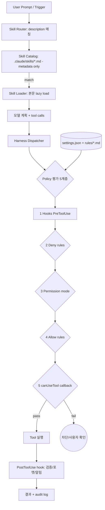

# Skill-Policy Harness Design — Unified Architecture

## 핵심 요약

스킬(skill)은 "할 수 있는 모드"를, 정책(policy)은 "해도 되는 한계"를 정의한다. 둘을 한 하네스 안에서 일관되게 운영하려면 **스킬 카탈로그·정책 레지스트리·런타임 dispatcher**를 분리하면서도 동일 lifecycle 이벤트에서 결합되도록 설계해야 한다. Claude Agent SDK의 5계층 평가 모델(`hooks → deny → permission mode → allow → canUseTool`)이 대표 reference architecture.

- **스킬 = What/How**: 자연어 트리거 또는 slash command로 적재되는 markdown 워크플로 (Progressive Disclosure로 metadata만 평소 로드).
- **정책 = May/MayNot**: 시스템 deny, hook, permission으로 강제되는 가드. 모델 self-discipline에 의존하지 않음.
- **공통 lifecycle**: 두 축이 동일한 PreToolUse / PostToolUse / SessionStart 이벤트에서 dispatched.
- **분리된 저장소 + 결합된 평가**: skills는 `.claude/skills/`, policies는 `settings.json` + `rules/*.md`. 평가는 통합.

## 컴포넌트 다이어그램

스킬 카탈로그(descriptor 기반 routing)와 정책 레지스트리(deny·allow·hook)가 하네스 런타임의 dispatcher를 통해 결합. 매 tool call마다 5계층 평가 후 실행 또는 차단.

## 적용 단계

신규 워크플로 도입 시 (1) 스킬 정의, (2) 정책 카테고리 매핑, (3) lifecycle hook 부착, (4) 카탈로그·레지스트리 등록, (5) 운영 감사의 5단계.

## 핵심 기능 및 서비스

| 기능 | 설명 |
|---|---|
| Skill descriptor | `name`, `description`(routing의 핵심), `args` schema, 본문 |
| Progressive disclosure | 평소 description만 로드 / 매칭 시 본문 적재 → context 절약 |
| User/Auto invocation | `/skill-name` 명시 호출 + 자연어 트리거 자동 매칭 |
| Policy categories | NEVER (불변·deny) / CONFIRM (1회 승인) / auto (자유) |
| Hook layer | PreToolUse·PostToolUse·SessionStart·UserPromptSubmit·Stop 등 12 events |
| Permission mode | read-only / workspace-write / full access — tool마다 최소 요구 모드 선언 |
| 5-layer eval | hooks → deny → mode → allow → canUseTool 순으로 평가 |
| Audit / observability | 차단·승인·실행 모두 log + 우회 시도 alert |
| Hot reload | settings/rule/skill 파일 변경 시 세션 재시작 없이 반영 |

## 유사 기술 비교

| 항목 | Skill-Policy Harness | OPA/Rego | LangChain DeepAgent harness | Microsoft Agent Skills SDK |
|---|---|---|---|---|
| 정책 표현 | JSON + markdown rule | Rego (declarative DSL) | Python config | TypeScript/JSON |
| 정책 강제 시점 | tool dispatch 5계층 | 호출 query 시점 | 에이전트 loop 단계 | tool dispatch |
| 스킬 추상화 | markdown SKILL.md (LLM 친화) | 별도 (정책만) | tool + sub-agent | SkillProvider 인터페이스 |
| 학습 곡선 | 낮음 (JSON/markdown) | 중간 (Rego 학습) | 중간 (Python) | 중간 (SDK) |
| AI 에이전트 통합 | 매우 강함 (Claude Code 네이티브) | 약함 (general policy) | 매우 강함 | 강함 |
| 적합 케이스 | AI 협업 팀 | 마이크로서비스·K8s·CI/CD | LangChain 기반 커스텀 에이전트 | Azure 생태계 |

## 실제 사례

### Anthropic Claude Agent SDK 5-Layer Evaluation
공식 reference: hooks → deny rules → permission mode → allow rules → canUseTool. 위에서부터 평가되어 어느 단계에서든 reject 가능. 이 구조가 "스킬은 어디서나 호출되지만 정책은 어디서도 우회 못함"을 보장.

### Awesome Harness Engineering (ai-boost)
GitHub 큐레이션. tools·patterns·evals·memory·MCP·permissions·observability·orchestration 8개 축으로 분류. 산업 전반에서 비슷한 architecture로 수렴 중임을 보여주는 시그널.

### Spotify/Backstage Software Template + Policy Engine
software template(스킬에 해당)으로 표준 프로젝트를 부트스트랩하면서 score·policy로 사후 거버넌스 강제. AI 영역의 skill-policy 결합과 유사한 구조.

### dwarvesf/claude-guardrails
Claude Code용 hardened security 설정 오픈소스. permissions deny rules + shell hooks + prompt injection defense의 lite/full variants. skill-policy 결합 패턴의 산업 적용 예.

## 활용 시나리오

### 시나리오 1: 자연어 트리거 + 시스템 deny
컨텍스트 — 사용자가 "고쳐줘"라고만 말해도 `/fix` 스킬이 자동 트리거되어야 하지만, `.env` 같은 민감 파일 수정은 절대 금지. 스킬 description에 한국어 트리거 키워드(고쳐줘/수정해줘)를 명시해 routing 활성화, settings.json `permissions.deny`에 `.env` 경로 패턴 등록. 모델이 스킬을 활성화하더라도 deny가 dispatch 시점에 차단.

### 시나리오 2: 다단계 정책 (NEVER vs CONFIRM)
컨텍스트 — `git push --force`는 NEVER, 새 의존성 추가는 CONFIRM. → NEVER는 PreToolUse hook에서 즉시 deny + log alert. CONFIRM은 첫 발생 시 사용자 확인 후 세션 내에서 재허용. 03_workflow의 Override Protocol을 hook에서 그대로 인코딩.

### 시나리오 3: 스킬 간 라우팅 충돌 방지
컨텍스트 — `/analyze`와 `/fix`가 비슷한 description으로 같은 자연어에 매칭 → 잘못된 스킬 선택. SKILL.md의 description에 SKIP 조건과 TRIGGER 조건을 명시해 router의 정확도 향상. workflow rule(03_workflow)이 메타-라우터 역할.

### 시나리오 4: Progressive disclosure로 토큰 절약
컨텍스트 — 스킬 30개 모두 평소 로드하면 context bloat. → 평소엔 metadata만, `description` 매칭 시에만 본문 적재. 한 세션 내에서 한 번 로드된 스킬은 cache.

## 장단점 및 트레이드오프

| 항목 | 내용 |
|---|---|
| 장점 | 스킬 자유도 + 정책 안전을 동시에 보장 / 5계층 평가로 우회 불가 / progressive disclosure로 토큰 효율 / hot reload로 빠른 정제 |
| 단점 | 계층이 깊어 디버깅 난도 상승 / hook script 자체의 유지보수 부담 / 정책·스킬 일관성을 유지하는 메타-정책 필요 |
| 트레이드오프 | 표현력(많은 hook/skill) vs 단순함 / 강제(시스템 deny) vs 자율성(off-path) / metadata 정확도 vs 사용자 경험(잘못 매칭 시 답답) |

## 함정 및 안티패턴

- **안티패턴 1: skill description을 routing의 유일한 기준으로** — 잘못된 자연어 매칭으로 엉뚱한 스킬 호출. → trigger/SKIP 조건을 description에 명시, 또는 메타-라우터 rule로 보강.
- **안티패턴 2: 정책을 자연어로만 표현** — 모델이 "이해는 하지만 따르지 않는" 상황. → NEVER는 hook + permissions.deny로 시스템 차단, 자연어는 약한 가이드.
- **안티패턴 3: 모든 lifecycle 이벤트에 hook 부착** — 응답 지연 + 디버깅 지옥. → 5~7개 핵심 이벤트(PreToolUse, PostToolUse, SessionStart, Stop)에 한정.
- **안티패턴 4: 스킬·정책의 정책(메타-정책) 부재** — 우선순위·conflict resolution 명세 없음. → CLAUDE.md의 Conflict Resolution 표 같은 메타-정책 의무화.
- **안티패턴 5: 정책의 silent override** — 사용자가 임시 override 후 잊음 → 영구화. → override는 명시적 만료(세션 종료 또는 N시간)를 강제, audit log 필수.
- **안티패턴 6: 스킬 비대화** — 한 스킬에 너무 많은 역할 → 진입 조건 모호. → "one skill, one job" 원칙. 분할 시 메타-라우터 rule로 흐름 명시.
- **안티패턴 7: 정책·스킬 버전 불일치** — settings.json은 최신인데 rules/*.md는 옛 버전. → 단일 PR로 묶어 변경, schema version 필드 추가.

## 참고 자료

- [Extend Claude with skills | Claude Code Docs](https://code.claude.com/docs/en/skills) — SKILL.md 구조·invocation·progressive disclosure 공식 가이드
- [Claude Code Hooks: The Deterministic Control Layer | Dotzlaw](https://www.dotzlaw.com/insights/claude-hooks/) — hook이 정책을 결정론적으로 강제하는 메커니즘
- [Claude Code hooks — the complete guide | Jakub Kontra](https://jakubkontra.com/en/blog/claude-code-hooks-complete-guide) — Pre/PostToolUse·12 lifecycle 이벤트 정리
- [What is an agent harness? | Arize AI](https://arize.com/blog/what-is-an-agent-harness/) — agent harness 9-component 구조
- [The 9 Components Every Production Agent Harness Needs | MindStudio](https://www.mindstudio.ai/blog/9-components-production-agent-harness) — loop/context/tools/prompt/permissions/hooks/persistence/skills/sub-agents 분해
- [Harness capabilities | LangChain DeepAgents Docs](https://docs.langchain.com/oss/python/deepagents/harness) — Python 진영의 harness reference
- [Open Policy Agent (OPA) | openpolicyagent.org](https://www.openpolicyagent.org/docs) — 일반 정책 엔진. policy-as-code 원형
- [dwarvesf/claude-guardrails | GitHub](https://github.com/dwarvesf/claude-guardrails) — Claude Code용 deny rules + hook + prompt injection 방어 오픈소스
- [Towards Policy-Compliant Agents (arxiv 2510.03485)](https://arxiv.org/pdf/2510.03485) — 정책 위반 감지용 효율 guardrail 연구
