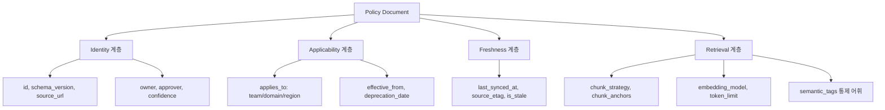

# AI 에이전트 참조용 정책 문서 메타데이터 스키마

## 핵심 요약

공용 정책 문서를 AI 에이전트(Claude, Codex 등)가 참조하려면 사람용 메타데이터(`title`, `owner`)만으론 부족하다. 에이전트는 **applicability(언제·어디 적용되는가)**·**confidence(얼마나 믿을 만한가)**·**provenance(출처는 어디인가)**·**retrieval hint(어떻게 검색되어야 하는가)**를 필요로 한다. 사람용 frontmatter 위에 agent-facing 필드를 정의해 hallucination을 줄이고 정확한 citation을 가능하게 한다.

- **4-계층 metadata**: identity / applicability / freshness / retrieval.
- **chunking unit**: 헤딩 기반(H2)이 default. 정책 문서는 sections이 self-contained해야 chunk가 독립적으로 의미 보존.
- **embedding 호환성**: chunk size·token 제한을 embedding 모델별로 명시 (text-embedding-3-small 8191 tokens, Cohere embed-multilingual-v3 512 tokens 등 차이).
- **citation anchor**: chunk마다 stable id 부여 → RAG 응답이 정확한 위치를 가리킬 수 있음.
- **agent 응답 룰**: `applies_to`·`effective_from`·`deprecation_date` 미충족 chunk는 답변에서 제외 또는 명시적 경고.

## metadata 계층 다이어그램



## 4-계층 필드 정의

### Identity (불변)
| 필드 | 타입 | 의미 |
|---|---|---|
| `id` | string (UUID/slug) | 저장소 독립 식별자 |
| `schema_version` | integer | 스키마 진화 추적 |
| `source_url` | URL | 원본 위치 (citation anchor) |
| `owner` | string (role) | 권위자 |
| `confidence` | enum (`draft` / `reviewed` / `approved` / `deprecated`) | 신뢰 수준 |

### Applicability (적용 범위)
| 필드 | 타입 | 의미 |
|---|---|---|
| `applies_to` | object | `{teams: [], domains: [], regions: []}` |
| `effective_from` | date | 발효일 |
| `deprecation_date` | date (optional) | sunset 일정 |
| `supersedes` | array of ids | 대체 대상 문서 |

### Freshness (캐시 상태)
| 필드 | 타입 | 의미 |
|---|---|---|
| `last_synced_at` | ISO timestamp | 마지막 서버 동기화 |
| `source_etag` | string | 서버 ETag |
| `is_stale` | boolean (computed) | TTL 초과 여부 |
| `sync_status` | enum | `ok` / `failed` / `offline` |

### Retrieval (검색·인덱싱 hint)
| 필드 | 타입 | 의미 |
|---|---|---|
| `chunk_strategy` | enum (`heading` / `fixed` / `semantic`) | 분할 단위 |
| `chunk_anchors` | array of `{id, heading, range}` | 인용 가능한 위치 |
| `embedding_model` | string | 인덱싱 사용 모델 |
| `embedding_token_limit` | integer | 모델별 토큰 제한 |
| `semantic_tags` | array | 통제 어휘 (`tag-taxonomy` 준수) |

## chunking 전략 — 정책 문서의 특수성

정책 문서는 sections이 **self-contained** (각 H2가 독립적 의미)이어야 RAG에서 chunk가 무손실로 인용 가능. 단순 fixed-size split은 의미 단위를 자른다.

| 전략 | 장점 | 단점 | 적합 |
|---|---|---|---|
| heading-based (H2) | 의미 보존, 인용 자연스러움 | chunk 크기 편차 큼 | 정책·도메인 규칙 (default 권장) |
| fixed-size (token) | 일관된 크기, 효율 | 의미 절단 | 산문체 긴 문서 |
| semantic split | 의미 보존 + 일관 크기 | 전처리 비용 | 대규모 batch 인덱싱 |
| 용어집 — entry 단위 | 정확 매칭 | 일반 검색 약함 | 용어집 한정 |

## embedding 모델별 호환성

chunk size 결정은 embedding 모델의 token 제한과 매칭되어야 한다.

| 모델 | Max input tokens | 권장 chunk | 한국어 처리 | 정책 문서 적합도 |
|---|---|---|---|---|
| OpenAI text-embedding-3-small | 8191 | 512–2048 | 양호 | ◯ 범용 |
| OpenAI text-embedding-3-large | 8191 | 512–2048 | 양호 | ◎ 정확도 우선 |
| Cohere embed-multilingual-v3 | 512 | ≤512 | 우수 | ◎ 다국어 정책 |
| AWS Bedrock Titan v2 | 8192 | 512–1024 | 보통 | ◯ AWS 환경 |
| AWS Bedrock Cohere v3 | 512 | ≤512 | 우수 | ◎ AWS + 한국어 |
| BGE-M3 (오픈소스) | 8192 | 512–2048 | 우수 | ◯ self-host |

**비추천 조합**:
- Cohere v3(512 token)에 heading-based 큰 chunk → 잘림 발생. fixed-size로 fallback 필요.
- 한국어 정책 문서 + OpenAI ada-002 (deprecated) → 한국어 성능 열위, embed-3 또는 Cohere v3 권장.

## citation anchor — RAG 응답의 정확도

```yaml
chunk_anchors:
  - id: "policy-refund#exception-cases"
    heading: "예외 케이스"
    range: { start_line: 42, end_line: 87 }
    token_estimate: 512
```

agent는 답변 시 `source_url#chunk_anchor.id`로 정확한 위치 인용. heading-based chunking이면 anchor가 자연스러운 deep link로 작동.

## agent 응답 룰

| 조건 | agent 동작 |
|---|---|
| `confidence: draft` | 답변에서 제외 또는 "draft" 명시 |
| `confidence: deprecated` | 응답 거부, supersedes 문서 안내 |
| `is_stale: true` | 답변 시 "마지막 sync N시간 전" 경고 |
| `applies_to` 불일치 | 답변 제외 (예: user team이 적용 범위 밖) |
| `effective_from` > 오늘 | "예정 정책" 명시 |
| `deprecation_date` < 오늘 | 응답 거부 |

## 실제 사례

### LangChain Document metadata
표준 `Document(page_content, metadata)` 구조. metadata에 `source`, `chunk_id` 정도만 권장. applicability·freshness는 사용자 정의 — 본 스키마가 이를 표준화.

### Anthropic Citations API
응답에 출처 chunk 범위 포함. citation anchor 필드와 직접 매핑 가능 — 정책 문서 RAG 시스템의 reference 패턴.

### Notion AI — page-level metadata
페이지의 `last_edited_time`, `created_by`, `properties`를 RAG에 활용. freshness·ownership 일부 자동화되지만 applicability는 없음.

### Confluence + Atlassian Intelligence
스페이스·라벨·권한을 retrieval filter로 사용. applies_to의 implicit 구현이지만 명시적 schema는 없음.

## 활용 시나리오

### 시나리오 1: 권한 회수된 사용자의 정책 조회
agent가 정책 문서 chunk를 retrieve. `applies_to.teams`가 사용자 팀 미포함 → 답변에서 제외. 사용자에게 "해당 정책은 X팀 전용입니다" 응답.

### 시나리오 2: deprecated 정책 인용 방지
구버전 환불 정책이 vault에 잔존. `deprecation_date < today` + `supersedes: [new-policy-id]` → agent가 자동으로 신정책으로 redirect.

### 시나리오 3: 다국어 정책 RAG
한·영 정책 혼재. `embedding_model: cohere-embed-multilingual-v3` + chunk ≤512 tokens. 헤딩이 길면 자동 fixed-size fallback.

### 시나리오 4: stale 경고
오프라인 사용자가 정책 조회 → `sync_status: offline`, `last_synced_at: 3일 전` → agent 응답 끝에 "이 답변은 3일 전 기준 사본입니다, 네트워크 복귀 후 재확인 권장".

## 장단점 및 트레이드오프

| 항목 | 내용 |
|---|---|
| 장점 | hallucination↓ / 정확한 citation / 적용 범위 자동 필터 / deprecated 인용 방지 |
| 단점 | frontmatter 작성 부담 / schema 유지보수 / embedding 모델 변경 시 재인덱싱 |
| 트레이드오프 | 풍부한 metadata(정확도) vs 작성 비용. Identity·Freshness는 자동화, Applicability는 작성자 의무, Retrieval은 시스템 자동 |

## 함정 및 안티패턴

- **사람용 frontmatter에 agent 필드 mix** → 가독성·유지보수 저하. → 사람용/agent용 sub-namespace 분리 (예: `agent: {...}`).
- **chunk_anchors를 수동 작성** → 본문 변경 시 anchor stale. → 빌드 시 자동 생성 + 본문 라인 변경 감지.
- **embedding_model 미명시** → 모델 교체 시 silent 정확도 저하. → 명시적 필드 + 인덱싱 파이프라인이 검증.
- **applies_to를 free-form string** → agent filter 신뢰 불가. → 통제 어휘 (team_id, domain_id) 강제.
- **deprecation 시 본문만 수정, supersedes 누락** → RAG가 새 문서를 못 찾음. → deprecation 시 `supersedes` 필수.
- **단일 chunk_strategy 강제** → 정책·용어집·산문이 동일 분할 → 의미 손실. → 카테고리별 strategy 차등.
- **confidence 필드 없이 draft·approved 혼재** → agent가 draft를 권위 있게 답변. → confidence 필드 필수 + draft는 응답 제외 default.

## 참고 자료

- [Anthropic — Citations API](https://docs.anthropic.com/en/docs/build-with-claude/citations) — chunk 단위 출처 인용
- [LangChain — Document schema](https://python.langchain.com/docs/concepts/document/) — 표준 metadata 구조
- [OpenAI — Embeddings guide](https://platform.openai.com/docs/guides/embeddings) — text-embedding-3 토큰 한도
- [Cohere — embed-multilingual-v3](https://docs.cohere.com/docs/multilingual-language-models) — 512 token 제한 + 다국어 강점
- [AWS Bedrock — Titan/Cohere embeddings](https://docs.aws.amazon.com/bedrock/latest/userguide/titan-embedding-models.html) — 서울 리전 모델 가용성
- [Pinecone — Chunking strategies](https://www.pinecone.io/learn/chunking-strategies/) — heading vs fixed vs semantic 비교
