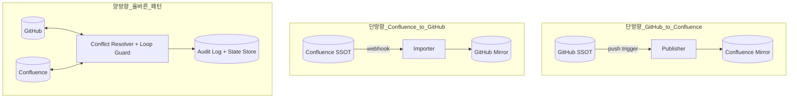
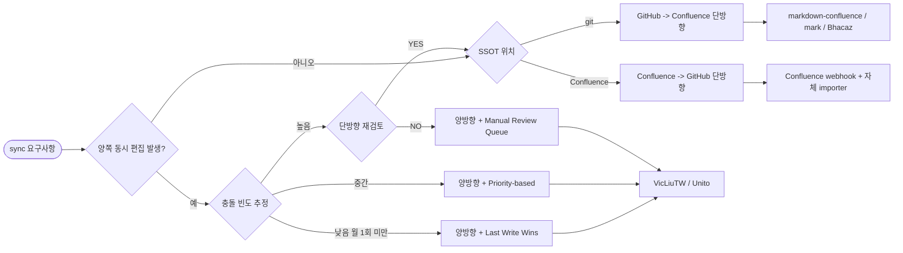

# Confluence ↔ GitHub Sync — Directionality Pattern

## 핵심 요약

Confluence ↔ GitHub 문서 sync에서 가장 먼저 결정해야 할 축은 **방향성**(unidirectional vs bidirectional)이고, 그 결정은 **SSOT 위치**·**충돌 정책**·**도구 선택**을 차례로 정한다. 본 노트는 결정 트리 + 충돌 해결 전략 + 운영 안티패턴을 한 장에 모은 패턴 분석. Tooling 비교는 sibling 노트로 분리.

- **방향성 3가지**: (1) GitHub → Confluence(단방향, 우세), (2) Confluence → GitHub(단방향, 드묾), (3) 양방향(bidirectional, 고난도).
- **결정 트리 핵심 질문 4개**: SSOT는 어디? 양쪽 동시 편집이 발생? 변환 손실 허용 범위? 충돌 빈도 추정?
- **양방향 sync는 "두 개의 단방향 파이프라인"이 아니다** — Stacksync 공식 분석: loop, race, double-update, conflict이 발생해 단순 결합으로는 실패.
- **충돌 해결 4종**: last-write-wins(timestamp) / priority-based(한쪽 우위) / field-level merging / manual review queue. 문서 sync에서는 field-level 적용이 어려워 priority-based + LWW + manual 결합이 현실적.
- **단방향 우세 이유**: 변환 round-trip 손실(macro·panel·embed)이 양방향에서 누적 증폭. 단방향은 SSOT 쪽이 깨끗하게 유지되므로 손실이 한쪽(미러)에만 발생.

## 시스템 아키텍처

세 방향성 패턴이 각각 어떻게 컴포넌트를 배치하는지 보이는 다이어그램. 단방향은 source/sink 분리가 깨끗하지만, 양방향은 두 개의 sync 엔진 대신 **단일 conflict resolver**가 중앙에 있어야 한다 (그렇지 않으면 anti-pattern).

## 처리 흐름

방향성 결정 → SSOT 결정 → 충돌 정책 → 도구 선택의 순서를 따르는 결정 트리. 양방향 분기에서는 충돌 빈도 추정이 추가 분기점.

## 핵심 기능 및 서비스

| 기능 | 설명 |
|---|---|
| SSOT 명문화 | 한쪽 시스템을 "주인"으로 선언하고 반대쪽은 mirror/view. 안 정하면 silent overwrite 발생 |
| Loop guard | 양방향에서 sync 엔진 자신의 변경을 다시 트리거하지 않게 actor 식별 (별도 service account 또는 label) |
| Conflict 정책 | 동시 편집 발생 시 어느 쪽을 살리고 어느 쪽을 보낼지 정의된 룰 |
| Reconciliation | 주기적으로 양쪽 state를 비교해 drift 감지 (webhook 손실 보완) |
| State store | 마지막 sync 시점의 hash/version/timestamp 저장. delta 감지·loop guard·dry-run에 사용 |
| Manual review queue | 자동 해결 불가능한 conflict를 사람이 결정하도록 큐에 적재 |

## 유사 기술 비교

| 항목 | 단방향 GH → Conf | 단방향 Conf → GH | 양방향 | 두 개 단방향(안티) |
|---|---|---|---|---|
| 특징 | docs-as-code, PR/diff 활용 | PM SSOT, 엔지니어 read-only | 양쪽 자유 편집, 충돌 정책 필수 | 두 single-direction job 결합 |
| 장점 | 셋업 간단, 변환 손실 한쪽 | PM/CS 친화 | UX 자유도 최고 | 도구 단순 |
| 단점 | PM이 Confluence 직접 수정 불가 | Storage Format → MD 손실 큼 | 운영 부담 큰, 도구 선택지 적음 | loop·race·double-update 발생 (반드시 실패) |
| 적합 케이스 | engineer SSOT, docs-as-code | 디자인/PRD가 Confluence 중심 | 진짜 양방향 요구 | 없음 |

## 실제 사례

### Stacksync 공식 분석: "Why Two One-Way Pipelines Fail"
Stacksync(데이터 sync SaaS) 공식 블로그에서 양방향 sync를 "단방향 두 개 결합"으로 구성하면 실패하는 원인을 정리. loop(자신 변경 재트리거), race(두 변경이 거의 동시 발생), double-update(같은 페이지가 두 번 업데이트), conflict resolution 미정의가 모두 발생. 결론: 양방향은 단일 엔진 + 충돌 정책 + state store 필수.

### Couchbase XDCR Conflict Resolution (참고 모델)
Couchbase의 cross-datacenter replication은 hybrid logical clock(HLC) 기반 timestamp 비교로 LWW를 결정론적으로 적용. 문서 sync에도 동일한 컨셉을 차용 가능 — 페이지에 last-modified-by/timestamp metadata를 두고 sync 엔진이 비교. 다만 사람이 수정한 직관과 어긋날 수 있다는 LWW의 본질적 한계는 그대로.

### Unito Confluence ↔ GitHub 양방향 통합 (SaaS)
Unito는 GitHub Software와 Confluence를 양방향 sync로 묶는 통합 제품 제공. 필드별 sync direction 설정으로 metadata는 one-way, 본문은 two-way 같이 hybrid 룰 운영. 별도의 conflict resolution 정책 GUI 제공. (단 Unito는 page-level 양방향에 한계 — GitHub Software 객체는 issue/PR 단위이고 본문 Markdown은 별도 처리.)

## 활용 시나리오

### 시나리오 1: 엔지니어 SSOT, PM/CS Confluence read-only (가장 흔함)
컨텍스트 — API spec, runbook, architecture가 git에 있고 PM·CS는 검색·권한 측면에서 Confluence를 선호. → **단방향 GH → Conf**. `markdown-confluence/publish-action` 또는 `Bhacaz/docs-as-code-confluence`. Confluence 페이지 권한을 read-only로 설정하거나 "이 페이지는 git에서 관리됩니다" 배너 매크로 자동 삽입. 손실은 git→Conf 한 방향만 발생하므로 git source는 항상 깨끗.

### 시나리오 2: PRD/디자인 SSOT는 Confluence, 엔지니어 archive용으로 git
컨텍스트 — 프로덕트 사양은 PM이 작성·승인, 엔지니어는 변경 이력을 PR로 보고 싶음. → **단방향 Conf → GH**. Confluence webhook page_updated → 자체 importer → Storage Format/ADF → Markdown 변환 → GitHub repo에 commit 또는 PR 생성. 변환 손실 매트릭스 사전 정의 필수(macro·attachment 손실 정책).

### 시나리오 3: 진짜 양방향 — Hybrid 팀, 충돌 빈도 낮음
컨텍스트 — PM·Eng가 한 페이지를 두 도구에서 편집, 충돌 빈도 월 1회 미만 추정. → **양방향 + Last-Write-Wins**. `VicLiuTW/confluence-markdown-sync` 또는 Unito 사용. last-modified-timestamp 기반 결정론적 해결. 가끔 발생하는 손실은 audit log + Slack 알림으로 사후 복구. 충돌 빈도가 높아지면 단방향으로 회귀하거나 manual review queue 추가.

## 장단점 및 트레이드오프

| 항목 | 내용 |
|---|---|
| 장점 (단방향) | 셋업 1일 내 가능 / 변환 손실 한쪽으로 격리 / SSOT 일관성 명확 / 도구 선택지 많음 |
| 장점 (양방향) | 양쪽 워크플로 자유도 최고 / 강제 도구 통일 없이 협업 가능 |
| 단점 (단방향) | 반대쪽 시스템에서 편집 불가능(또는 silent overwrite) / PM/Eng 한쪽이 불편 |
| 단점 (양방향) | 충돌 정책 정의·운영 부담 큼 / round-trip 손실이 누적 증폭 / 도구 선택지 좁고 가격 높음 / state store·reconciliation 필수 |
| 트레이드오프 | SSOT 일관성 ↔ 양쪽 편집 자유도 / 운영 단순성 ↔ UX 자유도 / 변환 충실도 ↔ 양방향 기능 / 자동화 깊이 ↔ 운영 통제력 |

## 함정 및 안티패턴

- **안티패턴 1: 양방향을 두 개의 단방향 파이프라인으로 구성** — Stacksync의 공식 분석. loop, race, double-update, conflict 미정의 모두 발생. → 진짜 양방향이 필요하면 단일 엔진 + 충돌 정책 + state store. 그게 아니면 단방향으로 단순화.
- **안티패턴 2: SSOT 미정의** — git/Confluence 둘 다 "주인"이라고 주장. → 시작 전 ADR에 SSOT 명문화, 반대쪽 페이지 자동 read-only 또는 배너.
- **안티패턴 3: Last-Write-Wins를 충돌 빈도 무관하게 채택** — 충돌이 잦으면 사용자 직관과 어긋나 데이터 신뢰 손실. → 충돌 빈도 측정 → 높으면 priority-based 또는 manual queue.
- **안티패턴 4: Loop guard 부재** — sync 엔진 자신의 변경이 다시 webhook 트리거 → 무한 loop. → service account `sync-bot` 같은 식별자로 본인 actor 변경은 ignore.
- **안티패턴 5: Reconciliation 없는 webhook 의존** — Confluence webhook은 best-effort라 누락 발생하지만 미감지. → 주기적 reconciliation worker로 양쪽 version/hash 비교, drift 시 alert.
- **안티패턴 6: 변환 손실 사후 발견** — info panel·status macro·custom layout이 round-trip에서 사라짐을 운영 후 발견. → 도입 전 변환 매트릭스(원본 → 변환 결과 → fallback)를 ADR로 작성, 손실 항목 사전 합의.
- **안티패턴 7: 단방향 SSOT 모드에서 반대쪽 직접 수정 허용** — 다음 sync 시 silent overwrite. → 단방향에서는 mirror 쪽 권한을 명시적으로 read-only로 설정.

## 참고 자료

- [The Engineering Challenges of Bi-Directional Sync: Why Two One-Way Pipelines Fail | Stacksync](https://www.stacksync.com/blog/the-engineering-challenges-of-bi-directional-sync-why-two-one-way-pipelines-fail) — 양방향 안티패턴 공식 분석
- [Two-Way Sync Demystified: Key Principles And Best Practices | Stacksync](https://www.stacksync.com/blog/two-way-sync-demystified-key-principles-and-best-practices) — 양방향 sync 원칙
- [Mastering Two-Way Sync: Key Concepts and Implementation Strategies | Stacksync](https://www.stacksync.com/blog/mastering-two-way-sync-key-concepts-and-implementation-strategies) — 구현 전략
- [Conflict Resolution | Couchbase Sync Gateway Docs](https://docs.couchbase.com/sync-gateway/current/conflict-resolution.html) — LWW + revision tree 모델
- [XDCR Conflict Resolution | Couchbase Server Docs](https://docs.couchbase.com/server/current/learn/clusters-and-availability/xdcr-conflict-resolution.html) — Hybrid Logical Clock + LWW
- [What Is a Two-Way Sync? | Noloco Glossary](https://noloco.io/glossary/two-way-sync) — 충돌 해결 4종 분류
- [Why Two-way Sync is Essential for Modern Teams in 2026 | Exalate](https://exalate.com/blog/two-way-synchronization/) — 양방향 도입 판단 기준
- [Confluence GitHub Software Integration | Unito](https://unito.io/integrations/confluence-github/) — 양방향 SaaS 구현 사례
- [Confluence Error 409: Conflict | DrDroid](https://drdroid.io/integration-diagnosis-knowledge/confluence-error-409--conflict) — REST API v2 conflict 처리
- [Lag in updating page version number v2 Confluence REST API | Atlassian Developer Community](https://community.developer.atlassian.com/t/lag-in-updating-page-version-number-v2-confluence-rest-api/68821) — version 갱신 lag 운영 이슈
