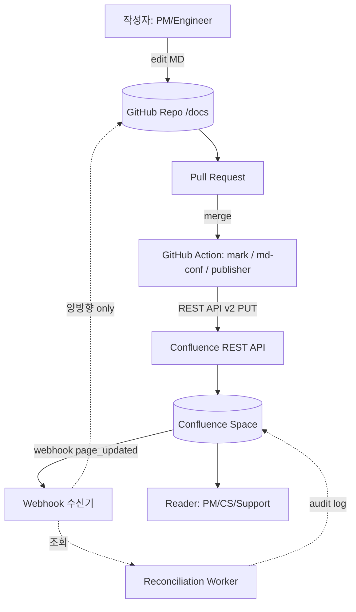
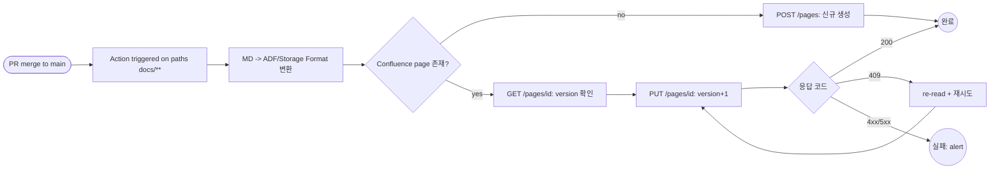

# Confluence ↔ GitHub Document Sync — Overview

## 핵심 요약

동일 문서(주로 Markdown)를 **Confluence**(PM/디자인 친화 WYSIWYG, 권한·검색·매크로)와 **GitHub**(엔지니어 친화, repo 옆 `docs/`, PR/diff/review)에서 동시에 보고/편집할 수 있게 두 시스템을 연결하는 통합 패턴. 본 노트는 단방향·양방향·도구·SSOT 결정 축을 **균형 있게 한 장에 모은 개요**이며, 세부는 sibling 노트 2개로 분리한다.

- **방향성**: GitHub → Confluence(우세, docs-as-code) / Confluence → GitHub(드묾) / 양방향(VicLiuTW, Unito 등 — round-trip 손실·충돌 비용 큼). 결정 트리는 `[[fl-2026-06-08-confluence-github-sync-directionality-pattern]]` 참조.
- **SSOT 위치**: GitHub-SSOT가 엔지니어 워크플로(PR 리뷰, diff, branch)와 정합. Confluence-SSOT는 PM/CS·고객지원이 직접 편집해야 할 때. 양쪽 SSOT는 안티패턴.
- **변환 한계**: Markdown ↔ Confluence Storage Format(XHTML 기반)/ADF 간 변환은 inherently lossy — macro·info panel·status lozenge·embedded layout이 round-trip 손실(`atlassian-mcp-server#161` 등 제안 중).
- **트리거**: GitHub Actions on push/merge(가장 흔함) / Confluence webhook on update(best-effort delivery) / 주기적 polling / REST API reconciliation(audit log polling).
- **공통 제약**: Confluence REST API v2 PUT은 page body 전체 + version+1 의무, 409 Conflict 시 re-read+retry 필요(optimistic locking).

## 시스템 아키텍처

GitHub repo `docs/` 와 Confluence space를 sync 엔진이 연결하는 구조. 단방향(우세)에서는 GitHub가 SSOT, sync 엔진(GitHub Action 또는 CLI)이 Markdown→Storage Format 변환을 담당하고 REST API로 page update. 양방향은 추가로 Confluence webhook 수신기와 reconciliation 워커 필요.

## 처리 흐름

GitHub PR 머지 시점부터 Confluence page가 업데이트되는 흐름. 양방향이면 Confluence 편집 시 webhook 경유로 Git PR 자동 생성(또는 직접 commit) 경로가 추가된다. 핵심은 **409 Conflict 처리**와 **loop guard**.

## 핵심 기능 및 서비스

| 기능 | 설명 |
|---|---|
| 변환 (MD → Storage Format/ADF) | Markdown 문법을 Confluence가 이해하는 XHTML-like 또는 ADF JSON으로 변환. 도구별 변환 품질이 핵심 차별점 |
| Page tree 매핑 | 폴더 구조 → parent page 트리. `docs/auth/login.md` → "auth" parent 아래 "login" child |
| 첨부 자동 업로드 | 이미지·다이어그램(Mermaid)·첨부파일을 Confluence attachment으로 자동 업로드, 본문에서 reference 갱신 |
| Diffing / idempotency | 직전 sync 결과와 비교해 변경된 페이지만 push (불필요한 version 증가 방지). markdown-confluence가 강점 |
| Loop guard | 양방향에서 sync 엔진 자신이 만든 변경을 다시 트리거하지 않도록 actor 식별(service account, label) |
| 권한/공간 라우팅 | YAML/frontmatter로 space-key·parent-page·label 지정. 페이지별 ACL 정책 적용 |
| 충돌 감지 | 동시 편집 시 version 비교, 409 응답 처리, conflict marker 삽입 또는 PR 생성 |

## 유사 기술 비교

| 항목 | Confluence ↔ GitHub sync | GitHub Wiki only | Confluence only | Notion + GitHub |
|---|---|---|---|---|
| 특징 | 두 도구 장점 결합, sync 엔진 매개 | repo 옆 wiki, MD 네이티브 | 단일 SaaS, WYSIWYG | Notion(PM) + GitHub(코드) 분리 |
| 장점 | PM/Eng 양쪽 워크플로 동시 만족 | repo와 한 곳, PR-free 즉시 수정 | 권한·검색·매크로 강력 | Notion 협업 UX 강점 |
| 단점 | 변환 손실, 운영 복잡도 | 권한 모델 약함, 비-개발자 진입장벽 | engineer 워크플로(PR/diff) 부재 | 두 도구 모두 비용·계정 분리 |
| 적합 케이스 | 조직 내 PM·Eng 분리 + 둘 다 강제 못 함 | 100% engineer 팀 OSS 프로젝트 | PM·Sales·CS 중심 enterprise | PM이 Notion 강하게 선호 |

## 실제 사례

### Atlassian 자체 docs (Atlassian Developer Docs)
Atlassian 자체 문서 일부가 GitHub-driven publishing 패턴을 채택. `atlassian-mcp-server` 같은 OSS 프로젝트는 README/docs를 GitHub에 두고 Confluence Cloud에는 별도 미러 또는 link-out 정책 운영. `lossless markdown round-trip for Confluence macros` 이슈(#161)는 양방향 시 macro 손실 문제를 공식 인지한 사례.

### Telefonica markdown-confluence-sync-action
사내 OSS로 공개한 GitHub Action — `docs/` 폴더의 Markdown을 Confluence Cloud로 자동 publish. 사내 다수 팀이 채택했고, 폴더 구조가 Confluence parent page tree로 그대로 매핑되는 docs-as-code SSOT 패턴.

### 일반 OSS 팀의 docs-as-code 패턴 (DEV 커뮤니티 다수)
DEV·Medium·Zenn 등 엔지니어 커뮤니티에서 자주 보고되는 패턴 — README/AsciiDoc/OpenAPI 같은 코드 인접 문서를 git에 두고 PR 워크플로로 review, merge 시 GitHub Action이 Confluence로 publish. PM·고객지원은 Confluence에서 read-only로 조회. SSOT는 항상 git.

## 활용 시나리오

### 시나리오 1: 엔지니어가 SSOT, PM/CS는 Confluence read-only 미러
컨텍스트 — API spec, architecture doc, runbook이 git에 있고 PM·CS는 Confluence 검색·권한 모델에 익숙. → **GitHub → Confluence 단방향 publish**. `markdown-confluence/publish-action` 또는 `Bhacaz/docs-as-code-confluence` GitHub Action 사용. PM이 Confluence에서 직접 수정하지 않도록 "이 페이지는 git에서 관리됩니다" 배너 매크로 자동 삽입. 자세한 도구 비교는 `[[fl-2026-06-08-confluence-github-sync-tools-catalog]]`.

### 시나리오 2: PRD/디자인은 Confluence SSOT, 엔지니어는 read-only diff
컨텍스트 — 프로덕트 기획·디자인 사양은 PM이 Confluence에서 작성·승인하고, 엔지니어는 변경 이력을 PR/diff로 보고 싶음. → **Confluence → GitHub 단방향**. Confluence webhook으로 페이지 변경 감지 → 변환 → GitHub repo에 commit 또는 PR 생성. 변환 손실 허용 범위 정의 필수(macro·attachment 정책).

### 시나리오 3: 양방향(고난도) — 양쪽 동시 편집 허용
컨텍스트 — Hybrid 팀, 한쪽 강제 불가능. → **양방향 sync**. `VicLiuTW/confluence-markdown-sync` 같은 양방향 도구 또는 SaaS(Unito) 사용. 단 round-trip 손실·충돌 비용 큼. 결정 트리 + 충돌 정책은 `[[fl-2026-06-08-confluence-github-sync-directionality-pattern]]` 참조. 운영 안티패턴 회피가 핵심.

## 장단점 및 트레이드오프

| 항목 | 내용 |
|---|---|
| 장점 | PM/Eng 두 워크플로 동시 만족 / git의 review·diff·branch + Confluence의 권한·검색 결합 / 단방향 모드는 셋업 1일 내 가능 / 도구 생태계 풍부 |
| 단점 | 변환 inherently lossy (macro·panel·embed) / 양방향은 충돌·loop 운영 부담 / 도구 lock-in 위험 / Confluence webhook best-effort 보장 부재 |
| 트레이드오프 | 자동화 깊이 ↔ 변환 충실도 / 양방향 편의 ↔ 충돌 복잡도 / SSOT 일관성 ↔ 양쪽 편집 자유도 / 도구 채택 속도 ↔ 운영 통제력 |

## 함정 및 안티패턴

- **안티패턴 1: SSOT 미정의** — git/Confluence 양쪽이 "주인"이라고 주장 → 한쪽에서 수정한 내용이 다음 sync에 silent overwrite. → 시작 전 SSOT 한쪽을 명문화하고 반대쪽 페이지에 "관리 위치" 배너 자동 삽입.
- **안티패턴 2: 양방향을 단방향 + 단방향 두 개로 구성** — Stacksync 사례 ("Why Two One-Way Pipelines Fail"). loop, race, double-update 발생. → 진짜 양방향이 필요하면 conflict resolution을 내장한 단일 엔진 사용, 그게 아니면 단방향으로 단순화.
- **안티패턴 3: Storage Format/ADF 변환 손실 무시** — info panel·status macro가 round-trip에서 사라짐을 운영 후에 발견. → 도입 전 변환 매트릭스(원본 → 변환 결과 → fallback)를 만들고 손실 항목을 ADR로 결정.
- **안티패턴 4: Confluence webhook delivery 보장 가정** — webhook 누락이 발생하지만 미감지. → 주기적 REST API reconciliation worker로 page version 비교, drift 감지 시 alert.
- **안티패턴 5: Loop guard 부재** — sync user의 변경이 다시 webhook 트리거 → 무한 loop. → service account `sync-bot` 같은 식별자로 본인 actor 변경은 ignore.
- **안티패턴 6: 단방향 SSOT 모드에서 PM이 Confluence에서 직접 수정** — 다음 publish 시 sync 엔진이 PM 수정을 silent overwrite. → 배너 매크로 자동 삽입 + Confluence 페이지 권한을 read-only(또는 specific group write-protected)로 설정.

## 참고 자료

- [How to create and maintain a single source of truth | Atlassian Blog](https://www.atlassian.com/blog/confluence/how-to-create-and-maintain-a-single-source-of-truth) — Atlassian 자체 SSOT 가이드
- [Building a true Single Source of Truth (SSoT) for your team | Atlassian Work Management](https://www.atlassian.com/work-management/knowledge-sharing/documentation/building-a-single-source-of-truth-ssot-for-your-team) — Confluence 중심 SSOT 전략
- [Docs as Code Confluence | DEV Community](https://dev.to/bhacaz/docs-as-code-confluence-3121) — docs-as-code 패턴 + 한계 분석
- [Publishing Markdown to Confluence using GitHub Actions | DEV Community](https://dev.to/vearutop/publishing-markdown-to-confluence-using-github-actions-1k4g) — CI/CD 단방향 실전
- [How to upload docs and diagrams to Confluence using GitHub Actions | Naomi Verdult, Medium](https://naomiverdult.medium.com/how-to-upload-docs-and-diagrams-to-confluence-using-github-actions-b44c44a0779a) — 다이어그램·이미지 처리 실전
- [Lossless markdown round-trip for Confluence macros | atlassian/atlassian-mcp-server #161](https://github.com/atlassian/atlassian-mcp-server/issues/161) — round-trip 손실 공식 이슈
- [Confluence vs GitHub Comparison | TrustRadius](https://www.trustradius.com/compare-products/atlassian-confluence-vs-github) — 두 도구 포지셔닝 비교
- [The Engineering Challenges of Bi-Directional Sync | Stacksync](https://www.stacksync.com/blog/the-engineering-challenges-of-bi-directional-sync-why-two-one-way-pipelines-fail) — 양방향 sync 운영 난제
- [Confluence Error 409: Conflict | DrDroid](https://drdroid.io/integration-diagnosis-knowledge/confluence-error-409--conflict) — REST API v2 conflict 처리
- [VicLiuTW/confluence-markdown-sync | GitHub](https://github.com/VicLiuTW/confluence-markdown-sync) — 양방향 sync OSS 예시
