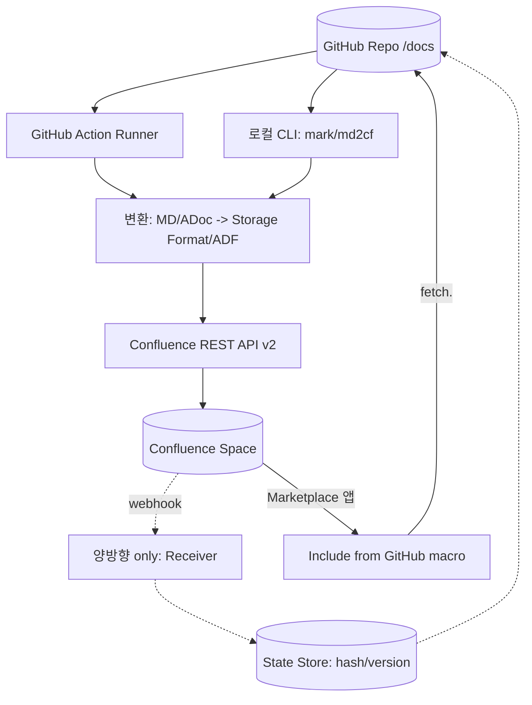
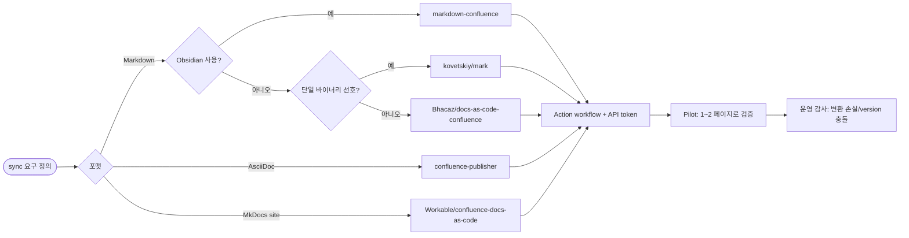

# Confluence ↔ GitHub Sync — Tools Catalog

## 핵심 요약

**Confluence ↔ GitHub 전용 도구만**을 추려 4개 카테고리로 분류한 카탈로그. 직전 노트 `[[fl-2026-06-06-confluence-sync-tools-catalog]]`가 Confluence 중심 **모든 외부 통합**(Notion·Slack·Jira·SaaS 양방향 등 5종)을 다뤘다면, 본 노트는 **양 끝점이 GitHub와 Confluence로 고정**된 케이스에 한정.

- **카테고리 4개**: (1) MD → Conf 단방향 publisher(우세), (2) AsciiDoc → Conf publisher, (3) 양방향 sync OSS, (4) Confluence-side embed(역방향 view).
- **가장 많이 쓰이는 3개**: `kovetskiy/mark` (Go), `markdown-confluence` (TS/npm + Obsidian plugin + GitHub Action), `Bhacaz/docs-as-code-confluence` (GitHub Action).
- **선택 기준 1줄**: AsciiDoc이면 confluence-publisher, MD + 단일 GitHub Action 셋업이면 Bhacaz 또는 markdown-confluence/publish-action, MD + Obsidian 통합이면 markdown-confluence, MD + 강력한 frontmatter metadata와 단일 바이너리면 mark, 진짜 양방향이 필요하면 VicLiuTW.
- **공통 제약**: 모두 Confluence Cloud 우선, Server/DC 지원은 도구별로 상이. Storage Format/ADF 변환 손실은 모든 도구에 공통(macro·panel·embed).

## 시스템 아키텍처

도구가 GitHub repo와 Confluence 사이에 어떻게 자리잡는지. 단방향 publisher는 GitHub Action 또는 로컬 CLI로 실행되며 변환 → REST API 호출이 핵심. 양방향 sync 도구는 추가로 Confluence 쪽에서 변경을 받아오는 경로 + state store 필요.

## 처리 흐름

도구를 선택하고 GitHub Action으로 셋업한 뒤 첫 publish까지의 흐름. 단방향 가정.

## 핵심 기능 및 서비스

| 카테고리 | 대표 도구 | 주요 기능 | 셋업 시간 | 적합 케이스 |
|---|---|---|---|---|
| MD → Conf 단방향 publisher | **kovetskiy/mark**, **markdown-confluence**, **Bhacaz/docs-as-code-confluence**, **Telefonica/markdown-confluence-sync-action**, **md2cf**, **md2conf**, **publish-confluence** | Markdown 폴더 → Confluence page 자동 publish, page tree 매핑, attachment 업로드 | 30분~수 시간 | 엔지니어 SSOT git, Confluence는 mirror |
| AsciiDoc → Conf publisher | **confluence-publisher/confluence-publisher** (Maven/Docker), **nomisp gradle plugin** | AsciiDoc → Confluence, Maven/Gradle 빌드 통합 | 1~2 시간 | Java 프로젝트, AsciiDoc 표준 사용 |
| 양방향 sync OSS | **VicLiuTW/confluence-markdown-sync**, **phoorichet/confluence-sync** | Confluence ↔ MD 양방향, 충돌 감지, 이미지/version 관리 | 반나절~1일 | 양방향 + OSS 선호 + 충돌 빈도 낮음 |
| Confluence-side embed | **Include from GitHub to Confluence** (Marketplace 앱) | Confluence에서 GitHub 파일/gist/issue/PR 매크로로 실시간 표시 | 30분 | 코드 옆 문서를 Confluence에서 view-only 임베드 |

### 카테고리별 세부 비교

#### 1. MD → Conf 단방향 publisher (가장 많이 쓰임)

- **kovetskiy/mark (Go)**: Apache 2.0. Homebrew/Go install/Docker/binary. HTML-style comment metadata(`<!-- Space: X -->`, `Parent`, `Title`, `Attachment`, `Label`, `Image-Align`) frontmatter 대체. goldmark parser 기반. Confluence Cloud + Server/DC 모두 지원. 단일 바이너리라 GitHub Action runner에 쉽게 통합.
- **markdown-confluence (TS/npm)**: `@markdown-confluence/lib` + `markdown-confluence-cli` + `publish-action` GitHub Action + Obsidian integration plugin + Docker. Cloud 전용. Wikilinks/이미지/Mermaid 자동 변환/comment preserving/diffing(불필요 업로드 회피). **Obsidian + Confluence 워크플로의 사실상 표준**. ADF JSON 직접 생성하므로 변환 충실도 높음.
- **Bhacaz/docs-as-code-confluence (GitHub Action)**: 폴더 sync 중심. inputs: `folder`, `username`, `password`, `confluence-base-url`, `space-key`, `parent-page-id`. 각 폴더가 parent page로, 각 MD 파일이 child page로 매핑. 셋업 가장 빠름(README 한 페이지 분량 workflow).
- **Workable/confluence-docs-as-code**: MkDocs 프로젝트 전용 GitHub Action. `mkdocs.yml` 구조를 그대로 Confluence parent page tree에 반영.
- **Telefonica/markdown-confluence-sync-action**: Telefonica 사내 OSS. Markdown 폴더 sync GitHub Action. 사내 다수 팀에서 검증.
- **md2cf (PyPI)**, **md2conf (hunyadi)**, **markdown-to-confluence (PyPI)**: Python alternative. CLI + library 형태. Python CI/CD 인프라가 있는 팀에 적합.
- **publish-confluence (GitHub Marketplace)**: 추가 GitHub Action 옵션.

#### 2. AsciiDoc → Conf publisher

- **confluence-publisher/confluence-publisher (Maven plugin + Docker)**: AsciiDoc 표준 채택 프로젝트(Java/Spring 진영 다수)용 공식 publisher. Docker 이미지 제공하여 GitHub Action 또는 로컬 빌드 어디서나 동작. Confluence Cloud + Server/DC 모두 지원.
- **nomisp gradle plugin (confluence-publisher-plugin)**: 위 Maven plugin의 Gradle 포팅. Gradle 빌드 통합.
- **bsorrentino/maven-confluence-plugin**, **buildit/confluence-maven-plugin**, **lucapino/confluence-maven-plugin**: 비공식 Maven 대안.

#### 3. 양방향 sync OSS

- **VicLiuTW/confluence-markdown-sync**: bidirectional sync, automatic conflict detection, image handling, version history management. Confluence Cloud 지원. "Confluence 페이지를 MD로 pull → AI 도구로 편집 → 다시 push"의 워크플로를 명시적으로 지원.
- **phoorichet/confluence-sync**: bidirectional sync + profile management + configuration. 비교적 신규 OSS.

#### 4. Confluence-side embed (역방향 view)

- **Include from GitHub for Confluence (Marketplace 앱)**: GitHub repo의 파일·gist·issue·PR을 Confluence 매크로로 직접 임베드. MD는 자동 HTML 렌더, K15t Scroll Viewport 호환. **sync가 아니라 view-thru** — Confluence에서 GitHub 콘텐츠를 실시간으로 보여줌. 페이지 동기화는 아니지만 "code 옆 README를 Confluence에서 보기" 같은 경량 use case에 적합.

## 유사 기술 비교

| 항목 | mark (kovetskiy) | markdown-confluence | Bhacaz docs-as-code | confluence-publisher | VicLiuTW (양방향) |
|---|---|---|---|---|---|
| 언어/런타임 | Go binary | Node.js/TS | Docker GitHub Action | Maven/Docker | Python |
| 포맷 | Markdown | Markdown (Obsidian dialect 지원) | Markdown | **AsciiDoc** | Markdown |
| 방향성 | 단방향 (MD → Conf) | 단방향 | 단방향 | 단방향 | **양방향** |
| Confluence Cloud | O | O | O | O | O |
| Confluence Server/DC | O | X (Cloud only) | 일부 | O | 명시 X |
| Obsidian 통합 | X | **O (공식 플러그인)** | X | X | X |
| Mermaid/이미지 자동 처리 | 부분 | **강력** | 부분 | 부분 | 부분 |
| Diffing/idempotency | 일부 | **강력** | 일부 | 일부 | 충돌 감지 |
| Metadata 위치 | HTML comment | frontmatter | Action inputs | 파일 헤더 | frontmatter |
| 셋업 난이도 | 낮음 | 중간 | **가장 낮음** | 중간 | 중간 |
| 라이선스 | Apache 2.0 | MIT 등 OSS | MIT | Apache 2.0 | OSS |

## 실제 사례

### Telefonica — markdown-confluence-sync-action 사내 도입
Telefonica가 사내 다수 팀 docs-as-code 워크플로를 위해 자체 GitHub Action을 OSS 공개. `docs/` 폴더의 MD를 Confluence Cloud로 자동 publish, 폴더 구조 = Confluence page tree. 사내 표준화 사례로 외부에도 활발히 사용.

### Atlassian 자체 — atlassian-mcp-server
Atlassian 공식 MCP Server 프로젝트가 자체 docs 일부를 Markdown으로 git에 두고 Confluence와 연결하는 과정에서 `lossless markdown round-trip for Confluence macros` 이슈(#161)를 명시적으로 다루는 중. Atlassian 자체도 양방향 lossless를 어렵게 본다는 신호.

### Obsidian 커뮤니티 — markdown-confluence Obsidian Plugin
Obsidian 노트테이커 다수가 개인 vault → Confluence 팀 space 단방향 publish용으로 채택. wikilinks/Mermaid/embed 변환이 강점이라 노트 작성 도구로 Obsidian, 팀 공유는 Confluence라는 hybrid 패턴이 자리잡힘.

### Java/Spring 진영 — confluence-publisher
Java/Spring Boot 프로젝트가 표준적으로 AsciiDoc을 채택하는 만큼, `mvn deploy` 흐름에 confluence-publisher를 끼워 빌드 산출물의 문서를 Confluence에 자동 publish하는 패턴이 일반적. Docker 이미지로 GitHub Action runner에서도 그대로 동작.

### DEV 커뮤니티 다수 — Bhacaz/docs-as-code-confluence
DEV/Medium/Zenn 등 기술 블로그에서 가장 자주 인용되는 GitHub Action. README 한 페이지 분량으로 셋업 완료. "어떻게 시작할지 모르겠으면 일단 Bhacaz로 PoC, 이후 mark/markdown-confluence로 마이그레이션" 패턴이 흔함.

## 활용 시나리오

### 시나리오 1: Markdown docs-as-code 최단 셋업
컨텍스트 — repo `docs/` 폴더의 MD를 Confluence로 자동 publish, 셋업 시간 최소화. → **Bhacaz/docs-as-code-confluence**. workflow에 GitHub Action 한 블록 + Confluence API token secret 추가, 1시간 내 첫 publish. PoC 검증 후 운영 기능 추가가 필요하면 mark/markdown-confluence로 이전.

### 시나리오 2: Obsidian vault → Confluence 팀 space
컨텍스트 — 개인은 Obsidian으로 작성, 팀 공유는 Confluence. → **markdown-confluence Obsidian plugin** + `publish-action` GitHub Action. wikilinks·Mermaid·embedded image가 깨지지 않고 ADF로 변환, comment-preserving으로 Confluence 쪽 댓글 보존, diffing으로 불필요한 version 증가 회피.

### 시나리오 3: AsciiDoc 표준 Java 프로젝트
컨텍스트 — Spring Boot/Java 프로젝트, AsciiDoc으로 SDK 문서 작성. → **confluence-publisher** Maven plugin. `mvn confluence-publish` 또는 GitHub Action에서 Docker 이미지 호출. 빌드 산출물에 문서 publish를 끼워넣어 release flow와 통합.

### 시나리오 4: 양방향 — Hybrid 팀, 충돌 빈도 낮음, OSS 선호
컨텍스트 — PM·Eng가 한 페이지를 두 도구에서 편집, SaaS는 비용/lock-in 회피. → **VicLiuTW/confluence-markdown-sync**. last-modified-timestamp 기반 LWW + 이미지 자동 처리 + version history. 충돌 정책 결정은 `[[fl-2026-06-08-confluence-github-sync-directionality-pattern]]` 참조. 충돌이 잦아지면 단방향으로 회귀.

### 시나리오 5: 강력한 단일 바이너리 + 멀티 OS CI 환경
컨텍스트 — 다양한 CI 환경(GitHub Actions/Drone/GitLab CI/로컬)에서 같은 publish 도구를 쓰고 싶음. → **kovetskiy/mark**. Go single binary로 OS 무관 실행, HTML-style metadata로 페이지별 fine-grained 제어, Homebrew/Docker 모두 제공.

### 시나리오 6: code 옆 README/예제를 Confluence에서 view-only 표시
컨텍스트 — engineer의 README는 git에 그대로 두고, PM/CS가 Confluence에서 검색·참조만 가능하면 됨. publish는 부담. → **Include from GitHub for Confluence Marketplace 앱**. Confluence 페이지에 매크로 한 줄 삽입하면 GitHub MD가 실시간 렌더. sync가 아니므로 변환 손실·충돌 무관.

## 장단점 및 트레이드오프

| 항목 | 내용 |
|---|---|
| 장점 | 4개 카테고리로 GitHub ↔ Confluence 거의 모든 use case 커버 / 각 카테고리에 검증된 OSS 다수 / GitHub Action 생태계로 셋업 1일 이하 가능 / Obsidian·MkDocs·AsciiDoc 등 인접 도구 통합 강함 |
| 단점 | 양방향 OSS는 SaaS만큼 안정적이지 않음 / Server/DC 지원이 도구별로 상이 / Storage Format/ADF 변환 손실은 모든 도구 공통 / 도구 중복 채택 시 누가 어느 페이지를 다루는지 모호 |
| 트레이드오프 | 셋업 속도(Bhacaz) ↔ 변환 충실도(markdown-confluence) / 단일 바이너리(mark) ↔ 강력한 변환(markdown-confluence) / OSS 자유도 ↔ SaaS 안정성 / Cloud-only ↔ Server/DC 호환 |

## 함정 및 안티패턴

- **안티패턴 1: 도구 카테고리 혼용 무계획** — 같은 페이지를 mark + Bhacaz가 동시에 publish → version 충돌 + double-update. → 페이지별로 한 도구만, source-of-truth 매트릭스 작성.
- **안티패턴 2: Confluence Server/DC 환경에서 Cloud-only 도구 채택** — markdown-confluence 같이 Cloud 전용 도구를 Server/DC에 채택하다 호환 불가 발견. → 도입 전 Confluence deployment type 확인하고 도구 호환 매트릭스 점검.
- **안티패턴 3: API token을 workflow에 평문 하드코딩** — 사고 시 token 노출. → GitHub Secrets로 분리(`ATLASSIAN_API_TOKEN` 등 표준 이름).
- **안티패턴 4: Bhacaz로 시작했다가 운영 기능 부족으로 burnout** — diffing/idempotency가 약해 매번 전체 page 재업로드, version 폭증. → 운영 phase 진입 시 markdown-confluence 또는 mark로 마이그레이션, 운영 시작 전 diffing 지원 도구로 PoC.
- **안티패턴 5: AsciiDoc 프로젝트에 MD 도구 채택** — AsciiDoc → MD 변환 후 다시 Confluence로 가는 이중 변환 발생, 손실 증폭. → AsciiDoc은 confluence-publisher 직행.
- **안티패턴 6: 양방향 OSS를 SaaS 수준으로 신뢰** — VicLiuTW 같은 OSS는 충돌 빈도가 높아지면 안정성·복구 기능 부족. → 충돌 빈도 측정 → 높으면 SaaS(Unito) 또는 단방향 회귀.
- **안티패턴 7: Marketplace embed 앱을 sync로 착각** — Include from GitHub 매크로는 view-only이지 sync가 아님. PM이 Confluence에서 수정해도 git에 반영 안 됨. → 정책 명확화: embed는 view-only, sync가 필요하면 GitHub Action publisher.

## 참고 자료

- [kovetskiy/mark | GitHub](https://github.com/kovetskiy/mark) — Go 단일 바이너리 MD → Confluence
- [kovetskiy/mark | DeepWiki](https://deepwiki.com/kovetskiy/mark) — 내부 처리 파이프라인 분석
- [markdown-confluence | 공식 문서](https://markdown-confluence.com/) — npm/CLI/Obsidian/Docker/GitHub Action 통합
- [@markdown-confluence/lib | npm](https://www.npmjs.com/package/@markdown-confluence/lib) — 핵심 라이브러리 패키지
- [markdown-confluence/publish-action | GitHub](https://github.com/markdown-confluence/publish-action) — GitHub Action wrapper
- [markdown-confluence/obsidian-integration | GitHub](https://github.com/markdown-confluence/obsidian-integration) — Obsidian plugin
- [Bhacaz/docs-as-code-confluence | GitHub](https://github.com/Bhacaz/docs-as-code-confluence) — 폴더 → Confluence page tree GitHub Action
- [Docs as Code - Confluence | GitHub Marketplace](https://github.com/marketplace/actions/docs-as-code-confluence) — Bhacaz Marketplace 페이지
- [Workable/confluence-docs-as-code | GitHub](https://github.com/Workable/confluence-docs-as-code) — MkDocs 전용 publisher
- [Telefonica/markdown-confluence-sync-action | GitHub](https://github.com/Telefonica/markdown-confluence-sync-action) — Telefonica 사내 OSS GitHub Action
- [confluence-publisher/confluence-publisher | GitHub](https://github.com/confluence-publisher/confluence-publisher) — AsciiDoc Maven plugin + Docker
- [Confluence publisher Gradle plugin user guide | nomisp](https://nomisp.github.io/confluence-publisher-plugin/index/user-guide.html) — Gradle 포팅
- [hunyadi/md2conf | GitHub](https://github.com/hunyadi/md2conf) — Python publisher
- [md2cf | PyPI](https://pypi.org/project/md2cf/) — Python CLI publisher
- [markdown-to-confluence | PyPI](https://pypi.org/project/markdown-to-confluence/) — Python alternative
- [VicLiuTW/confluence-markdown-sync | GitHub](https://github.com/VicLiuTW/confluence-markdown-sync) — 양방향 sync + 충돌 감지
- [phoorichet/confluence-sync | GitHub](https://github.com/phoorichet/confluence-sync) — 양방향 sync OSS
- [Include from GitHub for Confluence (Markdown, AsciiDoc) | Atlassian Marketplace](https://marketplace.atlassian.com/apps/1228981/include-github-for-confluence-markdown-asciidoc-plantuml) — view-only embed 매크로
- [publish-confluence | GitHub Marketplace](https://github.com/marketplace/actions/publish-confluence) — 추가 GitHub Action 옵션
- [Lossless markdown round-trip for Confluence macros | atlassian/atlassian-mcp-server #161](https://github.com/atlassian/atlassian-mcp-server/issues/161) — Atlassian 공식 round-trip 손실 이슈
