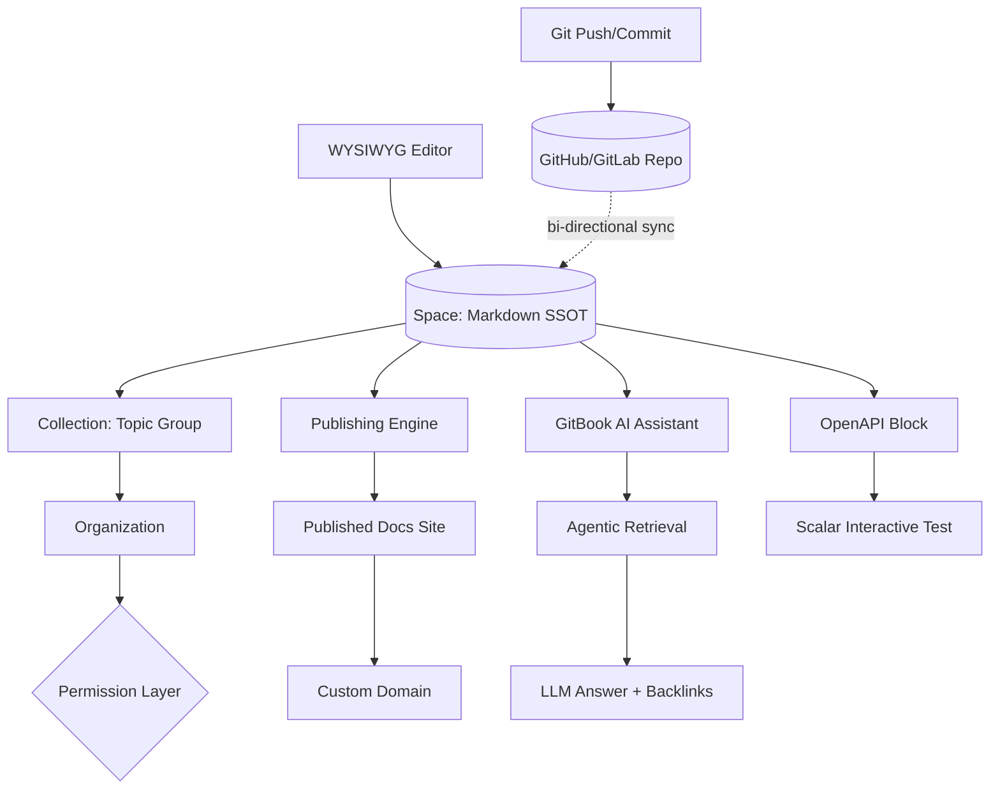
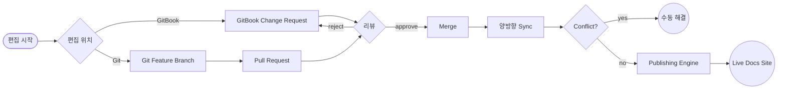

# GitBook

## 핵심 요약

GitBook은 **Markdown 기반의 문서·지식베이스 SaaS 플랫폼**으로, 제품 문서·API 레퍼런스·내부 위키·개발자 포털을 협업으로 작성·호스팅하는 도구다. 2014년 Aaron O'Mullan·Samy Pesse가 프랑스 Lyon에서 오픈소스 CLI(`gitbook-cli`)로 출발했으나 이후 SaaS 중심으로 사업 모델을 전환했고, 현재 OSS 버전은 `legacy` 브랜치로 deprecated 상태다. 2026년 기준 자사를 "the knowledge layer for AI"로 포지셔닝하며, AI Agent·Assistant·MCP 지원 등 LLM 친화 기능을 핵심 차별화로 내세운다.

- **양방향 Git Sync (bi-directional)** — GitHub/GitLab repo의 `.md` 파일과 GitBook space를 실시간 동기화. Engineer는 PR로, technical writer는 WYSIWYG 에디터로 동시에 편집 가능.
- **AI-native 문서화** — GitBook Assistant는 agentic retrieval 기반 (이전 버전은 RAG keyword extraction). 사용자 질문에 자연어로 답하고 관련 페이지 backlink 제공.
- **SaaS-only, self-host 불가** — closed-source 독점 플랫폼. 데이터 잔류(data residency) 요구가 있는 규제 산업·내부망 환경에는 부적합.
- **Spaces / Collections / Organizations 3-tier 구조** + 4-level 권한 (organization → site → collection → space) inheritance 모델.
- **OpenAPI 자동 문서화** — Swagger 2.0 / OpenAPI 3.0 spec 업로드 시 API reference 페이지 자동 생성 + Scalar 기반 "try it" interactive testing.

## 시스템 아키텍처

GitBook은 **content store (spaces/collections) + Git mirror + publishing layer + AI layer** 4계층으로 구성된다. 사용자는 WYSIWYG 에디터로 편집하지만 내부 모델은 Markdown SSOT를 유지하고, Git Sync를 통해 외부 repo와 양방향 mirror된다.

## 처리 흐름

전형적인 docs-as-code 워크플로는 GitBook 브랜치 또는 Git 브랜치 어느 쪽에서 시작해도 동일하게 review → merge → 양방향 sync → publish로 수렴한다.

## 핵심 기능 및 서비스

| 기능 | 설명 |
|---|---|
| Git Sync | GitHub/GitLab repo와 양방향 동기화. branch 단위 매핑, change request → commit 매핑. 첫 sync 시 방향(GitBook → Git 또는 Git → GitBook) 선택. |
| WYSIWYG Editor | block-based 에디터. 비기술 사용자가 PM·support·writer 역할로 참여 가능. 코드블록·이미지·임베드·callout 등 rich block 지원. |
| GitBook Assistant | agentic retrieval LLM. 문서 사이드바·임베드 위젯으로 노출. 페이지 context·이전 대화 기억. MCP 지원으로 외부 agent 통합. |
| GitBook AI Agent | 제품·사용자 데이터 학습 후 문서 변경 suggestion 자동 생성. Pro/Enterprise 한정. |
| OpenAPI 자동 문서화 | Swagger 2.0 / OpenAPI 3.0 spec 업로드 → API reference 자동 생성. 6시간마다 자동 update check. Scalar 기반 try-it. |
| Spaces & Collections | space = 단일 문서 단위. collection = space 그룹. site = 1+ space 묶음으로 published unit. |
| Permission Inheritance | organization → site → collection → space 4-level. 기본값 `inherit`. member는 모든 level 권한의 union 중 highest role 적용. |
| Adaptive Content | 사용자 segment별로 컨텐츠 분기. login user / role / referrer 기반 변형. Enterprise 한정. |
| Export | PDF·ePub 오프라인 export 지원. 단 실시간 작업은 인터넷 필수 (offline editing 미지원). |

## 유사 기술 비교

| 항목 | GitBook | Confluence | Notion | Mintlify |
|---|---|---|---|---|
| 특징 | Developer-focused 문서 SaaS, Git sync 강점 | Atlassian 생태계 통합 enterprise wiki | block-based 범용 workspace | AI-native developer docs (MDX 기반) |
| 장점 | 양방향 Git sync, OpenAPI 자동화, AI Assistant 성숙도 | Jira 연동 unmatched, 권한·governance 풍부 | 유연성 최강 (DB·wiki·project 통합) | MDX 자유도 높음, dev-first UX |
| 단점 | SaaS-only, 가격 가파른 jump, sync conflict 빈도 | UX 무겁고 외부 publishing 약함 | 외부 docs 사이트 publishing 빈약 | knowledge-base/내부 위키 용도 부적합 |
| 적합 케이스 | 제품 외부 docs + API reference + 개발자 협업 | Atlassian 사용 enterprise 내부 위키 | 스타트업 all-in-one 워크스페이스 | OSS·SaaS 제품의 개발자 전용 docs |

## 실제 사례

### Linear
GitBook customer page에 핵심 사례로 등재. 외부 사용자 대상 product docs를 GitBook으로 운영하며 dev팀의 Git workflow와 docs publishing을 연결.

### Snyk
공식 user-docs를 GitBook으로 운영하며 GitHub repo(`snyk/user-docs`)에 Markdown SSOT 보관. 양방향 sync 모델로, 대규모 업데이트는 GitBook 측에서 수행하는 정책을 채택.

### Red Hat
오픈소스·엔터프라이즈 양쪽 프로젝트의 docs site에 GitBook 활용. 다국어 sub-space + collection 구조로 권한 분리.

### 한국 PostgreSQL 사용자 모임 / OSGeo 한국어 지부
오픈소스 매뉴얼 협업 도구로 사용. 다수 contributor가 동일 space에서 chapter 단위 분담.

## 활용 시나리오

### 시나리오 1: 제품 외부 docs + API reference 통합 운영
SaaS 제품이 user guide(비개발자 대상)와 API reference(개발자 대상)를 동일 도메인 아래 운영해야 할 때 적합. user guide는 WYSIWYG로 PM·support가 직접 편집하고, API reference는 백엔드 repo의 OpenAPI spec을 GitBook이 자동 fetch (6시간 주기)하여 동기화한다. Scalar try-it block으로 사용자가 페이지 내에서 API 호출 테스트까지 수행. Stripe·Snyk·Linear가 이 패턴.

### 시나리오 2: docs-as-code 양방향 워크플로
엔지니어는 PR 리뷰 흐름 안에서 Markdown 수정 + 코드 변경을 한 PR로 묶고 싶고, 동시에 technical writer는 WYSIWYG으로 편집하고 싶을 때. GitBook의 양방향 Git Sync는 두 흐름을 한 branch에 수렴시키되, change request(GitBook 측)와 PR(Git 측)을 1:1 매핑한다. 단 양쪽 동시 편집 시 merge conflict가 자주 발생하므로, "Git push은 release 시점에만 / 일상 편집은 GitBook"처럼 채널 분리 정책이 권장된다.

### 시나리오 3: AI 시대의 knowledge layer
제품 내부에 AI 챗봇을 embed하고, 그 챗봇이 docs 기반 질의응답을 수행해야 할 때. GitBook Assistant는 agentic retrieval로 사용자의 현재 페이지·이전 대화 context까지 활용하여 답변하며, MCP를 통해 외부 LLM agent가 GitBook docs를 도구로 호출할 수 있다. 별도 RAG 파이프라인·vector DB 구축 없이 docs SaaS 한 곳에서 retrieval + answer가 완결됨.

## 장단점 및 트레이드오프

| 항목 | 내용 |
|---|---|
| 장점 | (1) 양방향 Git Sync — engineer와 writer가 같은 SSOT 위에서 협업. (2) OpenAPI 자동 문서화 + Scalar try-it 통합. (3) AI Assistant·Agent 성숙도(2026년 기준 SaaS docs 중 최상위). (4) WYSIWYG으로 비개발자 진입 장벽 낮음. (5) Spaces/Collections/Org permission inheritance가 명료. |
| 단점 | (1) SaaS-only — 데이터 잔류·내부망·on-prem 요구 환경 부적합. (2) 가격 가파른 단계: free → Premium $65/mo, Plus $10/user/mo. AI Agent 활성화 시 5인 팀 기준 ~$297/mo. (3) GitHub-to-GitBook sync conflict 빈번. 수동 해결 필요. (4) 검색은 큰 문서 사이트에서 약하다는 평가. (5) offline editing 불가, 인터넷 필수. (6) deep 커스터마이징·자체 layout 자유도 낮음. |
| 트레이드오프 | "managed docs SaaS의 편의성 ↔ self-host·full-control의 자유" 트레이드오프 위 끝에 위치. Confluence(enterprise governance) ↔ Docusaurus/Fern(full control OSS) 사이에서 SaaS 편의성 + Git sync 양쪽 모두를 원하는 use case에 fit. 단 vendor lock-in과 가격 변동 위험은 사용자 불만으로 지속 제기되는 항목. |

## 함정 및 안티패턴

- **안티패턴 1**: 내부망·regulated industry에서 GitBook을 SSOT로 채택 → 데이터 residency 요구 위반 가능, sensitive 정보 외부 SaaS에 상주. → **대안**: 내부 위키는 Confluence·self-hosted Outline·BookStack 사용, 외부 공개 docs만 GitBook으로 분리.
- **안티패턴 2**: GitBook과 Git repo 양쪽에서 동시 편집을 무제한 허용 → sync conflict 누적, 수동 해결 부담. → **대안**: "일상 편집 = GitBook only, repo 직접 commit = release / 대규모 refactor 시점만" 같은 채널 분리 정책 운영.
- **안티패턴 3**: 페이지 수 수백 단위로 늘어난 후 검색 만족도에 의존 → 내장 search 한계로 사용자 이탈. → **대안**: GitBook Assistant(AI 검색) 활성화하거나 Algolia DocSearch·Inkeep 같은 외부 검색 통합.
- **안티패턴 4**: 가격 변동 무시한 채 free tier에 의존한 production docs 운영 → 갑작스러운 paywall 이동으로 운영 중단 위험. → **대안**: 도입 단계에서 multi-year 비용 모델링, exit plan(Markdown export → 타 플랫폼 마이그레이션 경로) 사전 검증.
- **안티패턴 5**: deprecated된 OSS GitBook(`GitbookIO/gitbook` legacy 브랜치)을 신규 프로젝트에 채택 → 보안 패치·기능 업데이트 없음. → **대안**: 신규 OSS 정적 문서는 Docusaurus·VitePress·MkDocs 등 활발한 OSS로, SaaS docs가 필요하면 현행 GitBook.com을 사용.

## 참고 자료

- [GitBook 공식 사이트 — knowledge layer for AI](https://www.gitbook.com/) — 2026년 현 포지셔닝과 핵심 기능 entry point
- [GitBook Documentation — Git Sync (GitHub/GitLab)](https://gitbook.com/docs/getting-started/git-sync) — 양방향 sync 아키텍처 공식 설명
- [GitBook Documentation — Permissions and Inheritance](https://gitbook.com/docs/collaboration/member-management/permissions-and-inheritance) — 4-level 권한 모델 공식 reference
- [GitBook Documentation — GitBook Assistant (Agentic Retrieval)](https://gitbook.com/docs/ai-and-search/gitbook-ai-assistant) — AI 검색·답변 메커니즘
- [GitBook Documentation — OpenAPI Integration](https://gitbook.com/docs/api-references/openapi) — Swagger/OpenAPI 자동 문서화 사양
- [GitbookIO/gitbook (legacy) — GitHub](https://github.com/GitbookIO/gitbook) — deprecated OSS CLI 저장소
- [GitBook vs Confluence vs Notion (eesel AI, 2026)](https://www.eesel.ai/blog/confluence-vs-notion-vs-gitbook) — 3-way 비교 분석
- [GitBook vs Mintlify (GitBook Blog, 2026)](https://www.gitbook.com/blog/gitbook-vs-mintlify) — developer docs 영역 직접 비교 (vendor 작성이라 편향 주의)
- [GitBook Pricing Breakdown (Ferndesk, 2026)](https://ferndesk.com/blog/gitbook-pricing) — 2026년 기준 plan 구조·실비용 분석
- [GitBook Reviews (G2)](https://www.g2.com/products/gitbook/reviews) — 사용자 평가·실제 단점 사례
