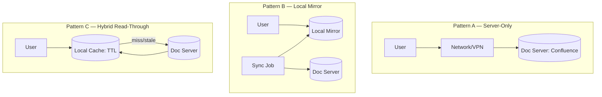

# 정책 문서의 서버-로컬 이중 저장 전략

## 핵심 요약

공용 정책 문서를 서버 단독으로 두느냐, 사용자 로컬에도 사본을 두느냐는 **agent latency·offline 작업·권한·VPN 제약**을 어떻게 다루느냐의 trade-off다. AI 에이전트(Claude Code, Codex 등)가 매 호출마다 서버 API에 의존하면 latency·rate-limit·인증 갱신·VPN 단절에 취약하다 — 로컬 캐시가 그 비용을 흡수한다. 다만 로컬 사본은 **stale risk**라는 새 문제를 만든다.

- **3-가지 패턴**: server-only / local-mirror / hybrid(read-through cache).
- **결정 기준**: 문서 변경 빈도, agent 호출 빈도, offline 작업 비중, 권한 변경 빈도, 보안 등급.
- **권장 default**: hybrid + TTL 기반 lazy refresh + 명시적 force-sync 명령.
- **보안 경계선**: 권한 등급별 정책 — public/internal은 로컬 허용, restricted/secret은 서버 단독.

## 패턴 비교 다이어그램

## 3-패턴 trade-off 매트릭스

| 항목 | A. Server-Only | B. Local Mirror | C. Hybrid (read-through) |
|---|---|---|---|
| 최신성 | 매우 강함 | 약함 (sync 주기 의존) | 강함 (TTL 내) |
| Offline 가용 | ✗ | ✓ | partial |
| Agent latency | 높음 | 매우 낮음 | 첫 호출만 높음 |
| 권한 일관성 | 강함 (서버가 권위) | 약함 (sync 시점 권한) | 중간 |
| 보안 (유출 위험) | 낮음 | 높음 (디스크 사본) | 중간 |
| 운영 복잡도 | 낮음 | 중간 (sync job 필요) | 높음 (캐시 무효화) |
| VPN/네트워크 의존 | 매우 강함 | 없음 | 첫 호출만 |
| 저장 비용 | 0 | 큼 (전체 미러) | 중간 (hot doc만) |

## 결정 매트릭스 — 어떤 패턴을 고를까

| 조건 | 권장 패턴 | 근거 |
|---|---|---|
| 변경 빈도 일/주 단위 | A 또는 C (짧은 TTL) | stale risk 회피 |
| 변경 빈도 분기 단위 | B 또는 C (긴 TTL) | 캐시 효용 큼 |
| Offline 작업 다수 | B | 네트워크 단절 시 0-tolerance |
| Agent 호출 ≥ 분당 10회 | B 또는 C | 서버 부하 + latency |
| 보안 등급 restricted | A | 디스크 유출 방지 |
| 권한 자주 변경 | A 또는 C (짧은 TTL) | 권한 회수 즉시 반영 |
| 다국가/VPN 환경 | B 또는 C | VPN 단절 fault tolerance |

## 권한·보안 등급별 매핑

| 등급 | 로컬 저장 | 패턴 | 부가 통제 |
|---|---|---|---|
| public | 허용 | B/C | 없음 |
| internal | 허용 | C (default) | TTL ≤ 24h |
| confidential | 조건부 | C 권장 | TTL ≤ 1h + 암호화 + 권한 재검증 |
| restricted | 금지 | A 강제 | 항상 서버 직접 조회 |

## 실제 사례

### Git 기반 docs repo + clone
오픈소스 진영의 표준. clone = 로컬 mirror(패턴 B), `git pull` = 명시적 sync. CLAUDE.md·Cursor rules 같은 agent 컨텍스트도 동일 패턴. 변경 빈도 낮은 정책 문서에 적합.

### Notion offline cache
공식 데스크탑 앱의 offline mode. 패턴 C — 로컬 SQLite 캐시 + 네트워크 복귀 시 자동 sync. 단 권한 변경 반영이 지연되어 보안 사고 가능성 보고됨.

### Confluence Server vs Cloud
Server(self-host)는 사실상 패턴 A. Cloud는 모바일 앱에서 selective offline(패턴 C). 정책 문서가 cloud에 있고 agent가 잦은 조회 시 hybrid가 필요.

### AWS SSM Parameter Store + local cache
config 도메인 사례. 로컬 캐시 + TTL + force refresh CLI. 본 패턴 C의 reference 구현.

## 활용 시나리오

### 시나리오 1: Confluence + Claude Code agent
agent가 정책 문서를 자주 참조. server-only면 매 호출마다 API rate-limit + latency. 해결: 로컬 vault에 mirror(패턴 B), 주간 sync. 권한 etag 검증은 별도 노트.

### 시나리오 2: 영업팀 출장 환경
VPN 불안정. 정책 문서 조회 빈도 높음. server-only면 출장 중 작업 마비. 해결: 패턴 B — 출발 전 force sync, offline 작업 후 복귀 시 충돌 검토.

### 시나리오 3: 권한 회수 즉시 반영 요구
보안 사고로 사용자 권한 박탈. 로컬 mirror가 있으면 디스크에 잔존. 해결: confidential 등급은 패턴 C 강제 + TTL 짧게 + 권한 재검증 hook.

## 장단점 및 트레이드오프

| 항목 | 내용 |
|---|---|
| 장점 (이중) | agent latency↓ / offline 가용 / 서버 부하 분산 / grep·검색 강함 |
| 단점 (이중) | stale risk / 디스크 유출 위험 / 권한 변경 지연 / sync 운영 비용 |
| 트레이드오프 | 최신성 vs 가용성 — 보안 등급으로 등급별 패턴 분리가 정답. 단일 패턴 강제는 항상 어느 한쪽 손실 |

## 함정 및 안티패턴

- **모든 문서에 단일 패턴 적용** → public·restricted 동일 정책으로 어느 한쪽이 손해. → 등급별 차등.
- **TTL 없이 로컬 mirror 운영** → "한 번 sync 후 영원히 stale" 발생. → 명시적 TTL + staleness 표시.
- **sync 실패를 silent하게 처리** → 사용자가 stale 사본을 신뢰. → sync 실패 시 명시적 경고 + 마지막 sync 시각 표시.
- **권한 변경을 sync에 의존** → 회수된 권한이 mirror에 잔존. → 권한은 별도 API로 항상 서버 검증.
- **로컬 mirror를 git에 commit** → 보안 사고 + 변경 이력 폭증. → `.gitignore` 필수, mirror는 별도 디렉토리.
- **agent가 패턴을 인지 못함** → cached 사본을 SSOT인 양 답변. → metadata로 "last_synced_at" 노출, agent가 stale 경고.

## 참고 자료

- [Stale-While-Revalidate RFC 5861](https://datatracker.ietf.org/doc/html/rfc5861) — hybrid 패턴의 표준 의미론
- [Notion offline mode docs](https://www.notion.so/help/offline-mode) — 패턴 C 상용 사례
- [Git as documentation source of truth](https://about.gitlab.com/handbook/) — 패턴 B 운영 사례
- [AWS SSM Parameter Store best practices](https://docs.aws.amazon.com/systems-manager/latest/userguide/sysman-paramstore-best-practices.html) — config 도메인의 hybrid 캐시
- [Cache-Control: stale-while-revalidate | MDN](https://developer.mozilla.org/en-US/docs/Web/HTTP/Headers/Cache-Control) — 캐시 무효화 패턴
