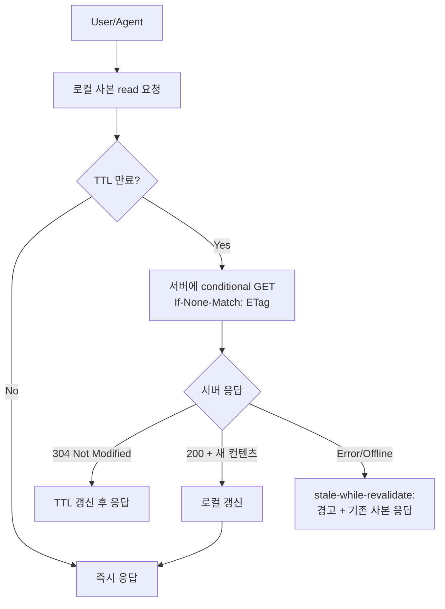
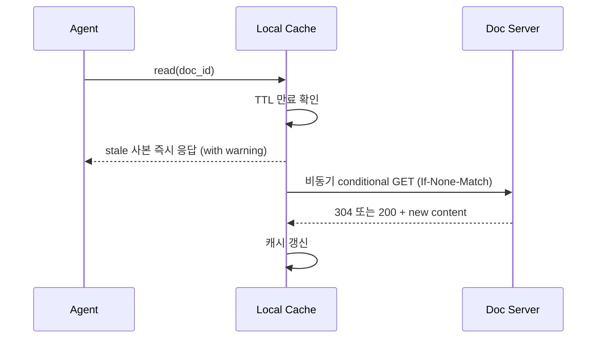

# 로컬 정책 사본의 staleness 감지·갱신 패턴

## 핵심 요약

dual-storage(서버 + 로컬 mirror) 전략을 채택했다면 다음 문제는 "로컬 사본이 stale한지 어떻게 알아내고, 언제 갱신할 것인가"다. 잘못 설계하면 stale 문서를 SSOT인 양 신뢰해 의사결정 오류를 부른다.

- **2-축 분류**: 트리거(push vs pull) × 검증 방식(시간 vs 컨텐츠).
- **표준 메커니즘**: ETag(content hash) / Last-Modified / If-Modified-Since / TTL / version vector.
- **권장 default**: ETag + 짧은 TTL + 명시적 force-sync — 정확도와 효율의 균형.
- **agent 노출**: `last_synced_at`·`is_stale`·`source_etag`를 frontmatter에 노출해 agent가 staleness 인식 가능.

## staleness 감지 다이어그램

## 메커니즘 비교 매트릭스

| 메커니즘 | 정확도 | 네트워크 비용 | 구현 비용 | 적합 케이스 |
|---|---|---|---|---|
| TTL only | 낮음 | 매우 낮음 | 매우 낮음 | 변경 빈도 매우 낮음 |
| Last-Modified | 중간 | 낮음 | 낮음 | 서버 시계 신뢰 가능 |
| ETag (content hash) | 매우 높음 | 낮음 (304) | 중간 | 정확도 우선 |
| Version vector | 매우 높음 | 낮음 | 높음 | 분산 multi-writer |
| Webhook push | 매우 높음 | 0 (즉시) | 매우 높음 | 변경 즉시 반영 필수 |
| Polling | 중간 | 높음 | 낮음 | webhook 불가 환경 |

## 2-축 분류

| 트리거 \ 검증 | 시간 기반 (TTL) | 컨텐츠 기반 (ETag/Hash) |
|---|---|---|
| Pull (read 시 검사) | TTL expiry → refresh | conditional GET (If-None-Match) |
| Push (서버가 알림) | 주기 sync job | webhook + ETag broadcast |

**default 권장**: pull + ETag (conditional GET). polling이나 webhook 없이 read 시점에 stale 여부 정확 판정.

## 표준 HTTP 캐시 헤더 매핑

| 헤더 | 의미 | 정책 문서 적용 |
|---|---|---|
| `ETag: "<hash>"` | 컨텐츠 fingerprint | doc 본문 SHA-256 (frontmatter 제외) |
| `Last-Modified: <date>` | 마지막 수정 시각 | server-side update 시각 |
| `Cache-Control: max-age=<s>` | TTL 지시 | 카테고리별 차등 (용어집 24h, 정책 1h) |
| `Cache-Control: stale-while-revalidate=<s>` | stale 사본 응답 허용 | 네트워크 단절 시 fallback |
| `If-None-Match: "<etag>"` | 클라이언트가 가진 ETag | conditional GET 요청 |
| `304 Not Modified` | 변경 없음 | body 없이 응답 — bandwidth↓ |

## frontmatter 노출 필드 (agent용)

| 필드 | 의미 | 예시 |
|---|---|---|
| `last_synced_at` | 마지막 sync 시각 (ISO 8601) | `2026-06-08T03:00:00Z` |
| `source_etag` | 서버 ETag | `"a3f7..."` |
| `ttl_seconds` | 카테고리별 TTL | `3600` |
| `is_stale` | 현재 stale 여부 (계산값) | `false` |
| `sync_status` | 마지막 sync 결과 | `ok` / `failed` / `offline` |

agent는 read 시 `is_stale: true` 또는 `sync_status: failed`인 문서를 응답 시 명시적 경고(예: "이 문서는 마지막 sync 이후 3일 경과, stale 가능성").

## TTL 차등 권장값

| 카테고리 | 권장 TTL | 근거 |
|---|---|---|
| 기획 정책 | 1h | 변경 시 즉시 반영 요구 |
| 개발 Knowledge | 6h | 변경 빈도 낮음 |
| 도메인 업무 규칙 | 1h | SLA·계약 영향, 빠른 반영 |
| 용어집 | 24h | 변경 드물고 영향 작음 |
| restricted (보안) | 5min | 권한 회수 즉시 반영 |

## stale-while-revalidate 패턴

응답 latency를 0으로 유지하면서 background에서 갱신 — 정확도는 다음 read부터 보장.

## 실제 사례

### HTTP cache (RFC 7234 / 5861)
웹의 표준 캐시 의미론. ETag + stale-while-revalidate는 본 패턴의 직접 차용 원천.

### npm / pip — package metadata cache
패키지 metadata를 ETag 기반으로 캐시. `npm install` 시 conditional GET → 변경 없으면 304. 정책 문서 운영의 mental model로 직접 차용 가능.

### Confluence REST API — version field
페이지마다 `version.number` 증가. ETag 대용으로 사용 가능. content hash가 아니어서 metadata-only 변경에도 증가하는 한계.

### Notion API — last_edited_time
ISO timestamp. Last-Modified 직접 매핑. content hash가 없어 정확도는 ETag 대비 낮음 — 시계 신뢰가 전제.

### Git as cache invalidator
`git pull` 후 commit hash 비교. 본 패턴의 file-level 구현. policy doc 저장소가 Git이면 별도 캐시 메커니즘 불필요.

## 활용 시나리오

### 시나리오 1: Claude agent의 정책 문서 참조
agent가 vault 로컬 사본 읽음 → frontmatter `is_stale: true` 발견 → 응답 전 conditional GET → 304면 그대로, 200이면 갱신 후 응답. 응답에 "마지막 sync: 2h 전" 표시.

### 시나리오 2: webhook 환경에서 즉시 반영
Confluence webhook → local sync agent가 ETag 갱신 알림 수신 → 다음 read 시 conditional GET이 304로 빠르게 검증. webhook 누락 케이스 대비 TTL fallback 유지.

### 시나리오 3: offline 작업 중 stale 응답
네트워크 단절 → conditional GET 실패 → stale-while-revalidate로 기존 사본 + 명시적 경고("offline, 사본은 2일 전 기준") 응답. 의사결정 책임은 사용자에게.

## 장단점 및 트레이드오프

| 항목 | 내용 |
|---|---|
| 장점 | 정확도 + 효율 균형 / HTTP 표준 차용으로 학습 비용↓ / agent가 staleness 인식 가능 |
| 단점 | ETag 계산 비용 / metadata-only 변경 처리 / webhook 누락 대비 필요 |
| 트레이드오프 | 정확도(ETag, 매 read마다 검증) vs 비용(TTL only). 카테고리별 차등 + stale-while-revalidate로 양립 |

## 함정 및 안티패턴

- **TTL만 사용** → "만료 전 변경"이 invisible. → ETag 병행.
- **ETag 검증을 매 read마다 동기로** → 네트워크 의존 + latency. → stale-while-revalidate로 비동기화.
- **stale 사본을 silent하게 응답** → 사용자가 SSOT로 신뢰. → 항상 `last_synced_at` 노출 + agent가 응답에 경고.
- **webhook만 신뢰** → 누락 시 영원히 stale. → TTL fallback 필수.
- **TTL을 카테고리 무관하게 단일값** → 용어집은 과다 sync, 정책은 stale. → 카테고리별 차등.
- **권한 변경을 ETag로 감지** → ETag는 본문 기준, 권한 변경 시 ETag 동일 가능. → 권한은 별도 endpoint로 검증.
- **frontmatter staleness 필드를 source에 commit** → 매 sync마다 diff 발생. → 별도 sidecar 파일 또는 ignore.

## 참고 자료

- [RFC 7234 — HTTP/1.1 Caching](https://datatracker.ietf.org/doc/html/rfc7234) — ETag·Last-Modified 표준
- [RFC 5861 — stale-while-revalidate](https://datatracker.ietf.org/doc/html/rfc5861) — 비동기 갱신 의미론
- [MDN — HTTP conditional requests](https://developer.mozilla.org/en-US/docs/Web/HTTP/Conditional_requests) — If-None-Match 패턴
- [Confluence REST API — Get content version](https://developer.atlassian.com/cloud/confluence/rest/v1/api-group-content/) — version.number 사용법
- [Notion API — Page object](https://developers.notion.com/reference/page) — last_edited_time 활용
- [npm cache validation](https://docs.npmjs.com/cli/v10/using-npm/cache) — ETag 기반 metadata cache 실전 사례
