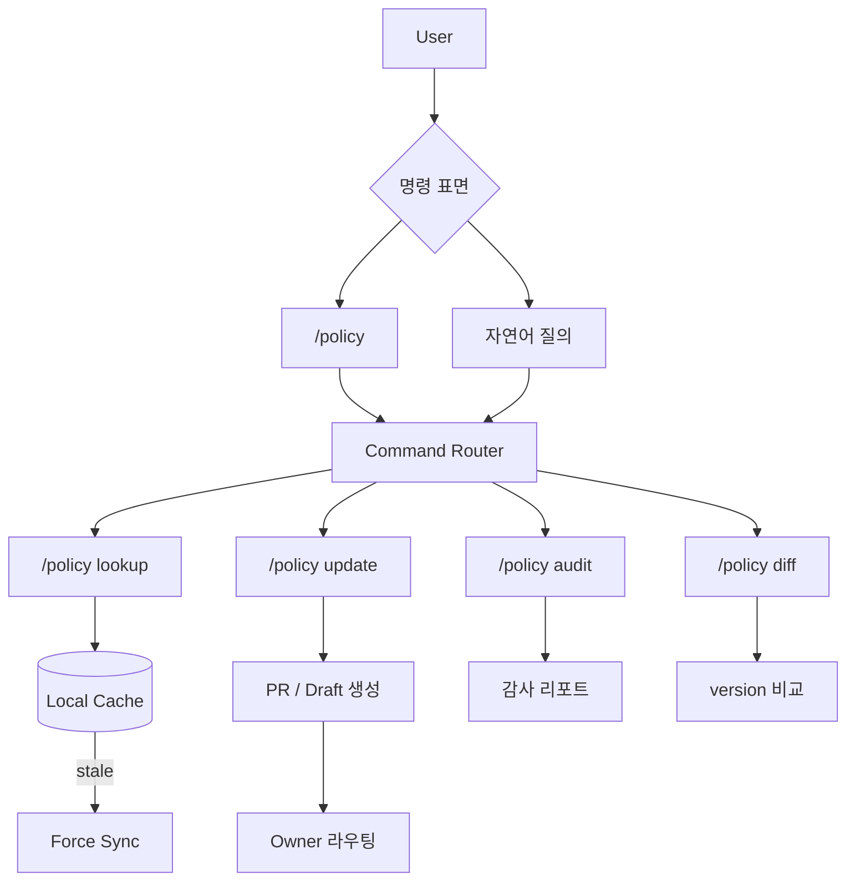
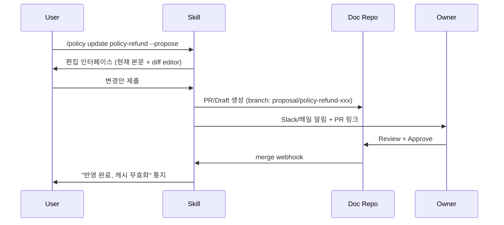

# 정책 문서 조회/갱신 skill·command UX 패턴

## 핵심 요약

정책 문서 시스템에 AI 에이전트·CLI 인터페이스가 붙으면 **명령어 표면(command surface)** 자체가 UX의 핵심이 된다. 잘못 설계된 surface는 사용자가 정책을 찾기보다 검색을 포기하게 만들고, 잘못된 인용을 silent하게 허용한다. skill harness(아키텍처)와 분리된 **command UX 차원의 패턴**을 정리한다.

- **4-축 command surface**: lookup(조회) / update(편집) / audit(감사) / diff(변경 비교).
- **dual surface**: 구조화 명령(`/policy lookup refund`) + 자연어 질의("환불 정책 알려줘") — 두 surface가 동일 backend 호출.
- **staleness UX**: 응답에 freshness 메타 항상 노출 — `last_synced_at`, `is_stale` 시각화.
- **승인 흐름의 inline화**: update 결과는 즉시 PR/draft로 직렬화, owner에게 라우팅 통지.
- **fail-safe default**: 모호 query는 절대 hallucinate 금지 — "찾을 수 없음" + 후보 제시.

## command surface 다이어그램



## 4-축 command 정의

### lookup — 조회
```
/policy lookup <topic>              # 키워드 검색
/policy lookup --id <doc-id>        # 직접 참조
/policy lookup --tag <tag>          # 태그 필터
/policy lookup --applies-to team-a  # 적용 범위 필터
```
- 응답에 항상 `last_synced_at`, `confidence`, `applies_to` 명시.
- stale일 경우 응답 상단에 명시 + force-sync 옵션 안내.

### update — 편집/제안
```
/policy update <doc-id>             # 편집 세션 진입
/policy update <doc-id> --propose   # 직접 편집 없이 제안만 생성
```
- update는 항상 draft/PR 직렬화 — 직접 커밋 금지.
- owner에게 자동 라우팅 (Slack/이메일/PR reviewer).

### audit — 감사
```
/policy audit --stale               # stale 문서 목록
/policy audit --deprecated          # 만료 임박 문서
/policy audit --owner unset         # owner 누락 문서
/policy audit --conflict            # SSOT 위반 후보
```
- read-only. 정기 실행(주간) + on-demand 둘 다.

### diff — 변경 비교
```
/policy diff <doc-id> --from v3 --to v5
/policy diff <doc-id> --since 2026-05-01
```
- 변경 이력 + 누가·언제·왜 (commit/revision message).
- 의사결정 시 "왜 이 룰이 이렇게 되었나" 추적.

## dual surface — 명령 vs 자연어

| 측면 | 구조화 명령 | 자연어 질의 |
|---|---|---|
| 학습 곡선 | 중간 (한 번 외우면 빠름) | 낮음 (즉시 사용) |
| 정확도 | 매우 높음 | 모호 가능 |
| 자동화 친화 | 강함 (스크립트) | 약함 |
| 신규 사용자 | 진입 장벽 | 자연 |
| 호환 | CI/CD·git hook | 채팅·agent |

**권장**: 자연어를 구조화 명령으로 normalize한 뒤 동일 backend 호출. agent가 "환불 정책 알려줘" → `/policy lookup refund --applies-to user.team`로 변환 → 사용자에게 변환된 명령 노출(투명성).

## staleness UX — 응답 포맷

```
📘 환불 정책 (policy-refund-2026)
   • 적용: 전사 (effective 2026-05-01~)
   • Owner: product-lead
   • Confidence: approved
   • Last synced: 2시간 전 ✓
   • Source: https://confluence.../policy-refund-2026

[본문 ...]

⚠️ 이 문서는 캐시된 사본입니다. `/policy sync policy-refund-2026`로 최신화하세요.
```

- freshness는 **모든 응답의 1st-class 메타**. footer가 아닌 header에 노출.
- stale 정도에 따라 색상 차등 (fresh / warn / stale).

## update 흐름 — inline approval



직접 커밋 금지 — 변경은 항상 승인 큐를 거친다. owner는 frontmatter에서 자동 라우팅.

## ownership routing 패턴

| frontmatter | 라우팅 대상 |
|---|---|
| `owner: product-lead` | role → 현재 product-lead 1인 (역할 매핑 테이블) |
| `owner: team-payment` | 팀 채널 + 팀 리더 |
| `approver: [a, b]` | a OR b 승인 시 통과 |
| `escalation: cto` | 3일 미응답 시 escalation |

**원칙**: 사람 ID 직접 부여 금지(인사 변경 시 폭증) — role/group만 사용.

## fail-safe — 모호 query 처리

```
User: 환불 관련해서 어떻게 처리해?

❌ 잘못된 응답: "환불은 7일 이내 가능합니다" (출처 없이 단언)

✓ 올바른 응답:
"환불 관련 정책 후보 3건을 찾았습니다:
  1. policy-refund-2026 (전사, 2026-05-01~) — Confidence: approved
  2. policy-refund-b2b-2025 (B2B, 2025-12-01~) — Confidence: approved
  3. fl-refund-draft (Draft) — 답변에서 제외됨
어떤 정책을 적용하시려는 상황인가요?"
```

- 단일 답이 명확하지 않으면 후보 제시. hallucinate 절대 금지.
- draft·deprecated는 응답에서 자동 제외 + 명시.

## 실제 사례

### GitHub CLI `gh`
verb-noun command surface (`gh pr list`, `gh issue create`). 자연어는 없지만 구조화 명령의 reference 사례. tab completion + alias로 학습 곡선 완화.

### AWS CLI
service-action 패턴 (`aws s3 ls`). 자연어 layer는 Amazon Q가 별도 — dual surface 분리 모델.

### Slack `/` commands
구조화 command + slash 진입. 본 패턴의 chat-surface 차용 대상.

### Anthropic Claude Code `/<skill>`
Claude Code skill 시스템. 자연어 trigger + slash 명령 dual surface. 본 패턴의 직접 적용 대상.

### Cursor / Continue — `@` doc reference
자연어 안에서 `@policy-refund`로 doc 직접 참조. mention-style anchor — 본 패턴의 inline 확장.

## 활용 시나리오

### 시나리오 1: 신규 합류자 학습
신규 입사자가 "휴가 정책 알려줘" 자연어 질의 → agent가 `/policy lookup vacation` 변환 → 정책 표시 + Confidence·effective_from·owner 명시 → 추가 질문 가능.

### 시나리오 2: 정책 변경 제안
PM이 환불 정책 수정 필요 → `/policy update policy-refund --propose` → 인라인 diff editor → PR 자동 생성 → owner Slack 알림 → 승인 후 자동 sync.

### 시나리오 3: 주간 감사
매주 월요일 cron으로 `/policy audit --stale --deprecated --owner unset` 실행 → Slack 채널에 리포트 → owner 부재 문서 자동 escalation.

### 시나리오 4: 모호 query 처리
"권한 어떻게 처리?" 같은 광범위 질의 → 후보 5건 제시 + 추가 질문 유도. agent가 단일 답으로 단언하지 않음.

## 장단점 및 트레이드오프

| 항목 | 내용 |
|---|---|
| 장점 | 학습 곡선↓ (자연어) + 자동화 친화 (구조화) / hallucination 방지 / freshness 항상 노출 / 승인 흐름 강제 |
| 단점 | dual surface 유지 비용 / normalize 정확도 / verb 분류 합의 비용 |
| 트레이드오프 | 자유도(자연어)와 정확도(구조화) 사이 — normalize 결과를 사용자에게 항상 노출해 투명성 확보 |

## 함정 및 안티패턴

- **자연어만 지원** → 자동화·CI/CD 통합 불가, agent의 호출 일관성 약함. → 구조화 명령 반드시 병행.
- **구조화 명령만 지원** → 신규 사용자 진입 장벽, 학습 비용. → 자연어 surface 추가 + normalize 노출.
- **freshness를 footer/주석으로** → 사용자가 stale 사본을 SSOT로 신뢰. → header 1st-class 메타.
- **update가 직접 commit** → 승인 흐름 우회. → 항상 PR/Draft 직렬화.
- **owner를 사람 ID로 frontmatter에 박음** → 인사 변경 시 일괄 수정. → role/group 매핑.
- **fail-safe 없이 단언** → hallucination을 권위 있게 응답. → 후보 제시 + 단일 답 강제 금지.
- **verb 분류를 ad-hoc하게 확장** (lookup, find, search, get, ...) → mental cost 폭증. → 4-축 (lookup/update/audit/diff)로 강제 정규화.
- **dual surface가 다른 backend 호출** → 동일 query에 다른 결과. → normalize 후 single backend.

## 참고 자료

- [Slack — Slash commands](https://api.slack.com/interactivity/slash-commands) — chat surface 표준
- [GitHub CLI design](https://cli.github.com/manual/) — verb-noun command 구조
- [Anthropic — Claude Code skills](https://docs.anthropic.com/en/docs/claude-code/slash-commands) — slash + 자연어 dual surface
- [Cursor — @ mentions](https://docs.cursor.com/) — inline doc reference 패턴
- [Atlassian Intelligence](https://www.atlassian.com/software/artificial-intelligence) — Confluence 자연어 정책 검색 reference
- [Conversational vs Command UI tradeoffs | Nielsen Norman Group](https://www.nngroup.com/articles/conversational-interfaces/) — dual surface 의사결정 근거
