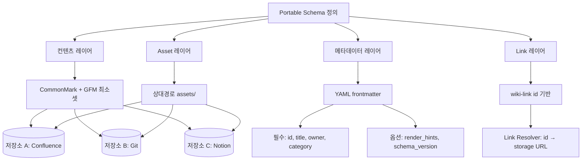

# 저장소 독립적(vendor-portable) 정책 문서 스키마

## 핵심 요약

Confluence → 다른 저장소(Notion / Git / GitBook 등)로 이관해도 운영이 끊기지 않으려면, 저장소 기능에 종속되지 않는 **컨텐츠 스키마**를 따로 정의해야 한다. sync 도구나 exporter는 컨텐츠가 portable할 때만 동작한다 — 스키마 자체가 vendor-specific 기능(Confluence macro, Notion database property)에 의존하면 sync는 lossy해진다.

- **Markdown + YAML frontmatter**: 메타데이터·본문 분리. 메타는 frontmatter, 본문은 CommonMark·GFM 최소 호환 셋만 사용.
- **Asset layout 규약**: 이미지·첨부는 `assets/{doc-id}/` 하위 상대경로. URL 인라인 임베드 금지 (vendor URL이 lock-in 유발).
- **Cross-link convention**: wiki-link `[[id]]` 표준화. absolute URL은 외부 자료에만 사용.
- **Vendor 기능 격리**: Confluence macro·Notion sync block 등은 본문에 직접 쓰지 않고 frontmatter의 `render_hints` 필드로 추상화.
- **Schema versioning**: `schema_version: 1` 필드로 schema 진화 추적 — 미래 마이그레이션 자동화의 근거.

## 컴포넌트 다이어그램

## Schema 필수 필드

| 필드 | 타입 | 의미 | 예시 |
|---|---|---|---|
| `id` | string (UUID/slug) | 저장소 독립 식별자 | `policy-refund-2026` |
| `title` | string | 사람이 읽는 제목 | `환불 정책` |
| `category` | enum | 4-카테고리 분류 | `plan_policy` |
| `owner` | string (role) | 소유자 role | `product-lead` |
| `schema_version` | integer | 스키마 버전 | `1` |
| `effective_from` | date | 발효일 | `2026-06-01` |
| `tags` | array | 통제 어휘 | `[refund, billing]` |
| `render_hints` | object (optional) | 저장소별 렌더 힌트 | `{toc: true}` |

## Markdown 기능 호환 매트릭스

| 기능 | CommonMark | GFM | Confluence | Notion | GitBook |
|---|---|---|---|---|---|
| heading | ✓ | ✓ | ✓ | ✓ | ✓ |
| table | partial | ✓ | ✓ | ✓ | ✓ |
| task list | ✗ | ✓ | partial | ✓ | ✓ |
| code fence | ✓ | ✓ | ✓ | ✓ | ✓ |
| mermaid | ✗ | ✗ | macro | code block | ✓ |
| callout/admonition | ✗ | ✗ | macro | 전용 block | 전용 block |
| embed (Figma 등) | ✗ | ✗ | macro | embed | embed |

**portable 셋**: CommonMark + GFM table/task/code-fence만 사용. mermaid·callout·embed는 `render_hints`로 분리하거나 plain 텍스트 fallback 제공.

## 비교: portable schema vs vendor-native

| 항목 | Portable schema | Vendor-native |
|---|---|---|
| 이관 비용 | 낮음 (exporter 1회) | 매우 높음 (수동 재작성) |
| 작성 편의 | 중간 (제약 존재) | 높음 (rich editor) |
| 검색·grep | 매우 강함 (plain text) | 약함 (vendor API 의존) |
| AI agent 친화 | 강함 (구조화 + plain) | 약함 (API rate-limit, 권한) |
| 신규 도구 도입 | 자유 | lock-in 위약 |

## 실제 사례

### MkDocs / Hugo / Docusaurus
정적 사이트 생성기 진영의 표준. Markdown + frontmatter + assets 구조. 본 스키마와 거의 동일한 portability 보장. 저장소를 옮겨도 다른 generator로 재빌드 가능.

### Obsidian Vault
wiki-link `[[]]` + frontmatter + 상대 asset 경로. plain file 기반이라 vendor 없이도 운영 가능. 본 스키마의 reference implementation.

### Notion → Markdown 이관 실패 패턴
Notion database property·sync block을 본문에 인라인 사용한 문서는 export 시 의미 상실. portable schema 미준수의 대표 사례.

### Confluence Markdown Connector (2024+)
공식 Markdown import/export 지원. CommonMark 기준은 무손실, macro 사용 시 lossy. portable schema 준수 시 양방향 sync 안정.

## 활용 시나리오

### 시나리오 1: Confluence → Git 점진적 이관
모든 문서를 portable schema로 재작성 → exporter로 Git push → Confluence를 read-only mirror로 전환. 본문이 portable이면 reverse도 가능.

### 시나리오 2: 다중 저장소 동시 운영
SSOT는 Git, public-facing은 GitBook, 사내 검색은 Confluence. 동일 schema의 1 source → 3 renderer. render_hints만 저장소별 차등.

### 시나리오 3: AI agent 직접 참조
agent가 plain Markdown을 RAG로 인덱싱. vendor API 권한·rate-limit 우회. schema 표준화로 chunking·metadata 추출 일관성.

## 장단점 및 트레이드오프

| 항목 | 내용 |
|---|---|
| 장점 | 저장소 이관 자유 / grep·diff·PR 친화 / AI agent retrieval 강함 / 장기 보존성 |
| 단점 | rich editor UX 포기 / macro·embed 제한 / 작성자에게 schema 학습 요구 |
| 트레이드오프 | 작성 편의(rich UX)와 portability(plain). 핵심 정책 문서만 portable 강제, 작업 노트는 자유 — 카테고리별 차등 적용 |

## 함정 및 안티패턴

- **본문에 vendor URL 인라인 임베드** → 이관 시 dead link. → 모든 asset은 상대경로 + `assets/` 하위.
- **schema_version 누락** → 미래 schema 진화 시 일괄 마이그레이션 불가. → 처음부터 `schema_version: 1` 부여.
- **frontmatter 없이 본문 첫 줄로 메타 표현** → parser별 해석 차이. → 표준 YAML frontmatter 강제.
- **wiki-link 대신 절대 경로 사용** → 저장소 이동 시 모든 링크 깨짐. → id 기반 wiki-link + resolver 레이어.
- **Markdown 호환셋 확장에 무관심** → "Notion에선 잘 보이니까" 패턴으로 vendor 종속 누적. → CI에서 portable 셋 외 사용 시 lint 경고.
- **render_hints에 본문 의미를 위임** → hint 제거 시 본문이 무의미. → hint는 표현 보조만, 의미는 본문에 자기완결.

## 참고 자료

- [CommonMark Spec](https://spec.commonmark.org/) — Markdown 표준
- [GitHub Flavored Markdown Spec](https://github.github.com/gfm/) — table·task list 확장
- [Diátaxis on portability](https://diataxis.fr/) — 문서 구조의 도구 독립성
- [Obsidian — File formats](https://help.obsidian.md/Files+and+folders/Accepted+file+formats) — plain file 기반 vault 운영
- [Confluence — Markdown import/export](https://confluence.atlassian.com/doc/import-content-into-confluence-cloud-1110725787.html) — portable schema의 양방향 sync 가능성
