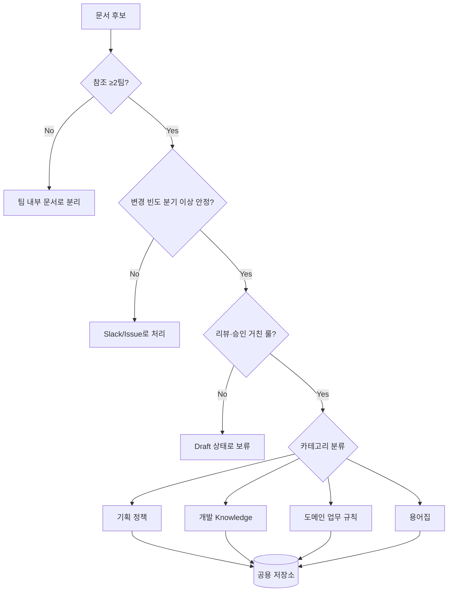

# 공용 정책 문서의 범위와 분류 체계

## 핵심 요약

기획팀·개발팀이 함께 참조하는 공용 정책 문서를 운영하려면 거버넌스(누가 승인) 이전에 **"무엇이 공용 정책인가"의 컨텐츠 taxonomy가 먼저 합의**되어야 한다. 분류 없이 단일 저장소에 넣기 시작하면 임시 메모·개인 노트·1팀 한정 문서가 섞여 검색·신뢰성이 무너진다.

- **4-카테고리 분류**: 기획 정책 / 개발 Knowledge / 도메인 업무 규칙 / 용어집 — 각 카테고리는 owner·lifecycle·리뷰 주기가 다르다.
- **포함 기준 (AND)**: (1) 참조 범위 ≥2팀 (2) 변경 빈도 분기 이상 안정 (3) 합의/리뷰를 거친 룰.
- **배제 기준**: 임시 메모, 1팀 한정 결정, 코드 주석·README로 충분한 내용, 개인 학습 노트, deprecated 후보.
- **회색 영역 처리 룰**: "참고용 문서" 같은 모호 카테고리를 만들지 말고, 포함/배제 둘 중 하나로 강제 판정한다.

## 분류 다이어그램

## 4-카테고리 정의

| 카테고리 | 정의 | 예시 | Owner | 변경 빈도 |
|---|---|---|---|---|
| 기획 정책 | 제품·서비스의 비즈니스 룰·UX 원칙 | 환불 정책, 가격 정책, UX writing 가이드 | PM/PO | 분기 |
| 개발 Knowledge | 다팀 공유 기술 결정·표준 | API 규약, 인증 흐름, 로깅 표준 | Tech Lead | 분기 |
| 도메인 업무 규칙 | 비즈니스 도메인의 invariants·constraint | 정산 룰, 권한 매트릭스, SLA | 도메인 owner | 반기 |
| 용어집 | 도메인 용어·약어·식별자 정의 | "주문" vs "구매", LMS 약어 | Cross-team | 상시 (소량) |

## 카테고리별 운영 룰 차이

| 항목 | 기획 정책 | 개발 Knowledge | 도메인 규칙 | 용어집 |
|---|---|---|---|---|
| 리뷰 주기 | 분기 | 분기 | 반기 | 월(추가만) |
| 승인자 | Product Lead | Tech Lead | 도메인 owner + Lead 2인 | Cross-team committee |
| 변경 비용 | 중 | 중 | 큼 (계약·SLA 영향) | 작음 |
| Deprecation | status 라벨 + 90일 | status 라벨 + 90일 | 명시적 sunset 일정 | alias로 흡수 |

## 경계선 판정 기준

| 기준 | 포함 | 배제 |
|---|---|---|
| 참조 범위 | ≥2팀이 정기 참조 | 1팀 한정 |
| 변경 빈도 | 분기 이상 안정 | 주 단위 변동 |
| 합의 수준 | review/approval 통과 | 개인 의견·draft |
| 대체 가능성 | 코드/주석으로 표현 불가 | code-as-doc로 충분 |
| 검색 가치 | "왜 이렇게 하는가"의 ground truth | 일시적 컨텍스트 |

## 실제 사례

### Atlassian — 4-tier doc taxonomy
공식 가이드에서 문서를 Strategy / Reference / Tutorial / How-to 4-tier로 분류. 본 노트의 4-카테고리는 컨텐츠 성격이 아닌 **소유권 기준** 분류라는 점에서 다르다.

### Diátaxis Framework
공식 문서 작성 프레임워크. Tutorial / How-to / Reference / Explanation 4분면. 기술 문서에 한정되며 정책·도메인 룰은 다루지 않음 — 공용 정책 분류엔 직접 적용 불가.

### GitLab Handbook
모든 정책을 단일 git repo에 카테고리(Engineering, People, Marketing 등)별로 분류. owner를 page-level metadata로 명시. 본 노트의 4-카테고리와 유사한 owner-based 분류 패턴.

## 활용 시나리오

### 시나리오 1: 신규 환불 정책 도입
PM이 환불 정책 초안 작성 → 분류 판정: 기획 정책 (PM owner, Product Lead 승인) + 도메인 규칙(정산 룰 변경 동반, 도메인 owner 추가 승인). 하나의 문서가 두 카테고리에 걸치면 **primary category + secondary tag**로 운영.

### 시나리오 2: 용어집 vs 도메인 규칙 모호 케이스
"활성 사용자(MAU)" 정의 — 용어집인지 도메인 규칙인지? 판정: 정의 자체는 용어집(짧고 안정), 산정 방식·예외 케이스는 도메인 규칙(긴 룰). 분리 작성 + cross-link.

### 시나리오 3: 회색 영역 문서 처리
"이 문서는 참고용입니다" 같은 모호 라벨 발견 → 포함/배제 강제 판정. 1팀만 보면 팀 wiki로 이관, 다팀 참조하지만 unstable이면 RFC/Draft로 별도 저장소.

## 장단점 및 트레이드오프

| 항목 | 내용 |
|---|---|
| 장점 | 검색 신뢰성↑ / owner 명확화 / 리뷰 주기 차등으로 운영 부담 분산 / 회색 영역 제거 |
| 단점 | 초기 카테고리 합의 비용 / 경계 케이스 판정 비용 / 카테고리 자체의 변화 필요 |
| 트레이드오프 | 세분화(정확)와 단순화(운영 부담) 사이의 균형. 4-카테고리가 sweet spot. 5+ 카테고리는 mental cost 폭증, 3 이하는 owner·lifecycle 차이 표현 부족 |

## 함정 및 안티패턴

- **카테고리에 "기타/참고"를 만든다** → 분류 회피처가 되어 점진적으로 90%가 기타로 수렴. → 강제 4-카테고리 판정, 회색이면 배제.
- **거버넌스만 합의하고 taxonomy를 미룬다** → 단일 룰이 모든 문서에 적용되어 가장 느슨한 룰로 수렴 (예: 용어집 변경에 Tech Lead 승인). → taxonomy 먼저 합의 후 카테고리별 운영 룰 차등.
- **용어집을 일반 정책에 포함** → alias·신조어 도입 워크플로 누락. → 별도 카테고리 + 별도 lifecycle.
- **1팀 한정 문서를 공용에 욱여넣기** → "혹시 다른 팀이 볼 수도 있다" 명분으로 검색 신뢰성 하락. → 팀 wiki와 공용 분리.
- **분류 없이 폴더 구조로 해결 시도** → 폴더가 곧 카테고리가 되지만 owner/lifecycle 차이가 표현 안 됨. → 폴더 + frontmatter category 필드 동시 사용.

## 참고 자료

- [Diátaxis Framework](https://diataxis.fr/) — 4분면 문서 분류 프레임워크 (기술 문서 한정)
- [GitLab Handbook — Handbook Usage](https://handbook.gitlab.com/handbook/about/handbook-usage/) — 단일 repo + owner-based 분류 운영 사례
- [Atlassian — Documentation types](https://www.atlassian.com/work-management/knowledge-sharing/documentation/types-of-documentation) — Strategy/Reference/Tutorial/How-to 4-tier
- [Building a single source of truth (SSOT) for your team | Atlassian](https://www.atlassian.com/work-management/knowledge-sharing/documentation/building-a-single-source-of-truth-ssot-for-your-team) — SSOT 위에 분류 체계가 필요한 이유
