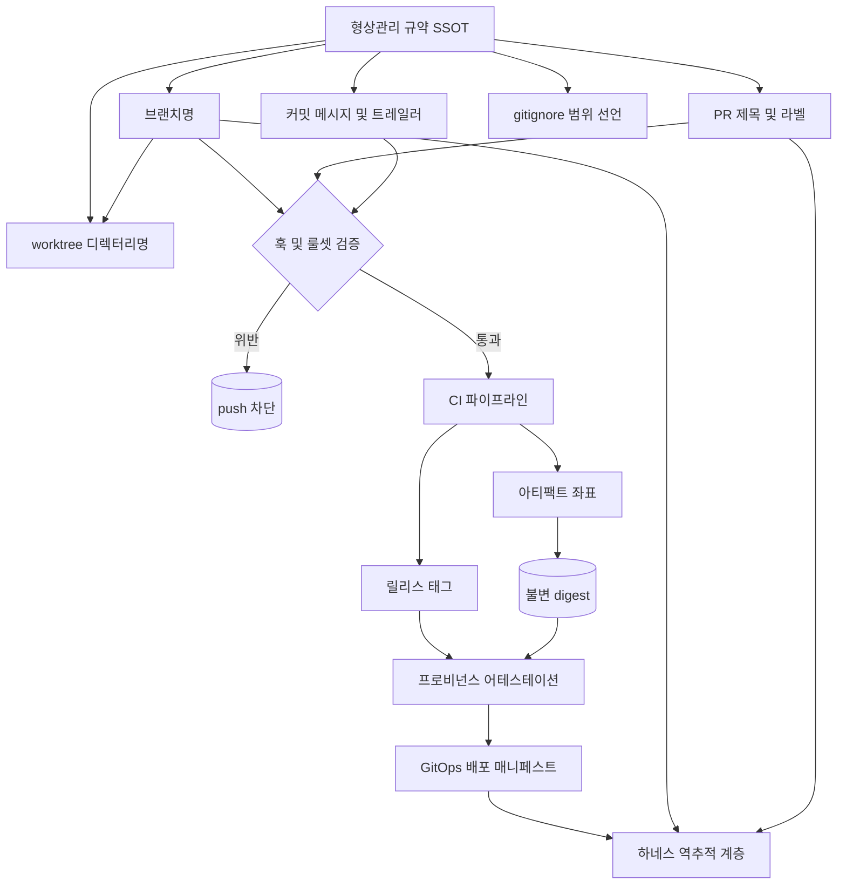
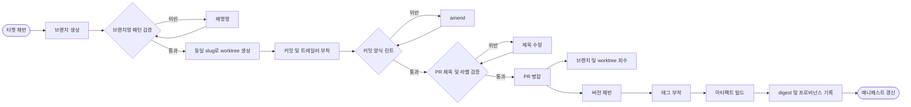

# 하네스 운영 네이밍 컨벤션 - 형상관리 범위

## 핵심 요약

**정의**: 브랜치·커밋·태그·버전·릴리스 아티팩트 — 즉 **형상 항목(Configuration Item)의 이름**을 에이전트가 생성·파싱·역추적할 수 있는 고정 문법으로 규정하는 규약. 동시에 *무엇이 형상관리 대상인가*(범위 경계)를 명시해 에이전트가 커밋해도 되는 것과 안 되는 것을 이름 패턴만으로 구분하게 만든다.

**배경**: 앞선 세 범위(Engineering / Infra / ERD)는 에이전트가 **읽는** 대상의 이름이었다. 형상관리 범위는 에이전트가 **쓰는** 이름이다 — 브랜치를 만들고 커밋을 남기고 태그를 붙이는 주체가 사람에서 에이전트로 넘어가는 지점이므로, 규칙이 없으면 히스토리 자체가 오염된다. 상위 개념은 [[fl-2026-07-29-harness-engineering]], 레포명 스킴은 [[fl-2026-07-31-git-repo-naming-convention]] 참조.

- **이름은 파싱 가능해야, 식별자는 불변이어야**: 브랜치·태그는 사람이 읽는 *레이블*, commit SHA·image digest는 기계가 신뢰하는 *식별자*. 두 층을 혼동하면 재현 불가능한 배포가 된다.
- **에이전트 접두는 이미 표준화 진행 중**: Conventional Branch 1.1.0이 `ai/`·`copilot/`·`cursor/`·`claude/`·`codex/` 접두를 스펙에 편입했다. 사람 작업과 에이전트 작업을 브랜치명에서 분리하는 것이 관행이 되고 있다.
- **흔적은 브랜치 하나가 아니라 세 표면**: 브랜치명·worktree 디렉터리명·PR(제목·라벨)이 같은 slug를 공유해야 세션 하나를 세 곳에서 같은 키로 조회할 수 있다. 벤더 도구는 이미 접두를 강제하고(Copilot은 `copilot/` 로 시작하는 브랜치만 생성·push 가능) worktree 디렉터리명까지 기계가 정하므로, 규약이 없으면 이름을 결정하는 주체가 팀이 아니라 도구가 된다.
- **범위 경계가 곧 안전장치**: `.gitignore`는 스타일 파일이 아니라 **형상관리 범위의 실행 가능한 선언문**이다. 에이전트가 빌드 산출물·`.env`를 커밋하는 실패는 범위 미정의에서 나온다.
- **가장 강제하기 쉬운 계층**: 브랜치명·커밋 양식·태그 패턴은 훅·룰셋·정규식으로 push 시점에 차단 가능하다. 인프라 이름(사후 변경 불가)이나 스키마(개명 비용 큼)와 달리 위반 비용이 낮은 시점에 잡힌다. **단 "차단 가능"은 룰셋을 쓸 수 있을 때의 이야기다** — private 저장소 + GitHub Free 조합은 룰셋·브랜치 보호 API가 모두 403이고(2026-09-12 실측), 그러면 남는 것은 우회 가능한 훅과 사후 CI뿐이다. 규약을 쓰기 전에 **강제 지점을 하나씩 실제로 호출해 봐야** 한다.

## 컴포넌트 다이어그램

규약 문서가 SSOT이고, 브랜치·worktree·PR·커밋·태그로 투영된 이름이 CI를 거쳐 아티팩트 좌표와 배포 매니페스트까지 전파된다. 하네스는 이 사슬의 양 끝을 모두 조회한다. worktree 디렉터리명은 로컬에만 존재해 검증 게이트를 지나지 않는 유일한 표면이다.

## 적용 단계

티켓 식별자에서 배포 매니페스트까지 **하나의 식별자가 끊기지 않고 이어지는지**가 설계 목표다. 어느 한 단계에서 이름이 자유형이 되면 그 지점에서 추적이 끊긴다.

## 핵심 기능 및 서비스

| 기능 | 설명 |
| --- | --- |
| 브랜치 문법 | Conventional Branch — ABNF `branch-name = trunk-branch / (type "/" description)`. 접두 `feature`(별칭 `feat`)·`bugfix`(별칭 `fix`)·`hotfix`·`release`·`chore`. **소문자 `a-z`·숫자 `0-9`·하이픈만**, 점(`.`)은 `release/v1.2.0` 처럼 릴리스 브랜치의 버전 표기에만 허용. 연속·선행·후행 하이픈/점 금지, **슬래시는 정확히 1개**(중첩 세그먼트 불허). 트렁크(`main`/`master`/`develop`)는 접두 면제. JSON Schema와 적합성 픽스처를 함께 배포해 기계 검증 가능 |
| 에이전트 브랜치 접두 | Conventional Branch **1.1.0에서 `ai/`·`copilot/`·`cursor/`·`claude/`·`codex/` 추가**. 병렬 worktree 세션은 `claude/{session-id}` 처럼 세션 식별자를 끼워 충돌을 원천 회피 |
| worktree 디렉터리명 | **디렉터리명 = 브랜치 slug** 가 원칙. Claude Code는 `claude --worktree <name>` 시 `.claude/worktrees/<name>/` 에 `worktree-<name>` 브랜치를 만들고, PR 참조(`--worktree "#1234"`)는 `.claude/worktrees/pr-1234` 로 떨어진다. 커뮤니티 관행은 레포 내 컨테이너(`.worktrees/`·`.trees/`, gitignore 필수) 또는 형제 디렉터리 `{repo}-{ticket}`. 디렉터리·브랜치를 같은 sanitized slug에서 유도해야 `git worktree list` 출력만으로 세션을 특정할 수 있다 |
| PR 제목 문법 | squash merge에서 **PR 제목이 곧 커밋 메시지**가 되므로 Conventional Commits `<type>(scope): <subject>` 를 제목에도 강제. 제목은 한 줄이라 breaking change는 `feat!:` 로 표기. `action-semantic-pull-request` 류로 검증하고 레포의 "Default to PR title for squash merge commits" 옵션과 짝지어 운용 |
| PR 표식 및 AI 공시 | 브랜치 접두는 PR 목록·리뷰 큐에서 보이지 않으므로 **라벨·제목 접두·PR 템플릿 체크박스**로 이중 표시. Copilot coding agent는 항상 **draft PR**로 열고 스스로 ready for review 전환·승인·머지를 하지 못한다 — 에이전트 산출물을 사람 게이트 앞에 세우는 기본형 |
| 브랜치·worktree 회수 | 접두는 **자동 정리의 필터 키**. `cleanup-stale-branches-action` 은 `allowed-prefixes`·`ignored-prefixes` 와 `last-commit-age-days`(기본 30일)로 대상을 선별하고 기본·보호 브랜치, 열린 PR이 걸린 브랜치는 제외한다. Claude Code는 `cleanupPeriodDays` 기준 주기 sweep로 subagent·background 세션 worktree를 회수하되 변경·미푸시 커밋이 남았으면 보존 |
| 중립 접두 vs 벤더 접두 | 스펙이 정의한 벤더 중립 슬롯은 **`ai/`** 하나. `agent/`·`wf/` 는 **Conventional Branch 1.1.0 밖의 로컬 확장**이다 — 도입하려면 룰셋 정규식·정리 액션 `allowed-prefixes`·커밋 훅 세 곳에 직접 등록해야 하고, 도구가 강제하는 접두(`copilot/`)와 병존시킬 경로를 미리 정해야 한다. **사내 결정은 중립 `agent/`** — [[dec-2026-09-10-vcs-layer-naming-and-release-tagging]] D5 가 "벤더를 브랜치에 넣으면 벤더를 바꿀 때 브랜치 문법이 바뀐다"는 이유로 `claude/` 를 기각하고 벤더명을 `Agent: {vendor}/{model}` 트레일러로 내렸다 |
| 티켓 식별자 삽입 | `feature/{TICKET}-{slug}` (예: `feature/JIRA-456-user-authentication`). 이슈 트래커·PR·배포 로그를 잇는 조인 키 역할 |
| 커밋 양식 | Conventional Commits `<type>[scope]: <description>` — 버전 채번 자동화의 입력. 상세는 [[fl-2026-07-31-git-repo-convention-commit-message]] |
| 에이전트 attribution | `Co-authored-by` 트레일러가 사실상 유일한 실사용 수단. `Generated-By` 는 **git 빌트인도 아니고 벤더 공통 표준도 아님** — 도구별 임시 트레일러가 난립한 상태. Codex CLI는 `commit_attribution` 설정으로 태깅 |
| 태그 패턴 (단일 패키지) | `v{MAJOR}.{MINOR}.{PATCH}` — SemVer FAQ는 **"`v1.2.3` 은 semantic version이 아니다"** 고 명시한다. `v` 는 버전임을 나타내는 관례적 접두일 뿐 버전 문자열의 일부가 아니므로, 파싱 시 반드시 벗겨야 한다. 마일스톤은 **annotated tag**(태거·일시·메시지 포함)로 |
| 태그 패턴 (모노레포) | Changesets 기준 `{pkg-name}@{version}` (예: `@abc/core@1.2.3`). 단일 패키지 레포에서만 `v` 접두를 붙인다. 패키지별 독립 버저닝 시 태그 충돌 회피의 유일한 방법 |
| 버전 스킴 선택 | SemVer = *무엇이* 바뀌었나(라이브러리·API), CalVer = *언제* 바뀌었나(배포·LTS 주기). 애플리케이션 CalVer + 라이브러리 SemVer 혼합 운용이 실무 패턴 |
| 아티팩트 태그 | 이미지 태그는 immutable 정책 전제. `latest` 단독 의존 금지, `{semver}` + `{commit-sha}` 다중 태깅으로 "사람용 레이블 + 기계용 좌표" 병행 |
| 불변 식별자 | 배포·검증 참조는 이름이 아니라 **SHA-256 digest**. 어테스테이션은 "이 digest 산출물은 이 레포 이 커밋 이 워크플로에서 나왔다"를 서명한 진술 |
| 범위 선언 | `.gitignore` 로 제외: 빌드 산출물(`dist/`·`build/`), 의존성(`node_modules/`·`vendor/`), 시크릿(`.env`·키스토어), 에디터·OS 파일(`.DS_Store`·`.vscode/`). `.gitignore` 자체는 반드시 커밋 |
| 강제 수단 | 클라이언트 훅(pre-commit / pre-push, Husky) + 서버측 룰셋·pre-receive. GitHub은 룰셋 Restrictions의 **Restrict branch names** 로 정규식 강제 가능 — 단 정규식은 `Must (not) match a given regex pattern` 요구사항에서만 유효하고 `Must start with...` 류는 **리터럴 해석(와일드카드 미지원)**. 정규식 예: `^(feature\|bugfix\|hotfix\|release\|chore)/[a-z0-9.-]+$`. **실측 2026-09-12**: private + GitHub Free 에서는 룰셋·브랜치 보호 API 자체가 403(*"Upgrade to GitHub Pro or make this repository public"*)이라 **push 시점 차단 수단이 존재하지 않는다** — 예방을 포기하고 `on.push` 트리거로 탐지를 놓되 그것이 탐지임을 로그에 남기는 것이 차선 |

## 유사 기술 비교

| 항목 | Git 참조 이름 인코딩 (본 문서) | 이슈 트래커 메타데이터 | 프로비넌스 어테스테이션 |
| --- | --- | --- | --- |
| 특징 | 브랜치·태그명에 타입·티켓·버전을 인코딩 | 티켓 시스템이 상태·담당·연결을 보관 | 빌드 시점에 digest·커밋·워크플로를 서명 기록 |
| 장점 | 조회 없이 이름에서 추론, 훅으로 즉시 강제, 비용 0 | 이름에 못 담는 상태·이력·논의 축적 | 위조 불가, 배포 산출물에서 소스 커밋까지 역추적 |
| 단점 | 길이·문자 제약, 사후 개명 시 참조 깨짐, 표현력 한계 | API 조회 필요(토큰 비용), 트래커 종속 | 인프라 구축 비용, 검증 단계 추가, 이름 문제는 못 풂 |
| 적합 케이스 | 에이전트가 브랜치·태그를 직접 만드는 환경 | 사람 협업·릴리스 노트·감사 이력 | 규제 대응, 공급망 보안, 사고 조사 |

> 셋은 대체재가 아니라 **정밀도 계층**이다. 이름은 *탐색*, 트래커는 *맥락*, 어테스테이션은 *증명*. 하네스 관점 우선순위는 이름 > 어테스테이션 > 트래커 — 이름은 프롬프트 한 줄이면 되고 나머지는 도구 호출이 필요하다.

## 실제 사례

### Conventional Branch — 에이전트 접두의 스펙 편입

`<type>/<description>` 문법을 형식 문법·JSON Schema·언어 중립 적합성 픽스처로 배포하는 스펙. 주목할 점은 **1.1.0에서 AI 코딩 에이전트 접두(`ai/`, `copilot/`, `cursor/`, `claude/`, `codex/`)를 정식 편입**했다는 것이다. 에이전트 브랜치를 사람 브랜치와 같은 이름 공간에 두면 리뷰 정책·보호 규칙·자동 정리 대상을 구분할 수 없다는 문제를 스펙 수준에서 인정한 사례. 규칙 문서를 사람용 산문이 아니라 **기계 판독 가능한 산출물**로 배포한 형태 자체가 하네스 친화적이다.

### Changesets — 모노레포 태그 충돌 회피

모노레포에서 패키지별로 독립 버저닝할 때 `v1.2.3` 태그는 어느 패키지의 것인지 알 수 없다. Changesets는 `{pkg-name}@{version}` 형식으로 태그를 만들고(`webpack-config-single-spa@3.1.0`, `@abc/core@1.2.3`), **단일 패키지 레포에서만 `v` 접두**를 붙인다. 즉 태그 문법이 레포 토폴로지의 함수다 — 폴리레포/모노레포 결정이 태그 네이밍까지 전파된다는 점을 도구가 기본값으로 못 박은 케이스.

### 에이전트 커밋 attribution의 표준 부재

연구·도구 문서가 공통으로 지적하는 현실은 **에이전트 attribution에 합의된 트레일러가 없다**는 것이다. `Generated-By` 는 git 빌트인이 아니고 벤더 간 채택 표준도 아니며, 실사용은 `Co-authored-by` 와 도구별 임시 트레일러의 혼재다. Codex CLI는 `commit_attribution` 설정으로, 다른 도구는 브랜치 접두(`codex/{session-id}`)로 흔적을 남긴다. 표준이 없는 구간이므로 **팀 규약에서 트레일러 키를 직접 고정**해 두지 않으면 히스토리에서 에이전트 작업 비중을 사후 집계할 수 없다.

### SLSA / GitHub Artifact Attestations — 이름을 신뢰하지 않는 설계

어테스테이션은 "SHA-256 digest로 식별된 이 산출물은 이 레포·이 커밋·이 워크플로 실행에서 생성되었다"는 서명 진술이다. 핵심 설계 원칙은 **검증 대상을 항상 불변 참조(digest)로 전달**하라는 것 — 태그 같은 가변 레이블로 검증하면 검증과 사용 사이에 산출물이 바뀔 수 있다. 프로비넌스는 빌드 스크립트가 아니라 플랫폼이 생성한다. 네이밍 규약이 아무리 정교해도 **이름은 증거가 아니다**는 경계선을 명확히 해 준다.

### GitHub Copilot coding agent — 접두 강제와 draft PR 기본값

Copilot coding agent는 **`copilot/` 로 시작하는 브랜치만 생성·push할 수 있다.** 초기에는 `copilot/fix-bdaf7923-9865-4ef5-8c17-05ae939937a3` 처럼 UUID가 붙은 이름을 만들었고, 2025-10 변경으로 작업 내용을 반영한 `copilot/add-theme-switcher` 형태와 생성된 PR 제목을 쓰게 됐다. 작업을 시작하면 브랜치를 만들고 **draft PR을 열되 스스로 ready for review 전환·승인·머지는 못 한다.** 시사점은 두 가지다 — 접두를 도구가 강제하는 순간 사내 규약(`feature/{TICKET}-{slug}`)과 충돌하므로 규약에 "에이전트 접두는 티켓 규칙 예외" 를 명시해야 하고, 이름이 기계 생성이라 **티켓 ID 조인 키가 브랜치명에서 끊긴다**(PR 본문·라벨로 보완해야 한다).

### Claude Code worktrees — 디렉터리명이 도구 기본값에서 나오는 구간

`claude --worktree <name>` 은 `.claude/worktrees/<name>/` 디렉터리와 `worktree-<name>` 브랜치를 한 번에 만든다. 이름을 생략하면 `bright-running-fox` 같은 이름을 자동 생성하고, PR 번호를 넘기면 `.claude/worktrees/pr-<number>` 로 떨어진다. 즉 **디렉터리명·브랜치명이 규약이 아니라 도구 기본값의 산물**이다. 세션을 티켓에 묶으려면 `--worktree {TICKET}-{slug}` 로 이름을 넘기는 것 자체를 규약에 못 박아야 하고, `.claude/worktrees/` 를 `.gitignore` 에 넣는 것도 범위 선언의 일부다. 회수는 `cleanupPeriodDays` 기반 주기 sweep가 맡되 변경·미푸시 커밋이 남은 worktree는 남겨 둔다.

### 오픈소스 AI 공시 정책 — 표식 자리의 표준 부재

Ghostty(2025-08)·MicroPython·scikit-learn 등은 AI 사용을 PR에서 공시하도록 요구한다. 정책 조사에 따르면 AI 정책을 둔 프로젝트 중 **48.8%가 공시를 요구하고 46.6%는 공시 지침이 없으며**, 공시 위치는 주로 PR 설명과 커밋 메시지지만 **프로젝트 간 공통 컨벤션은 아직 없다**(정책의 51%는 최소 1회 개정되며 길어지는 중). 커밋 트레일러 표준 부재와 정확히 같은 구조의 공백이므로, 사내에서도 "에이전트 표식을 어디에 남기는가(브랜치 접두 / 라벨 / PR 템플릿 체크박스)"를 한 곳으로 고정하지 않으면 사후 집계도 리뷰 차등도 불가능하다.

### 이 워크스페이스 실측 — 규약을 실제로 걸었을 때 깨진 네 곳

저장소 다섯(`platform-*`)에 규약을 실체화하고 이슈 → 브랜치 → worktree → 커밋 → PR → 병합 → 태그 → 역추적을 실제로 한 바퀴 돌린 기록이다. 앞의 사례들이 문헌이라면 이것은 실측이고, **로컬 시나리오 37건이 전부 통과한 뒤에도 원격에서만 드러난 결함이 넷** 나왔다. 넷 다 규약이 아니라 *규약을 강제하는 장치* 가 틀린 경우다.

1. **룰셋이 아예 없었다.** `GET /repos/{owner}/{repo}/rulesets` 와 브랜치 보호 API가 둘 다 **403** — *"Upgrade to GitHub Pro or make this repository public."* private + Free 조합에는 push 시점 차단 수단이 **존재하지 않는다.** 형상관리 층이 "위반 비용이 가장 싼 계층"인 것은 룰셋이 있을 때의 이야기였다. 예방을 포기하고 `on.push` 트리거로 탐지를 놓되, 매 실행에 *이것은 사후 탐지다* 를 남겨 초록을 예방으로 오해하지 않게 했다. 규약 밖 브랜치를 `--no-verify` 로 직접 밀어 훅도 원격도 못 막고 CI만 잡는 것을 반증으로 확인했다.

2. **공시 게이트가 거짓 실패를 냈다.** `github.event.pull_request.labels` 는 트리거 시점 스냅샷이라, PR 생성과 동시에 붙인 라벨이 `[]` 로 읽혔다. **재실행해도 같은 페이로드를 다시 읽어 복구 경로가 없었다.** 다섯 중 하나만 걸린 타이밍 의존 결함이라 재현성도 없었다. 실행 시점에 API로 다시 읽어 고쳤다 — **거짓 실패를 내는 게이트는 못 막는 게이트만큼 나쁘다.** 사람들이 끄게 된다.

3. **게이트가 첫 위반에서 멈췄다.** 위 1의 반증 테스트에서 브랜치명과 커밋을 둘 다 어기고 밀었는데, 브랜치명 스텝이 실패하자 커밋 스텝이 `SKIP` 되어 **커밋 위반은 보고되지 않았다.** Actions 의 기본 동작이지만 예방이 아니라 탐지인 구간에서는 틀린 기본값이다 — 한 번에 하나씩 보이면 고치는 쪽이 빨간 불을 왕복하게 되고, 왕복이 길어지면 규칙을 끄는 쪽이 싸진다. 잡을 둘로 갈랐다. **엔진 신뢰**(불변식·적합성 픽스처)는 틀리면 뒤의 모든 판정이 조용히 틀리므로 단락시키고, **규칙 판정**은 서로 독립이므로 `!cancelled()` 로 전부 돌린다.

4. **검사가 0건을 검사하고 통과를 보고했다.** 넷 중 가장 값진 발견이고, **3을 고치지 않았으면 영영 못 봤다** — 커밋 스텝이 계속 `SKIP` 이었기 때문이다. 고쳐서 스텝이 실제로 돌게 되자 규약 밖 커밋인데도 `SUCC` 가 떴다. `enforcedSince` 를 날짜로만(`2026-09-12`) 적었는데 git 의 `--since` 는 날짜만 주면 **UTC 자정**으로 해석한다. 작성자가 `+09:00` 이라 그날 커밋이 전부 경계 이전으로 밀렸고, 다섯 저장소 전부 `검사대상=0건` 이었다. `TZ` 환경변수로도 바뀌지 않는다. **CI는 부트스트랩 이래 내내 초록이었고 의심할 신호가 하나도 없었다** — 규약이 경계하라고 적어 둔 *조용한 통과* 를 규약의 도구가 만들어 냈다. 오프셋을 명시한 ISO-8601 시각으로 바꾸고, 그 형식을 엔진 불변식으로 강제하고, **제외된 건수를 매 실행에 적게** 했다.

넷의 공통점은 하나다 — **규칙은 맞았고 틀린 것은 규칙을 확인하는 장치였다.** 그리고 넷 다 돌려 보지 않으면 드러나지 않았다. 특히 3과 4는 **결함이 결함을 가리는 사슬**이었다: 단락이 미검사를 가렸고, 미검사는 초록이라 의심할 이유조차 없었다. 게이트를 하나 고칠 때마다 그 뒤에 가려져 있던 것이 나온다고 봐야 한다.

## 활용 시나리오

### 시나리오 1: 병렬 에이전트 세션 격리

동시에 여러 에이전트 세션을 worktree로 띄워 각기 다른 작업을 돌리는 상황. 브랜치명이 `claude/{session-id}-{slug}` 로 고정되고 **디렉터리가 같은 slug에서 유도**되면(`.worktrees/{slug}/` ↔ `claude/{slug}`) worktree 디렉터리·브랜치·세션 로그가 같은 키로 묶여 어느 세션이 무엇을 만들었는지 즉시 특정된다. 실무 병렬도는 2–4 세션이 상한으로 보고되는데, 그 규모에서도 디렉터리명과 브랜치명이 어긋나면 `git worktree list` 만으로는 대응 관계를 복원할 수 없다. 접두가 없으면 사람 브랜치와 섞여 보호 규칙·자동 정리·리뷰 강도를 구분할 수 없고, 방치된 에이전트 브랜치가 수십 개 쌓여도 골라낼 수 없다.

### 시나리오 2: 사고 조사 — 배포된 산출물에서 커밋 역추적

프로덕션 장애 시 "지금 도는 이미지가 어느 커밋인가"를 5분 내 답해야 한다. 이미지가 `{semver}` 와 `{commit-sha}` 로 다중 태깅되고 매니페스트가 digest를 참조하면, 매니페스트 → digest → 어테스테이션 → 커밋 SHA → PR → 티켓까지 조회 한 번씩으로 이어진다. `latest` 로 배포됐다면 그 태그가 어느 빌드를 가리켰는지 사후에 복원할 방법이 없다.

### 시나리오 3: 에이전트가 릴리스 태그를 스스로 채번

"머지된 변경을 릴리스하라"는 지시. Conventional Commits 타입이 일관되면 에이전트는 `feat` → minor, `fix` → patch, `BREAKING CHANGE` → major 를 규칙에서 연역해 다음 버전을 계산하고, 태그 문법(모노레포면 `{pkg}@{ver}`)까지 규약에서 유도한다. 커밋 타입이 자유형이면 버전 채번은 LLM 판단에 맡겨지고, 판단 근거가 커밋 히스토리 요약이므로 breaking change를 놓치면 조용히 minor로 나간다.

### 시나리오 4: 방치된 에이전트 브랜치·worktree 일괄 회수

에이전트를 며칠 돌리면 머지되지 않은 브랜치와 디스크에 남은 worktree가 수십 개 쌓인다. 접두가 있으면 정리는 필터 한 줄이다 — `allowed-prefixes` 에 `ai/`·`claude/` 를 넣고 `last-commit-age-days` 를 30일로 두면 열린 PR이 없고 보호되지 않은 에이전트 브랜치만 골라 삭제된다. 접두가 없으면 사람 브랜치와 구분되지 않아 자동 정리를 아예 켤 수 없고, `git worktree list` 는 길어지는데 어느 디렉터리를 지워도 되는지 판단할 근거가 없다. **회수 정책은 접두 규약과 세트로 도입해야** 접두가 비용이 아닌 자산이 된다.

## 장단점 및 트레이드오프

| 항목 | 내용 |
| --- | --- |
| 장점 | 훅·룰셋으로 push 시점 강제 가능(위반 비용이 가장 싼 계층) · 티켓→브랜치→태그→아티팩트 조인 키 확보 · 버전 채번 자동화의 전제 조건 · 에이전트 작업과 사람 작업의 분리 · `.gitignore`가 시크릿 유출의 1차 방벽 · 접두 하나가 자동 정리·리뷰 차등·사후 집계의 공통 필터 키 |
| 단점 | 브랜치·태그 개명 시 기존 참조(PR 링크·CI 캐시·릴리스 노트)가 깨짐 · 티켓 ID를 브랜치에 넣으면 티켓 없는 작업이 규칙 밖으로 밀림 · 에이전트 attribution은 표준 부재로 팀 로컬 규약에 머묾 · 훅은 클라이언트 우회 가능(서버측 이중화 필요) — **그 이중화가 불가능한 구성이 있다**(private + GitHub Free 는 룰셋·브랜치 보호가 403, 2026-09-12 실측) · 벤더 도구가 강제하는 접두(`copilot/`)는 우회 불가라 사내 규약과 충돌 · worktree 디렉터리명은 원격에 존재하지 않아 서버측에서 검증·강제할 수단이 없음 |
| 트레이드오프 | **레이블 표현력 ↔ 불변 식별자 신뢰성**: 이름에 정보를 더 넣을수록 사람·에이전트의 탐색은 쉬워지지만, 이름은 가변이라 증거가 못 된다. 실무 균형점은 **"이름 = 탐색·필터 축, digest/SHA = 배포·검증 축"** 2층 병행이며, 배포 매니페스트가 이름을 참조하는 순간 재현성이 깨진다. 또한 **SemVer 엄격성 ↔ 릴리스 속도**: SemVer는 매 릴리스마다 breaking 판정을 요구해 배포 주기가 짧은 애플리케이션에서는 판정 자체가 병목이 된다 — 이때 애플리케이션은 CalVer, 공개 라이브러리는 SemVer로 분리하는 것이 현실적이다. 마지막으로 **벤더 접두 ↔ 목적 접두**: `copilot/`·`claude/` 는 *누가* 만들었나를, `feature/`·`fix/` 는 *무엇을* 하는가를 담는데 Conventional Branch는 슬래시를 정확히 1개로 제한하므로 둘을 한 이름에 담을 수 없다 — 생성 주체는 접두에, 작업 성격은 라벨·PR 제목에 분산하는 것이 현실적인 배분이다. |

## 함정 및 안티패턴

- **안티패턴 1**: 배포 참조에 가변 태그 사용 (`myapp:latest`, `myapp:prod`) → 태그는 덮어쓰기 가능하므로 같은 이름이 다른 산출물을 가리키고 롤백·조사가 불가능 → 레지스트리 **태그 불변 정책**을 켜고 매니페스트는 digest를, 사람용 레이블은 `{semver}`·`{commit-sha}` 다중 태깅으로 병행.
- **안티패턴 2**: 환경·버전 정보를 레포명에 인코딩 (`payment-api-v2`, `payment-api-prod`) → 레포가 환경 수 × 버전 수만큼 증식하고 히스토리가 분절 → 환경은 브랜치/폴더, 버전은 태그로. 레포명은 역할만 ([[fl-2026-07-31-git-repo-naming-convention]]).
- **안티패턴 3**: 에이전트 브랜치를 사람 브랜치와 같은 이름 공간에 방치 → 리뷰 정책 차등 적용 불가, 미완성 에이전트 브랜치가 누적돼도 식별·정리 불가 → `ai/`·`claude/` 등 **전용 접두 + 세션 식별자**, 자동 정리 정책을 접두에 걸기.
- **안티패턴 4**: 형상관리 범위를 명시하지 않고 에이전트에게 커밋 권한 부여 → 빌드 산출물·`node_modules/`·`.env` 가 커밋되고, 시크릿은 히스토리에 영구 잔존(되돌려도 남음) → `.gitignore`를 **범위 선언문으로 취급해 리뷰 대상에 포함**, 시크릿 스캐너를 pre-receive에 이중 배치.
- **안티패턴 5**: 커밋 타입은 강제하되 버전 채번은 사람이 수동 → Conventional Commits의 유일한 실익(자동 채번)을 버리고 양식 준수 비용만 남김 → 채번을 자동화하거나, 자동화하지 않을 거면 양식 강제를 완화.
- **안티패턴 6**: 모노레포에서 `v{version}` 단일 태그 스킴 유지 → 어느 패키지의 릴리스인지 태그로 판별 불가, 동시 릴리스 시 충돌 → `{pkg-name}@{version}` 로 전환. 태그 스킴은 레포 토폴로지의 함수다.
- **안티패턴 7**: 브랜치명에 대문자·공백·중첩 슬래시 남용 (`Feature/JIRA 456/Fix_Login`) → 대소문자 비민감 파일시스템에서 충돌하고 정규식 검증·URL 인용이 깨짐 → 소문자 kebab-case, 허용 문자를 `a-z0-9-` 로 제한하고 구분자 `/` 는 정확히 1개만(점은 릴리스 버전 표기에만).
- **안티패턴 8**: 규약을 위키 문서로만 운영 → 에이전트는 문서를 읽지 않고 히스토리를 모방하므로, 오염된 히스토리 1건이 이후 전체를 오염시킴 → 규칙을 **훅·룰셋·머신 판독 스펙**으로 실체화하고, 히스토리 자체를 규약의 학습 데이터로 관리.
- **안티패턴 9**: worktree 디렉터리명과 브랜치명을 따로 지음 (`../tmp2/` 에서 `claude/JIRA-456` 작업) → `git worktree list` 로 세션-작업 대응을 복원할 수 없고 병렬 세션이 늘수록 어느 디렉터리를 지워도 되는지 판단 불가 → **둘 다 같은 sanitized slug에서 유도**하고 컨테이너 디렉터리(`.worktrees/`·`.trees/`)를 `.gitignore` 에 등록.
- **안티패턴 10**: 커밋 양식만 강제하고 PR 제목은 자유형 방치 → squash merge에서 PR 제목이 그대로 커밋 메시지가 되므로 히스토리가 오염되고 자동 채번의 입력이 깨짐 → PR 제목에 같은 문법을 린트로 강제하고 "Default to PR title for squash merge commits" 를 함께 켠다.
- **안티패턴 11**: 브랜치 접두만으로 에이전트 표식을 끝냄 → 접두는 PR 목록·리뷰 큐·릴리스 노트에 노출되지 않아 리뷰 강도 차등이 실패 → 라벨 또는 PR 제목 접두 + 템플릿 공시 항목으로 **표식을 리뷰 동선 위에 올린다**.
- **안티패턴 13 — 강제 수단의 가용성을 확인하지 않고 규약을 설계**: "룰셋으로 막으면 된다"를 전제하고 규약을 쓴다 → 플랜·저장소 가시성·호스팅에 따라 룰셋 API 자체가 열리지 않아(private + GitHub Free 는 403) 설계의 전제가 통째로 없다 → **규약을 쓰기 전에 강제 지점을 하나씩 실제로 호출해 본다.** 못 쓰는 수단이 있으면 예방 대신 탐지를 놓고, 그것이 탐지임을 규약과 로그 양쪽에 적는다.
- **안티패턴 14 — 검사하지 않은 것을 통과로 센다**: 검사 범위를 `--since`·경로·top-N 같은 필터로 좁혀 두고 **실제로 몇 건을 봤는지 세지 않는다** → 필터가 과하게 잡으면 0건을 검사한 뒤 초록이 뜨고, 초록이므로 아무도 의심하지 않는다 → **검사 건수와 제외 건수를 매 실행에 출력**하고, 범위가 비어 있지 않은데 0건을 검사했으면 *통과가 아니라 미검사* 라고 명시한다. 시각 경계는 **오프셋을 명시한 ISO-8601** 로만 적는다 — 날짜만 적으면 git 이 UTC 자정으로 해석해 작성자 시간대만큼 조용히 빠진다.
- **안티패턴 15 — 게이트가 첫 위반에서 멈춘다**: CI 스텝을 순차로 두면 앞이 실패할 때 뒤가 건너뛰어진다 → 한 번에 하나씩만 보이니 고치는 쪽이 빨간 불을 왕복하며 지우게 되고, 왕복이 길어지면 규칙을 끄는 쪽이 싸진다 → **판정의 계층을 나눈다.** 엔진 신뢰(불변식·적합성 픽스처)는 단락시키고 — 엔진이 틀리면 뒤의 모든 판정이 조용히 틀리므로 — 개별 규칙 판정은 서로 독립이니 전부 돌려 **한 실행에서 위반을 전부 보고**한다.
- **안티패턴 12**: 스펙 밖 접두(`agent/`·`wf/`)를 규약 문서로만 도입 → Conventional Branch 검증기·정리 액션·룰셋 정규식이 모르는 이름이라 강제도 회수도 안 되고, 벤더가 강제하는 `copilot/` 와 이중 체계가 됨 → 중립 슬롯 `ai/` 를 쓰거나, 로컬 확장을 고집한다면 **룰셋 정규식·`allowed-prefixes`·훅 세 곳 동시 등록을 도입 조건으로** 건다. 사내 결정이 후자를 택했고 그 조건을 이미 받았다 — [[dec-2026-09-10-vcs-layer-naming-and-release-tagging]] D7 의 *조립 독점 → 훅 → CI* 승격 순서가 세 곳 등록을 강제 경로로 흡수한다.

## 참고 자료

- [Conventional Branch — A Git Branch Naming Convention](https://conventionalbranch.org/) - `<type>/<description>` 문법, 허용 문자, 트렁크 접두 면제 규칙
- [conventional-branch/conventional-branch (GitHub)](https://github.com/conventional-branch/conventional-branch) - `spec.json`의 ABNF·JSON Schema와 `tests/fixtures.json` 적합성 픽스처, 1.1.0의 AI 에이전트 접두(`ai`·`copilot`·`cursor`·`claude`·`codex`) 편입
- [Semantic Versioning 2.0.0](https://semver.org/) - `MAJOR.MINOR.PATCH` 규범. `v` 접두는 스펙 요구가 아닌 툴체인 관례
- [Calendar Versioning — CalVer](https://calver.org/) - 날짜 기반 버전 스킴과 LTS·정기 릴리스 정합
- [SemVer vs. CalVer: Choosing the Best Versioning Strategy for Your Project - SensioLabs](https://sensiolabs.com/blog/2025/semantic-vs-calendar-versioning) - "무엇이 바뀌었나 vs 언제 바뀌었나" 축과 애플리케이션 CalVer + 라이브러리 SemVer 혼합 운용 패턴
- [Changesets command-line options (GitHub)](https://github.com/changesets/changesets/blob/main/docs/command-line-options.md) - 모노레포 `{pkg-name}@{version}` 태그, 단일 패키지 레포 `v{version}` 규칙
- [Docker Best Practices: Using Tags and Labels to Manage Docker Image Sprawl](https://www.docker.com/blog/docker-best-practices-using-tags-and-labels-to-manage-docker-image-sprawl/) - 다중 태깅 전략과 태그 가변성 문제
- [Container Image Versioning - Container Registry](https://container-registry.com/posts/container-image-versioning/) - 태그 불변 정책, digest 기반 참조 근거
- [SLSA Provenance (v1.0 스펙)](https://slsa.dev/spec/v1.0/provenance) - 프로비넌스가 담아야 할 소스 커밋·빌드 플랫폼·입력
- [slsa-framework/slsa-verifier (GitHub)](https://github.com/slsa-framework/slsa-verifier) - 검증은 항상 불변 참조(digest)로 전달해야 하는 이유
- [Using artifact attestations - GitHub Docs](https://docs.github.com/actions/security-for-github-actions/using-artifact-attestations) - digest·커밋·워크플로를 묶는 서명 진술의 구조(in-toto 포맷 + Sigstore 단기 인증서)
- [Attributing AI-Authored Commits in Git - Crash Override](https://crashoverride.com/resources/knowledge-base/code-ownership/attributing-ai-commits-git) - `Generated-by`·`Assisted-by`의 비표준성과 `Co-authored-by` 실사용 현황
- [Codex CLI Commit Attribution: `commit_attribution`](https://codex.danielvaughan.com/2026/03/28/codex-cli-commit-attribution/) - 에이전트 커밋 태깅 설정과 브랜치 접두 기반 추적
- [Best practices for naming Git branches - Graphite](https://graphite.com/guides/git-branch-naming-conventions) - 티켓 ID 삽입, kebab-case, 접두 체계
- [Available rules for rulesets - GitHub Docs](https://docs.github.com/en/repositories/configuring-branches-and-merges-in-your-repository/managing-rulesets/available-rules-for-rulesets) - `Restrict branch names`·`Restrict creations` 등 서버측 강제 규칙 목록
- [Creating rulesets for a repository - GitHub Docs](https://docs.github.com/en/repositories/configuring-branches-and-merges-in-your-repository/managing-rulesets/creating-rulesets-for-a-repository) - 정규식 요구사항과 리터럴 해석 요구사항의 차이. 백슬래시 금지·`[^...]` 미지원 제약도 여기 있다
- [gitignore - Git Documentation](https://git-scm.com/docs/gitignore) - 제외 패턴 문법·우선순위 공식 레퍼런스
- [Gitopedia: Know what to ignore](https://gitbybit.com/gitopedia/best-practices/know-what-to-ignore) - 형상관리 제외 대상(산출물·의존성·시크릿) 분류 예시
- [Baseline (configuration management) - Wikipedia](https://en.wikipedia.org/wiki/Baseline_%28configuration_management%29) - CI 식별·베이스라인 개념의 고전적 정의
- [Run parallel sessions with worktrees - Claude Code Docs](https://code.claude.com/docs/en/worktrees) - `.claude/worktrees/<name>/` 경로와 `worktree-<name>` 브랜치, `cleanupPeriodDays` 기준 주기 sweep 회수 규칙
- [git worktree - Git Documentation](https://git-scm.com/docs/git-worktree) - worktree 생성·목록·제거 공식 레퍼런스
- [Copilot coding agent uses better branch names and pull request titles - GitHub Changelog](https://github.blog/changelog/2025-10-16-copilot-coding-agent-uses-better-branch-names-and-pull-request-titles/) - `copilot/` 접두 유지와 UUID 이름에서 서술형 이름으로의 전환
- [About GitHub Copilot cloud agent - GitHub Docs](https://docs.github.com/copilot/concepts/agents/coding-agent/about-coding-agent) - 에이전트의 브랜치 생성·draft PR 개설 동작과 "자신이 만든 브랜치에만 push" 권한 경계
- [amannn/action-semantic-pull-request (GitHub)](https://github.com/amannn/action-semantic-pull-request) - PR 제목 Conventional Commits 검증, squash merge에서 제목이 커밋이 되는 이유
- [cbrgm/cleanup-stale-branches-action (GitHub)](https://github.com/cbrgm/cleanup-stale-branches-action) - `allowed-prefixes`·`ignored-prefixes`·`last-commit-age-days` 기반 회수 정책
- ["We Permit the Use of AI, but […]": The Landscape of AI Policies in Popular Open Source Projects (arXiv)](https://arxiv.org/abs/2609.07542) - 정책 281건 분석. 83.3%가 AI 사용을 허용하되 **48.8%가 공시를 요구**, 공시 위치·양식의 프로젝트 간 표준은 부재
- [Git Worktree Best Practices - Directory Layout & Tips](https://www.gitworktree.org/guides/best-practices) - 형제 디렉터리 vs 컨테이너 레이아웃 비교, 중첩 worktree 금지
- [Agent Fingerprints in Pull Requests - Codex Knowledge Base](https://codex.danielvaughan.com/2026/04/30/agent-fingerprints-pull-requests-codex-cli-git-hygiene/) - 계정명·브랜치 접두·co-author 메타데이터로 에이전트를 식별하는 신호 체계 (MSR 2026 연구 기반)
- [Harness engineering for coding agent users - Martin Fowler](https://martinfowler.com/articles/harness-engineering.html) - 하네스가 레포 신호를 소비하는 방식에 대한 배경
