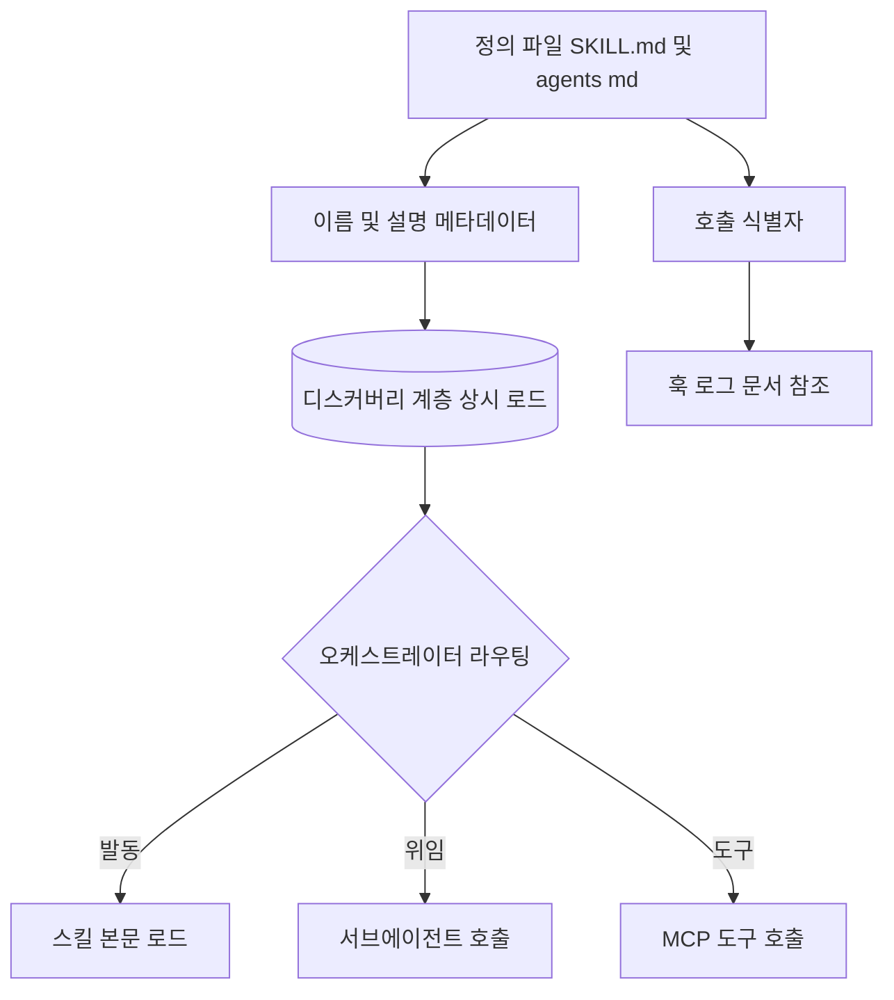
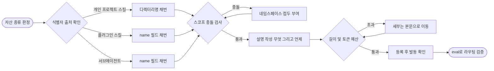

# 하네스 운영 네이밍 컨벤션 - 하네스 자산 범위

## 핵심 요약

**정의**: skill·subagent·slash command·workflow·MCP tool·plugin — 즉 **하네스 자신을 구성하는 정의 자산의 이름**을, 사람이 타이핑하는 호출 문자열이자 LLM이 라우팅 판단에 쓰는 입력으로 동시에 설계하는 규약. 다른 범위의 이름은 레이블이지만, 이 범위의 이름은 **API 표면**이다.

**배경**: 앞선 네 범위는 에이전트가 **읽는** 대상(코드·인프라·스키마)이거나 **쓰는** 대상(브랜치·PR·태그: [[fl-2026-09-12-configuration-management-naming-convention]])의 이름이었다. 이번 범위는 하네스 **자신의 표면**이다 — 개명 비용이 가장 크고, 품질 효과는 가장 즉각적이다. 상위 개념은 [[fl-2026-07-29-harness-engineering]].

- **이름이 곧 breaking change 단위**: plugin `name` 은 스펙상 immutable 로 규정된다. 컴포넌트 호출명이 이 값에서 파생되므로 최상위 이름 하나가 전체 호출 표면을 고정한다.
- **description 이 실제 라우팅 로직**: 스킬은 시작 시 `name`+`description` 만 로드되고(Skill당 약 100 토큰), 이 설명과 요청을 매칭해 발동을 판정한다. **형식 검증은 통과하면서 라우팅만 조용히 실패하는 유일한 계층이다.**
- **식별자의 출처가 자산마다 다르다**: 서브에이전트는 `name` 만이 정체성(파일명·경로 무관)인데, 개인·프로젝트 스킬은 반대로 **디렉터리명이 호출명**이고 `name` 은 표시 라벨일 뿐이다. 한 규약으로 뭉개면 반드시 한쪽이 틀린다.
- **네임스페이스는 충돌 회피 + 선택 힌트 이중 역할**: `plugin:component` 콜론 스코프가 충돌을 막고, prefix 그룹핑은 도구 선택 정확도 자체를 움직인다 — Anthropic 은 prefix/suffix 선택이 tool-use eval 에 non-trivial 영향을 주며 모델마다 다르다고 보고한다.

## 컴포넌트 다이어그램

정의 파일에서 추출된 이름·설명이 상시 로드되는 디스커버리 계층을 만들고, 오케스트레이터는 그 계층만 보고 라우팅한다. 같은 이름이 호출 식별자로 훅·로그·문서에도 동시에 박힌다.

## 적용 단계

핵심은 **자산 종류를 먼저 판정**하는 것이다. 식별자가 디렉터리명에서 오는지 `name` 필드에서 오는지가 종류마다 다르므로, 이 분기를 건너뛰면 이름을 고쳐도 호출명이 바뀌지 않는다.

## 핵심 기능 및 서비스

| 자산 | 이름 규칙 |
| --- | --- |
| Skill `name` (스펙) | **최대 64자**, **소문자·숫자·하이픈만**. **예약어 `anthropic`·`claude` 포함 금지**. `description` 은 비어 있을 수 없고 **최대 1024자**, "무엇을 하는가"와 "언제 쓰는가"를 **둘 다** 담아야 함 |
| Skill 호출명 (개인·프로젝트) | 호출명은 **디렉터리명**에서 나온다. frontmatter `name` 은 **표시 라벨일 뿐**. 폴더명 `synced` 는 claude.ai 동기화 예약이므로 **어떤 대소문자로도 사용 금지** |
| Skill 호출명 (플러그인) | `name` 이 커맨드 **마지막 세그먼트**가 되고 플러그인 접두로 네임스페이스된다. **`name` 을 비우면 설치 디렉터리명으로 폴백**하는데, marketplace 설치본은 그 값이 **업데이트마다 바뀌는 버전 문자열** |
| Skill 디스커버리 예산 | Level 1(이름+설명)은 **항상 로드, Skill당 약 100 토큰**. Level 2(본문)는 발동 시 로드. 목록에서는 `description`+`when_to_use` 합쳐 **1,536자에서 절단** |
| Subagent `name` | 소문자+하이픈, 스코프 내 유일. **파일명·경로는 정체성에 영향 없음.** 훅은 이 값을 `agent_type` 으로 받는다. **`:` 금지** — 포함 시 파일이 로드되지 않고 디버그 로그에만 에러 |
| Subagent 우선순위 | managed > `--agents` > `.claude/agents/`(프로젝트) > `~/.claude/agents/`(전역) > 플러그인 |
| Subagent 설명 예산 | `description` 합계가 **15,000 토큰 초과 시 시작 경고** |
| Slash command | 이름 충돌 시 **스킬이 우선**. 서브디렉터리 네임스페이싱은 문서화돼 있으나 **미동작 이슈가 보고**돼 있어 의존 금지 |
| Plugin `name` | **kebab-case**, 컴포넌트 네임스페이스의 근거이며 **immutable** |
| MCP tool `name` | **1–128자**, 대소문자 구분, 허용 문자 `A-Za-z0-9_-.`. **서버 내에서만 유일**. 표시명은 별 필드 `title` — **식별자와 표시명이 스펙 수준에서 분리** |
| MCP 서버 간 충돌 | 여러 서버를 합치는 클라이언트는 disambiguation 을 **스스로 구현해야** 한다. 결정적으로 **`serverInfo` 의 `name` 은 유일성이 보장되지 않아 disambiguation 근거로 쓸 수 없다** |
| MCP 이름 길이 예산 | 클라이언트 조합 접두(`mcp__plugin_{plugin}_{server}__{tool}`)가 상한을 쉽게 초과한다. 합계를 **작명 단계에서 미리 계산**해야 함 |
| Namespacing 전략 | prefix vs suffix 선택이 tool-use eval 에 **non-trivial 영향**이며 모델마다 다르다 → **자체 eval 로 결정**하라는 권고 |
| Workflow / DAG id | 식별자 전부 소문자, 파일명과 분리된 안정 식별자. **버전·날짜를 id 에 넣지 말 것** — 이력·SLA 가 id 로 키잉돼 개명 시 고아화된다 |

## 유사 기술 비교

| 항목 | 호출 식별자 이름 | description 기반 시맨틱 라우팅 | retrieval 기반 도구 선택 |
| --- | --- | --- | --- |
| 특징 | 이름 문자열이 곧 호출 키이자 네임스페이스 | 설명문과 요청을 매칭해 발동·위임 판정 | 후보를 벡터 검색으로 좁혀 소수만 노출 |
| 장점 | 결정론적, 충돌을 구조적으로 차단, 훅·로그와 조인 | 사용자가 이름을 몰라도 동작 | 자산 수백 개로 확장 가능 |
| 단점 | 개명이 breaking change, 길이·문자 제약 | **검증 수단이 없어 조용히 실패** | 인프라 추가, 검색 실패 시 진단 어려움 |
| 적합 케이스 | 사람이 직접 호출하는 스킬·커맨드 | 자동 발동·위임이 기본인 자산 | MCP 도구가 수십~수백 개로 늘어난 하네스 |

> 셋은 대체재가 아니라 **선택 공간을 좁히는 3단 필터**다. 이름은 *주소*, 설명은 *판단*, retrieval 은 *스케일*.

## 실제 사례

### 이 워크스페이스 실측 — 규약을 실제로 걸었을 때 (2026-09-14)

`platform-governance` 에 정본을 세우고 `platform-orchestration` 에 파일럿으로 걸어 한 바퀴 돌렸다. **로컬 시나리오가 전부 통과한 뒤에도 드러난 결함이 셋 나왔고, 셋 다 규약 자신이 잡았다.**

1. **eval 이 설명의 영역 침범을 잡았다.** `adopt-harness` 의 description 이 정의 파일 규격 점검까지 주장해 개인 스코프의 `defs-audit` 영역을 침범했고, 부정 케이스가 임계를 **0.007 차이로** 넘었다. 사람이 읽어서는 절대 안 보이는 폭이다.
2. **같은 자리에서 스코어러 결함이 드러났다.** SKIP 절 어휘를 *끌어당기는* 쪽으로 세고 있어서, 규약이 시키는 교정(SKIP 추가)을 하면 점수가 **더 나빠졌다.** 지표가 규약과 싸우는 상태다 — SKIP 토큰을 감점으로 돌려 고쳤다.
3. **훅이 엔진 결함을 잡았다.** `asset` 단건 모드가 형제 자산 목록을 몰라 SKIP 대체 경로의 실재성을 판정하지 못했다. 커밋이 실제로 막혔다.

그리고 **E2E 의 음성 통제 하나가 처음에 실패했다.** "설명을 지우면 정확도가 떨어져야 한다"는 어서션인데, "언제" 절만 지우는 통제가 약해 나머지 어휘로 여전히 100% 가 나왔다. 지표가 고장난 게 아니라 **통제가 약했던** 것이고, description 전체로 넓히자 100% → 50% 로 떨어졌다. **약한 음성 통제는 없는 것보다 나쁘다** — 통과를 찍으면서 아무것도 보증하지 않는다.

**선행 ADR 이 전제한 자산이 전부 부재였다.** [[dec-2026-09-10-harness-layer-naming]] 의 D2 는 형태 정본을 `platform-data-model` 로 지목하며 그 근거로 *"`skillNameLength` 가 이미 거기 있었다"* 를 들었는데, `naming.yaml` 도 `lint-naming.mjs` 도 ADR 0014 도 **워크스페이스 어디에도 없다.** 게다가 `~/.claude/skills/defs/reference/field-spec.md` 가 이름 형태 판정을 그 부재 자산에 위임해 둔 상태였다 — **정의 파일 SSOT 가 "여기가 아니다"라고 선언한 뒤 존재하지 않는 곳을 가리키고 있었다.** 읽는 쪽은 검사를 건너뛰는데 갈 곳이 없으므로 **미검사가 통과로 보인다.**

### Claude Code 스킬 — 같은 파일이 배포 경로에 따라 다른 이름으로 불린다

개인·프로젝트 스킬은 **디렉터리명**이 호출명이고 `name` 은 표시 라벨이다. 반면 플러그인 스킬은 `name` 이 커맨드 마지막 세그먼트가 된다. 즉 **동일한 SKILL.md 가 어디에 놓였는지에 따라 식별자 출처가 바뀐다.** 개인 스킬을 사내 플러그인으로 승격하는 순간 규칙이 뒤집히는데, `name` 을 비워 두면 marketplace 설치본은 **버전 문자열 디렉터리명**으로 폴백해 업데이트마다 호출명이 변한다.

### Claude Code 서브에이전트 — 경로가 아니라 `name` 이 정체성

`.claude/agents/` 는 재귀 스캔되지만 **서브디렉터리는 식별자에 영향을 주지 않는다.** `:` 를 넣으면 플러그인 스코프 예약과 충돌해 **파일이 아예 로드되지 않고 디버그 로그에만 에러가 남는다** — 조용한 실패의 전형이다.

### MCP 스펙 — `name`/`title` 분리와 "충돌은 클라이언트 책임"

유일성은 **서버 내부로만 한정**되고, 여러 서버를 합치는 클라이언트가 disambiguation 을 스스로 구현해야 한다. 결정적 제약: **`serverInfo` 의 `name` 은 유일성이 보장되지 않으므로 disambiguation 근거로 써서는 안 된다.** "서버명으로 접두를 붙이면 안전하다"는 직관을 스펙이 명시적으로 부정한다.

### Anthropic "Writing effective tools for agents" — 네임스페이싱이 eval 을 움직인다

**prefix 냐 suffix 냐의 선택이 tool-use 평가에 non-trivial 한 영향을 주고 그 방향이 모델마다 다르다.** 결론은 "정답 스킴"이 아니라 **자체 eval 로 정하라**는 것이다. 즉 이름은 취향이 아니라 **측정 대상**이다.

## 활용 시나리오

### 시나리오 1: 스킬이 발동하지 않는다 — 이름을 고칠까 설명을 고칠까

발동 판정 입력은 **`description`** 이므로 이름을 바꿔도 효과가 없다. 손댈 곳은 설명이며, "무엇을 하는가"만 있고 "언제 쓰는가"가 빠졌을 때가 대부분이다. 이름은 **사람의 호출 편의**를 위해 짧게 유지하고 개명은 최후 수단으로 남긴다.

### 시나리오 2: 서브에이전트가 20개로 늘어 위임이 엉킨다

설명 합계가 커지면 선택 공간이 넓어져 오위임이 늘고, 15,000 토큰을 넘으면 시작 경고까지 뜬다. 대응 셋 — 설명에서 구현 세부를 본문으로 이동, prefix 그룹핑, 스코프 우선순위 활용. 접두 방향은 추측하지 말고 **대표 요청으로 위임 정확도를 재서** 고정한다.

### 시나리오 3: 개인 스킬을 사내 플러그인으로 승격

식별자 출처가 **디렉터리명 → `name` 필드**로 바뀐다. 체크리스트: (1) 모든 스킬에 `name` 명시, (2) 플러그인 `name` 을 kebab-case 로 확정하고 **이후 불변으로 취급**, (3) 호출명이 `/{plugin}:{skill}` 로 바뀌는 것을 문서에 반영, (4) 예약어와 `synced` 회피 확인.

### 시나리오 4: 검증할 수 없는 조항을 규약에 넣어야 할 때 (이 워크스페이스의 해법)

"좋은 description 을 써라"는 규약이 될 수 없다 — **검증 불가능한 필수 조항은 조항이 아니다.** 측정 가능한 대리 지표 셋으로 대체한다: **구조**("무엇"+"언제" 마커), **경계**(SKIP 대체 경로가 *실재하는 자산인지까지*), **행동**(라우팅 eval). 셋째는 LLM 을 부르지 않는다 — 모델이 라우팅 시점에 실제로 보는 텍스트만으로 결정적 대리 함수를 돌리고, **그것이 무엇을 못 재는지를 규약이 명시한다.**

## 장단점 및 트레이드오프

| 항목 | 내용 |
| --- | --- |
| 장점 | 이름 하나로 호출·훅(`agent_type`)·로그·문서가 조인됨 · 네임스페이스가 충돌을 구조적으로 차단 · 디스커버리 비용이 Skill당 약 100 토큰이라 자산 수를 늘려도 컨텍스트 페널티가 작음 · 접두 그룹핑이 선택 정확도를 직접 개선 |
| 단점 | 개명이 breaking change · 식별자 출처가 자산 종류마다 달라 규약이 한 문장으로 안 끝남 · description 품질은 **기계 검증 수단이 없어** 형식만 통과하고 라우팅은 조용히 실패 · MCP 는 서버 간 유일성을 보장하지 않고 `serverInfo.name` 도 신뢰할 수 없음 |
| 트레이드오프 | **이름 안정성 ↔ 표현력**: 변할 것(버전·환경·소유팀)은 이름이 아니라 설명·태그에 둔다. **네임스페이스 명시성 ↔ 호출 길이**: 접두 깊이는 예산 안에서 정해야 한다. **규약의 확정성 ↔ eval 의존성**: prefix/suffix 는 모델별로 갈려 문서로 못 박을 수 없고, 팀이 자체 측정으로 고정해야 하는 유일한 항목이다 |

## 함정 및 안티패턴

- **안티패턴 1**: 개인·프로젝트 스킬에서 `name:` 만 고치고 호출명이 바뀔 것으로 기대 → 호출명은 **디렉터리명**에서 온다 → 폴더를 개명하고 `name` 은 표시 라벨로만 쓴다.
- **안티패턴 2**: marketplace 배포 플러그인의 스킬에 `name` 미기재 → 버전 문자열로 폴백해 **업데이트마다 호출명 변경** → 릴리스 체크리스트에 넣는다.
- **안티패턴 3**: 서브에이전트 `name` 에 `:` → **파일 미로드 + 디버그 로그 에러**, 조용히 사라짐 → 하이픈만 사용.
- **안티패턴 4**: 이름에 `anthropic`·`claude` 포함, 폴더명 `synced` 사용 → 벤더명은 이름에서 제외하고 목적으로 명명.
- **안티패턴 5**: `description` 에 "무엇"만 쓰고 "언제"를 생략 → **형식 검증은 통과하고 라우팅만 실패**하며 로그에 남지 않음 → 트리거 + SKIP 조건을 명시한다.
- **안티패턴 6**: 서브에이전트 설명에 구현 절차를 계속 추가 → 15,000 토큰 초과 시 시작 경고 → 설명은 위임 판단용 한두 문장.
- **안티패턴 7**: 이름·`dag_id` 에 버전·날짜 인코딩 → 개명 순간 **과거 실행이 고아화** → 식별자는 안정적으로 두고 버전·주기는 태그로.
- **안티패턴 8**: MCP 서버명으로 도구 접두를 붙여 충돌을 해결했다고 가정 → 스펙이 **`serverInfo.name` 을 disambiguation 근거로 쓰지 말라고 명시** → 클라이언트가 관리하는 별도 식별자로 접두하고 조합 길이를 예산에서 역산.
- **안티패턴 9**: 슬래시 커맨드 서브디렉터리 네임스페이싱에 의존 → 미동작 이슈 구간 → 네임스페이스를 **이름 문자열 자체**에 넣는다.
- **안티패턴 10 (실측)**: **벤더가 강제하는 사실과 우리가 정한 규칙을 한 정본에 섞는다** → 벤더 릴리스마다 우리 정본이 조용히 틀려진다 → 두 블록으로 물리적으로 가르고 벤더 쪽에 **실측일**을 박는다. 실측일 없는 사실은 사실이 아니라 기억이다.
- **안티패턴 11 (실측)**: **앞 층의 시간 유예(`enforcedSince`)를 이 층에 그대로 옮긴다** → 하네스 자산은 파일을 고치면 되므로 시간 경계가 필요 없고, 진짜 비가역성인 **개명**에는 시간 유예가 아무 도움도 안 된다 → 경계를 시각이 아니라 **범위**(강제/관측전용)로 긋는다.
- **안티패턴 12 (실측)**: **SKIP 절 어휘를 발동 어휘와 같이 센다** → 규약이 시키는 교정(SKIP 추가)이 측정을 악화시켜 **지표가 규약과 싸운다** → SKIP 토큰은 감점으로 돌린다.
- **안티패턴 13 (실측)**: **약한 음성 통제를 통과로 센다** → "설명을 지우면 정확도가 떨어져야 한다"를 약하게 통제하면 지표가 아무것도 안 재는데 초록이 뜬다 → 음성 통제는 **실제로 떨어지는 것을 관측**할 만큼 세게 건다.
- **안티패턴 14 (실측)**: **정본이 없는 곳을 SSOT 로 지목한다** → "이름 형태 판정은 여기가 아니다"라고 선언한 뒤 존재하지 않는 파일을 가리키면, 읽는 쪽은 검사를 건너뛰는데 갈 곳이 없어 **미검사가 통과로 보인다** → 전방 참조에는 실재 확인이 붙어야 한다.

## 참고 자료

- Agent Skills overview - Claude Platform Docs — `name` 64자·예약어 금지, `description` 1024자, progressive disclosure 3계층
- Extend Claude with skills - Claude Code Docs — 개인·프로젝트는 디렉터리명이 호출명, 플러그인은 `name`, 목록 1,536자 절단, `synced` 예약
- Create custom subagents - Claude Code Docs — `name` 이 유일한 정체성·`:` 금지·`agent_type` 전달·스코프 우선순위·15,000 토큰 경고
- Plugins reference - Claude Code Docs — 플러그인 `name` kebab-case·immutable, `plugin:component` 스코프
- Writing effective tools for AI agents - Anthropic Engineering — prefix/suffix 네임스페이싱의 eval 영향
- Tools - Model Context Protocol — tool `name` 1–128자·서버 내 유일성, `title` 분리, `serverInfo.name` 을 disambiguation 에 쓰지 말 것
- Tool Preferences in Agentic LLMs are Unreliable (arXiv 2505.18135) — 설명 편집만으로 도구 사용률이 최대 10배 변동
- Semantic Tool Discovery for LLMs (arXiv 2603.20313) — retrieval 기반 선택이 정확도를 13.62% → 43.13% 로 개선
- Harness engineering for coding agent users - Martin Fowler — 하네스 구성요소를 규약으로 관리하는 배경
- 본 규약의 구현: `rocio-eom/platform-governance` `conventions/harness.{md,json}` · `harness-lint.mjs` · `tests/e2e/harness/`
