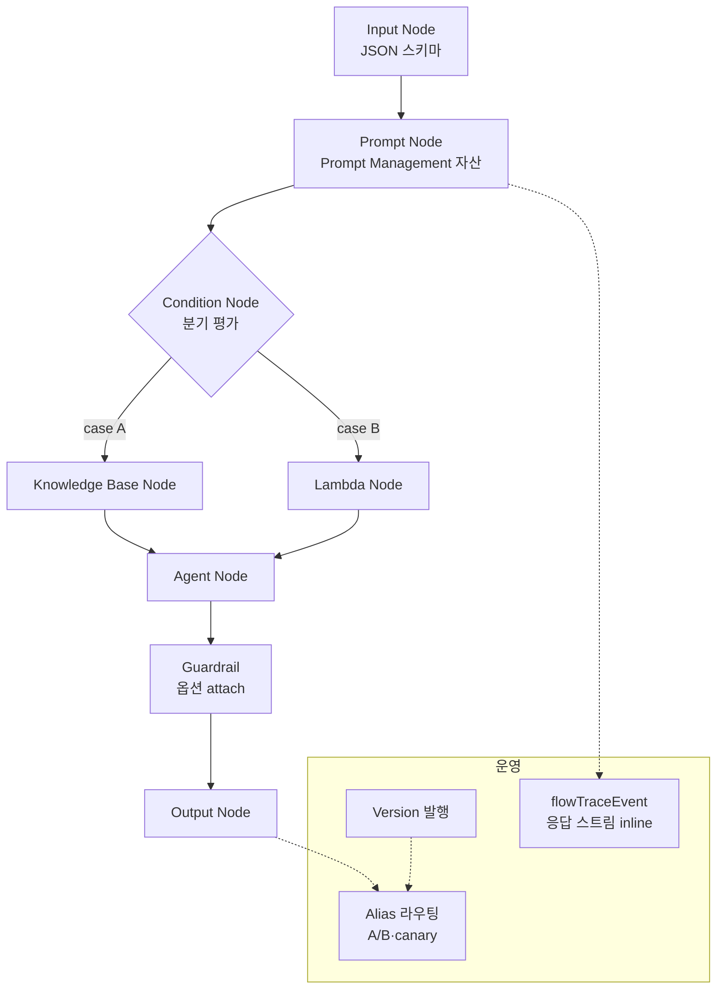
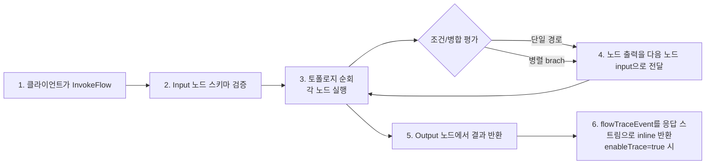

# Amazon Bedrock Flows

## 핵심 요약

Bedrock Flows는 **노드 기반 비주얼 빌더**로 GenAI 워크플로우를 구성·테스트·배포하는 매니지드 오케스트레이션 서비스이다. Prompts, Agents, Knowledge Bases, Guardrails, Lambda, Amazon Lex, S3 등을 시각적으로 연결해 멀티스텝 GenAI 파이프라인을 코드 최소화로 구축한다.

- **노드 기반 비주얼 빌더**: 드래그·드롭으로 Prompt → KB → Agent → Lambda 체이닝
- **조건부 분기·변수 전달**: condition 노드, iterator(반복), collector(병합) 지원
- **버저닝·트레이싱**: flow version 발행 + A/B 가능, 실행마다 trace 자동 기록
- **API·SDK 호출 가능**: `InvokeFlow` API로 백엔드에서 실행
- **Prompt Management 통합**: 재사용 가능한 prompt 자산을 노드로 끌어 쓰기

## 시스템 아키텍처

Flow는 노드의 directed graph로 표현되고, 런타임은 노드 간 데이터를 type-checked 변수로 전달한다.

## 처리 흐름

`InvokeFlow` 호출 한 건의 라이프사이클.

## 핵심 기능 및 서비스

| 기능 | 설명 |
|---|---|
| 비주얼 노드 빌더 | 콘솔에서 drag&drop, 변수 매핑은 노드 간 와이어로 표현 |
| 노드 종류 | Input/Output, Prompt, Agent, Knowledge Base, Lambda, Lex, S3, Iterator, Collector, Condition |
| Prompt Management 연동 | 별도 관리되는 prompt 자산을 노드로 임포트, 버전 고정 |
| Versioning & Alias | flow를 DRAFT → published version으로 발행, alias로 traffic 라우팅 |
| Trace & Debug | InvokeFlow에 `enableTrace: true` 설정 시 응답 스트림에 `flowTraceEvent` inline 반환 (노드별 input·output·timestamp). 콘솔 테스트 패널에서도 동일 정보 확인 |
| InvokeFlow API | 백엔드에서 SDK로 호출, 비동기 패턴은 별도 워커 필요 |
| Guardrails attach | Prompt·Agent 노드에 1-step 안전성 적용 |

## 과금

Bedrock Flows는 **node transition 기반 orchestration fee + underlying 서비스 비용 합산** 2축으로 과금된다. flow 정의·버저닝·콘솔 빌더 자체에는 비용이 없으며, 동작은 `InvokeFlow` 호출 시점에만 발생한다.

**1축 — Flows orchestration fee** (AWS 공식 pricing 기준): **$0.035 / 1,000 node transitions**. 1회 flow 실행의 node transition 수는 토폴로지·iterator 반복 횟수에 따라 가변. 예시(AWS 공식): 25 transitions/실행 × 960 실행/월 = $0.84/월.

**2축 — 노드별 underlying 서비스 비용**:

| 노드 종류 | 과금 |
|---|---|
| Input · Output · Condition · Iterator · Collector | orchestration fee만 (별도 underlying 없음) |
| Prompt 노드 | 호출된 FM의 input/output 토큰 단가 |
| Agent 노드 | 호출된 Agent의 underlying FM 토큰 (Agent 자체 fee 없음, [[aws-bedrock-agents]] 참조) |
| Knowledge Base 노드 | Retrieve 호출 = 임베딩 모델 query 토큰 + 벡터 스토어 사용료(예: OpenSearch Serverless OCU 시간당, S3 Vectors GB/검색 단가) |
| Lambda 노드 | Lambda 표준 요금 ($0.20/1M requests + $0.0000166667/GB-sec) |
| Lex 노드 | Lex 요청 단가 (스트리밍/배치별) |
| S3 노드 | S3 GET/PUT/스토리지 표준 단가 |
| Guardrails attach | 정책별 text unit 단가 ($0.15/1K text unit) |

> **요점**: Flow 1회 호출은 종종 5~10개 노드를 거치므로 **단일 모델 호출 대비 비용 누적 위험**이 크다. orchestration fee는 작지만 underlying FM·KB·Lambda가 트래픽 증가에 따라 선형 누적되므로 운영 전에 노드별 비용 시뮬레이션 권장. 또한 Flow 정의·버전 보관에는 비용이 없으나 동작은 InvokeFlow 호출 시점에만 발생한다.

## 유사 기술 비교

| 항목 | Bedrock Flows | AWS Step Functions | LangChain LCEL | n8n / Zapier |
|---|---|---|---|---|
| 특징 | GenAI 특화 비주얼 오케스트레이션 | 범용 상태머신 워크플로우 | 코드 기반 chain 구성 | 범용 SaaS 통합 |
| 장점 | Bedrock 리소스 네이티브, 시각적 직관성 | 강력한 에러 처리·재시도, 풀 AWS 통합 | 풀 프로그래머블, 멀티 LLM 지원 | SaaS·앱 통합 풍부 |
| 단점 | AWS 락인, 복잡 로직은 표현 한계 | LLM 친화성 낮음, JSON state 직접 작성 | 시각화 없음, 운영성 직접 구축 | LLM 깊이·기업 거버넌스 약함 |
| 적합 케이스 | Bedrock 중심 PoC·중간 복잡도 워크플로우 | 미션크리티컬 결정론적 워크플로우 | 코드퍼스트 팀, 멀티벤더 | 비기술 팀 자동화 |

## 실제 사례

### AWS — Bedrock Flows GA 데모
공식 데모: 고객 지원 흐름에서 사용자 의도 분류(Prompt 노드) → 환불 정책 KB 검색 → Lambda로 결제 시스템 호출 → 응답 합성을 비주얼 빌더로 구성. 콘솔 테스트에서 즉시 디버깅.

### C4 — Flows vs Step Functions 비교 사례
실제 운영팀이 LLM 파이프라인 수십 개를 마이그레이션한 후기. 단순 chain·분기는 Flows로, 장기 실행·복잡 보상 로직은 Step Functions로 분리하는 패턴.

## 활용 시나리오

### 시나리오 1: 다단계 콘텐츠 생성 파이프라인
"주제 → 개요 생성 → 섹션별 작성 → 일관성 검토 → 요약" 5단계를 각 Prompt 노드로 분리. 중간에 Condition으로 품질 점수가 낮으면 재생성 분기. 디자이너·PM이 직접 흐름 수정 가능.

### 시나리오 2: 고객 지원 라우팅
Input의 자연어 질문을 분류 Prompt → Condition으로 `결제/기술/일반` 분기 → 각 분기에서 다른 KB 검색 + 다른 Agent 호출. 새 카테고리 추가는 노드 추가로 처리.

### 시나리오 3: 멀티모달 처리 파이프라인
이미지 입력을 받아 Vision 모델 prompt 노드로 캡션 추출 → KB로 관련 제품 검색 → 추천 응답 생성. S3 노드로 결과 아카이브.

## 장단점 및 트레이드오프

| 항목 | 내용 |
|---|---|
| 장점 | (1) 시각화로 비기술 팀과 협업 용이 (2) Bedrock 리소스(Agent/KB/Prompt/Guardrails) 네이티브 연결 (3) Version·Alias로 안전한 롤아웃 |
| 단점 | (1) 복잡한 분기·예외 처리는 표현 한계, 비주얼이 오히려 가독성↓ (2) 장기 실행·재시도·SAGA 같은 패턴은 Step Functions 대비 약함 (3) Flow 자산이 console 중심이라 IaC(코드형 인프라) 관리가 번거로움 |
| 트레이드오프 | 가시성·속도(Flows) vs 견고성·범용성(Step Functions). PoC·중간 복잡도는 Flows, 미션크리티컬·복잡 SAGA는 Step Functions |

## 함정 및 안티패턴

- **장기 실행 잡을 Flows로 구현**: Flows는 동기 InvokeFlow 위주이고 장시간 워크플로우(>수십 분)에 부적합 → **대안**: Step Functions Standard Workflow + Flows를 sub-step으로 호출
- **모든 비즈니스 로직을 Lambda 노드로 흡수**: 복잡 로직이 Lambda에 숨고 Flow는 hello-world급이 됨 → **대안**: 결정론적 코어는 별도 마이크로서비스, Flow는 GenAI 의사결정 부분에 집중
- **버저닝 없이 DRAFT 직접 호출**: 운영 변경이 즉시 사용자에게 노출 → **대안**: published version + alias로 라우팅, alias만 점진 변경
- **Trace 비활성**: 사고 시 어느 노드에서 잘못됐는지 재현 불가 → **대안**: 프로덕션 트래픽 일정 비율 `enableTrace: true` 활성 후 응답 스트림의 `flowTraceEvent`를 별도 로그 sink(예: CloudWatch Logs / S3)에 적재해 사후 분석

## 참고 자료

- [Amazon Bedrock Flows (AWS 공식)](https://aws.amazon.com/bedrock/flows/) — 제품 페이지, 핵심 기능 요약
- [Amazon Bedrock Pricing — Flows 섹션 (AWS 공식)](https://aws.amazon.com/bedrock/pricing/) — node transition 단가($0.035 / 1K) 및 실행 예시
- [Node types for your flow (AWS Docs)](https://docs.aws.amazon.com/bedrock/latest/userguide/flows-nodes.html) — 12종 노드 (Agent · Collector · Condition · Input · Iterator · KnowledgeBase · LambdaFunction · Lex · Output · Prompt · Retrieval · Storage) 공식 목록
- [InvokeFlow API Reference (AWS Docs)](https://docs.aws.amazon.com/bedrock/latest/APIReference/API_agent-runtime_InvokeFlow.html) — `enableTrace` 플래그, `flowTraceEvent` 응답 스트림 동작
- [Deploy a flow with versions and aliases (AWS Docs)](https://docs.aws.amazon.com/bedrock/latest/userguide/flows-deploy.html) — DRAFT → published version → alias 라우팅
- [Build generative AI workflow with Flows (AWS Docs)](https://docs.aws.amazon.com/bedrock/latest/userguide/flows.html) — Flows 사용 가이드
- [Create a flow with a single prompt (AWS Docs)](https://docs.aws.amazon.com/bedrock/latest/userguide/flows-ex-prompt.html) — 단일 prompt flow 예제
- [Getting Started with Prompt Management Flows (AWS Samples)](https://aws-samples.github.io/amazon-bedrock-samples/agents-and-function-calling/bedrock-agents/bedrock-flows/Getting_started_with_Prompt_Management_Flows/) — Prompt Management 연동
- [Bedrock Flows vs Step Functions (C4 Blog)](https://www.dataa.dev/2026/03/10/amazon-bedrock-flows-vs-step-functions-when-visual-ai-orchestration-is-the-right-answer/) — 실전 비교 후기

## 관련 노트

- [[aws-bedrock-overview]] — Bedrock 플랫폼 컴포넌트 지도 (Flows의 상위 컨텍스트)
- [[aws-bedrock-agents]] — Flow의 Agent 노드에서 호출 대상
- [[bedrock-knowledge-bases]] — Flow의 KB 노드에서 retrieve 대상
- [[bedrock-claude-generation-models]] — Prompt 노드의 underlying FM 선택 기준
