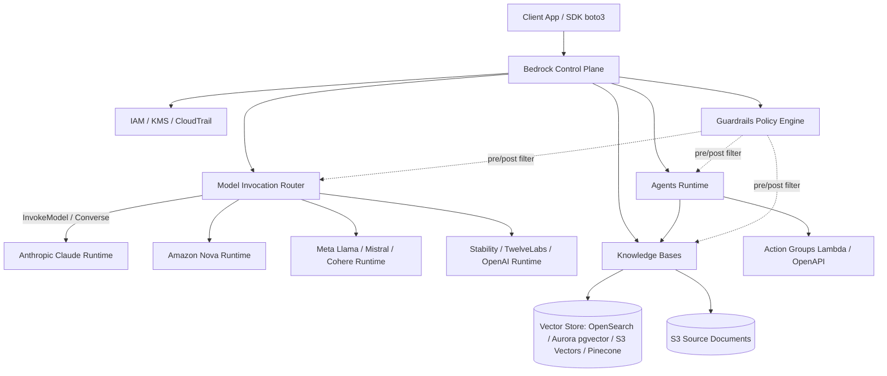
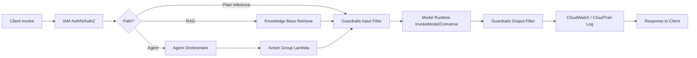

# Amazon Bedrock

## 핵심 요약

Amazon Bedrock은 단일 API와 IAM 경계 안에서 다수 공급사의 파운데이션 모델(FM)에 접근할 수 있게 해주는 **완전관리형 생성형 AI 서비스**다. 2023년 GA(General Availability) 이후 AWS는 "멀티 벤더 모델 카탈로그 + 엔터프라이즈 통합" 포지셔닝을 강화해 왔으며, Anthropic Claude·Amazon Nova·Meta Llama·Mistral·Cohere·AI21·DeepSeek·Stability AI·OpenAI·TwelveLabs 등을 동일 SDK 패턴으로 호출하고 모델 ID만 교체해 swap 가능하다.

> **버전 민감 항목 flag**: 지원 공급사 수·모델 변종 수(2026년 기준 18개 공급사 110+ 모델)는 정기 업데이트됩니다. 최신 현황은 [Supported foundation models](https://docs.aws.amazon.com/bedrock/latest/userguide/models-supported.html)로 확인하세요.

- **Multi-vendor unified API**: Anthropic Claude(Opus 4.7 포함), Amazon Nova(Premier 1M / Pro 300K / Lite 300K / Micro 128K), Meta Llama, Mistral, Cohere, AI21, DeepSeek, Stability AI, OpenAI, TwelveLabs 등을 단일 `InvokeModel`/`Converse` API로 호출
- **Serverless 과금**: 별도 GPU/엔드포인트 프로비저닝 없이 On-Demand(토큰 단위) 호출이 기본. 고정 처리량이 필요하면 Provisioned Throughput(MU 단위)으로 전환
- **엔터프라이즈 빌딩 블록 일체화**: Knowledge Bases(매니지드 RAG), Agents(도구 호출/액션 그룹), Guardrails(콘텐츠/PII/주제/환각 6종 정책), Model Customization(fine-tuning), Prompt Management, Model Evaluation을 단일 서비스에서 제공
- **데이터 격리**: 입력·출력은 모델 학습에 재사용되지 않으며 VPC Endpoint, KMS, IAM, CloudTrail로 AWS 보안 경계 내에서 운영

## 시스템 아키텍처

Bedrock은 클라이언트 측 SDK 호출을 단일 컨트롤 플레인이 받아 모델별 추론 백엔드와 보조 서브시스템(KB, Agent, Guardrail)으로 라우팅하는 구조다. 모든 데이터 경로는 AWS 백본 내부에서 처리되고, 외부 공급사 모델도 AWS 격리 환경에 배포된 인스턴스 위에서 실행된다.

## 처리 흐름

표준 호출은 IAM 인증 → 모델 라우팅 → (선택) Guardrails 입력 검사 → 모델 추론 → (선택) Guardrails 출력 검사 → 응답 반환 순서로 진행된다. RAG·Agent 경로에서는 라우팅 전후로 KB 검색과 Action 호출이 끼어든다.

## 핵심 기능 및 서비스

| 기능 | 설명 |
|---|---|
| Foundation Model Catalog | 멀티 벤더 모델 카탈로그. 단일 `InvokeModel`/`Converse` API로 호출, 모델 ID만 교체해 swap. |
| Amazon Nova | AWS 1st-party FM 패밀리. Premier(1M context), Pro(300K), Lite(300K), Micro(128K, text-only) + Canvas(이미지) / Reel(비디오). |
| Knowledge Bases | 매니지드 RAG. 소스(S3 등) → 청킹 → 임베딩 → 벡터 스토어(OpenSearch Serverless / Aurora pgvector / S3 Vectors / Pinecone) → Retrieve & Generate를 한 번에 구성. |
| Agents | LLM 기반 멀티스텝 에이전트. Action Group(Lambda/OpenAPI)으로 도구 호출, KB 통합, 자동 프롬프트 오케스트레이션. |
| Guardrails | 6종 정책: content filter, denied topics, sensitive info(PII) filter, word filter, image content filter, contextual grounding + Automated Reasoning(환각 검출). 유해 콘텐츠 최대 88% 차단, 사실성 검증 정확도 최대 99% (AWS Guardrails 공식 문서 기준, 버전 민감). |
| Model Customization | Fine-tuning, Continued Pre-training, Distillation 지원. 커스텀 모델은 Provisioned Throughput 호스팅만 가능. |
| Provisioned Throughput | 모델 단위(MU) 시간당 고정 요금. 1개월/6개월 commitment. 커스텀 모델 호스팅 및 일관된 지연 요구에 사용. |
| Prompt Management / Flows | 프롬프트 버전 관리, Flow 시각 빌더, A/B 평가 통합. |
| Model Evaluation | 자동/휴먼 평가 작업. 정확도·견고성·독성 등 메트릭으로 모델 선정 지원. |

## 과금

Bedrock은 영구 무료 티어가 없는 종량제(On-Demand) + 약정형(Provisioned Throughput / Batch / Flex) 혼합 모델이다.

> **버전 민감 항목 flag**: 아래 과금 구조·크레딧 정책은 변경될 수 있습니다. 최신 단가와 약관은 [Amazon Bedrock Pricing](https://aws.amazon.com/bedrock/pricing/)으로 재확인하세요.

| 가격 트랙 | 단위 | 비고 |
|---|---|---|
| On-Demand | 토큰 단위(text), 이미지·초·요청 수(modality별) | 약정 없음, 첫 호출부터 과금. 모델별 단가 10배 이상 편차. |
| Provisioned Throughput (PT) | model unit(MU) × 시간 | 1개월/6개월 commitment, 미사용에도 과금. 커스텀 모델 호스팅 PT 필수. |
| Batch Inference | On-Demand 대비 50% 할인 | 비동기, 시간 보장 약함. 대량 임베딩·평가에 적합. |
| Flex (Converse / InvokeModel) | On-Demand 대비 50% 할인 | latency 약간 ↑ 허용 시 자동 적용. Converse / InvokeModel만 지원. |
| Knowledge Bases · Guardrails · Agents · Custom Models | 부가 컴포넌트 비용 별도 | 모델 토큰료에 더해 누적. |

> **데이터 보관 비용 없음**: 캐시 보관·세션 컨텍스트 자체에는 별도 fee가 없다. Prompt caching은 cache read/write 토큰 단가로만 과금.

## 유사 기술 비교

| 항목 | Amazon Bedrock | Azure OpenAI Service | Google Vertex AI |
|---|---|---|---|
| 모델 카탈로그 | Multi-vendor(Anthropic, Meta, Mistral, Cohere, Stability, OpenAI, Amazon Nova 등) | OpenAI 단일(GPT-4o/4o-mini/4 Turbo, o1 등) | Gemini 네이티브 + Model Garden(서드파티) |
| 통합 API | 단일 `InvokeModel`/`Converse` | OpenAI 호환 API | Vertex AI Predict + Model Garden 어댑터 |
| 강점 | 모델 swap 자유도, IAM 일원화, KB/Agents/Guardrails 빌트인 | Microsoft 365·Entra ID·Teams 결합, OpenAI 최신 모델 직결 | BigQuery 네이티브 통합, Gemini 1M+ context, 멀티모달 |
| 약점 | OpenAI 최신 모델은 지연 출시, 가격 트래킹 복잡 | 벤더 락인(OpenAI 단일), 비-OpenAI 모델 부재 | FedRAMP High 미충족(2026 기준), AWS·Azure 대비 엔터프라이즈 침투율 낮음 |
| 적합 케이스 | AWS 네이티브, 멀티모델 실험·RAG·Agent를 한 계정으로 운영 | Microsoft 스택, M365/Copilot 연계 | GCP·BigQuery 중심, 장문 context·멀티모달 |

## 실제 사례

### Elastic

Elastic AI Assistant가 Bedrock 위의 Anthropic Claude를 호출해 보안 로그를 검토·분석하고 자연어로 답한다. 보안 운영팀이 위협 탐지·완화 시간을 단축하는 데 사용된다.

### ASAPP

CX 플랫폼이 Bedrock 위의 Claude로 GenerativeAgent를 구동. 콜 에스컬레이션 최대 40% 감소, 첫 통화 해결률 91%, 동시 처리 가능 복잡 인터랙션 수 3배 증가를 보고 ([ASAPP 공식 사례](https://aws.amazon.com/solutions/case-studies/asapp-case-study/)).

### Carrier

Abound Net Zero Management 제품이 Bedrock 위에서 유틸리티 데이터·이력·예측 분석을 결합해 에너지 소비·탄소 배출 관리 인사이트를 제공.

### 기타 엔터프라이즈

Delta Air Lines, Novo Nordisk, NextEra Energy, Freddie Mac, Synchrony 등 21개 산업에 걸친 도입이 공개되어 있다.

## 활용 시나리오

### 시나리오 1: AWS 네이티브 멀티모델 RAG 챗봇

**맥락**: 자사 문서(S3)와 Confluence를 근거로 답하는 사내 챗봇이 필요하지만 어떤 LLM이 가장 적합한지 미정.
**선택 이유**: Knowledge Bases로 청킹·임베딩·검색 파이프라인을 매니지드로 구성하고, Claude / Nova / Llama를 모델 ID 교체만으로 A/B 평가 가능.
**구체 적용**: S3 + OpenSearch Serverless 벡터 스토어로 KB 구성 → Model Evaluation으로 후보 비교 → Guardrails로 PII 마스킹 → On-Demand 시작 후 트래픽 안정화 시 Provisioned Throughput 전환.

### 시나리오 2: 컴플라이언스가 강한 엔터프라이즈 Agent

**맥락**: 보험사 약관 검토·청구 자격 판정 보조 에이전트. PII 유출과 환각 답변 절대 불가.
**선택 이유**: Agents + Guardrails 조합이 IAM/KMS/CloudTrail과 빌트인 통합. Automated Reasoning 기반 환각 검출 적용 가능.
**구체 적용**: KB로 약관 인덱싱 → Agent Action Group을 Lambda로 정책 조회 API 호출 → Guardrails로 PII 마스킹·grounding 검증 → CloudTrail로 모든 호출 로깅.

### 시나리오 3: 도메인 특화 모델 fine-tuning 및 운영

**맥락**: 사내 문서·코드 스타일에 특화된 어시스턴트. 자체 GPU 클러스터 운용 회피.
**선택 이유**: Bedrock Model Customization(fine-tuning, continued pre-training)을 매니지드로 실행, 결과 모델은 Provisioned Throughput으로 일관 지연 보장.
**구체 적용**: S3에 학습 데이터 업로드 → Nova/Claude 베이스에 fine-tuning 잡 → Model Evaluation으로 검증 → MU 1개월 commitment로 호스팅 → breakeven 분석 후 6개월로 비용 절감.

## 장단점 및 트레이드오프

| 항목 | 내용 |
|---|---|
| 장점 | (1) 멀티 벤더 단일 API로 모델 swap 비용 최소화. (2) KB·Agents·Guardrails 빌트인으로 RAG/Agent 스택을 별도 통합 없이 구성. (3) IAM·KMS·VPC Endpoint·CloudTrail로 엔터프라이즈 보안·감사 완비. (4) 입출력이 모델 학습에 미사용, 데이터 거버넌스 안전. |
| 단점 | (1) OpenAI 최신 모델은 Azure 대비 지연 출시. (2) Provisioned Throughput 가격·MU 의미 파악이 어렵고 capacity planning 복잡. (3) Knowledge Bases + 벡터 스토어 + Guardrails 부가 비용이 누적되어 단순 RAG도 초기 비용 발생. (4) 리전별 모델 가용성 차이가 커서 모델별 리전 매핑 필요. |
| 트레이드오프 | On-Demand의 유연성 ↔ throttling·비용 예측 어려움. Provisioned Throughput의 일관 성능·할인 ↔ commitment lock-in. 멀티 벤더 자유도 ↔ 신규 기능 도입 지연. |

## 함정 및 안티패턴

- **함정 1 — 커스텀 모델을 On-Demand로 호출 가정**: fine-tuned 모델은 On-Demand 호출 불가. **대안**: Provisioned Throughput MU를 사전 산정, 평가 단계에서 호스팅 비용을 별도 항목으로 trace.
- **함정 2 — Provisioned Throughput 조기 commitment**: PoC 단계에서 지연 보장만 보고 MU를 구매. **대안**: On-Demand로 1–2주 트래픽 분포 측정 → breakeven 계산(시간당 MU 가격 vs 토큰 단가 × 호출량) 후 commit.
- **함정 3 — Knowledge Bases 비용을 모델 비용만으로 추산**: 벡터 스토어·인덱싱·Retrieve 비용이 별도. **대안**: 토큰·KB·벡터 스토어 비용을 한 대시보드에서 통합 모니터링.
- **함정 4 — Guardrails 미적용으로 PII 노출**: Bedrock은 기본적으로 콘텐츠 검열을 수행하지 않음. **대안**: PoC 단계부터 Guardrails policy attach + 요청·응답 양방향 필터 표준 적용.
- **함정 5 — 리전·모델 가용성 무시**: 한 리전에서 동작한 코드가 다른 리전에서 모델 ID 없어 실패. **대안**: 모델별 리전 매트릭스 문서화 + Cross-Region Inference Profile 활용.
- **함정 6 — 자유 실험 방치로 비용 폭증**: 토큰 단가가 모델별 10배 이상 차이 나는데 모니터링 없이 전 팀에 IAM 권한 배포. **대안**: SCP + 모델별 호출 한도 + CloudWatch 비용 알람.

## 참고 자료

- [Amazon Bedrock 공식 페이지 — AWS](https://aws.amazon.com/bedrock/) — 서비스 개요, 모델 카탈로그, 가격 정책 일람
- [Amazon Bedrock User Guide — What is Amazon Bedrock?](https://docs.aws.amazon.com/bedrock/latest/userguide/what-is-bedrock.html) — 공식 사용자 가이드의 개념·아키텍처 도입
- [Supported foundation models in Amazon Bedrock](https://docs.aws.amazon.com/bedrock/latest/userguide/models-supported.html) — 지원 모델 카탈로그·리전 가용성
- [Amazon Bedrock Guardrails 공식 문서](https://docs.aws.amazon.com/bedrock/latest/userguide/guardrails.html) — 6종 정책·적용 방식
- [How Amazon Bedrock Guardrails works](https://docs.aws.amazon.com/bedrock/latest/userguide/guardrails-how.html) — Guardrails 내부 동작·88%/99% 성능 수치 출처
- [Increase model invocation capacity with Provisioned Throughput](https://docs.aws.amazon.com/bedrock/latest/userguide/prov-throughput.html) — MU·commitment·throughput 보장
- [Amazon Bedrock Pricing](https://aws.amazon.com/bedrock/pricing/) — On-Demand·Provisioned·Batch 가격 정책
- [Amazon Bedrock Customers — AWS](https://aws.amazon.com/bedrock/customers/) — Elastic·ASAPP·Carrier 등 도입 케이스 카탈로그
- [Elastic case study — Amazon Bedrock + Claude](https://aws.amazon.com/solutions/case-studies/elastic-case-study/) — Elastic AI Assistant 보안 운영 사례
- [ASAPP case study — GenerativeAgent on Bedrock](https://aws.amazon.com/solutions/case-studies/asapp-case-study/) — 콜센터 자동화 정량 효과

## 관련 노트

- [[aws-bedrock-agents]] — Bedrock Agents 상세: ReAct 기반 매니지드 에이전트, Action Group·KB·Guardrails 오케스트레이션
- [[aws-bedrock-embedding]] — Bedrock 임베딩 모델(Titan v2·Cohere): 서버리스 임베딩 API, IAM 인증, Knowledge Bases 통합
- [[bedrock-claude-generation-models]] — Bedrock Claude 4.X 모델 선택: Sonnet/Haiku/Opus 비용·품질·한국어 기준
- [[moc-aws-bedrock]] — 본 노트 소속 MOC. Bedrock 전체 컴포넌트 인덱스
