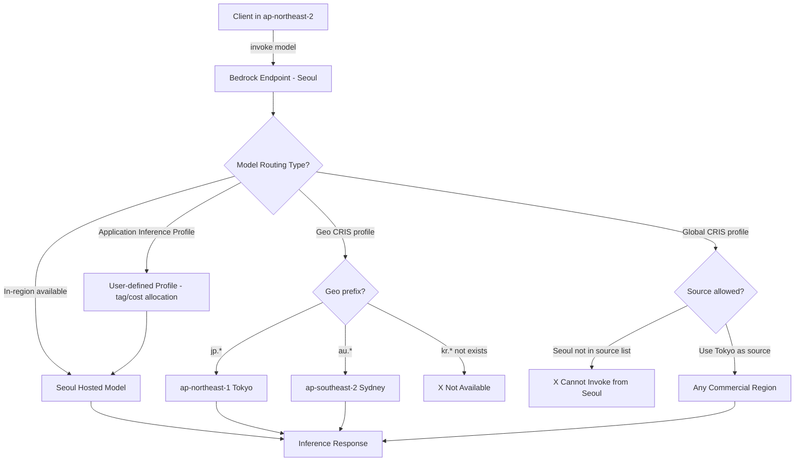
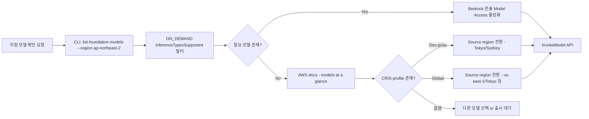

# AWS Bedrock Seoul Region Model Support

## 핵심 요약

AWS Bedrock의 모델 가용성은 region별로 다르며, 서울(ap-northeast-2)은 미국 리전(us-east-1·us-west-2) 대비 신규/플래그십 모델 출시가 늦거나 미지원인 경우가 많다. 본 노트는 **2026-06 시점** 서울 리전에서 호출 가능한 모델 카테고리와 그 한계를 정리한다.

- **3 가지 호출 경로**: ① in-region on-demand (Seoul에 모델이 호스팅됨), ② geographic cross-region inference (CRIS — 지역 라우팅), ③ global cross-region inference (모든 commercial region 라우팅). 서울은 in-region이 핵심이며 global CRIS source region 목록에는 미포함
- **Geo CRIS prefix**: APAC 영역에서 `jp.*` (Tokyo), `au.*` (Sydney) 만 존재. **`kr.*` 또는 서울 전용 geo profile 없음** → 한국 데이터 주권 요건이 있으면 in-region 모델만 사용 가능
- **Application Inference Profile**: 사용자가 base 모델 + 메타데이터(tag·cost allocation) 묶음으로 정의하는 invocation 프로파일. 서울은 application inference profile 생성 가능 region 목록에 포함 → 모니터링·cost allocation tag 적용은 region 제약 없음
- **신규 Claude flagship 한계**: Claude Sonnet 4.5+ / Opus 4.x / Haiku 4.5는 inference-profile-only로 출시되어 base model ID 직접 호출 불가. 서울에서 호출하려면 Global CRIS source region(Tokyo 등)을 우회하거나 us-east-1을 직접 호출

## 시스템 아키텍처

Bedrock의 region별 모델 가용성은 3계층 + 1보조로 구성된다. 클라이언트는 자신의 source region에서 호출하지만 실제 추론은 in-region / geo / global 라우팅 정책에 따라 다른 destination region에서 처리될 수 있다.

## 처리 흐름

서울 리전에서 사용 가능한 모델을 확정하려면 공식 source-of-truth를 다음 순서로 점검한다.

## 핵심 기능 및 서비스

서울 리전에서 호출 가능한 대표 모델 (2026-06 기준 · 변동 가능, AWS 공식 page 1차 source).

| 그룹 | 모델 / Model ID | 호출 방식 (Seoul 기준) | 비고 |
|---|---|---|---|
| Anthropic Claude (legacy) | Claude 3 Haiku, Claude 3.5 Sonnet, Claude 3.5 Haiku | in-region on-demand (점진적 추가) | Claude 3.5 Sonnet 초기 출시는 Seoul 미포함, 이후 확장. 모델 카드에서 region 확정 필수 |
| Anthropic Claude (latest flagship) | Claude Sonnet 4 / 4.5 / 4.6, Claude Opus 4.x / 4.8, Claude Haiku 4.5 | Global CRIS only (Seoul source 미지원, Tokyo 등 우회 필요) | `global.anthropic.claude-...` 프로파일 ID. Seoul에서 직접 invoke 불가 |
| Amazon Titan (text/embedding) | `amazon.titan-embed-text-v2:0`, `amazon.titan-text-express-v1`, Titan Text G1 | in-region on-demand | 임베딩은 broad availability — Seoul 대체로 지원 |
| Amazon Nova | Nova Lite / Pro / Premier, Nova 2 Lite | 일부 in-region + 일부 Global CRIS only | Nova 2 Lite 신규 모델은 Global routing only로 등록 |
| Cohere Embed | `cohere.embed-multilingual-v3`, `cohere.embed-english-v3`, Cohere Embed v4 | in-region on-demand | 다국어 임베딩 Seoul 1차 후보. [[cohere-embed-multilingual-v3]] 참조 |
| Cohere Command | Command R / R+ | 일부 in-region (region별 상이) | 출시 시점·region 추가 변동 큼 |
| Meta Llama | Llama 3 / 3.1 (8B/70B), Llama 3.2 multimodal | region별 상이 (Seoul 일부 버전 미지원) | 멀티모달은 us-* 위주 |
| Mistral | Mistral 7B, Mixtral 8x7B, Mistral Large | region별 상이 | Seoul 가용성 모델 카드 확인 |
| Stability AI | SDXL, Stable Image | 대부분 us-* / eu-* 위주 | Seoul 가용성 낮음 |
| Application Inference Profile | (모든 모델 대상) | Seoul 지원 region 목록에 포함 | 모니터링·태깅용. 모델 자체 가용성과 무관 |

> 신뢰 가능한 방법: `aws bedrock list-foundation-models --region ap-northeast-2 --query "modelSummaries[?contains(inferenceTypesSupported, 'ON_DEMAND')].[modelId,providerName]" --output table` 로 실시간 조회.

### 모델별 on-demand 가격 (2026-06 기준)

가격 단위 — Text/Chat: USD per 1M tokens (input / output) · Embedding: USD per 1M tokens (input only) · Image: USD per image. AWS Bedrock 공시 가격은 대부분 **region 무관 단일 가격**이며 CRIS 호출도 정가표 기준 청구(cross-region 데이터 전송 요금 별도). 신규 모델(Nova 2, Claude 4.6 등)은 출시 직후 변동 가능.

| 모델 | 가격 (USD) | Seoul 호출 경로 |
|---|---|---|
| Claude 3 Haiku | 0.25 / 1.25 | in-region |
| Claude 3.5 Sonnet v1/v2 | 3.00 / 15.00 | in-region |
| Claude 3.5 Haiku | 0.80 / 4.00 | in-region |
| Claude Sonnet 4 / 4.5 / 4.6 | 3.00 / 15.00 | Global CRIS only |
| Claude Opus 4.x | 15.00 / 75.00 | Global CRIS only |
| Claude Haiku 4.5 | 1.00 / 5.00 | Global CRIS only |
| Titan Text Embeddings V2 | 0.02 (input only) | in-region |
| Titan Text G1 Express | 0.20 / 0.60 | in-region |
| Titan Text G1 Lite | 0.15 / 0.20 | in-region |
| Nova Micro | 0.035 / 0.14 | in-region |
| Nova Lite | 0.06 / 0.24 | in-region |
| Nova Pro | 0.80 / 3.20 | in-region |
| Nova Premier | 2.50 / 12.50 | us-east-1 source CRIS |
| Nova 2 Lite (2026 신규) | 0.06 / 0.24 (출시 직후 변동 가능) | Global CRIS |
| Cohere Embed Multilingual v3 | 0.10 (input only) | in-region |
| Cohere Embed English v3 | 0.10 (input only) | in-region |
| Cohere Embed v4 | 0.12 (input only) | us-east-1 / CRIS (Seoul 미공시) |
| Cohere Command R | 0.50 / 1.50 | us-east-1 / CRIS |
| Cohere Command R+ | 3.00 / 15.00 | us-east-1 / CRIS |
| Llama 3 8B Instruct | 0.30 / 0.60 | us-east-1 (Seoul 미가용) |
| Llama 3 70B Instruct | 2.65 / 3.50 | us-east-1 |
| Llama 3.1 8B | 0.22 / 0.22 | us-east-1 / CRIS |
| Llama 3.1 70B | 0.72 / 0.72 | us-east-1 |
| Llama 3.1 405B | 2.40 / 2.40 | us-east-1 only |
| Llama 3.2 11B Vision | 0.16 / 0.16 | us-east-1 |
| Llama 3.2 90B Vision | 0.72 / 0.72 | us-east-1 |
| Mistral 7B Instruct | 0.15 / 0.20 | us-east-1 |
| Mixtral 8x7B Instruct | 0.45 / 0.70 | us-east-1 |
| Mistral Large (24.02) | 4.00 / 12.00 | us-east-1 |
| Mistral Large 2 (24.07) | 2.00 / 6.00 | us-east-1 |
| SDXL 1.0 | 0.04/image (≤50 steps), 0.08/image (>50) | us-east-1 |
| Stable Image Core | 0.04/image | us-east-1 |
| Stable Image Ultra | 0.14/image | us-east-1 |
| Stable Diffusion 3 Large | 0.08/image | us-east-1 |

> 비용 검증 1차 source: [Amazon Bedrock pricing](https://aws.amazon.com/bedrock/pricing/). region selector가 있으나 대부분 모델에서 단일 가격을 노출하므로 ap-northeast-2 동가 적용. provisioned throughput 단가는 region별 차등이 있으므로 별도 확인 필요.

## 유사 기술 비교

서울 vs 인접 region의 가용성 폭 비교.

| 항목 | ap-northeast-2 (Seoul) | ap-northeast-1 (Tokyo) | ap-southeast-1 (Singapore) | us-east-1 (N. Virginia) |
|---|---|---|---|---|
| In-region Claude flagship | 제한적 (legacy 위주) | 점진 확대, jp.* geo CRIS 존재 | 확대 중, apac.* 일부 | 신규 모델 1차 출시 region |
| Global CRIS source 자격 | 미포함 | 포함 (Claude Sonnet 4 등) | 미포함 (현재) | 포함 |
| Geo CRIS prefix | 없음 | `jp.*` | `apac.*` 일부 | `us.*` |
| 임베딩 모델 폭 | Titan v2, Cohere v3 multilingual·v4 등 충분 | 동등 이상 | 동등 | 가장 풍부 |
| 데이터 잔류 | 한국 잔류 (in-region 사용 시) | 일본 잔류 | 싱가포르 잔류 | 미국 잔류 |
| 적합 케이스 | 한국 데이터 잔류 요구 + 임베딩·legacy LLM 충분한 워크로드 | 일본 잔류 + 최신 Claude geo routing 필요 | 동남아 latency + APAC 가용성 | 최신 모델 즉시 사용 + cross-region 자유 |

## 실제 사례

### 사내 wiki RAG (Confluence) — 한국 데이터 잔류 요건
한국어 정책서·가이드의 vector index를 외부 송신 없이 Seoul에 잔류시켜야 하는 케이스. [[cohere-embed-multilingual-v3]] (`cohere.embed-multilingual-v3`)가 Seoul on-demand로 가용 → in-region 임베딩 적재 후 S3 Vectors / OpenSearch 인덱싱. Claude 응답 단계에서는 in-region Claude 3.5 Sonnet 또는 Tokyo source의 Global CRIS Claude Sonnet 4를 선택.

### 글로벌 본사 + 한국 지사 cross-region 운영
본사는 us-east-1 모든 최신 모델 사용, 한국 지사는 Seoul 임베딩 + Tokyo geo CRIS 조합으로 신규 Claude 활용. region별 권한·SCP로 destination region을 강제하여 컴플라이언스 분리.

## 활용 시나리오

### 시나리오 1: 한국어 RAG end-to-end (데이터 잔류 1순위)
- 청킹·임베딩: Seoul in-region Cohere Embed Multilingual v3 또는 Titan Embed v2
- vector store: Seoul S3 Vectors / OpenSearch Serverless
- 생성: Seoul in-region Claude 3.5 Sonnet (가용 시) 또는 Tokyo Global CRIS Claude Sonnet 4
- 트레이드오프: 데이터 잔류 ✓, 최신 모델 약간 후행

### 시나리오 2: 최신 Claude 즉시 활용 (지연 최소화)
- Bedrock client를 us-east-1로 향하게 설정, 데이터는 us-east-1로 송신
- Global CRIS profile `global.anthropic.claude-sonnet-4.6-...` 사용
- 트레이드오프: 모델 즉시성 ✓, 한국 잔류 ✗ (법무·보안 사전 확인 필수)

### 시나리오 3: Application Inference Profile로 cost allocation
- Seoul region application inference profile 생성 → `app-team-rag-prod` 등 tag 부여
- 동일 base 모델에 대해 팀·환경별 invocation 비용 분리 추적
- 모델 자체 가용성과 무관하므로 어떤 in-region 모델에도 적용 가능

## 장단점 및 트레이드오프

| 항목 | 내용 |
|---|---|
| 장점 | 한국 데이터 잔류 ✓ (in-region 호출 시), 임베딩 모델 카탈로그 충분 (Titan·Cohere v3/v4), latency 낮음, Application Inference Profile 지원 |
| 단점 | 최신 Claude flagship 직접 호출 불가 (Global CRIS source 자격 없음, kr.* geo profile 없음), 일부 멀티모달·이미지 모델 미지원, 신규 모델 출시 후행 |
| 트레이드오프 | 데이터 잔류와 모델 최신성의 대립 — 최신 Claude 필요 시 Tokyo geo CRIS 또는 us-* Global CRIS source로 region 전환 필요(데이터가 해당 region으로 송신됨). 잔류 우선이면 모델 후행 감수 |

## 함정 및 안티패턴

- **안티패턴 1: 모델 ID를 us-east-1 기준으로 하드코딩 후 Seoul 배포** → Seoul 미지원 모델 호출 시 `ResourceNotFoundException` 발생, prod에서 silent fallback 없음 → 배포 region별 모델 ID·CRIS profile을 IaC 변수로 분리, deploy 단계에서 `list-foundation-models`로 사전 검증
- **안티패턴 2: `kr.anthropic.*` 또는 서울 전용 geo profile 가정** → 존재하지 않는 prefix. 호출 즉시 실패 → APAC 영역의 geo profile은 `jp.*`, `au.*`만 사용. 한국에서 geo routing 필요하면 Tokyo source region으로 전환 검토
- **안티패턴 3: Global CRIS profile을 Seoul source로 호출 시도** → Global CRIS의 source region 목록에 Seoul 미포함 (현재 US 3개 + Ireland + Tokyo만) → Tokyo / Ireland / us-* 중 컴플라이언스 허용 region으로 source 변경
- **안티패턴 4: Bedrock 콘솔 "Model access" 활성화 누락 후 SDK 호출** → 콘솔에서 모델별 명시적 활성화 필요, 활성화 전엔 API 모두 403 → CI/CD 초기 단계에 model access 상태 점검 스텝 추가
- **안티패턴 5: 모델 카탈로그를 한 번 캡처 후 6개월 사용** → 모델 추가·deprecate가 빈번 (예: legacy Claude 2.x deprecate, 신규 Nova 2 등록). 인덱스·프롬프트 재작업 트리거를 놓침 → AWS 공식 "models at a glance" 페이지 또는 model catalog blog를 분기당 1회 재확인

## 갱신 정책

본 노트는 빠르게 변동하는 region 가용성·가격을 다루므로 staleness 추적이 핵심.

- **Snapshot 기준**: frontmatter `snapshot_date: 2026-06-06` 필드. 이 시점의 in-region 카탈로그·가격·CRIS source 목록을 기준 사실로 박제.
- **분기 재확인 트리거**: 매 분기 1회 다음 4개 source를 재확인 후 본문 갱신 + `snapshot_date` 업데이트.
  1. `aws bedrock list-foundation-models --region ap-northeast-2` (in-region 목록)
  2. [Supported Regions and models for inference profiles](https://docs.aws.amazon.com/bedrock/latest/userguide/inference-profiles-support.html) (CRIS source 목록 변동)
  3. [Amazon Bedrock pricing](https://aws.amazon.com/bedrock/pricing/) (가격 갱신·신규 모델 추가)
  4. AWS What's New 또는 region selector — 최근 발표된 region 추가·deprecate
- **즉시 갱신 트리거**: Claude Sonnet/Opus의 신규 마이너 release · Nova 신규 라인 · Seoul Global CRIS source 자격 변동 시.
- **deprecation 처리**: 모델이 Seoul에서 deprecate되면 표에서 제거하지 말고 "deprecated YYYY-MM"으로 표기 (역사적 lookup 가치 보존).

## 참고 자료

- [Amazon Bedrock pricing — AWS 공식](https://aws.amazon.com/bedrock/pricing/) — provider별 on-demand 가격 1차 source (region selector 포함)
- [Cross-region inference pricing — AWS 공식](https://aws.amazon.com/bedrock/cross-region-inference/) — CRIS 호출 시 정가표 청구 + 데이터 전송 요금 명시
- [Model support by AWS Region — Amazon Bedrock 공식](https://docs.aws.amazon.com/bedrock/latest/userguide/models-regions.html) — region별 모델 지원 진입점 (개별 모델 카드로 redirect)
- [Regional availability — Amazon Bedrock 공식](https://docs.aws.amazon.com/bedrock/latest/userguide/models-region-compatibility.html) — region 가용성 matrix
- [Supported Regions and models for inference profiles — Amazon Bedrock 공식](https://docs.aws.amazon.com/bedrock/latest/userguide/inference-profiles-support.html) — Geo / Global CRIS source 목록 (ap-northeast-2 포함된 application inference profile region 목록 명시)
- [Cross-region inference — Amazon Bedrock 공식](https://docs.aws.amazon.com/bedrock/latest/userguide/cross-region-inference.html) — CRIS 동작 원리
- [Supported foundation models — Amazon Bedrock 공식](https://docs.aws.amazon.com/bedrock/latest/userguide/models-supported.html) — 전체 모델 카탈로그
- [Amazon Bedrock endpoints and quotas](https://docs.aws.amazon.com/general/latest/gr/bedrock.html) — region 엔드포인트·쿼터
- [Claude in Amazon Bedrock — Claude API 공식](https://platform.claude.com/docs/en/build-with-claude/claude-in-amazon-bedrock) — Claude 모델별 region·CRIS 매핑
- [Amazon Bedrock Model Catalog 2026 — hidekazu-konishi](https://hidekazu-konishi.com/entry/amazon_bedrock_model_catalog_2026.html) — 110+ 모델 region 매트릭스(8 representative regions, Seoul 미포함이라 보조 참고)

## 관련 노트

- [[aws-bedrock-overview]] — Bedrock 플랫폼 전체 개요 (본 노트의 상위 컨텍스트)
- [[bedrock-claude-generation-models]] — Claude 모델 라인업·역량 (본 노트는 region 가용성 축, 본 link는 모델 축)
- [[bedrock-converse-api]] — model invocation API (region별 endpoint·CRIS profile 호출 패턴)
- [[aws-bedrock-embedding]] — Bedrock 임베딩 모델 전반 (Seoul in-region 임베딩 1차 후보들)
- [[cohere-embed-multilingual-v3]] — Seoul on-demand 가용 한국어 임베딩 1차 선택지
- [[titan-text-embeddings-v2]] — Seoul on-demand 가용 AWS-native 임베딩
- [[moc-aws-bedrock]] — 본 노트 소속 MOC
