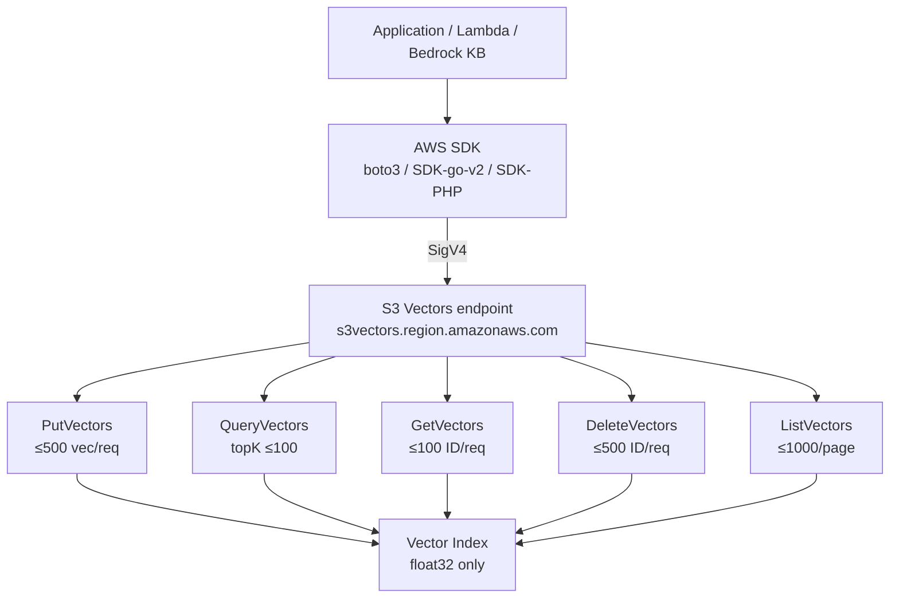
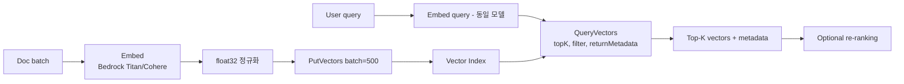

# AWS S3 Vectors Data Plane API

## 핵심 요약

S3 Vectors의 데이터 평면 API는 **단 5개 operation**으로 구성된다: `PutVectors`, `QueryVectors`, `GetVectors`, `DeleteVectors`, `ListVectors`. SDK API 버전은 **`2025-07-15`**이며, AWS SDK for Go v2, PHP, Python(boto3), Node.js 등 표준 SDK에 포함된다. 벡터는 항상 **float32**로 저장되고(상위 정밀도는 자동 다운캐스트), Top-K는 **최대 100**, 단일 PutVectors는 **최대 500개 벡터**까지 묶을 수 있다.

> **버전 민감 항목 flag**: 아래 한도(Top-K 100, batch 500, 처리량 2,500 vec/s)는 GA 기준이며 릴리스에 따라 변경될 수 있습니다. 최신 한도는 반드시 [S3 Vectors Limitations — AWS Docs](https://docs.aws.amazon.com/AmazonS3/latest/userguide/s3-vectors-limitations.html)에서 확인하세요.

- **5개 데이터 평면 작업**: Put / Query / Get / Delete / List.
- **벡터 데이터 형식**: 입력은 자유로우나 저장은 **float32**로 정규화.
- **배치 한도**: `PutVectors` 500, `DeleteVectors` 500, `GetVectors` 100, `ListVectors` page size 1,000.
- **검색 한도**: `QueryVectors` Top-K 최대 100 (프리뷰 한도 30에서 GA에서 100으로 확장).
- **처리량 가이드**: 인덱스당 **PutVectors/DeleteVectors 1,000 req/s** 또는 **2,500 vectors/s**, **QueryVectors/GetVectors/ListVectors 수백 req/s**.

## 시스템 아키텍처

5개 API는 vector index ARN을 타깃으로 동작하며, SDK는 표준 SigV4 인증으로 호출한다.

## 처리 흐름

전형적 RAG 흐름의 API 호출 시퀀스.

## 핵심 기능 및 서비스

| 작업 | 입력 한도 / 옵션 | 반환 |
|---|---|---|
| `PutVectors` | 벡터 ≤500개/req, 각 벡터에 key·data·metadata | 성공/실패 ID |
| `QueryVectors` | queryVector, **topK ≤100**, filter expression, returnMetadata, returnDistance | Top-K 벡터 + 거리 + 메타 |
| `GetVectors` | key ≤100/req | 벡터 attribute |
| `DeleteVectors` | key ≤500/req | 삭제 결과 |
| `ListVectors` | page size ≤1,000, nextToken | 벡터 키 목록 + 토큰 |
| 인증 | SigV4 표준, IAM policy로 액션별 제어 | — |
| 리전 엔드포인트 | `s3vectors.{region}.amazonaws.com` | — |
| 처리량 (인덱스당) | Put/Delete 1,000 req/s 또는 2,500 vec/s; Query/Get/List 수백 req/s | — |

## 유사 기술 비교

| 항목 | S3 Vectors API | OpenSearch _search (kNN) | Pinecone upsert/query | pgvector (SQL) |
|---|---|---|---|---|
| 인터페이스 | 5개 REST/SDK 메서드 | REST DSL JSON | gRPC/REST | SQL `<->`, `<#>` |
| 배치 단위 | Put 500, Get/Delete 100/500 | bulk API 임의 | upsert 100~1000 | INSERT batch |
| TopK 한도 | **100** | 사실상 무제한 | 1만 | 무제한 |
| 필터 표현 | JSON 표현식 | DSL query | sparse vector + metadata | WHERE 절 |
| 처리량 | Put 2,500 vec/s/index | OCU 수에 비례 | 자동 스케일 | 인스턴스 한계 |
| 적합 | 매니지드 콜드 RAG | 풀텍스트+벡터 하이브리드 | 운영 단순 SaaS | RDB 통합 |

## 실제 사례

### Bedrock Knowledge Bases — 내부 호출 표준화
KB는 `Ingestion Job`으로 PutVectors를 호출하고, `Retrieve` API 내부에서 QueryVectors를 호출한다. 사용자는 KB API만 보지만, **CloudTrail에는 `s3vectors:PutVectors` / `QueryVectors`가 기록**되어 비용·디버깅 단위가 이쪽이 된다.

### LangChain / LlamaIndex 통합 사례
`langchain-aws`와 `llama-index`는 S3 Vectors 통합을 제공한다. 다만 **기본 metadata payload가 2KB filterable 한도를 초과**하는 버그가 보고됨(`langchain-aws#693`, `llama_index#21062`) — SDK 위 추상 레이어가 한도를 모르면 PutVectors가 실패한다. 추상화 사용 시 메타 크기 가드 필수.

## 활용 시나리오

### 시나리오 1: 대규모 초기 인제스트 파이프라인
50M 벡터 초기 적재. PutVectors 500/req × 1,000 req/s = **500K vec/s 이론치**, 실제는 2,500 vec/s/index 가이드 하에서 **인덱스 N개 병렬화**가 표준. 단일 인덱스 worker 1개로는 불가. 작업자별로 인덱스 샤딩 키 분배 → fan-out.

### 시나리오 2: 실시간 RAG 검색 호출
사용자 질의마다 QueryVectors 1회. 인덱스당 수백 QPS 한도가 있어 **인덱스 라우팅 + 캐시 레이어**가 표준. Top-K 100까지 받을 수 있으니, 100개 후보 → LLM 재랭킹으로 최종 K를 정하는 패턴이 비용 효율적.

### 시나리오 3: 만료된 벡터 일괄 정리
TTL 기반 만료 워크플로. `ListVectors` 페이지 순회 → 만료 키 필터 → `DeleteVectors` 500 batch. ListVectors는 페이지 토큰 기반이라 cursor 보존이 중요. 단일 워커보다 키 범위 분할 후 병렬.

## 장단점 및 트레이드오프

| 항목 | 내용 |
|---|---|
| 장점 | (1) **API 표면이 5개로 작아** 학습·구현·SDK 코드 양 적음 (2) IAM·CloudTrail이 표준이라 거버넌스 통합 쉬움 (3) SigV4·VPC endpoint·PrivateLink와 매끄럽게 결합 (4) GA에서 Top-K 100, 처리량 가이드 명시화 |
| 단점 | (1) Filter DSL이 단순 — 복잡 표현식·BM25 등 풀텍스트 결합 불가 (2) 인덱스당 처리량 한도가 명확해 **고QPS 워크로드는 인덱스 샤딩**이 강제됨 (3) 벡터가 **float32 강제** — int8 / fp16 quantization으로 절감 불가 |
| 트레이드오프 | "단순·매니지드" vs "표현력·튜닝". OpenSearch / Pinecone과 달리 인덱스 알고리즘 노브(HNSW M/ef, IVF nlist 등)가 없다. 단순함을 산 대신 튜닝 여지를 포기. |

## 함정 및 안티패턴

- **Top-K = 30 한도 가정 (프리뷰 잔재)**: GA에서 **100으로 확장**. 30을 기준으로 짠 코드는 불필요한 multi-query 패턴이 남아 있을 수 있음.
- **벡터를 float64 / fp16으로 보낸 채 정밀도 가정**: 저장 시 **float32로 다운캐스트**. 정밀도 손실이 검색 결과에 영향을 주는 케이스(고차원 의학·금융 임베딩)에서는 사전 검증 필요.
- **단일 인덱스에 모든 PutVectors 몰아넣기**: 2,500 vec/s 한도 초과 시 throttling. **인덱스 샤딩**(예: tenant ID hash mod N)으로 분산.
- **PutVectors batch = 1**: HTTP overhead가 RTT의 대부분. **batch 100~500 유지**. SDK 추상 레이어가 batch=1로 동작하면 처리량이 1/100~1/500로 떨어짐.
- **ListVectors로 전체 스캔 후 재인덱싱 가정**: 페이지가 1,000개씩이라 50M 벡터면 5만 요청. 재인덱싱은 **소스 데이터에서 재임베딩**이 정석. ListVectors는 디버깅·감사용.

## 참고 자료

- [Amazon S3 Vectors API Reference — AWS Docs](https://docs.aws.amazon.com/AmazonS3/latest/API/API_Operations_Amazon_S3_Vectors.html) — 5개 API 공식
- [PutVectors — AWS Docs](https://docs.aws.amazon.com/AmazonS3/latest/API/API_S3VectorBuckets_PutVectors.html) — 요청·응답 스키마
- [QueryVectors — AWS Docs](https://docs.aws.amazon.com/AmazonS3/latest/API/API_S3VectorBuckets_QueryVectors.html) — kNN 쿼리 스키마
- [Querying vectors — AWS Docs](https://docs.aws.amazon.com/AmazonS3/latest/userguide/s3-vectors-query.html) — 쿼리 가이드
- [Limitations and restrictions — AWS Docs](https://docs.aws.amazon.com/AmazonS3/latest/userguide/s3-vectors-limitations.html) — 모든 한도값
- [S3 Vectors best practices — AWS Docs](https://docs.aws.amazon.com/AmazonS3/latest/userguide/s3-vectors-best-practices.html) — 처리량 가이드
- [s3vectors package — aws-sdk-go-v2](https://pkg.go.dev/github.com/aws/aws-sdk-go-v2/service/s3vectors) — Go SDK 시그니처
- [Api-S3vectors-2025-07-15 — AWS SDK for PHP V3](https://docs.aws.amazon.com/aws-sdk-php/v3/api/api-s3vectors-2025-07-15.html) — API 버전
- [Basic operations with S3 Vectors in Python and Node.js — DevelopersIO](https://dev.classmethod.jp/en/articles/amazon-s3-vectors-basic-operation-using-python-and-node-js/) — 실전 코드
- [langchain-aws S3 Vectors metadata 버그 — GitHub #693](https://github.com/langchain-ai/langchain-aws/issues/693) — 추상화 한도 위반 사례
- [llama_index S3 Vector metadata 한도 — GitHub #21062](https://github.com/run-llama/llama_index/issues/21062) — 동일 사례

## 관련 노트

- [[aws-bedrock-overview]] — S3 Vectors가 속한 Bedrock 생태계 개요
- [[bedrock-knowledge-bases]] — S3 Vectors를 내부 vector store로 사용하는 managed RAG 서비스
- [[aws-bedrock-embedding]] — PutVectors에 전달할 임베딩을 생성하는 Bedrock 임베딩 API
- [[titan-text-embeddings-v2]] — S3 Vectors와 함께 사용하는 주요 임베딩 모델
- [[moc-aws-bedrock]] — 본 노트 소속 MOC
