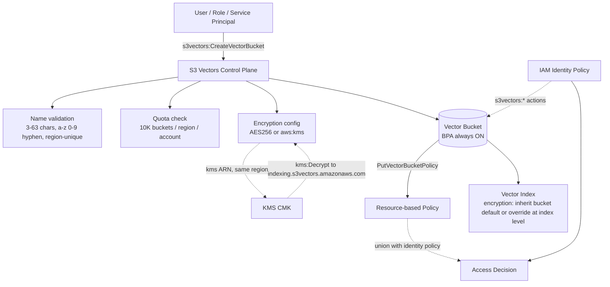
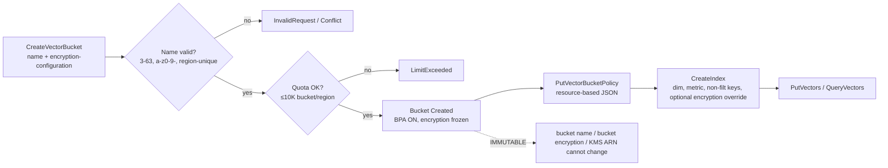

# S3 Vectors Bucket Governance

> 본 노트는 vector bucket의 **생성 규칙(naming · quota · immutability) + IAM action · resource-based policy 운영**에 집중한다. 리소스 모델 자체(2-tier 구조·BPA·CFN 리소스 타입)는 [[aws-s3-vectors-resource-model]], 암호화 메커니즘(인덱스 단위 override 포함)은 [[aws-s3-vectors-encryption]] 참조.

## 핵심 요약

S3 Vectors의 vector bucket은 일반 S3 bucket과 **거의 모든 거버넌스 규칙이 다르다**. 이름은 **계정·리전 단위 유니크**(글로벌 아님)이고, **Block Public Access는 끌 수 없으며**, **bucket 단위 encryption 설정은 생성 후 변경 불가**(인덱스 단위 override는 가능, 그러나 인덱스도 생성 후 불변)다. 접근 제어는 `s3vectors` 네임스페이스 한정 IAM action과 `PutVectorBucketPolicy` 기반 resource-based policy로 운영하며, 두 정책은 **union 평가**된다.

- **네이밍**: 3~63자, lowercase + digits + hyphens, letter/number 로 시작·종료. 변경 불가. (일반 S3 글로벌 유니크와 달리 **리전 유니크**.)
- **Quota**: bucket 10,000/region/account, index 10,000/bucket, vector 2B/index, dimension 1~4,096.
- **Immutable on create**: bucket name, **bucket-level** encryption configuration(SSE-S3 vs SSE-KMS), KMS key ARN. 인덱스도 생성 시점에 차원·메트릭·non-filterable keys·encryption(override 시) 모두 불변.
- **BPA 강제**: 모든 vector bucket에서 Block Public Access 항상 ON. 토글 자체가 존재하지 않음.
- **Policy API**: `PutVectorBucketPolicy` / `GetVectorBucketPolicy` / `DeleteVectorBucketPolicy`. resource ARN은 `arn:aws:s3vectors:<region>:<account>:bucket/<name>[/index/<name>]`.
- **Seoul 지원**: 2025-12 GA 시점에 ap-northeast-2 포함 14개 리전 사용 가능.

> **버전 민감 항목**: GA 리전 목록·quota 수치·action 명세는 2025-12 GA 시점 기준. 최신값은 AWS docs 재확인.

## 시스템 아키텍처

bucket 생성 → encryption 결정 → bucket policy 부착 → index 생성 → KMS·IAM·CFN과 결합. 모든 enforcement 포인트는 `s3vectors` 서비스 네임스페이스 안에서 닫힌다.

## 처리 흐름

`CreateVectorBucket` → encryption·이름 검증 → quota 검증 → bucket 생성 → optional policy 부착 → index 생성 순서. 이름·bucket encryption 설정은 이 시점 이후 변경 불가.

## 핵심 기능 및 서비스

| 기능 | 설명 |
|---|---|
| Naming rule | 3~63자, `a-z 0-9 -`, 시작·종료는 letter/number. 생성 후 변경 불가 |
| Uniqueness scope | **AWS 계정 × 리전 단위 유니크** (일반 S3의 글로벌 유니크와 다름) |
| Bucket quota | 계정·리전당 vector bucket 10,000개 |
| Index quota | bucket당 vector index 10,000개 |
| Vector quota | 인덱스당 vector 최대 2 billion, dimension 1~4,096 |
| Encryption (bucket default) | SSE-S3 (`AES256`) 기본 / SSE-KMS (`aws:kms` + customer managed key). **bucket 생성 후 변경 불가** |
| Encryption (index override) | 인덱스 생성 시 bucket default를 **override 가능** (SSE-S3 또는 SSE-KMS). 인덱스 생성 후엔 불변 |
| KMS 제약 | same Region, **full ARN** 필수(alias 불가), `indexing.s3vectors.amazonaws.com`에 `kms:Decrypt` 부여 |
| Block Public Access | **항상 ON, 비활성 불가** (토글 없음) |
| Policy API | `PutVectorBucketPolicy` / `GetVectorBucketPolicy` / `DeleteVectorBucketPolicy` |
| Resource ARN | `arn:aws:s3vectors:<region>:<account>:bucket/<name>` (+ `/index/<name>`) |
| Condition keys | `s3vectors:sseType`, `s3vectors:kmsKeyArn`, `s3vectors:VectorBucketTag/<key>` + AWS global tag keys |
| CloudFormation | `AWS::S3Vectors::VectorBucket`, `AWS::S3Vectors::VectorBucketPolicy` (update on encryption ⇒ Replacement) |
| Tagging | Bucket당 최대 50 tag. `TagResource`/`UntagResource`/`ListTagsForResource` |

## 유사 기술 비교

| 항목 | S3 Vectors Vector Bucket | 일반 S3 Bucket | Pinecone Project/Index | OpenSearch Domain |
|---|---|---|---|---|
| 이름 유니크 범위 | 계정 × 리전 | **글로벌** | 프로젝트 내 | 계정 × 리전 |
| 이름 변경 | 불가 | 불가 | 불가 | 불가 |
| Block Public Access | 강제 ON | 옵션(기본 ON) | API key 기반 | VPC/도메인 정책 |
| 암호화 | bucket 생성 후 불변, index override 가능 | 변경 가능 | 매니지드 | 변경 가능 |
| 권한 모델 | `s3vectors:*` + bucket policy | `s3:*` + bucket policy | API key + RBAC | IAM + fine-grained |
| 리소스 quota | 10K bucket × 10K index | 100 bucket(soft), 무제한 object | 플랜별 | 도메인별 |
| IaC | CFN `AWS::S3Vectors::*` (신규) | CFN `AWS::S3::*` (풍부) | Terraform | CFN/CDK |
| 적합 케이스 | RAG 벡터 전용 거버넌스 | 일반 객체 | 전용 벡터 SaaS | 하이브리드 검색 |

## 실제 사례

### Bedrock Knowledge Bases — service principal 권한 누락
Bedrock KB가 vector bucket을 자동 생성할 때 KB 서비스 롤이 `s3vectors:*` action을 보유하지 못해 `AccessDeniedException`이 가장 흔한 첫 실패. 일반 S3의 `s3:*` 정책이 그대로 통하지 않는 **네임스페이스 분리의 직접 결과**. 해결은 KB 롤에 `s3vectors:CreateVectorBucket`, `CreateIndex`, `PutVectors`, `QueryVectors`, `GetVectors` 추가.

### 멀티테넌트 SaaS — bucket tag + index-level CMK 분리
한 vector bucket에 테넌트별 index를 두고 **인덱스 단위로 SSE-KMS 키를 override**해 테넌트별 CMK로 분리하는 패턴이 표준이다. AWS docs는 `CreateIndex` 시 `encryptionConfiguration`으로 bucket default를 override 가능함을 명시한다(`indexing.s3vectors.amazonaws.com`에 `kms:Decrypt` 부여 필요). 추가로 bucket 자체는 `s3vectors:VectorBucketTag/tenant` condition으로 IAM 격리를 보강. 자세한 인덱스 단위 암호화 운영은 [[aws-s3-vectors-encryption]] 참조.

## 활용 시나리오

### 시나리오 1: 운영 환경 분리(account × region)
이름이 계정·리전 단위 유니크라서 dev/stg/prod를 **같은 이름**(`rag-prod`)으로 다른 계정에 재사용 가능. 일반 S3 글로벌 유니크 제약에서 벗어나, IaC 템플릿을 계정만 바꿔 그대로 재배포하는 단순 패턴이 가능.

### 시나리오 2: Cross-account read-only 공유
데이터 소유 계정의 vector bucket policy에 분석 계정 Role을 Principal로 두고 `s3vectors:QueryVectors`, `GetVectors`, `ListIndexes`만 허용. Resource는 `bucket/<name>`과 `bucket/<name>/index/*` 양쪽을 모두 지정해야 한다(QueryVectors는 index 레벨, ListIndexes는 bucket 레벨).

### 시나리오 3: 암호화 정책 강제(가드레일)
조직 SCP에서 `s3vectors:CreateVectorBucket` / `s3vectors:CreateIndex`에 대해 `Condition: StringNotEquals: s3vectors:sseType = aws:kms`이면 Deny. 모든 vector bucket이 강제로 KMS CMK 사용하도록 강제하는 컴플라이언스 가드레일. SSE-S3 fallback을 차단할 때 사용.

## 장단점 및 트레이드오프

| 항목 | 내용 |
|---|---|
| 장점 | (1) 리전 유니크라 환경별 이름 재사용 가능 (2) BPA 강제로 의도치 않은 공개 노출 원천 차단 (3) `s3vectors` 네임스페이스 분리로 일반 S3 정책 사고가 벡터 데이터에 번지지 않음 (4) condition key로 SSE/KMS 강제 가드레일 가능 (5) tag 기반 IAM·과금 attribution 깔끔 (6) 인덱스 단위 CMK override로 테넌트별 키 분리 가능 |
| 단점 | (1) 일반 S3 라이프사이클·CRR·이벤트·VPC 엔드포인트 정책을 **재사용 불가** (2) BPA 비활성 불가 — 공개 정적 자산 패턴 자체가 부적합 (3) bucket·index 모두 생성 후 encryption 불변 → 키 회전·암호화 전환 시 해당 리소스 자체 재생성 (4) `s3vectors` action prefix가 새로 도입되어 기존 SCP·가드레일 재작성 필요 |
| 트레이드오프 | "기존 S3 운영 자산 재사용" vs "벡터 워크로드 격리·BPA 강제". AWS는 후자를 강하게 선택했다. 운영팀은 새 IAM/CFN/SCP 표준을 1회 수립하면 이후 거버넌스가 더 단순해진다. |

## 함정 및 안티패턴

- **일반 S3 IAM 정책 재사용**: `s3:GetObject`로 vector bucket 접근 시도 → 항상 거부 → `s3vectors:GetVectors` 등 새 prefix로 별도 정책 작성.
- **글로벌 유니크 가정한 네이밍**: 일반 S3처럼 `rag-vectors-prod` 충돌 회피용 suffix(uuid 등) 자동 부착 → 리전 유니크라 불필요한 복잡도 → 환경 라벨(`rag-prod-apne2`)로 충분.
- **bucket-level 암호화 사후 변경 시도**: SSE-S3로 생성 후 SSE-KMS로 전환 시도 → 불가 → **신규 bucket + blue/green 마이그레이션 + DNS/alias 컷오버**가 유일한 경로. 생성 시점에 결정.
- **index-level 암호화 사후 변경 시도**: 인덱스 override 설정도 생성 후 변경 불가 → 인덱스 재생성 + reindex 필요.
- **KMS key alias 사용**: bucket 생성·index 생성 시 KMS alias나 key id 전달 → 거부 → **full ARN** 필수.
- **KMS key policy에 서비스 권한 누락**: `indexing.s3vectors.amazonaws.com`에 `kms:Decrypt` 누락 → PutVectors 시점에 `AccessDeniedException` → key policy에 서비스 principal 등록 필수.
- **BPA 토글 시도**: console/CLI/CFN에서 BPA off 시도 → 옵션 자체가 없음 → 공개 정적 자산은 일반 S3 + CloudFront 패턴으로 분리.
- **Resource ARN 불일치**: `QueryVectors` 권한을 bucket ARN에만 부여 → action은 index 레벨이라 거부 → `bucket/<name>/index/*`까지 함께 명시.
- **QueryVectors의 returnMetadata 권한 누락**: `s3vectors:QueryVectors`만 허용하고 `returnMetadata=true`로 호출 → 거부 → `s3vectors:GetVectors`도 함께 부여 (filter 사용 시에도 동일).
- **인덱스 단위 KMS 분리를 못 한다고 잘못 가정**: 실제로는 `CreateIndex`의 `encryptionConfiguration`으로 bucket default를 override해 인덱스별 다른 CMK 지정 가능. 테넌트별 키 분리·CloudTrail 감사 모두 인덱스 레벨로 가능 → 격리 경계 설계 시 인덱스 단위 옵션도 고려. 자세한 운영 패턴은 [[aws-s3-vectors-encryption]] 참조.

## 참고 자료

- [Vector bucket naming rules — AWS Docs](https://docs.aws.amazon.com/AmazonS3/latest/userguide/s3-vectors-buckets-naming.html) — 길이·문자·유니크 규칙 공식 (High)
- [Limitations and restrictions for S3 Vectors — AWS Docs](https://docs.aws.amazon.com/AmazonS3/latest/userguide/s3-vectors-limitations.html) — quota 1차 출처 (High)
- [Creating a vector bucket — AWS Docs](https://docs.aws.amazon.com/AmazonS3/latest/userguide/s3-vectors-buckets-create.html) — CLI/콘솔 파라미터, 암호화 불변성 (High)
- [Managing vector bucket policies — AWS Docs](https://docs.aws.amazon.com/AmazonS3/latest/userguide/s3-vectors-bucket-policy.html) — PutVectorBucketPolicy 등 (High)
- [Identity and Access Management in S3 Vectors — AWS Docs](https://docs.aws.amazon.com/AmazonS3/latest/userguide/s3-vectors-access-management.html) — BPA 강제, action·ARN 형식 (High)
- [Resource-based policy examples — AWS Docs](https://docs.aws.amazon.com/AmazonS3/latest/userguide/s3-vectors-resource-based-policies.html) — cross-account / deny 패턴 (High)
- [Identity-based policy examples — AWS Docs](https://docs.aws.amazon.com/AmazonS3/latest/userguide/s3-vectors-iam-policies.html) — IAM 예시 (High)
- [Actions, resources, and condition keys for Amazon S3 Vectors — Service Authorization](https://docs.aws.amazon.com/service-authorization/latest/reference/list_amazons3vectors.html) — action·condition key 권위 출처 (High)
- [Data protection in S3 Vectors — AWS Docs](https://docs.aws.amazon.com/AmazonS3/latest/userguide/s3-vectors-data-encryption.html) — SSE-S3/SSE-KMS, **인덱스 단위 override 명시** (High)
- [AWS::S3Vectors::VectorBucket — CloudFormation](https://docs.aws.amazon.com/AWSCloudFormation/latest/TemplateReference/aws-resource-s3vectors-vectorbucket.html) — CFN 속성, Replacement 트리거 (High)
- [AWS::S3Vectors::VectorBucketPolicy — CloudFormation](https://docs.aws.amazon.com/AWSCloudFormation/latest/TemplateReference/aws-resource-s3vectors-vectorbucketpolicy.html) — CFN 정책 리소스 (High)
- [Amazon S3 Vectors is now generally available — What's New](https://aws.amazon.com/about-aws/whats-new/2025/12/amazon-s3-vectors-generally-available/) — GA 리전(Seoul 포함) (High)

## 관련 노트

- [[aws-s3-vectors-overview]] — S3 Vectors 전체 개요와 도입 맥락
- [[aws-s3-vectors-resource-model]] — 2-tier 리소스 모델(bucket → index → vectors)과 namespace 분리
- [[aws-s3-vectors-encryption]] — 인덱스 단위 SSE-KMS override · per-index CMK · 멀티테넌트 키 분리 운영
- [[aws-s3-vectors-api]] — Put/Get/Query API와 action 매핑
- [[aws-s3-vectors-capacity-planning]] — quota 한도 내 인덱스·벡터 capacity 산정
- [[aws-s3-vectors-cfn-privatelink-tagging]] — CloudFormation 리소스·PrivateLink·tagging 운영
- [[aws-s3-vectors-metadata-schema]] — filterable/non-filterable metadata key 설계
- [[bedrock-kb-s3-vectors-integration]] — Bedrock Knowledge Bases에서 vector bucket을 백엔드로 사용할 때의 통합
