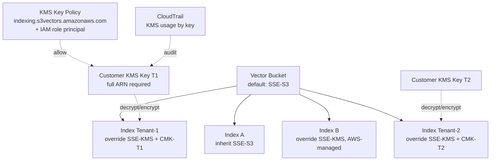
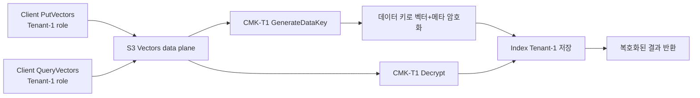

# S3 Vectors Encryption (per-index CMK)

## 핵심 요약

S3 Vectors는 **인덱스 단위로 암호화 설정을 override** 할 수 있다. 버킷 기본값을 SSE-S3로 두고, 민감 인덱스만 SSE-KMS + 고유 CMK로 지정하는 패턴이 표준이다. KMS 키는 **반드시 전체 ARN으로 지정**해야 하며(키 ID·alias 불가), CMK 사용 시 **S3 Vectors 서비스 프린시플에 KMS 권한을 명시적으로 부여**해야 한다. 이 메커니즘이 **멀티테넌트 SaaS에서 테넌트별 키 분리**의 핵심 빌딩 블록이 된다.

- **암호화 방식**: SSE-S3 (기본, AWS 관리) / SSE-KMS (AWS 관리 키) / **SSE-KMS + CMK** (사용자 관리, 인덱스별 가능).
- **설정 레벨**: 버킷 default / **인덱스 override** (인덱스 설정이 버킷보다 우선).
- **키 식별**: **전체 ARN 강제** — `arn:aws:kms:ap-northeast-2:<account>:key/<key-id>`. Alias 미지원.
- **권한**: KMS 키 정책에 `indexing.s3vectors.amazonaws.com` 서비스 프린시플(`kms:Decrypt`) + 사용 IAM 역할에 `kms:GenerateDataKey`, `kms:Decrypt`.
- **감사**: CloudTrail에 KMS 사용 기록 — 테넌트별 키별 사용량 트래킹 가능.

## 시스템 아키텍처

버킷 기본 / 인덱스 override / 테넌트별 CMK 분리 구조.

## 처리 흐름

쓰기/읽기 경로에서 KMS 키 호출 시퀀스.

## 핵심 기능 및 서비스

| 항목 | SSE-S3 | SSE-KMS (AWS-managed) | SSE-KMS + CMK |
|---|---|---|---|
| 키 소유 | AWS 관리 | AWS 관리 | **사용자(CMK)** |
| 키 정책 / 회전 제어 | 불가 | 제한 | **완전 제어** |
| CloudTrail 감사 | 부분 | 부분 | **완전(키 단위)** |
| 비용 | 무료 | KMS request 단가 | KMS request + 키 보관료 |
| 인덱스별 override | 가능 | 가능 | **가능 (멀티테넌트의 핵심)** |
| 키 식별 | — | aws/s3vectors alias | **full ARN 강제** |
| 권한 | 자동 | 자동 | **서비스 프린시플 명시 부여** |
| 멀티테넌트 적합성 | 낮음 | 중간 | **높음 (테넌트별 키 격리)** |

## 유사 기술 비교

| 항목 | S3 Vectors per-index CMK | OpenSearch domain KMS | Pinecone 멀티테넌시 | 일반 S3 bucket key |
|---|---|---|---|---|
| 격리 단위 | **인덱스** (10K/bucket) | 도메인 | 네임스페이스 (논리) | 객체 / 버킷 |
| 키 정책 사용자 제어 | 가능 (CMK) | 가능 | 제한 | 가능 |
| 비용 격리 | 인덱스·CMK 단위 가시성 | 도메인 단위 | 별도 | 객체 단위 |
| 컴플라이언스 (BYOK) | 가능 | 가능 | 부분 | 가능 |
| 적합 케이스 | RAG 멀티테넌트 | 도메인 단위 격리 | SaaS 빠른 시작 | 객체 데이터 격리 |

## 실제 사례

### 의료 / 법무 SaaS — 테넌트별 BYOK
환자·고객 데이터 기반 RAG. 테넌트(병원·로펌)별로 별도 CMK를 보관하고 S3 Vectors 인덱스를 1:1 매핑. 테넌트가 키 사용을 일시 정지(`kms:Disable`)하면 해당 인덱스 접근이 즉시 차단 — **kill switch 패턴**.

### Bedrock KB + S3 Vectors — 자동 CMK 매핑
KB 생성 시 vector store CMK를 지정하면 KB가 자동으로 vector index에 동일 CMK를 설정. KB 서비스 롤이 CMK 정책에 추가돼야 함. 미설정 시 ingestion job이 `KMSAccessDeniedException`으로 실패.

### 단일 버킷 / 다중 CMK 패턴
한 vector bucket 안에서 인덱스별 CMK만 다르게 두는 구성. **버킷 정책·CFN 스택은 공유**하면서 키 단위 격리·감사 가능. 운영 단순성과 암호화 격리의 균형.

## 활용 시나리오

### 시나리오 1: 멀티테넌트 RAG SaaS
테넌트당 인덱스 1개 + 인덱스별 CMK. 테넌트 onboarding = (1) CMK 생성 → (2) 키 정책에 `indexing.s3vectors.amazonaws.com`(`kms:Decrypt`) + 테넌트 전용 IAM 역할(`kms:GenerateDataKey`·`kms:Decrypt`) 추가 → (3) `CreateVectorIndex` with encryption override → (4) tenant ID를 filterable metadata에 부착.

### 시나리오 2: BYOK / 키 소유 분리
일부 엔터프라이즈 고객은 자기 AWS 계정의 KMS 키 사용을 요구. SaaS 계정의 vector bucket이 cross-account CMK를 사용하도록 grant 부여 — 키 소유는 고객, 데이터 처리는 SaaS.

### 시나리오 3: 컴플라이언스 키 회전·삭제
연 1회 자동 키 회전 활성화. 기존 데이터는 이전 키 자료로 복호화 가능, 신규 적재는 새 키 자료로 암호화. 테넌트 이탈 시 CMK schedule deletion → 해당 인덱스 데이터 사실상 **crypto-shredding**.

## 장단점 및 트레이드오프

| 항목 | 내용 |
|---|---|
| 장점 | (1) **인덱스 단위 격리**가 멀티테넌트 SaaS에 최적 (2) BYOK·crypto-shredding·키 정책 자유로 컴플라이언스 친화 (3) CloudTrail 키별 감사로 복호화 주체·시점 명확 (4) 버킷 default + 인덱스 override의 2단 구성으로 운영 단순 |
| 단점 | (1) KMS 비용(요청·키 보관)이 PUT/Query마다 누적 — 고QPS에서 의미 있음 (2) **full ARN 강제** — 키 별칭/ID 사용 자동화 코드는 재작성 필요 (3) 키 정책에 서비스 프린시플·IAM 역할 누락 시 모든 작업이 `KMSAccessDenied`로 실패 (4) cross-account CMK 사용 시 정책·grant 복잡도 증가 |
| 트레이드오프 | "격리·컴플라이언스" vs "비용·운영 복잡도". 모든 인덱스에 CMK를 두면 비용·운영이 부담 — **민감 인덱스만 CMK, 나머지는 SSE-S3** 권장. |

## 함정 및 안티패턴

- **KMS 키 alias / ID로 설정 시도**: full ARN 강제 — 잘못된 식별자 사용 시 `InvalidArgumentException`. CFN 템플릿에서 `!Sub` / `!GetAtt`로 ARN을 동적 생성.
- **CMK 정책에 서비스 프린시플 누락**: `indexing.s3vectors.amazonaws.com`에 `kms:Decrypt` 권한이 없으면 인덱싱 백그라운드 작업이 실패. IAM 역할에는 `kms:Decrypt` + `kms:GenerateDataKey` 둘 다 필요. 키 정책 템플릿이 첫 트러블슈팅 포인트.
- **모든 인덱스에 CMK 적용**: KMS 비용 + 운영 부담 누적. 격리가 필요한 워크로드만 CMK, 나머지는 SSE-S3.
- **CMK 회전 = 데이터 재암호화 가정**: KMS는 키 자료를 회전하지만 **기존 데이터는 이전 키 자료로 복호화** 됨. 명시적 재암호화는 별도 재인제스트 필요.
- **테넌트 삭제 후 CMK만 disable**: KMS는 30~365일 대기 후 삭제. 그 기간 인덱스 데이터는 복구 가능 상태. 즉시 무결성 보장이 필요하면 **인덱스 삭제 + CMK schedule deletion 병행**.

## 참고 자료

- [Data protection and encryption in S3 Vectors — AWS Docs](https://docs.aws.amazon.com/AmazonS3/latest/userguide/s3-vectors-data-encryption.html) — 암호화 모델 공식 (High)
- [Setting encryption in S3 Vectors — AWS Docs](https://docs.aws.amazon.com/AmazonS3/latest/userguide/s3-vectors-sectting-encryption.html) — 인덱스별 override 설정 (High)
- [Using SSE-KMS — AWS Docs](https://docs.aws.amazon.com/AmazonS3/latest/userguide/UsingKMSEncryption.html) — SSE-KMS 일반 (High)
- [Working with S3 Vectors — AWS Docs](https://docs.aws.amazon.com/AmazonS3/latest/userguide/s3-vectors.html) — 보안 일반 (High)
- [Using S3 Vectors with Amazon Bedrock Knowledge Bases — AWS Docs](https://docs.aws.amazon.com/AmazonS3/latest/userguide/s3-vectors-bedrock-kb.html) — KB + CMK 통합 (High)
- [AWS S3 Encryption with CMKs — Medium](https://medium.com/@dyavanapellisujal7/aws-s3-encryption-with-customer-managed-keys-using-sse-kms-for-secure-object-storage-045f6fddeea5) — CMK 패턴 (Mid)
- [S3 Encryption Types Guide 2026](https://go-cloud.io/s3-encryption-types/) — 암호화 유형 정리 (Mid)

## 관련 노트

- [[aws-s3-vectors-api]] — PutVectors·CreateVectorIndex 호출 시 암호화 파라미터가 적용되는 데이터 플레인
- [[aws-s3-vectors-capacity-planning]] — 테넌트당 인덱스 분리가 CMK 격리와 함께 설계되는 capacity 전략
- [[aws-s3-vectors-cfn-privatelink-tagging]] — CMK + VPC Endpoint + tag-on-create 로 구성하는 enterprise readiness 패턴
- [[aws-s3-vectors-bucket-governance]] — bucket-level immutability·`s3vectors:*` IAM·resource-based policy·BPA 강제와 결합되는 거버넌스 평면
- [[bedrock-kb-s3-vectors-integration]] — KB에서 CMK 지정 시 ingestion job 권한 요건
- [[moc-aws-bedrock]] — 본 노트 소속 MOC
