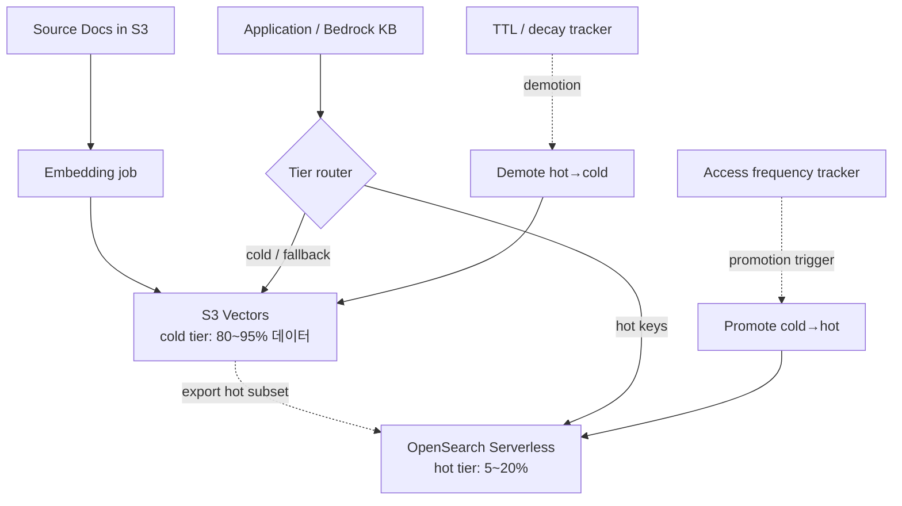
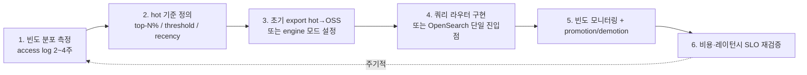

# AWS S3 Vectors Hot/Cold Tiering

## 핵심 요약

벡터 검색 워크로드의 **빈도 분포가 long-tail**이라는 관찰에서 출발해, 자주 질의되는 hot subset(전체의 5~20%)만 **OpenSearch**에 두어 ms 단위 응답을 보장하고, cold 대부분은 **S3 Vectors**에 저장해 비용을 최대 90% 절감하는 AWS-specific 아키텍처 패턴. 일반 hot/cold 티어링 이론은 [[hot-cold-data-tiering]] 참조, 본 노트는 **S3V × OSS 결합 시점에 발생하는 두 가지 통합 형태**와 운영 트레이드오프에 집중한다.

- **두 가지 통합 모드**: (a) **Export 방식** — S3 Vectors → OpenSearch Serverless로 핫 부분 point-in-time 복제(수동 재export 필요), (b) **Engine 방식** — OpenSearch Managed Cluster가 S3 Vectors를 백엔드 벡터 엔진으로 사용(자동 라우팅).
- **워크로드 전제**: 빈도 long-tail 분포 — 균일 분포 워크로드에서는 효과 없음. **사전 access log 분석 2~4주가 선결**.
- **Promotion / Demotion 트리거**: 사용자 정의 임계치(접근 빈도·moving window). promotion이 너무 민감하면 OSS 비용 폭증, demotion이 너무 느리면 비용 절감 미달.
- **공식 가이드**: AWS Prescriptive Guidance가 hybrid를 표준 RAG 패턴으로 권장. cold/idle 95%+ 단독 워크로드는 [[aws-s3-vectors-cold-tier-rag]]로 우회 가능(라우터 불필요).

> **버전 민감 항목 flag**: 본 노트의 hot ratio(5~20%), 비용 절감 폭(70~90%), cold/hot latency 차이(10~50배), hot/cold cutoff 정책(60/90일)은 2026년 6월 기준 일반적 보고치이며 워크로드·리전·서비스 단가 변경에 따라 변동합니다. SLO·비용 계획 시 [AWS S3 Vectors 공식 pricing](https://aws.amazon.com/s3/pricing/) 및 자체 PoC 실측으로 재확인하세요.

## 시스템 아키텍처

S3V + OSS 결합 시 라우터·promotion tracker·decay tracker가 추가된다. Bedrock KB는 그 앞단 단일 진입점 역할.

## 처리 흐름

운영 lifecycle 6단계. 빈도 분포가 변하면 1단계로 재진입.

## 핵심 기능 및 서비스

| 통합 방식 | 동작 | 동기화 | sync 신선도 | 적합 케이스 |
|---|---|---|---|---|
| **Export to OSS Serverless** | S3V → OSS로 hot subset point-in-time 복제 | **수동 재export** | 재export 주기 의존 (예: 주간) | 안정적 hot set, 주간 갱신 허용 |
| **OSS as engine on S3 Vectors** | OSS Managed Cluster가 S3V를 백엔드로 사용 | 자동 (OSS가 관리) | 거의 실시간 | 빠른 통합, 단일 검색 API |
| **라우터 자체 구현** | 앱이 hot/cold 키 라우팅 + 두 store에 별도 호출 | 앱 책임 | 앱 동기화 로직 의존 | 최대 유연성, 복잡도 ↑ |
| **Bedrock KB + S3V (cold-only)** | KB가 S3V를 vector store로, OSS 없음 | KB ingestion job | KB 동기화 주기 | 매니지드 RAG의 cold-only 운영 |

## 유사 기술 비교

본 패턴이 vault에 등장하는 다른 데이터 티어링과 어떻게 다른지 정렬.

| 항목 | S3V + OSS tiering | Pinecone Serverless 단일 티어 | Elasticsearch warm/cold node | S3 Intelligent-Tiering |
|---|---|---|---|---|
| 데이터 분리 | 물리적 service 분리 (S3V vs OSS) | 내부 추상화 (서버리스 자동) | node role 분리 | S3 객체 단위 자동 |
| 비용 절감 폭 | 70~90% (cold long-tail) | 워크로드 자동 (사용량 과금) | hot 노드 비용 절감 | 30~70% (객체 storage) |
| 사용자 운영 부담 | tier promotion 직접 결정 | 자동 | ILM 정책 작성 | 거의 없음 |
| 검색 단일 API | Engine 모드면 가능, Export는 라우팅 필요 | 가능 | 가능 (cluster) | N/A (storage only) |
| 정합성 | Export는 수동 sync, Engine은 자동 | 자동 | ILM 자동 | 자동 |
| 적합 데이터 | 벡터 (semantic search) | 벡터 (semantic search) | 풀텍스트 + 시계열 | 일반 객체 |

## 실제 사례

### Qlik — 데이터 카탈로그 시맨틱 검색
수억 벡터를 S3 Vectors에 두고 OpenSearch를 앞단에 둠. 자주 검색되는 카탈로그 엔티티는 OSS에, 아카이브 엔티티는 S3V. **사용자가 인지하는 검색 API는 OSS 단일**, tier 분리는 운영 상세. AWS Builder Center 벤치마크 글이 본 사례의 P50/P99를 측정.

### Caylent — 하이브리드 벡터 스토리지 경제성 분석
"hot vs cold 비율"에 따른 비용·레이턴시 시뮬레이션. **hot=10% 균등 가정 시 순수 OSS 대비 약 70~80% 절감**, hot 비율이 40% 이상이면 절감 효과 급감. PoC가 cold-only로 시작 → 사용량 증가 시 hybrid 전환이 자연스러운 진화 경로.

### BigData Boutique — P50/P99 측정
OSS + S3 Vectors 하이브리드의 응답 시간 측정. hot 경로는 OSS와 동등(ms), cold 경로는 sub-second이지만 일관되게 OSS보다 **10~50배 느림**. **SLO 차등화**가 UX 설계 필수(검색 중… 상태 또는 두 단계 응답).

## 활용 시나리오

### 시나리오 1: e-커머스 추천 + 카탈로그 검색
지난 7일간 노출된 상품 임베딩만 OSS hot, 나머지 카탈로그는 S3V cold. 추천(개인화·실시간) = OSS, 검색(롱테일 SKU 발견) = S3V. promotion 트리거 = "노출 발생 시 hot으로 이동", demotion = "7일 미노출 시 cold 환원". hot 비율 10% 이하 유지가 ROI 핵심.

### 시나리오 2: 지식 베이스 — 최신 문서 vs 아카이브
최근 90일 문서는 OSS, 그 이전은 S3V archive. Bedrock KB Retrieve가 OSS를 primary, miss/저신뢰일 때 S3V fallback. **사용자는 단일 KB endpoint만 인지**. 신규 문서 ingestion은 OSS에 직접 들어가고, daily lifecycle job이 90일 demotion을 처리.

### 시나리오 3: 멀티미디어 인덱스 — 메타데이터로 분리
이미지·비디오 임베딩에서 "최근 60일 업로드" 또는 "조회 ≥ 10회"인 자산만 OSS, 나머지는 S3V. 콘텐츠 라이프사이클과 정렬된 자연스러운 hot/cold. 메타데이터 `last_accessed_at` 기반 일배치 sync.

## 장단점 및 트레이드오프

| 항목 | 내용 |
|---|---|
| 장점 | (1) **비용 70~90% 절감** (long-tail 워크로드에서). (2) hot 경로는 ms, cold는 sub-second — **SLO를 워크로드별 차등** 가능. (3) S3V로 인덱스 상한 사실상 무한(2B/index, 20T/bucket). (4) AWS 공식 권장 패턴으로 IaC·문서 풍부. |
| 단점 | (1) **운영 복잡도 ↑** — 라우터, promotion 트리거, 빈도 트래킹 컴포넌트 추가. (2) Export 방식은 수동 sync — 데이터 신선도 보장 어려움. (3) 빈도 분포가 균일하면 효과 없음 — 사전 측정 필수. (4) cold miss 시 사용자 경험 저하 — fallback UX 설계 부담. |
| 트레이드오프 | "단순 단일 티어 vs 비용 최적화 하이브리드". 데이터·트래픽이 작으면 단일 OSS / Pinecone이 단순, 코퍼스가 1억+ 또는 비용 압박이 클 때 hybrid가 ROI. **PoC 단계 단일 → 측정 → 스케일 시 hybrid 전환**이 권장 경로. cold-only로 충분하면 [[aws-s3-vectors-cold-tier-rag]]로 더 단순화. |

## 함정 및 안티패턴

- **안티패턴 1: 빈도 분포 측정 없이 hybrid 도입** — 균일 분포면 hot subset 정의 무의미 → 모든 쿼리가 hot/cold 양쪽에 가는 worst case. **2~4주 access log 분석이 선결**.
- **안티패턴 2: Export 한 번 후 sync 방치** — point-in-time 복제 후 신규 데이터가 OSS에 없음 → 검색 누락. **주기적 재export 또는 Engine 모드** 사용.
- **안티패턴 3: promotion 트리거를 너무 민감하게** — 단발 접근에도 promote → OSS 비용 폭증. **moving window + N회 임계치** 설계.
- **안티패턴 4: cold 경로 SLO를 hot과 동일하게 광고** — cold sub-second는 100~700ms 범위. UX에서 "검색 중…" 상태 또는 hot 결과 우선 표시 + cold 결과 점진적 추가 패턴 필요.
- **안티패턴 5: 단일 인덱스로 hot/cold 같이 운영** — tier 분리가 안 됨 → S3V 단일 인덱스 한도(처리량·QPS)에 hot이 발목 잡힘. **물리적 인덱스 분리**가 hybrid의 기본.
- **안티패턴 6: hybrid 도입 후 demotion 미설계** — hot이 시간이 갈수록 누적 → 비용 절감 사라짐. **TTL 또는 recency 기반 demotion job** 필수.
- **안티패턴 7: cold-only로 충분한데 hybrid 채택** — idle 95%+ 워크로드에 OSS 운영 비용을 추가할 이유 없음. [[aws-s3-vectors-cold-tier-rag]] 패턴 검토 우선.

## 참고 자료

- [Using S3 Vectors with OpenSearch Service — AWS Docs](https://docs.aws.amazon.com/AmazonS3/latest/userguide/s3-vectors-opensearch.html) — Export·Engine 두 통합 방식 공식 (High)
- [Optimizing vector search with S3 Vectors and OpenSearch — AWS Big Data Blog](https://aws.amazon.com/blogs/big-data/optimizing-vector-search-using-amazon-s3-vectors-and-amazon-opensearch-service/) — hybrid 아키텍처 가이드 (High)
- [Amazon S3 Vectors product page](https://aws.amazon.com/s3/features/vectors/) — tiered 패턴 소개 (High)
- [Building cost-effective RAG with Bedrock KB and S3 Vectors — AWS ML Blog](https://aws.amazon.com/blogs/machine-learning/building-cost-effective-rag-applications-with-amazon-bedrock-knowledge-bases-and-amazon-s3-vectors/) — KB 결합 (High)
- [Benchmarking S3 Vectors vs OpenSearch Serverless — AWS Builder Center](https://builder.aws.com/content/3BWqyF1PhA4Mc1fxUOl9n2B9yZo/benchmarking-amazon-s3-vectors-vs-opensearch-serverless-at-scale) — P50/P99 비교, Qlik 사례 (Mid-High)
- [S3 Vectors with OpenSearch: Cost-Efficient Hybrid Search — BigData Boutique](https://bigdataboutique.com/blog/opensearch-with-s3-vectors-cost-efficient-hybrid-search) — 벤치마크 (Mid)
- [Architecting GenAI at Scale — Caylent](https://caylent.com/blog/architecting-gen-ai-at-scale-lessons-from-aws-s-3-vector-store-and-the-nuances-of-hybrid-vector-storage) — hybrid 트레이드오프 분석 (Mid)

## 관련 노트

- [[hot-cold-data-tiering]] — 일반 hot/cold 티어링 이론·형식적 정의·캐싱/아카이빙과의 구분 (Concept 레벨). 본 노트는 그 AWS S3V+OSS 구현 패턴
- [[aws-s3-vectors-cold-tier-rag]] — cold-only 단순화 패턴(idle 95%+ 워크로드). hybrid가 과한 경우의 대안
- [[aws-s3-vectors-api]] / [[aws-s3-vectors-cost-model]] / [[aws-s3-vectors-capacity-planning]] — S3V 자체의 API·비용·용량 결정 — hybrid 설계의 cold tier 측 깊이
- [[bedrock-kb-s3-vectors-integration]] — Bedrock KB + S3V 통합. KB 단일 진입점으로 hybrid를 가린다
- [[bedrock-knowledge-bases]] — KB가 S3V를 cold backend로 지원하는 managed RAG
- [[vector-store-decision-matrix]] — AWS 내 벡터 옵션 결정-트리. hybrid 채택 여부를 결정하는 상위 결정 노트
- [[moc-aws-bedrock]] — 본 노트 소속 MOC
