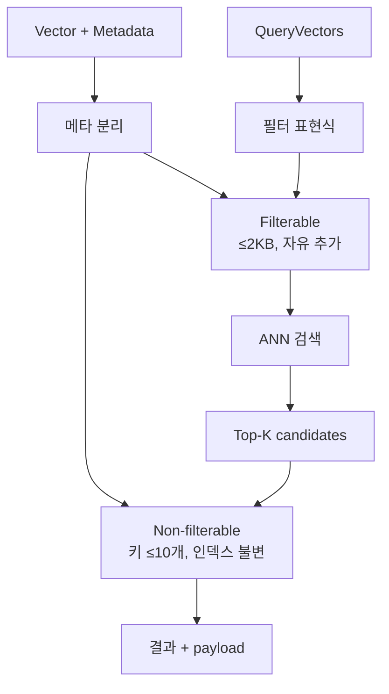
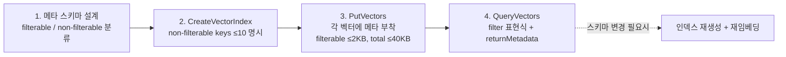

# S3 Vectors Metadata Schema

## 핵심 요약

S3 Vectors는 각 벡터에 메타데이터를 첨부할 수 있으나, **두 종류로 명확히 분리**된다: filterable(쿼리 필터 표현식에 사용 가능)과 non-filterable(검색 시 payload로 반환만 됨). 두 카테고리는 **용량 제한이 다르고**, non-filterable 키는 **인덱스 생성 시 명시**해야 하며 생성 후 변경 불가다. 이 스키마 결정이 운영 전체를 좌우하므로 인덱싱 전에 카테고리·키·크기를 확정하는 것이 핵심.

- **두 카테고리**: filterable / non-filterable. 검색·반환·과금이 다름.
- **크기 한도**: **벡터당 총 메타 40 KB**, **filterable 부분 ≤ 2 KB**, **non-filterable** = 나머지(최대 ~38 KB).
- **non-filterable 키 한도**: **인덱스당 최대 10개**, 각 키 이름 ≤ 63자. **인덱스 생성 시 확정, 이후 불변**.
- **카테고리 전환 불가**: 한 번 non-filterable로 지정된 키를 나중에 filterable로 바꿀 수 없음 (반대도 동일).
- **타입**: 문자열·숫자·불리언·배열 등 JSON 기본 타입 지원. 중첩 표현은 제한.

> **버전 민감 항목**: 구체적 바이트 한도(2 KB · 40 KB)·키 개수(10개) 등은 서비스 업데이트로 변동 가능. 최신값은 [AWS Docs — Limitations](https://docs.aws.amazon.com/AmazonS3/latest/userguide/s3-vectors-limitations.html) 확인.

## 시스템 아키텍처

filterable은 쿼리 시 인덱스 내부에서 사전 필터링 경로에 진입하고, non-filterable은 ANN 결과에 payload로 후부착되는 역할을 한다.



## 처리 흐름

스키마 설계 → 인덱스 생성 → 적재 → 쿼리 순. 1번에서 실수하면 인덱스 재생성이 필요하다.



## 핵심 기능 및 서비스

### filterable / non-filterable 비교

| 항목 | filterable | non-filterable |
|---|---|---|
| 쿼리 필터 표현식에 사용 | 가능 (`==`, `IN`, `>`, `<` 등) | **불가** |
| 검색 응답에 함께 반환 | 가능 | 가능 (returnMetadata 옵션) |
| 인덱스 생성 시 키 지정 | 자동(자유 추가) | **사전 명시 필수, 불변** |
| 인덱스당 키 개수 | 사실상 자유 | **최대 10개** |
| 벡터당 크기 한도 | **≤ 2 KB** | 총 40 KB 한도 내 나머지(~38 KB) |
| 변경 가능성 | 벡터 단위로 추가/수정 가능 | 키 자체는 인덱스 단위로 불변 |
| 권장 용도 | tenant ID, 언어, 카테고리, 날짜 등 거친 분리 | 원문 스니펫, source URL, chunk 위치 등 큰 payload |

### 실전 Filterable 표준 키 (≤ 2 KB)

production RAG / 멀티테넌트 챗봇에서 filterable로 배치되는 표준 키 목록. 합산 권장 ≤ 1.5 KB (2 KB 천장 대비 25% 여유).

| 그룹 | 키 | 타입 | 예시 | 용도 |
|---|---|---|---|---|
| 격리 | `tenant_id` | string | `"acme-corp"` | 멀티테넌트 데이터 격리·과금 attribution |
| 분류 | `doc_type` | string enum | `"policy"`, `"runbook"`, `"api_doc"` | 동일 인덱스 내 문서 종류 분리 |
| 분류 | `source` | string enum | `"confluence"`, `"notion"`, `"jira"` | 출처 시스템 필터 |
| 분류 | `category` | string | `"legal"`, `"hr"`, `"engineering"` | 도메인 카테고리 |
| 분류 | `lang` | string (ISO 639-1) | `"ko"`, `"en"`, `"ja"` | 언어 분기 (다국어 RAG) |
| 식별 | `doc_id` | string | `"conf-123456"` | 원문 문서 ID — 동일 doc의 chunk 그룹화 |
| 식별 | `chunk_idx` | number | `7` | 동일 문서 내 청크 순서 — 인접 chunk fetch |
| 식별 | `content_hash` | string (sha256 prefix) | `"a1b2c3d4"` | 콘텐츠 해시 — 증분 임베딩 skip 판단 |
| 시간 | `created_at` | number (unix ts) | `1735689600` | 원본 작성 시점 — 최신성 필터 |
| 시간 | `updated_at` | number (unix ts) | `1735776000` | 최신 수정 — 정렬·재인덱싱 트리거 |
| 버전 | `embedding_model` | string | `"titan-v2"`, `"cohere-multilingual-v3"` | 모델 교체 시 분기 (lock-in 회피) |
| 권한 | `acl_role` | string | `"engineer"`, `"admin"`, `"public"` | RBAC — 역할별 filter 강제 |
| 권한 | `visibility` | string enum | `"public"`, `"internal"`, `"restricted"` | 노출 범위 |
| 권한 | `classification` | string enum | `"public"`, `"confidential"`, `"pii"` | 데이터 분류 — 감사·차단·redaction |
| 품질 | `confidence` | number (0~1) | `0.87` | chunk 품질·임베딩 신뢰도 필터 (`>= 0.7`) |

> `tenant_id`는 UUID 대신 **8~16자 alphanumeric**으로 유지(2 KB 천장 보호). 시간은 ISO 8601 문자열보다 **unix timestamp(number 8 B)**가 효율적. `user_id` / `session_id` / `expires_at`는 multi-turn 대화 메모리 인덱스 전용이므로 범용 RAG 인덱스에서는 제외.

### 실전 Non-filterable 표준 키 (총 40 KB / 최대 10개 / 불변)

검색 응답에 포함만 되는 큰 payload. **10개 슬롯은 1회성 결정**이므로 보수적으로 배분.

| 키 | 타입 | 예상 크기 | 용도 |
|---|---|---|---|
| `chunk_text` | string | 1~4 KB | 청크 원문 — LLM context에 직접 inject, 별도 GetObject 호출 절감 |
| `summary` | string | ~200 B | chunk 한 줄 요약 — 재랭킹·citation 짧은 표시 |
| `title` | string | ~200 B | 원문 문서 제목 — citation 헤더 |
| `source_url` | string | ~300 B | 원본 URL — LLM citation에 그대로 노출 |
| `heading_path` | string | ~500 B | 문서 구조 경로 (`"Chap 3 > Section 2"`) — 위치 맥락 |
| `breadcrumb` | string | ~500 B | Confluence/Notion 경로 (`"Space > Page > Subpage"`) |
| `page_number` | number | 8 B | PDF·DOCX 페이지 번호 |
| `created_by` | string | ~100 B | 작성자 — audit·책임 추적 |
| `preview_html` | string | ~2 KB | 짧은 HTML 렌더 — UI 미리보기 |
| `extra_meta` | string (JSON) | 가변 | 압축 application-specific blob — **키 한도 10개 절약용 escape hatch** |

> 추가 필드 필요 시 새 키 추가 대신 **`extra_meta`에 JSON 직렬화**로 합쳐 키 1개로 운영. 나중에 누락 키 발견 → 인덱스 재생성 + 재임베딩 외 경로 없음.

## 유사 기술 비교

| 항목 | S3 Vectors | OpenSearch | Pinecone | pgvector |
|---|---|---|---|---|
| 필터 가능 메타 한도 | **2 KB / 벡터** | 매핑 필드 수만큼 | 40 KB / 벡터 (기본) | 컬럼 자유 |
| 페이로드(non-filter) 한도 | ~38 KB / 벡터 | `_source` 자유(샤드 한도) | 메타 분리 없음 | TOAST로 큰 값 |
| 스키마 불변성 | non-filter 키 **불변** | 매핑 부분 변경 가능 | metadata schema 자유 | ALTER TABLE 가능 |
| 필터 표현식 풍부도 | 기본 비교/논리 | 풀 DSL | 풍부 | 풀 SQL |
| 적합 케이스 | 거친 필터 + 큰 payload | 정밀 필터 + 풀텍스트 | 운영 단순 | RDB 트랜잭션 |

## 실제 사례

### LangChain S3 Vectors — filterable 한도 초과 버그

`langchain-aws`의 기본 metadata 생성기가 chunk 텍스트·source 정보 등을 모두 filterable로 넣으려 시도 → **2 KB 한도 초과로 PutVectors 실패**. `langchain-aws#693`·`llama_index#21062`에서 동일 패턴이 보고됨. SDK 위 추상화 레이어가 메타 한도를 인식하지 못할 때 발생하는 전형적 실패. 해결: 큰 텍스트는 non-filterable로 분리, filterable에는 tenant/lang 같은 작은 필드만 배치.

### Bedrock Knowledge Bases — 자동 스키마 매핑

KB가 vector index를 자동 생성할 때 추가 제약이 적용된다.

| 항목 | 한도 / 권장 |
|---|---|
| Custom metadata | **1 KB / 벡터**, 최대 **35 keys** (S3 Vectors 직접 사용 대비 엄격) |
| `AMAZON_BEDROCK_TEXT` | KB가 청크 원문을 저장하는 reserved key — `nonFilterableMetadataKeys`에 포함 권장 (없으면 1 KB 한도 초과) |
| `AMAZON_BEDROCK_METADATA` | reserved 시스템 키 — 변경 금지 |
| metadata sidecar | 원본 문서별 `{filename}.metadata.json`으로 `metadataAttributes` 지정 |

KB 모드 권장 filterable 키: `tenant_id`, `category`, `lang`, `source`, `acl_role`, `updated_at` — 6~8개로 압축. 나머지는 non-filterable로 위임. 직접 S3 Vectors API 사용 시와 KB 통합 시의 메타 한도가 다름을 혼동하지 않도록 주의.

## 활용 시나리오

### 시나리오 1: 멀티테넌트 RAG의 tenant 격리

모든 벡터에 `tenant_id`를 filterable로 부착. 쿼리마다 `filter: {tenant_id == "X"}` 강제 → 데이터 격리. 다만 강한 filter는 ANN recall을 하락시킬 수 있으므로 [[recall-vs-filter-tradeoff]] 참조.

### 시나리오 2: 큰 원문 스니펫 보존

chunk 원문(수 KB)을 non-filterable `chunk_text`에 저장 → 검색 응답에 함께 반환되어 LLM 프롬프트 구성 시 별도 GetObject 불필요. 단, 인덱스 생성 시 키 이름을 정확히 지정해야 한다.

### 시나리오 3: 실전 PutVectors metadata 구성 예시

```json
{
  "key": "conf-123456-chunk-7",
  "data": { "float32": ["...1024-dim embedding..."] },
  "metadata": {
    "tenant_id": "acme-corp",
    "doc_type": "kb",
    "source": "confluence",
    "category": "engineering",
    "lang": "ko",
    "doc_id": "conf-123456",
    "chunk_idx": 7,
    "content_hash": "a1b2c3d4",
    "created_at": 1735689600,
    "updated_at": 1735776000,
    "embedding_model": "titan-v2",
    "acl_role": "engineer",
    "visibility": "internal",
    "classification": "internal",
    "confidence": 0.91,

    "chunk_text": "S3 Vectors는 각 벡터에 메타데이터를 ... (원문 1.5KB)",
    "summary": "S3 Vectors metadata 한도와 분류 모델 설명",
    "title": "S3 Vectors 운영 가이드",
    "source_url": "https://confluence.acme.com/pages/123456",
    "heading_path": "S3 Vectors > 메타데이터 > 한도",
    "breadcrumb": "Platform > Vector Store > S3 Vectors",
    "page_number": 12,
    "created_by": "rocio",
    "extra_meta": "{\"team\":\"platform\",\"reviewed_at\":1735000000}"
  }
}
```

위 예시에서 filterable 14개(약 1.2 KB), non-filterable 9개(약 4 KB 합산) — 양쪽 한도 모두 여유.

## 장단점 및 트레이드오프

| 항목 | 내용 |
|---|---|
| 장점 | (1) Filter / payload 분리로 **검색 경로 최적화** (작은 필터, 큰 payload) (2) Non-filterable 키 사전 명시로 인덱스 메모리 사용량 예측 가능 (3) 검색 응답에 payload 부착으로 추가 GetObject 호출 불필요 |
| 단점 | (1) **카테고리 결정이 1회성** — 잘못 분류한 키 변경 시 인덱스 재생성+재임베딩 (2) filterable 2 KB 한도가 빡빡 — 큰 텍스트 강제 분리 (3) non-filterable 키 10개 한도가 멀티테넌트·다중 도메인에서 빠르게 소진 |
| 트레이드오프 | "스키마 자유도" vs "검색 성능·운영 단순성". S3 Vectors는 RDB / OpenSearch 수준의 자유도를 포기하고, 사전 결정의 안전·성능을 챙긴다. **인덱싱 전 스키마 워크숍**이 사실상 필수. |

## 함정 및 안티패턴

- **chunk 원문을 filterable로 넣기**: 1 chunk = 4~8 KB라면 2 KB 한도 초과로 PutVectors 실패. → non-filterable `chunk_text` 키에 저장.
- **non-filterable 키를 인덱스 생성 후 추가 가정**: 불가. 누락된 키가 발견되면 새 인덱스 생성 + 재임베딩 외 경로 없음. → 인덱싱 전 메타 스키마 리뷰 게이트.
- **모든 필드를 filterable로**: 불필요한 필터링 인덱스 비용·쿼리 복잡도 증가. → 실제 필터에 쓰일 필드만 filterable, 나머지는 non-filterable payload.
- **5개 테넌트 + 6개 도메인 키를 다 non-filterable에**: 10개 한도 초과. → 테넌트 ID는 filterable로, payload는 도메인 묶음 키 1개로 압축(JSON 직렬화).
- **40 KB payload 가정으로 큰 청크 통째 저장**: 한도 내라도 PutVectors 페이로드가 비대 → 처리량 한도에 더 빠르게 도달. chunk 크기를 1~2 KB로 유지.
- **SDK 추상화 레이어 신뢰**: LangChain·LlamaIndex 등 S3 Vectors 래퍼가 기본 metadata를 filterable로 몰아넣어 2 KB 초과 발생(`langchain-aws#693`). 프레임워크 기본값을 검증하고 filterable metadata 크기를 직접 제어.

## 참고 자료

- [Metadata filtering — AWS Docs](https://docs.aws.amazon.com/AmazonS3/latest/userguide/s3-vectors-metadata-filtering.html) — 필터 표현식 공식 (High)
- [Limitations and restrictions — AWS Docs](https://docs.aws.amazon.com/AmazonS3/latest/userguide/s3-vectors-limitations.html) — 모든 메타 한도 (High)
- [Vectors — AWS Docs](https://docs.aws.amazon.com/AmazonS3/latest/userguide/s3-vectors-vectors.html) — vector + metadata 모델 (High)
- [S3 Vectors best practices — AWS Docs](https://docs.aws.amazon.com/AmazonS3/latest/userguide/s3-vectors-best-practices.html) — 메타 스키마 설계 가이드 (High)
- [Using S3 Vectors with Amazon Bedrock Knowledge Bases — AWS Docs](https://docs.aws.amazon.com/AmazonS3/latest/userguide/s3-vectors-bedrock-kb.html) — KB의 metadata 매핑 (High)
- [S3 Vector big metadata error — AWS re:Post](https://repost.aws/questions/QUWezLMjc0S8GOiaa3jOOKGQ/s3-vector-big-metadata-error) — 한도 초과 실제 사례 (Mid)
- [langchain-aws S3 Vectors metadata 버그 #693 — GitHub](https://github.com/langchain-ai/langchain-aws/issues/693) — SDK 추상화 한도 위반 (Mid)
- [llama_index Filterable metadata 2048 bytes #21062 — GitHub](https://github.com/run-llama/llama_index/issues/21062) — 동일 버그 (Mid)

## 관련 노트

- [[aws-s3-vectors-resource-model]] — 인덱스 리소스 계층 (bucket→index, non-filterable 키는 인덱스 생성 시 결정)
- [[aws-s3-vectors-api]] — PutVectors / QueryVectors API 파라미터 상세
- [[bedrock-kb-s3-vectors-integration]] — KB 통합 시 metadata 제약(1 KB / 35 keys) 및 sidecar 패턴
- [[aws-s3-vectors-capacity-planning]] — 인덱스 샤딩과 metadata 스키마 불변성 교차 고려
- [[recall-vs-filter-tradeoff]] — filterable 조건 강도가 ANN recall에 미치는 영향
- [[aws-s3-vectors-overview]] — S3 Vectors 플랫폼 전체 개요
