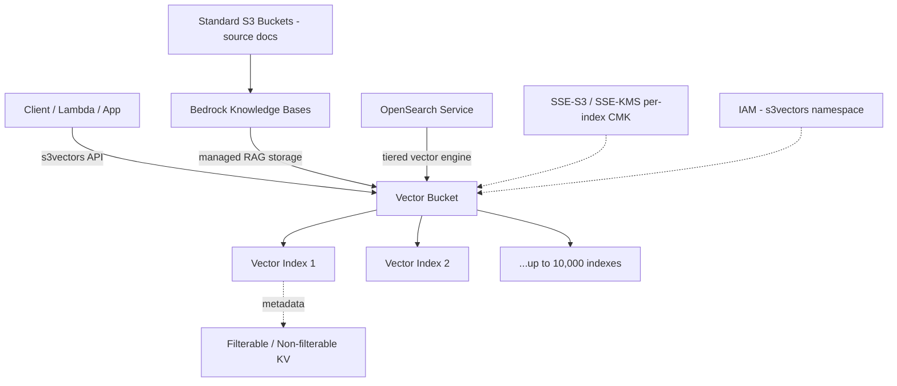
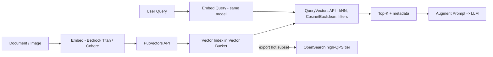

# Amazon S3 Vectors

## 핵심 요약

Amazon S3 Vectors는 **S3 객체 스토리지에 네이티브로 벡터 임베딩을 저장·검색**할 수 있게 한 신규 스토리지 클래스다. 별도의 벡터 DB를 운영하지 않고도 S3 위에서 k-NN 유사도 검색을 수행한다. 2025년 7월 AWS Summit New York에서 프리뷰로 공개됐고, **2025-12-02 GA**되며 프리뷰 대비 규모가 40배 확장됐다.

핵심 포지셔닝은 "저비용·매니지드 벡터 스토리지" — 전용 벡터 DB 대비 최대 **90% 비용 절감**을 내세우며, 자주 질의되지 않는 대용량 RAG/시맨틱 검색 인덱스를 cold/warm 티어로 운영하기 위한 솔루션이다.

- **새로운 리소스 타입**: `vector bucket` → `vector index` 2-tier. 인프라 프로비저닝 없이 전용 API로 호출
- **GA 스펙**: 인덱스당 최대 **20억 벡터**, 버킷당 최대 **10,000 인덱스** (프리뷰의 5천만/40배 확장)
- **레이턴시**: cold(저빈도) 쿼리 sub-second, 빈도 높은 쿼리 ~100ms 이하 (전용 벡터 DB보다는 10~50배 높은 레이턴시 영역)
- **통합**: Amazon Bedrock Knowledge Bases·OpenSearch Service 네이티브 통합, hot/cold 티어링 패턴 지원

> **버전 민감 항목**: 레이턴시 수치·가격($0.06/GB)·가용 리전(GA 기준 14개)은 서비스 업데이트에 따라 변동. 최신값은 [S3 Vectors 제품 페이지](https://aws.amazon.com/s3/features/vectors/)와 [AWS 요금 페이지](https://aws.amazon.com/s3/pricing/)에서 확인.

## 시스템 아키텍처

S3 Vectors는 일반 S3 버킷 옆에 별도 리소스 평면을 두는 구조다. 클라이언트는 전용 API(`s3vectors` 네임스페이스)로 vector bucket → vector index에 벡터를 넣고 질의하며, Bedrock KB·OpenSearch가 그 앞단에서 RAG 오케스트레이션과 hot-tier 검색을 담당한다.

리소스 모델 상세(2-tier 구조·IAM 분리·BPA 강제·CFN 리소스 타입)는 [[aws-s3-vectors-resource-model]] 참조.

## 처리 흐름

쓰기 경로는 임베딩 모델로 벡터를 만든 뒤 S3 Vectors API로 인덱스에 적재하고, 읽기 경로는 같은 모델로 쿼리를 임베딩해 k-NN 검색을 수행한다. hot 워크로드만 OpenSearch로 이관하는 티어링이 권장 패턴.

데이터 플레인 5개 API(PutVectors/QueryVectors 등) 상세는 [[aws-s3-vectors-api]] 참조.

## 핵심 기능 및 서비스

| 기능 | 설명 |
|---|---|
| Vector bucket / Vector index | 새 리소스 타입. 일반 S3 버킷과 분리, 전용 API로만 접근. 상세 → [[aws-s3-vectors-resource-model]] |
| 규모 (GA 기준) | 인덱스당 최대 **20억 벡터**, 버킷당 최대 **10,000 인덱스** |
| 거리 메트릭 | Cosine, Euclidean (k-NN 유사도 검색) |
| 메타데이터 필터링 | 키-값 쌍 기본 filterable. non-filterable key 인덱스당 최대 10개, 생성 후 변경 불가 |
| 레이턴시 | 저빈도 쿼리 sub-second, 빈번 쿼리 ~100ms (마케팅 기준) |
| 비용 | 스토리지 약 **$0.06/GB**, 쿼리 비용은 처리 데이터량 비례. 상세 → [[aws-s3-vectors-cost-model]] |
| 암호화 | 기본 SSE-S3, 옵션 SSE-KMS (CMK), **인덱스별 전용 CMK** 지정 가능. 상세 → [[aws-s3-vectors-encryption]] |
| 가용 리전 (GA) | **14개 리전** (프리뷰 5개 → 확장). ap-northeast-2(서울) 포함 |
| Bedrock KB 통합 | KB 생성 시 기존/신규 S3 vector index 선택. RAG 매니지드 경로. 상세 → [[bedrock-kb-s3-vectors-integration]] |
| OpenSearch 통합 | OpenSearch가 S3 Vectors를 vector engine으로 활용. cold=S3V, hot=OSS tiered 패턴 |

## 유사 기술 비교

| 항목 | Amazon S3 Vectors | Amazon OpenSearch Serverless | Pinecone (Serverless) | Aurora PostgreSQL + pgvector |
|---|---|---|---|---|
| 포지셔닝 | 객체 스토리지 위 매니지드 벡터 인덱스 | 분산 검색 엔진 위의 벡터 검색 | 전용 매니지드 벡터 DB | 관계형 DB 확장 |
| 인덱스당 최대 벡터 | **20억** | 워크로드/OCU 한정 | 수십억 (티어별) | 수백만~수천만(실용) |
| 레이턴시 | cold sub-sec, hot ~100ms | 수~수십 ms | 수~수십 ms | 수십 ms |
| 최소 비용 | 스토리지 $0.06/GB + 쿼리량 (idle ≈ $0) | OCU $0.24/h, 최소 ~$350/mo | 최소 $50/mo | 인스턴스 비용 |
| 처리량 한계 | 쓰기 <2MB/s, hot ~200 QPS | OCU 수에 따라 수평 확장 | 자동 스케일 | 단일 인스턴스 한계 |
| Recall | ~85~90%, 필터 적용 시 50% 이하 가능, 튜닝 노브 없음 | HNSW/IVF 튜닝 가능 | 튜닝 가능 | HNSW/IVFFlat 튜닝 가능 |
| Top-K 상한 | **30** | 제약 거의 없음 | 제약 거의 없음 | 제약 거의 없음 |
| 하이브리드 검색 | 미지원 | 지원 | 지원 (네임스페이스) | 직접 구현 |
| 적합 케이스 | **콜드 RAG 인덱스, 아카이브 시맨틱 검색, 비용 우선** | **고QPS / 저지연 / 텍스트+벡터 하이브리드** | 운영 단순성·빠른 PoC | ≤10M 벡터, RDB와 한 트랜잭션 |

워크로드 기반 벡터 DB 선택 의사결정은 [[vector-store-decision-matrix]] 참조.

## 실제 사례

### TwelveLabs (페타바이트 규모 비디오 인텔리전스)
TwelveLabs는 비디오 파운데이션 모델의 수십억 개 임베딩을 S3 Vectors에 저장. "팀이 득점 후 환호하는 클립" 같은 자연어 쿼리를 같은 임베딩 공간으로 변환해 ANN 검색, 정확한 타임스탬프·비디오 ID를 반환하는 비디오 검색을 구현.

### Qlik (분석 제품의 전사 시맨틱 검색)
Qlik은 수억 개 벡터와 다수 인덱스를 S3 Vectors에 적재하고 **OpenSearch를 앞단**에 두는 hybrid/tiered 구성으로, 자사 데이터 카탈로그·분석 제품 전반의 엔티티에 대한 시맨틱 검색을 제공.

### March Networks (비디오·사진 인텔리전스 아카이브)
March Networks는 대규모 비디오·사진 인덱스를 S3 Vectors로 저비용 운영. "수십억 개의 벡터를 경제적으로 저장하면서도 받아들일 만한 레이턴시"라는 트레이드오프를 명시적으로 선택한 사례.

### AWS 프리뷰 4개월 도입 수치
프리뷰 기간 동안 고객들이 **25만+ 벡터 인덱스를 생성**하고 **400억+ 벡터를 적재**, **10억+ 쿼리**를 수행. 신규 서비스 카테고리로 빠른 초기 도입 속도를 보임.

## 활용 시나리오

### 시나리오 1: 저빈도 대용량 문서 아카이브 시맨틱 검색
컴플라이언스·법무 문서, 과거 운영 매뉴얼 등 분기에 몇 번 검색되는 코퍼스. Bedrock Titan V2로 임베딩 → S3 Vectors index → Bedrock KB `Retrieve` API. cold sub-second 레이턴시면 충분. 항상 띄워두는 OpenSearch Serverless ~$350/mo 최소 비용 대비 대폭 절감. 상세 → [[aws-s3-vectors-cold-tier-rag]]

### 시나리오 2: Hot/Cold 티어드 RAG
최근 30일 문서는 OpenSearch Serverless에 두고 고QPS·저지연 응대, 그 이전은 S3 Vectors로 cold 운용. OpenSearch의 S3 Vectors engine 통합으로 단일 검색 API에서 hot/cold를 묶음.

### 시나리오 3: 미디어 인텔리전스 아카이브
Bedrock Titan Multimodal Embeddings G1로 이미지·키프레임 임베딩 → S3 Vectors index. 수억~수십억 규모 미디어 카탈로그를 경제적으로 보관하고 자연어/이미지 쿼리로 유사 콘텐츠 검색.

## 장단점 및 트레이드오프

| 항목 | 내용 |
|---|---|
| 장점 | (1) **비용 최대 90% 절감** (대용량/저빈도 워크로드에서 큼) (2) **인프라 프로비저닝 불필요** — vector bucket/index만 생성 (3) **인덱스당 20억 벡터** (4) Bedrock KB·OpenSearch 네이티브 통합 (5) 인덱스별 KMS CMK로 멀티테넌트/컴플라이언스 친화 |
| 단점 | (1) **쓰기 <2MB/s, hot ~200 QPS 천장** — 고처리량·저지연 부적합 (2) **Recall 85~90%, 튜닝 노브 없음** (3) **Top-K 최대 30, 하이브리드 검색·멀티테넌시 미지원** (4) Non-filterable metadata key 10개 한도, 인덱스 생성 후 변경 불가 (5) 일부 메트릭 리전 제한 |
| 트레이드오프 | "저비용·매니지드 스토리지" vs "저지연·고QPS·풍부한 검색 기능"의 명시적 교환. AWS 권장 표준 패턴: **hot subset은 OpenSearch·Pinecone, cold/archive는 S3 Vectors**로 분리하는 hybrid 아키텍처. |

## 함정 및 안티패턴

- **고QPS 대화형 챗봇의 단일 인덱스로 사용**: hot ~200 QPS 천장, cold 수백 ms 레이턴시 → SLO 위반. OpenSearch hot tier로 분리하거나 캐시 레이어 추가
- **메타데이터를 나중에 추가하려는 설계**: non-filterable key는 인덱스 생성 후 변경 불가, 10개 한도 → 인덱싱 전에 필터 스키마 먼저 확정
- **필터 조합으로 정밀 검색 기대**: 필터 적용 시 recall 50% 이하로 떨어지는 사례 → 필터는 거친 분리(tenant ID, 언어)에만 사용, 의미 기반 추가 필터는 LLM 후처리/재랭킹으로
- **모델 교체 후 인덱스 재사용**: Titan ↔ Cohere ↔ OpenAI 임베딩은 의미 공간 비호환 → [[embedding-model-lock-in]] 참조
- **Top-K > 30 의존**: API가 30에서 막힘 → 큰 후보군이 필요한 RAG는 multi-query 분할 후 머지하거나 OpenSearch로 이관
- **대량 배치 인덱싱을 단일 인덱스로 한 번에**: 쓰기 처리량 <2MB/s 제약 → 다중 인덱스 병렬화 또는 분할 배치. 상세 → [[aws-s3-vectors-capacity-planning]]

## 참고 자료

- [Amazon S3 Vectors — product page (AWS)](https://aws.amazon.com/s3/features/vectors/) — 공식 제품 소개 (High)
- [Amazon S3 Vectors now generally available — AWS News Blog](https://aws.amazon.com/blogs/aws/amazon-s3-vectors-now-generally-available-with-increased-scale-and-performance/) — GA(2025-12-02) 공식 발표, 40배 확장 (High)
- [Introducing Amazon S3 Vectors (Preview) — AWS News Blog](https://aws.amazon.com/blogs/aws/introducing-amazon-s3-vectors-first-cloud-storage-with-native-vector-support-at-scale/) — 2025-07 프리뷰 공개 (High)
- [Working with S3 Vectors and vector buckets — AWS Docs](https://docs.aws.amazon.com/AmazonS3/latest/userguide/s3-vectors.html) — vector bucket/index API 공식 문서 (High)
- [S3 Vectors best practices — AWS Docs](https://docs.aws.amazon.com/AmazonS3/latest/userguide/s3-vectors-best-practices.html) — 메타데이터·인덱스 설계 가이드 (High)
- [Using S3 Vectors with Amazon Bedrock Knowledge Bases — AWS Docs](https://docs.aws.amazon.com/AmazonS3/latest/userguide/s3-vectors-bedrock-kb.html) — Bedrock KB 통합 (High)
- [Advanced search with S3 vector engine on OpenSearch — AWS Docs](https://docs.aws.amazon.com/opensearch-service/latest/developerguide/s3-vector-opensearch-integration-engine.html) — OpenSearch tiered 패턴 (High)
- [Vector database options — AWS Prescriptive Guidance](https://docs.aws.amazon.com/prescriptive-guidance/latest/choosing-an-aws-vector-database-for-rag-use-cases/vector-db-options.html) — AWS 권장 벡터 DB 선택 가이드 (High)
- [Optimize agent tool selection using S3 Vectors and Bedrock KB — AWS Storage Blog](https://aws.amazon.com/blogs/storage/optimize-agent-tool-selection-using-s3-vectors-and-bedrock-knowledge-bases/) — 에이전트 RAG 사례 (High)
- [TwelveLabs case study — AWS](https://aws.amazon.com/solutions/case-studies/twelvelabs-case-study/) — 페타바이트 비디오 인텔리전스 사례 (High)
- [Amazon S3 Vectors GA — InfoQ](https://www.infoq.com/news/2026/01/aws-s3-vectors-ga/) — GA 의미·업계 반응 (Mid)
- [AWS claims 90% vector cost savings — VentureBeat](https://venturebeat.com/data-infrastructure/aws-claims-90-vector-cost-savings-with-s3-vectors-ga-calls-it-complementary) — 90% 비용 절감 주장과 분석가 시각 (Mid)
- [AWS S3 Vectors Latency Analysis — Murray Cole](https://murraycole.com/posts/aws-s3-vectors-latency-analysis) — 100~1M 벡터 레이턴시 벤치 (Mid)
- [Architecting GenAI at Scale with S3 Vector Store — Caylent](https://caylent.com/blog/architecting-gen-ai-at-scale-lessons-from-aws-s-3-vector-store-and-the-nuances-of-hybrid-vector-storage) — hybrid 벡터 스토리지 패턴 (Mid)

## 관련 노트

### 파생 상세 노트 (S3 Vectors sub-topics)
- [[aws-s3-vectors-resource-model]] — 2-tier 리소스 계층(bucket→index)·IAM 분리·BPA·CFN 리소스 타입
- [[aws-s3-vectors-api]] — 데이터 플레인 5개 API(PutVectors/QueryVectors 등): 배치 한도·처리량·인덱스 샤딩
- [[aws-s3-vectors-cost-model]] — 비용 3축(PUT/Storage/Query): query data-processed 차원, 128KB 최소 PUT
- [[aws-s3-vectors-capacity-planning]] — 인덱스 용량 계획 및 샤딩 전략: 처리량·격리·스키마 불변성 5축
- [[aws-s3-vectors-encryption]] — 인덱스별 SSE-KMS + CMK override: 멀티테넌트 암호화 격리·BYOK
- [[aws-s3-vectors-cfn-privatelink-tagging]] — CloudFormation + Interface VPC Endpoint + tag-on-create: 엔터프라이즈 GA readiness
- [[aws-s3-vectors-cold-tier-rag]] — cold-tier only RAG 아카이브 패턴: idle 95%+ 코퍼스, 운영 인스턴스 0
- [[bedrock-kb-s3-vectors-integration]] — Bedrock KB + S3 Vectors 자동 프로비저닝·ingestion job·IAM 롤

### 연관 개념
- [[vector-store-decision-matrix]] — 워크로드 기반 벡터 DB 선택 의사결정 매트릭스
- [[embedding-model-lock-in]] — 모델 교체 시 재임베딩 비용: 인덱스 잠금 메커니즘
- [[moc-aws-bedrock]] — 본 노트 소속 MOC
