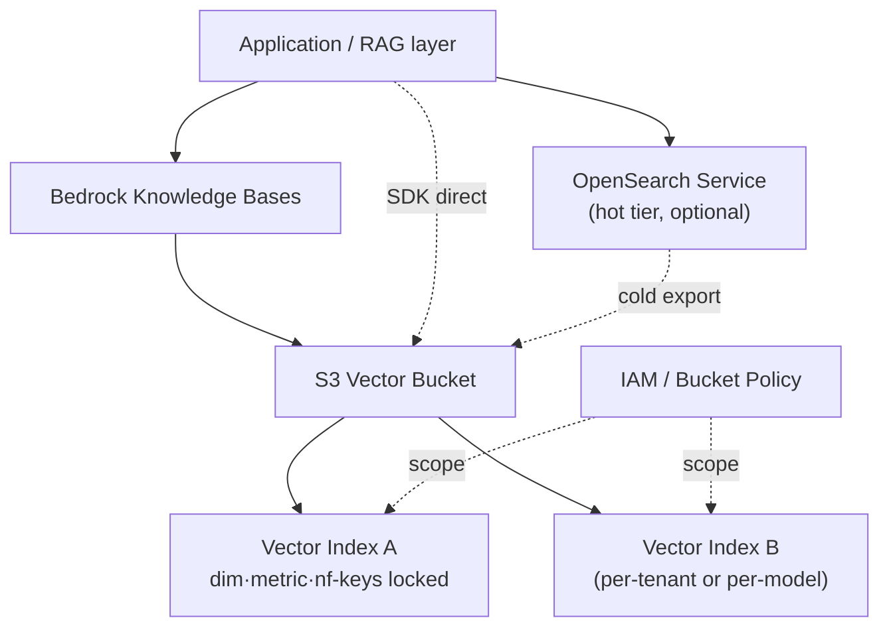
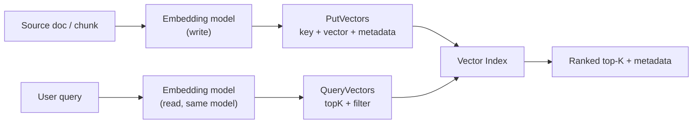

# AWS S3 Vectors — Schema Design Strategy

> 본 노트는 S3 Vectors의 **운영 설계 결정**(인덱스 명명·메타데이터 필드 배치·멀티테넌트 패턴·JSON 페이로드 샘플)에 집중한다. filterable / non-filterable 개념 정의는 [[aws-s3-vectors-metadata-schema]], API 동작은 [[aws-s3-vectors-api]] 참조.

## 핵심 요약

S3 Vectors의 스키마 결정은 **인덱스 생성 시점에 확정되며 사후 변경 불가**에 가깝다(재인덱싱 강제). dimension·distanceMetric·nonFilterableMetadataKeys 세 가지를 인덱싱 전에 확정하는 것이 설계의 핵심이다.

- **인덱스 명명에 모델·차원 포함**: `{domain}-{model}-{dim}` 패턴으로 모델 마이그레이션 시 신규 인덱스 자연 병행 운영
- **filterable 필드 선정 원칙**: 검색·필터 대상 facet만 filterable, 대용량 payload(chunk 본문·URL)는 non-filterable
- **멀티테넌트**: tenant당 index 분리 + IAM/bucket policy로 ARN 단위 격리가 AWS 권장 패턴
- **Hot-Cold 조합**: S3 Vectors는 cold tier 포지셔닝 — 최근 데이터는 OpenSearch hot tier, 과거 데이터만 S3 Vectors

## 시스템 아키텍처

App / RAG 레이어가 Bedrock KB 또는 직접 SDK로 vector bucket에 접근. bucket 내 다수의 vector index가 dimension·metric·non-filterable keys를 각자 lock한다.



## 처리 흐름

쓰기는 `PutVectors`로 `(key, vector, metadata)` 일괄 삽입, 읽기는 query embedding을 만들고 `QueryVectors`로 topK + metadata filter 검색.



## 핵심 기능 및 서비스

### Index 스키마 JSON 샘플 (`CreateIndex`)

```json
{
  "vectorBucketName": "rag-corpus-prod",
  "indexName": "wiki-titan-v2-1024",
  "dataType": "float32",
  "dimension": 1024,
  "distanceMetric": "cosine",
  "metadataConfiguration": {
    "nonFilterableMetadataKeys": [
      "chunk_text",
      "source_url",
      "raw_html_excerpt"
    ]
  },
  "encryptionConfiguration": {
    "sseType": "aws:kms",
    "kmsKeyArn": "arn:aws:kms:ap-northeast-2:123456789012:key/abcd-..."
  },
  "tags": {
    "env": "prod",
    "team": "rag-platform",
    "embedding_model": "amazon.titan-embed-text-v2:0"
  }
}
```

설계 포인트:
- `indexName`에 **임베딩 모델 + dimension** 포함 → 모델 교체 시 신규 index 자연 병행 운영
- `nonFilterableMetadataKeys`에는 검색·필터 대상이 아닌 대용량 payload만 (chunk 본문, raw HTML 등)
- 검색에 쓸 facet(`tenant_id`, `doc_type`, `lang`, `created_at`, `acl_group`)은 **filterable로 default** — 명시 불필요

### PutVectors 벡터 페이로드 샘플

```json
{
  "vectors": [
    {
      "key": "doc:wiki-1042#chunk-7",
      "data": { "float32": [0.0123, -0.0456, "..."] },
      "metadata": {
        "tenant_id": "acme-corp",
        "doc_type": "wiki",
        "lang": "ko",
        "created_at": "2026-06-01T09:30:00Z",
        "acl_group": ["eng", "platform"],
        "doc_id": "wiki-1042",
        "chunk_idx": 7,
        "chunk_text": "S3 Vectors는 ...",
        "source_url": "https://wiki.acme.corp/page/1042"
      }
    }
  ]
}
```

- `key`에 **doc_id + chunk_idx** 포함 → 부분 갱신(특정 chunk만 재임베딩) 추적 용이
- filterable 영역: tenant_id, doc_type, lang, created_at, acl_group, doc_id, chunk_idx → 합산 2KB 이내 유지
- non-filterable 영역: chunk_text, source_url → 대용량이지만 retrieval 결과로만 사용

### QueryVectors 필터 표현 샘플

```json
{
  "queryVector": { "float32": [0.0211, -0.0334, "..."] },
  "topK": 8,
  "filter": {
    "$and": [
      { "tenant_id": { "$eq": "acme-corp" } },
      { "lang": { "$in": ["ko", "en"] } },
      { "created_at": { "$gte": "2026-01-01T00:00:00Z" } },
      { "acl_group": { "$in": ["eng"] } }
    ]
  },
  "returnMetadata": true,
  "returnDistance": true
}
```

- prefilter 후 ANN 검색이므로 tenant·acl·시간 범위는 **반드시 filterable로** 설계
- `acl_group`을 list 타입으로 두면 `$in`으로 다중 그룹 멤버십 표현 가능

## 유사 기술 비교

| 항목 | S3 Vectors | OpenSearch Serverless | pgvector | Pinecone |
|---|---|---|---|---|
| 특성 | S3 네이티브 cold tier | managed search engine | RDB 확장 | 전용 vector DB SaaS |
| 장점 | 비용 최저(최대 90%↓), 무한 확장, IAM/KMS 통합 | low latency, 풍부한 query DSL, hybrid | 트랜잭션·관계형 동거, ops 단순 | 관리 부담 zero, latency 최저 |
| 단점 | latency 100ms~sub-sec, 스키마 lock-in | 비용 높음, OCU capacity 관리 | 수직 확장 한계 | vendor lock-in, 비용 |
| 적합 케이스 | 대량 cold 임베딩, long-tail corpus | 활성 검색, hybrid BM25+vector | 소규모 RAG, app DB와 통합 | latency 최우선, low-ops |

## 실제 사례

### Bedrock KB 백엔드 (single-tenant, 비용 우선)
~1M chunks, Titan Embeddings v2(1024-d): bucket 1개 + index 1개(`wiki-titan-v2-1024`), Bedrock KB가 retrieve, IAM은 KB execution role에만 grant. OpenSearch 대비 비용 최대 90% 절감.

### Multi-tenant SaaS (tenant당 index 분리)
tenant당 `CreateIndex` 호출만으로 onboarding. bucket policy condition `s3vectors:ResourceArn`으로 cross-tenant 격리. tenant 메타를 단일 index에 섞지 않는 AWS 권장 패턴.

### Hot-Cold Tiered Architecture
최근 30일 임베딩은 OpenSearch, 그 이상은 S3 Vectors. 쿼리 라우터가 `created_at` 범위로 store 결정. 30일 경과 OpenSearch 항목은 nightly job으로 S3 Vectors export 후 OS에서 삭제.

## 장단점 및 트레이드오프

| 항목 | 내용 |
|---|---|
| 장점 | 대량 cold 임베딩 비용 최적화(최대 90%↓). S3 IAM/KMS/리전·복제·라이프사이클 그대로 활용. Bedrock KB native. 4096 dim까지 표준 모델 cover |
| 단점 | latency 100ms~sub-sec(hot path 부적합). index 스키마 사후 변경 불가(재인덱싱 강제). filterable metadata 2KB 제약. non-filterable key 사후 추가 불가 |
| 트레이드오프 | **비용 vs latency**: 90% 비용 절감 대신 OpenSearch 대비 latency 2-10배. **lock-in vs 유연성**: dimension/metric/non-filterable keys lock으로 단순성을 얻지만 모델 변경 시 dual-write 재인덱싱 필요 |

## 함정 및 안티패턴

- **안티패턴 1: 임베딩 모델 미확정 상태에서 production index 생성** → dimension/distance metric lock-in으로 모델 교체 시 재인덱싱 강제 → index 이름에 모델·dimension 포함(`{domain}-{model}-{dim}`)해 신규 index 병행 운영.
- **안티패턴 2: filterable metadata에 chunk 본문 등 대용량 payload 저장** → 2KB 제한 초과로 `PutVectors` 400 → chunk_text·raw HTML·source_url은 `nonFilterableMetadataKeys`로 분리.
- **안티패턴 3: 단일 index에 모든 tenant 데이터 + `tenant_id`로만 필터링** → 쿼리 성능 저하 + IAM 격리 약화 + cross-tenant leak 위험 → tenant당 index 분리 + IAM/bucket policy ARN 단위 grant.
- **안티패턴 4: hot path 실시간 검색 단독 사용** → 100ms~sub-sec latency가 UX 침해 → OpenSearch hot tier + S3 Vectors cold tier 구성.
- **안티패턴 5: non-filterable key를 사후 추가 시도** → index 생성 시점에만 선언 가능, ALTER 불가 → schema 변경 결정을 ADR로 남기고 신규 index 생성 + 재인덱싱.

## 참고 자료

- [Amazon S3 Vectors (product page)](https://aws.amazon.com/s3/features/vectors/) — 공식 제품 페이지, 가격·통합 개요
- [CreateIndex API reference](https://docs.aws.amazon.com/AmazonS3/latest/API/API_S3VectorBuckets_CreateIndex.html) — request body JSON schema 원본
- [Metadata filtering](https://docs.aws.amazon.com/AmazonS3/latest/userguide/s3-vectors-metadata-filtering.html) — filterable vs non-filterable 제약, filter 표현식
- [S3 Vectors best practices](https://docs.aws.amazon.com/AmazonS3/latest/userguide/s3-vectors-best-practices.html) — multi-tenant 분할·성능 가이드
- [Limitations and restrictions](https://docs.aws.amazon.com/AmazonS3/latest/userguide/s3-vectors-limitations.html) — 2KB/40KB/10키 등 상한
- [Amazon S3 Vectors now generally available (AWS News Blog, 2025-12)](https://aws.amazon.com/blogs/aws/amazon-s3-vectors-now-generally-available-with-increased-scale-and-performance/) — GA scale·성능 수치

## 관련 노트

- [[aws-s3-vectors-metadata-schema]] — filterable / non-filterable 개념 정의 (본 노트는 그 위에서 실제 설계 결정)
- [[aws-s3-vectors-api]] — PutVectors·QueryVectors API 동작 상세
- [[aws-s3-vectors-resource-model]] — vector bucket / vector index 리소스 모델
- [[aws-s3-vectors-cost-model]] — oversampling·filterable 메타 증가가 비용에 미치는 영향
- [[recall-vs-filter-tradeoff]] — pre-filter ANN 검색에서 recall 감소 원리 — 본 설계의 필터 전략에 직접 영향
- [[bedrock-kb-s3-vectors-integration]] — Bedrock KB가 S3 Vectors를 RAG vector store로 사용하는 통합 패턴
