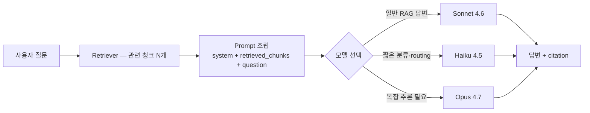

# Bedrock Claude Generation Models

## 핵심 요약

AWS Bedrock의 Claude 4.X 패밀리(Opus 4.7 · Sonnet 4.6 · Haiku 4.5)는 RAG generation 단계에서 한국어 답변 품질·비용·지연 3축의 균형을 기준으로 선택한다. **Sonnet 4.6이 한국어 RAG generation 기본 1순위**. 호출은 Bedrock Converse API 경유 권장(provider-agnostic 형식, system prompt·tools·multi-turn 지원).

- **Sonnet 4.6**: 균형형. 한국어 reasoning·instruction following 안정. RAG generation 기본 후보. 200K context (1M 옵션)
- **Haiku 4.5**: 빠른 응답·저비용. 짧은 답변·classification·routing에 강점. 긴 컨텍스트에서 정확도 하락 가능성
- **Opus 4.7**: 최고 성능·최고 비용. 복잡 reasoning·다단계 추론. RAG generation에는 over-spec 가능성

> **버전 민감 항목 flag**: 모델 ID suffix(날짜)·context window 옵션·과금 단가는 릴리스 주기에 따라 변경됩니다. 최신 수치는 반드시 [Amazon Bedrock 지원 모델 목록](https://docs.aws.amazon.com/bedrock/latest/userguide/models-supported.html) 및 [Bedrock pricing 페이지](https://aws.amazon.com/bedrock/pricing/)로 재확인하세요.

## 평가 축 (RAG generation 옵션 비교)

| 축 | Sonnet 4.6 | Haiku 4.5 | Opus 4.7 |
|---|---|---|---|
| 한국어 reasoning | 우수 | 양호 (짧은 답변 기준) | 매우 우수 |
| latency (단일 답변) | ~수초 | ~1–2초 | ~수초–십수초 |
| cost (input/output) | 중 | 저 | 고 |
| context window | 200K (1M 옵션) | 200K | 200K |
| instruction following | 강 | 중 | 매우 강 |
| RAG generation 적합도 | **1순위 추천** | cost-sensitive 경로 | over-spec |

## 시스템 아키텍처

Bedrock Converse API를 통해 단일 코드 경로로 Claude 모델을 호출. 모델 ID는 리전 직접(on-demand) 또는 cross-region inference profile 형식으로 지정.

```
클라이언트
  └── Bedrock Converse API (bedrock-runtime)
        ├── modelId: anthropic.claude-sonnet-4-6-...  ← on-demand (ap-northeast-2 가용 시)
        └── modelId: apac.anthropic.claude-sonnet-4-6-...  ← cross-region inference profile
```

## 처리 흐름



## 과금 (Bedrock On-Demand, 참고용)

> **버전 민감 항목 flag**: 아래 수치는 2026-04 기준이며 변경될 수 있습니다. 실제 적용 전 [Bedrock pricing](https://aws.amazon.com/bedrock/pricing/)에서 최신 단가를 반드시 확인하세요.

| 모델 | Input ($/1M tok) | Output ($/1M tok) | 비고 |
|---|---|---|---|
| Claude Haiku 4.5 | $1 | $5 | cost-sensitive 경로(classification/routing) 1순위 |
| Claude Sonnet 4.6 | $3 | $15 | RAG generation 균형형. 1순위 추천 |
| Claude Opus 4.7 | $5 | $25 | 복잡 reasoning. 새 tokenizer로 동일 입력 대비 토큰 수 증가 가능 — 실효 단가 단순 곱셈 이상 |

**추가 할인·옵션** (모두 버전 민감, 최신 정책 확인 필요):
- **Batch Inference**: 50% 할인 (비동기, 대량 평가·재인덱싱에 적합)
- **Flex 모드**: 50% 할인, latency 약간 증가 허용
- **Prompt caching**: cache read ~0.1x 단가 — 반복 system prompt가 길 때 절감 효과 큼
- **Cross-region inference profile** 사용 시 표준 리전 단가 동일, 데이터 leg 비용 추가 가능

> **비용 근거 요약**: Sonnet 4.6 1순위 — Haiku 대비 3× 비싸지만 한국어 long-context 정확도 우위로 retrieval miss 재호출 절감. Opus 4.7 — Sonnet 대비 단가 1.67× × tokenizer 토큰 증가 = 실효 비용 Sonnet 대비 큰 폭 상승, retrieval이 충분할 때 over-spec.

## ap-northeast-2 가용성

- Bedrock 서울 리전(ap-northeast-2)의 Claude 4.X 모델 가용성을 호출 전 확인 필수
- 미가용 시 **cross-region inference profile** 사용 가능 (예: `apac.anthropic.claude-sonnet-4-6-20250929-v1:0`) — data residency·latency 영향 검토 필요
- IAM 권한: `bedrock:InvokeModel`, `bedrock:Converse`

## 한국어 RAG generation 시 주의

- **system prompt 한국어화**: "한국어로 답변하라" + 출력 형식(citation 형식·길이) 명시
- **citation 강제**: "근거 청크의 ID/제목을 답변 끝에 인용하라" 추가 — Claude는 instruction following이 강해 잘 따르는 편
- **chunk packing 순서**: relevance 높은 청크를 prompt 앞 또는 끝에 배치 (Lost in the Middle 효과 완화)
- **temperature**: factual RAG 답변은 0–0.3 권장. 한국어 자연스러움을 위해 0.2–0.4도 고려

## 함정 및 안티패턴

- **Haiku로 long context 처리**: 200K window 지원은 되나 긴 컨텍스트 중간 정보 정확도가 Sonnet 대비 낮음 → 청크 수가 많을 때 Sonnet 권장
- **Opus 기본 선택**: RAG generation은 retrieval이 잘 됐다는 전제 → 모델 reasoning 부담 낮음. Opus는 비용 대비 효과 불분명
- **provider lock-in**: Bedrock Claude만 의존 시 향후 multi-provider 전환 어려움 → Bedrock Converse API의 provider 추상화 이점 활용

## 참고 자료

- [Amazon Bedrock pricing](https://aws.amazon.com/bedrock/pricing/) — region별 최신 Claude 단가
- [Amazon Bedrock 지원 모델 목록](https://docs.aws.amazon.com/bedrock/latest/userguide/models-supported.html) — 모델 ID, context window, ap-northeast-2 가용성
- [Anthropic Claude 모델 개요 — Anthropic 공식 docs](https://docs.anthropic.com/en/docs/about-claude/models/overview) — 모델 스펙, 비교, 권장 사용 케이스
- [Amazon Bedrock cross-region inference](https://docs.aws.amazon.com/bedrock/latest/userguide/inference-profiles-support.html) — cross-region inference profile ID 목록, 지원 리전

## 관련 노트

- [[aws-bedrock-embedding]] — Bedrock 임베딩 모델(Titan 등). generation 모델과 함께 RAG 파이프라인의 양 축
- [[moc-aws-bedrock]] — 본 노트 소속 MOC
- [[moc-rag]] — 본 노트가 다루는 generation 단계가 속한 상위 RAG 토픽
