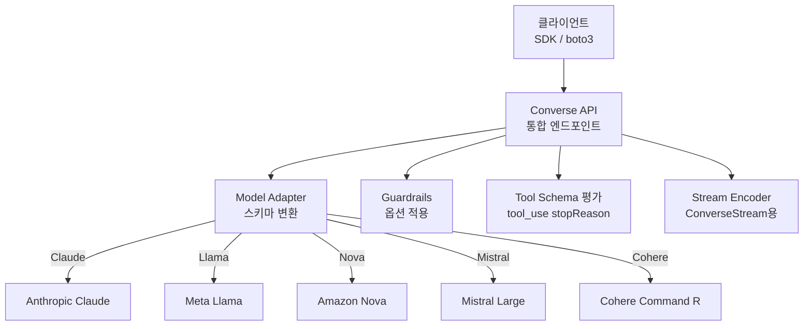
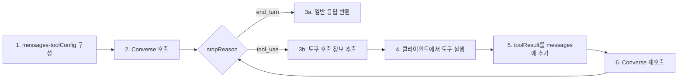

# Bedrock Converse API

## 핵심 요약

Bedrock Converse API는 Bedrock의 모든 messages-기반 FM(Claude, Llama, Mistral, Nova, Cohere Command 등)에 대해 **하나의 통일된 요청·응답 스키마**를 제공하는 추론 API이다. 기존 `InvokeModel`이 모델별 JSON 스키마를 요구했던 문제를 해결해 "한 번 짠 코드를 모델 교체 시 그대로 사용"할 수 있게 한다.

- **모델 독립 스키마**: `messages[]` + `system[]` + `inferenceConfig{}` 구조로 표준화
- **동기·스트리밍 2개 작업**: `Converse` (동기) / `ConverseStream` (SSE 스트리밍)
- **빌트인 Tool Use**: `toolConfig`로 도구 정의, 응답의 `stopReason: tool_use`로 분기
- **멀티모달 지원**: 이미지·문서를 `content` 블록으로 첨부 가능(모델이 지원하는 경우)
- **Guardrails 직접 연동**: `guardrailConfig` 파라미터로 1-step 안전성 적용

## KB 연동 vs 단독 사용

Converse API는 **단독 추론 API**다. Knowledge Bases와는 독립적으로 동작한다.

| 패턴 | API | 설명 |
|---|---|---|
| 단독 LLM 호출 | `Converse` | 모델에게 메시지를 보내고 응답 받음. KB 없이 동작 |
| KB 자동 RAG | `RetrieveAndGenerate` | KB가 Retrieve + LLM 호출을 한 묶음으로 처리. Converse를 경유하지 않음 |
| KB 수동 RAG | `Retrieve` → `Converse` | 개발자가 청크를 직접 가져온 뒤 Converse messages에 삽입. retrieval·generation 분리 제어 |

> 세 번째 패턴은 retrieval 로직을 직접 제어하고 싶을 때 사용. Converse는 그 경우 generation 레이어만 담당한다.

## InvokeModel과의 스키마 비교

Converse API 이전 `InvokeModel`은 모델마다 요청·응답 JSON 구조가 달랐다.

**InvokeModel 시절 — 모델별 스키마 N벌 필요:**

```json
// Claude (Anthropic 형식)
{
  "anthropic_version": "bedrock-2023-05-31",
  "messages": [{"role": "user", "content": "안녕"}],
  "max_tokens": 512
}

// Llama (Meta 형식) — 완전히 다른 구조
{
  "prompt": "<|begin_of_text|><|user|>\n안녕<|eot_id|>",
  "max_gen_len": 512
}
```

응답 JSON 구조도 모델마다 달라서 파싱 코드를 모델별로 작성해야 했다.

**Converse API — modelId 한 줄만 교체:**

```json
// 요청 — Claude든 Llama든 동일 구조
{
  "modelId": "anthropic.claude-sonnet-4-6-...",
  "messages": [{"role": "user", "content": [{"text": "안녕"}]}],
  "inferenceConfig": {"maxTokens": 512}
}

// 응답 — 모든 모델이 동일 구조
{
  "output": {"message": {"role": "assistant", "content": [{"text": "안녕하세요!"}]}},
  "stopReason": "end_turn",
  "usage": {"inputTokens": 5, "outputTokens": 10}
}
```

`modelId`를 `meta.llama3-...`로 바꾸면 요청·응답 코드는 그대로 사용 가능하다.

## 시스템 아키텍처

Converse API는 모델별 JSON 차이를 추상화하는 **어댑터 레이어**로 동작한다.



## 처리 흐름

도구 사용을 포함한 1턴 Converse 호출의 전형적인 흐름.



## 핵심 기능 및 서비스

| 기능 | 설명 |
|---|---|
| 통합 messages 스키마 | `[{role:'user', content:[{text:'...'}]}]` 형식, 모든 지원 모델 공통 |
| inferenceConfig | `maxTokens`, `temperature`, `topP`, `stopSequences` 표준화 |
| Tool Use | `toolConfig.tools[]`로 JSON Schema 정의, 응답에 `toolUse` 블록 |
| ConverseStream | 토큰 단위 SSE 스트리밍, `messageStart` → `contentBlockDelta` → `messageStop` |
| Multimodal Content | `content`에 `image`, `document` 블록 추가 가능 |
| Guardrails 통합 | `guardrailConfig{guardrailIdentifier, guardrailVersion, trace}` 1-step 적용 |
| additionalModelRequestFields | 표준 외 파라미터(모델 고유)를 escape hatch로 전달 |
| Cross-region Inference | inference profile ID 사용 시 자동 region failover |

## IAM 권한

Converse API는 `InvokeModel`과 **동일한 IAM Action**을 재사용한다. 별도 Action이 없으므로 기존 InvokeModel 권한이 있으면 그대로 동작한다.

| API 작업 | 필요한 IAM Action |
|---|---|
| `Converse` (동기) | `bedrock:InvokeModel` |
| `ConverseStream` (스트리밍) | `bedrock:InvokeModelWithResponseStream` |

**기본 정책 예시 (서울 리전):**

```json
{
  "Effect": "Allow",
  "Action": [
    "bedrock:InvokeModel",
    "bedrock:InvokeModelWithResponseStream"
  ],
  "Resource": [
    "arn:aws:bedrock:ap-northeast-2::foundation-model/anthropic.claude-sonnet-4-6-*",
    "arn:aws:bedrock:ap-northeast-2:{account-id}:inference-profile/apac.anthropic.claude-sonnet-4-6-*"
  ]
}
```

> **주의**: cross-region inference profile 사용 시 `Resource`에 inference profile ARN을 **별도로** 추가해야 한다. 모델 ARN만 넣으면 profile 호출 시 Access Denied 발생.

**부가 기능별 추가 Action:**

| 기능 | 추가 Action | Resource |
|---|---|---|
| `guardrailConfig` 사용 | `bedrock:ApplyGuardrail` | Guardrail ARN |
| KB `Retrieve` 수동 호출 | `bedrock:Retrieve` | KB ARN |
| KB `RetrieveAndGenerate` | `bedrock:RetrieveAndGenerate` | KB ARN |

## 과금

> **버전 민감 항목 flag**: 아래 단가·할인율은 참고용이며 릴리스 주기에 따라 변경됩니다. 최신 수치는 반드시 [Amazon Bedrock pricing](https://aws.amazon.com/bedrock/pricing/)에서 확인하세요.

Converse / ConverseStream API 자체는 **별도 API fee가 없다**. 호출당 비용은 `modelId`로 지정한 underlying FM의 토큰 단가와 부가 컴포넌트의 합으로 결정된다.

| 구성 요소 | 과금 방식 |
|---|---|
| Converse / ConverseStream | **별도 fee 없음** (API 호출 자체는 무료) |
| Underlying FM | 모델별 input/output 1M token 단가 (On-Demand) — 예: Claude Sonnet 4.6 $3/$15, Claude Haiku 4.5 $1/$5 |
| Guardrails attach (`guardrailConfig`) | 정책별 text unit 단가 (content filter / denied topics) — 공식 페이지 확인 |
| Tool Use | 토큰만 추가 발생, tool 정의 자체에는 별도 fee 없음. tool 실행(Lambda 등)은 해당 서비스 요금 |
| Prompt caching | cache write 배율 / cache read 할인율 — 버전 민감, 공식 페이지 확인 |
| Flex 모드 | standard 대비 할인 적용 (slightly higher latency 허용) — 할인율 버전 민감 |
| Batch Inference | Converse는 동기 호출이므로 batch 미적용. InvokeModel batch 전용 |

> **요점**: Converse는 단순 추상화 레이어 — 비용 산정은 항상 "모델 토큰 단가 × 토큰 수" 기준으로 추정. 모델 교체 시 비용은 변경되지만 API 호출 fee는 변하지 않는다.

## 유사 기술 비교

| 항목 | Bedrock Converse | OpenAI Chat Completions | Anthropic Messages API | Bedrock InvokeModel |
|---|---|---|---|---|
| 특징 | Bedrock 모든 모델 통합 | OpenAI 모델만 | Anthropic 모델만 | 모델별 raw JSON |
| 장점 | 모델 교체 시 코드 동일 | 가장 폭넓은 에코시스템 | Claude 모든 기능 즉시 사용 | 모델 고유 기능 100% 노출 |
| 단점 | 모델 고유 신기능 지연 노출 | OpenAI 락인 | Anthropic 락인 | 모델별 스키마 N벌 작성 |
| 적합 케이스 | 멀티 모델 A/B, 벤더 분산 | OpenAI 중심 | Claude 전용 앱 | 최신 기능·세밀 튜닝 |

## 실제 사례

### Spring AI — Bedrock Converse 백엔드 채택
Spring AI 프레임워크가 Bedrock 기본 어댑터로 Converse API를 채택. 모델 교체를 application.yaml의 한 줄 변경으로 처리.

### aws-samples — Streaming AI Assistant with Tools
실시간 스트리밍 + 도구 호출을 결합한 reference 구현. ConverseStream의 `contentBlockDelta` 이벤트와 `toolUse` 이벤트를 분리 처리하는 패턴([aws-samples 레포](https://github.com/aws-samples/stream-ai-assistant-using-bedrock-converse-with-tools)).

## 활용 시나리오

### 시나리오 1: 모델 벤더 분산 전략
프로덕션에서 Claude 70%, Nova 20%, Llama 10% 가중치 라우팅. Converse API 덕분에 어댑터 코드를 모델별로 작성하지 않고 `modelId`만 교체. 비용·가용성·품질 리스크 분산.

### 시나리오 2: 스트리밍 챗봇 + 함수 호출
ConverseStream으로 토큰 스트리밍 + `toolUse` 이벤트가 도착하면 일시 정지 → 클라이언트가 함수 실행 → `toolResult`로 재호출하는 패턴. UX(저지연) + 기능성(외부 데이터) 동시 확보.

### 시나리오 3: 모델 평가 파이프라인
같은 프롬프트 셋을 N개 모델에 적용해 품질·비용·지연 측정. Converse 표준 스키마 덕분에 평가 코드 1개로 처리.

## 장단점 및 트레이드오프

| 항목 | 내용 |
|---|---|
| 장점 | (1) 모델 교체·A/B가 코드 변경 없이 가능 (2) Guardrails·Tool Use 통합 (3) ConverseStream의 표준 이벤트 모델 |
| 단점 | (1) 모델 고유 기능(예: Claude prompt caching) 지원이 InvokeModel보다 지연 (2) `additionalModelRequestFields` 사용 시 결국 모델별 분기 발생 (3) 모든 모델 지원이 아님(임베딩·이미지 생성은 별도 API) |
| 트레이드오프 | 이식성(Converse) vs 최신성/세밀 제어(InvokeModel). 신기능 PoC는 InvokeModel, 프로덕션 다중 모델은 Converse |

## 함정 및 안티패턴

- **모든 모델 기능을 Converse로 사용 가능하다고 가정**: 임베딩(`amazon.titan-embed`)·이미지 생성(Titan Image)·일부 신기능은 미지원 → **대안**: messages 기반 텍스트/멀티모달만 Converse, 그 외는 InvokeModel 또는 전용 API
- **Tool Use 응답을 단일 메시지로 처리**: `stopReason: tool_use`를 무시하고 일반 텍스트로 파싱 → **대안**: stopReason 분기 후 도구 실행, 그 결과를 다음 turn의 messages에 `toolResult` 블록으로 추가
- **스트리밍 이벤트 일괄 버퍼링**: ConverseStream의 메리트인 저지연 UX를 잃음 → **대안**: contentBlockDelta 수신 즉시 클라이언트에 push
- **`additionalModelRequestFields`로 모델별 코드 분기 누적**: 결국 멀티모델 추상화의 의미 상실 → **대안**: 모델별 분기는 명시적 어댑터 클래스로 격리, 표준 파라미터로 가능한 한 처리

## 참고 자료

- [Converse API Reference (AWS Docs)](https://docs.aws.amazon.com/bedrock/latest/APIReference/API_runtime_Converse.html) — 동기 API 스키마·파라미터
- [ConverseStream API Reference (AWS Docs)](https://docs.aws.amazon.com/bedrock/latest/APIReference/API_runtime_ConverseStream.html) — 스트리밍 이벤트 구조
- [Inference using Converse API (AWS Userguide)](https://docs.aws.amazon.com/bedrock/latest/userguide/conversation-inference.html) — 사용 가이드와 모범 사례
- [Converse API tool use examples (AWS Docs)](https://docs.aws.amazon.com/bedrock/latest/userguide/tool-use-examples.html) — Tool Use 패턴 코드
- [Amazon Bedrock pricing](https://aws.amazon.com/bedrock/pricing/) — 모델별 토큰 단가·Flex·Batch 최신 수치
- [Bedrock Converse API (Spring AI)](https://docs.spring.io/spring-ai/reference/api/chat/bedrock-converse.html) — 외부 프레임워크 통합 사례

## 관련 노트

- [[aws-bedrock-overview]] — Converse API가 속한 Bedrock 플랫폼 전체 개요
- [[bedrock-knowledge-bases]] — KB 수동 RAG 시 `Retrieve` 결과를 Converse messages에 삽입하는 패턴
- [[aws-bedrock-agents]] — Agents 내부의 Action Group 호출도 Converse 스키마 기반
- [[bedrock-guardrails]] — `guardrailConfig`으로 직접 연동되는 안전 레이어
- [[bedrock-claude-generation-models]] — Converse로 호출하는 대표 모델 선택 기준
- [[aws-bedrock-flows]] — Flows 노드 내 Prompt 노드가 Converse 패턴 사용
- [[moc-aws-bedrock]] — 본 노트 소속 MOC
