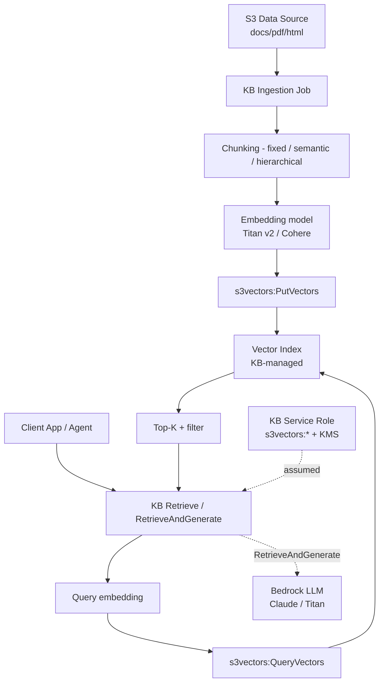
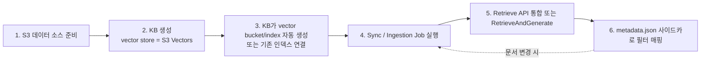

# Bedrock KB + S3 Vectors 통합 패턴

## 핵심 요약

Bedrock Knowledge Bases는 **데이터 소스 → 청킹 → 임베딩 → 벡터 저장 → Retrieve → RetrieveAndGenerate**까지의 RAG 파이프라인 전체를 매니지드로 제공한다. vector store 옵션 중 **S3 Vectors는 가장 저렴한 cold-friendly 옵션**으로, KB가 vector bucket·index를 자동 생성하고 ingestion job이 PutVectors를 호출, Retrieve가 내부적으로 QueryVectors를 호출한다. 사용자는 KB endpoint만 보면 되고 S3 Vectors API는 추상화된다.

- **자동 프로비저닝**: KB 생성 시 S3 Vectors bucket/index를 KB가 만들거나 기존 인덱스를 연결.
- **데이터 동기화**: Ingestion job이 데이터 소스를 스캔, 변경분 청킹·임베딩 후 PutVectors.
- **검색 API**: `Retrieve` (벡터 검색만) / `RetrieveAndGenerate` (검색 + LLM 답변 생성).
- **레이턴시 가이드**: cold sub-second, warm ~100ms — S3 Vectors 자체 성능과 동일.
- **권한 요건**: KB 서비스 롤이 `s3vectors:*`와 (CMK 사용 시) KMS 키 권한을 가져야 함.

## 시스템 아키텍처

## 처리 흐름

## 핵심 기능 및 서비스

| 기능 | KB가 제공 | 사용자 책임 |
|---|---|---|
| 데이터 소스 연결 | S3 / Confluence / SharePoint / Web crawler 등 | 데이터 정리·접근 권한 |
| 청킹 | fixed / semantic / hierarchical / no-chunk | 전략 선택 + 파라미터 |
| 임베딩 | Bedrock embedding 모델 호출 | 모델 선택 (Titan v2 / Cohere) |
| Vector store | S3 Vectors / OSS Serverless / Aurora pgvector / Pinecone / MongoDB | 옵션 선택 |
| Ingestion job | 변경 감지 → PutVectors 호출 | trigger (수동 / 이벤트) |
| Retrieve API | 쿼리 임베딩 + QueryVectors + 메타 필터 | filter expression, K, source |
| RetrieveAndGenerate | Retrieve + Bedrock LLM 호출 + 인용 부착 | system prompt, guardrails |
| metadata.json 사이드카 | 문서별 메타 매핑 | 작성·동기화 |

## 유사 기술 비교

> **버전 민감 항목 flag**: 아래 비용 수치(OSS Serverless 약 $350/mo 등)는 참고용 rough estimate입니다. 최신 단가는 [Amazon Bedrock pricing](https://aws.amazon.com/bedrock/pricing/) 및 [Amazon S3 Vectors pricing](https://aws.amazon.com/s3/pricing/vectors/) 에서 확인하세요.

| 항목 | KB + S3V | KB + OSS Serverless | KB + Aurora pgvector | KB + Pinecone |
|---|---|---|---|---|
| Idle 비용 | **≈ Storage만** | OCU 최소 ~$350/mo | 인스턴스 시간당 | $50+/mo |
| 적합 워크로드 | cold·archive | hot·hybrid | RDB 통합 | 운영 단순 |
| 자동 프로비저닝 | KB가 vector bucket/index 생성 | KB가 collection 생성 | DB 사전 준비 | Pinecone 사전 준비 |
| 검색 풍부도 | 기본 kNN + 필터 | 풀텍스트+벡터 hybrid | SQL 통합 | 운영 단순 |
| 사용자 관리 | 사실상 0 | OCU 사이징 | DB 운영 | API key |

## 실제 사례

### AWS ML Blog — Cost-effective RAG with KB + S3 Vectors
AWS 공식 가이드. **수억 벡터 코퍼스를 KB + S3V로 운영**한 사례. RetrieveAndGenerate로 단일 API, 비용은 OSS Serverless 대비 큰 폭 절감 입증.

### KB 서비스 롤 권한 트러블슈팅 (AWS re:Post)
KB가 S3 Vectors 인덱스에 접근할 때 가장 흔한 오류는 **KB 서비스 롤에 `s3vectors:*` 액션이 없음**. 콘솔 마법사가 IAM 정책을 만들 때 가끔 누락 — 수동 보강 필요. CMK 사용 시 KMS 키 정책에도 KB 롤 추가.

### Medium 튜토리얼 — How to Build a RAG with KB + S3V
실전 핸즈온: (1) data source = S3 bucket, (2) chunking strategy = semantic, (3) embedding = Titan v2, (4) vector store = S3 Vectors → KB가 자동 생성. Retrieve API 응답에 source URI + metadata 포함.

## 활용 시나리오

### 시나리오 1: 사내 위키 자연어 Q&A
Confluence 또는 S3 위키. KB에 연결 → semantic chunking → S3V index. 사용자 앱은 RetrieveAndGenerate 단일 호출 + Claude 답변 생성. 비용 ~$10/mo Storage 수준에서 운영.

### 시나리오 2: 멀티테넌트 SaaS의 테넌트별 KB
테넌트당 KB 1개 + 각 KB가 별도 S3V 인덱스 + 별도 CMK. tenant onboarding = KB 생성 → 데이터 소스 연결 → sync. 운영 코드 거의 0.

### 시나리오 3: 콘텐츠 카탈로그 + 에이전트
Bedrock Agent의 tool로 KB Retrieve 연결. 에이전트가 자연어로 카탈로그 시맨틱 검색 → Top-K 후보 → LLM 추론 → 액션. AWS 스토리지 블로그의 "에이전트 tool selection 최적화" 패턴.

## 장단점 및 트레이드오프

| 항목 | 내용 |
|---|---|
| 장점 | (1) **운영 코드 사실상 0** — 청킹·임베딩·재시도·메타 매핑 모두 매니지드 (2) S3V의 저비용 + KB의 추상화 결합 = **가장 저렴한 매니지드 RAG** (3) RetrieveAndGenerate로 단일 API에서 답변 + 인용까지 (4) 데이터 소스 변경 감지 → 자동 sync |
| 단점 | (1) KB가 인덱스를 추상화 — **dim / metric / chunking 파라미터 변경 시 재인덱싱** (2) KB가 만든 vector index의 IAM·태그 거버넌스를 사용자가 다시 챙겨야 함 (3) chunking 전략 선택지가 제한적 (4) custom 임베딩 / 후처리 / re-ranking은 별도 구현 필요 (5) **하이브리드 검색(BM25+벡터) 미지원** — semantic search 전용 (6) 이진 벡터 임베딩 미지원 |
| 트레이드오프 | "매니지드 단순성" vs "튜닝 자유도". KB는 90% 사용처에 충분하지만, custom embedding·hybrid search·BM25 결합이 필요하면 OSS Serverless 또는 직접 구현이 나음. |

## 함정 및 안티패턴

- **KB 서비스 롤에 s3vectors 액션 누락**: ingestion job AccessDeniedException → 최초 트러블슈팅 포인트. **롤 정책 검증을 deploy 단계 게이트**로.
- **KB 콘솔로 인덱스 생성 후 IaC import**: dim/metric/non-filt가 불변 → 변경 불가, blue/green 재인덱싱 필요. **처음부터 CFN으로 vector index 생성 후 KB가 연결**.
- **metadata.json 사이드카 동기화 누락**: 데이터 소스의 메타 변경이 KB / S3V에 반영 안 됨. **사이드카 동기 sync 트리거**를 ingestion job 직전에.
- **모든 데이터 소스를 단일 KB로**: 청킹 전략·임베딩 모델이 도메인별로 다른데 강제 통합 → recall 저하. **도메인별 KB + S3V 인덱스 분할**.
- **RetrieveAndGenerate에 guardrail / 인용 검증 생략**: hallucination 위험. KB는 인용을 반환하지만 검증은 별도. **citation grounding 체크 단계** 추가.
- **Hierarchical chunking + 대형 청크 조합**: parent-child 관계·계층 컨텍스트가 non-filterable metadata로 저장 → KB+S3V 맥락에서 벡터당 custom metadata 한도 **1KB** 초과 위험. Hierarchical chunking 사용 시 토큰 수를 낮게 유지하거나 semantic chunking으로 전환.
- **KB+S3V metadata 한도 혼동**: 직접 S3 Vectors API 사용 시 filterable metadata 2KB지만, **KB 통합 시 custom metadata 1KB / 35개 키**로 별도 제한 적용. LangChain·LlamaIndex 래퍼가 KB 맥락에서도 raw API 한도를 가정하면 ingestion 실패.

## 참고 자료

- [Using S3 Vectors with Amazon Bedrock Knowledge Bases — AWS Docs](https://docs.aws.amazon.com/AmazonS3/latest/userguide/s3-vectors-bedrock-kb.html) — 통합 공식
- [Bedrock Knowledge Bases 제품 페이지](https://aws.amazon.com/bedrock/knowledge-bases/) — 매니지드 RAG 소개
- [Building cost-effective RAG with KB and S3 Vectors — AWS ML Blog](https://aws.amazon.com/blogs/machine-learning/building-cost-effective-rag-applications-with-amazon-bedrock-knowledge-bases-and-amazon-s3-vectors/) — 사례·비용
- [Knowledge bases for Amazon Bedrock — AWS Prescriptive Guidance](https://docs.aws.amazon.com/prescriptive-guidance/latest/retrieval-augmented-generation-options/rag-fully-managed-bedrock.html) — 매니지드 RAG 모범
- [Optimize agent tool selection using S3 Vectors and KB — AWS Storage Blog](https://aws.amazon.com/blogs/storage/optimize-agent-tool-selection-using-s3-vectors-and-bedrock-knowledge-bases/) — 에이전트 tool selection
- [Bedrock KB with S3 Vectors — IAM troubleshooting (AWS re:Post)](https://repost.aws/articles/ARBB7YtfrCRPGtBPnk09O_jA/bedrock-knowledge-base-with-s3-vectors-troubleshooting-iam-permission-issues) — 권한 오류
- [How to Build a RAG with KB and S3 Vectors — Medium / AWS Fullstack](https://medium.com/awsfullstack/how-to-build-a-rag-knowledge-base-with-amazon-s3-vectors-and-amazon-bedrock-8a60ddc0d4f5) — 실전 핸즈온
- [aws-samples/amazon-bedrock-rag — GitHub](https://github.com/aws-samples/amazon-bedrock-rag) — KB RAG 레퍼런스

## 관련 노트

- [[bedrock-knowledge-bases]] — 이 통합 패턴이 속하는 Bedrock KB 서비스 전체 개요
- [[aws-s3-vectors-api]] — KB가 내부적으로 호출하는 S3 Vectors 데이터 플레인 5개 API
- [[aws-bedrock-embedding]] — Ingestion Job에서 청킹 후 벡터 생성에 사용하는 Bedrock 임베딩 API
- [[bedrock-guardrails]] — RetrieveAndGenerate 출력에 citation grounding 및 안전 정책 적용
- [[moc-aws-bedrock]] — 본 노트 소속 MOC
