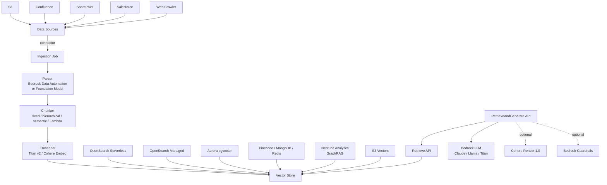
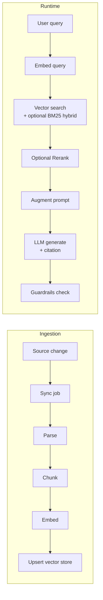

# Bedrock Knowledge Bases

## 핵심 요약

AWS의 fully-managed RAG 서비스로, 사용자가 데이터 소스와 vector store를 지정하면 ingestion(parsing → chunking → embedding → 저장) 전체와 retrieval API까지 한 묶음으로 제공한다. Bedrock의 LLM(Claude, Llama, Titan 등) · Guardrails · Agents와 IAM 기반으로 결합된다.

- **End-to-end 자동화**: data source 등록 시점부터 자동 sync, chunking, embedding, vector index 적재까지 코드 없이 수행
- **두 가지 runtime API**: `Retrieve`(top-K chunks만 반환) / `RetrieveAndGenerate`(retrieval + LLM 호출 + citation 자동 묶음)
- **선택지 폭이 넓음**: 데이터 소스, 청킹 전략, embedding 모델, vector store를 각각 교체 가능 → AWS-내 컴포넌트 조합으로 RAG 운영
- **최근 확장**: 2025년 3월 GraphRAG GA, 2025년 4월 Aurora/MongoDB hybrid search, 2025년 12월 S3 Vectors 출시(최대 90% 비용 절감)

## 시스템 아키텍처

Knowledge Base는 data source connector → ingestion job(parser + chunker + embedder) → vector store + metadata index → runtime retrieval API의 4-layer 구조다.

## 처리 흐름

데이터 적재 시점부터 사용자 query 응답까지의 두 단계 흐름이다 — ingestion(offline)과 retrieval(runtime)이 명확히 분리된다.

1. **Sync**: 주기 또는 수동 trigger로 source 변경분 fetch. metadata(source, version, last-modified)도 함께 추출
2. **Parse**: Bedrock Data Automation parser는 표·이미지·heading 구조 보존 (단가는 버전 민감, 최신값은 공식 pricing 페이지 확인)
3. **Chunk**: 5개 전략 중 선택(다음 절 참조)
4. **Embed**: Titan Text Embeddings V2 또는 Cohere Embed(English/Multilingual). 입력 토큰만 과금
5. **Upsert**: 선택한 vector store에 vector + metadata 저장. doc_id로 idempotent 적재
6. **Runtime**: query embedding → semantic+BM25 hybrid search → (선택) Cohere Rerank → prompt augmentation → LLM 호출 → citation/Guardrails 응답

## 핵심 기능 및 서비스

> **버전 민감 항목 flag**: 아래 기능 목록의 지원 여부·단가(Rerank, Parser 등)·서비스 quota는 릴리스마다 변동됩니다. 최신 내용은 [Amazon Bedrock Knowledge Bases 공식 문서](https://docs.aws.amazon.com/bedrock/latest/userguide/kb-how-it-works.html) 및 [Bedrock pricing](https://aws.amazon.com/bedrock/pricing/)에서 확인하세요.

| 기능                     | 설명                                                                                                                                                                                   |
| ---------------------- | ------------------------------------------------------------------------------------------------------------------------------------------------------------------------------------ |
| Data Source Connectors | S3 / Confluence / SharePoint / Salesforce / Web Crawler 등 — 주기적 자동 sync                                                                                                              |
| Vector Store 옵션        | OpenSearch Serverless(default) / OpenSearch Managed / Aurora PostgreSQL(pgvector) / Pinecone / MongoDB Atlas / Redis Enterprise Cloud / Neptune Analytics(GraphRAG) / S3 Vectors(신규) |
| Chunking 전략            | default(fixed) / hierarchical(parent-child) / semantic / no-chunking / custom Lambda transformer                                                                                     |
| Embedding 모델           | Titan Text Embeddings V2 (256/512/1024 dim) / Cohere Embed English v3 / Cohere Embed Multilingual v3                                                                                 |
| Hybrid Search          | semantic + BM25 병행 — OpenSearch(Serverless/Managed), Aurora PostgreSQL, MongoDB Atlas 지원                                                                                             |
| GraphRAG               | Neptune Analytics 위에 entity·관계 그래프를 자동 구축 → graph-aware retrieval (2025년 3월 GA)                                                                                                      |
| Reranking              | Cohere Rerank 1.0 통합 (단가 버전 민감, 현재 시점 공식 페이지 확인)                                                                                                                                    |
| Query Reformulation    | 모호한/복합 query를 sub-query로 분해 후 검색                                                                                                                                                     |
| RetrieveAndGenerate    | retrieval + LLM 호출을 단일 API call로 묶음, citation 자동 포함                                                                                                                                  |
| Session Context        | multi-turn 대화 컨텍스트 자동 관리                                                                                                                                                             |
| Guardrails 통합          | 응답 필터링, PII 마스킹 (별도 Guardrails 구성 연결)                                                                                                                                                |
| IAM 통합                 | row-level/document-level access control을 IAM/리소스 정책으로 구현                                                                                                                             |
| Multimodal             | Bedrock Data Automation parser로 표·이미지·차트가 있는 PDF 처리                                                                                                                                  |

## 유사 기술 비교

| 항목     | AWS Bedrock Knowledge Bases                                         | Vectara                                    | LlamaIndex (+ LlamaCloud)             | 자체 RAG (OpenSearch/Pinecone DIY) |
| ------ | ------------------------------------------------------------------- | ------------------------------------------ | ------------------------------------- | -------------------------------- |
| 특징     | AWS-native managed RAG, IAM/S3 통합                                   | Managed RAG-as-a-Service, 자체 Boomerang 임베딩 | Orchestration 프레임워크 + managed parsing | 컴포넌트 직접 조립                       |
| 장점     | AWS stack과 완벽 통합, 코드 최소, Guardrails/Agents 묶음                       | 단일 API, grounding 정확도 강조                   | 유연성 극대, 다양한 vendor 혼용 가능              | 모든 부분 제어, 비용 최적화 자유              |
| 단점     | "black box" 일부 — chunking·retrieval 세부 튜닝 제약, 기본 service quota 낮음  | AWS 외부 환경, vendor lock-in                  | 운영·튜닝 부담, managed 영역 직접 책임            | 구축·운영 비용 최대                      |
| 적합 케이스 | AWS 중심 stack, 빠른 출시, ML 엔지니어 부족                                     | 빠른 출시 + AWS 외부 환경                          | 복잡 retrieval, 다중 vector store 혼용      | retrieval 정확도가 핵심 KPI, 충분한 리소스   |

## 실제 사례

### Ring (Amazon)
글로벌 고객 지원에 사용. 기존 Lex 기반 rule-based 챗봇의 피크 시간대 human agent escalation 비율을 Bedrock Knowledge Bases 도입 후 낮춤 — region별 컨텐츠를 metadata 필터로 분리, ingestion/평가/promotion 워크플로우 분리로 컨텐츠 거버넌스 강화([AWS ML Blog](https://aws.amazon.com/blogs/machine-learning/how-ring-scales-global-customer-support-with-amazon-bedrock-knowledge-bases/)).

### Synthetic Data 기반 Q&A 예시 (국내 SI 활용)
한국 SI 기업(MetaNet SAS)이 MetaPay에 Bedrock Knowledge Bases를 적용해 도메인 정확도가 중요한 업무(연말정산 등)를 처리한 사례 (AWS Korea Blog 기준, 공개 사례).

## 활용 시나리오

### 시나리오 1: AWS-only 스택의 사내 위키 Q&A
**컨텍스트**: 데이터가 이미 S3·Confluence에 있고 인증은 IAM. ML 엔지니어 부족.  
**선택 이유**: 자체 RAG 구축은 ROI 낮음. KB가 가장 빠른 path-of-least-resistance.  
**적용**: S3 connector + hierarchical chunking + Titan v2 1024 dim + OpenSearch Serverless → `RetrieveAndGenerate` + Claude Sonnet → Guardrails로 PII 필터.

### 시나리오 2: 비용 절감 (S3 Vectors 전환)
**컨텍스트**: OpenSearch Serverless 최소 2 OCU 고정 비용이 트래픽 적은 KB에 부담.  
**선택 이유**: S3 Vectors는 trillion-scale 지원, sub-second latency, 최대 90% 비용 절감(AWS 발표 기준).  
**적용**: 새 KB를 S3 Vectors로 생성, 기존 데이터 재적재 → 트래픽 ramp-up → 구 OpenSearch 인덱스 폐기. 단, OpenSearch만 지원하는 binary vector 등 기능은 사전 검토 필요.

### 시나리오 3: GraphRAG로 관계 추론이 필요한 도메인
**컨텍스트**: 법률·의료·금융처럼 entity 간 관계가 답변에 본질적인 도메인.  
**선택 이유**: 단순 vector retrieval은 분산된 정보 합성에 약함. Neptune Analytics 기반 GraphRAG는 entity·relation 그래프를 자동 구축.  
**적용**: S3 문서 → Bedrock Data Automation parser → KB GraphRAG 모드로 Neptune Analytics 벡터 + 그래프 동시 구축 → graph-aware retrieval → Claude로 응답.

## 장단점 및 트레이드오프

| 항목     | 내용                                                                                                                                                                                                                                                                                                                            |
| ------ | ----------------------------------------------------------------------------------------------------------------------------------------------------------------------------------------------------------------------------------------------------------------------------------------------------------------------------- |
| 장점     | • End-to-end 자동화로 출시 속도 가장 빠른 path • AWS 보안·거버넌스(IAM, KMS, CloudTrail, VPC)와 native 통합 • 7+개 vector store, 5개 chunking 전략 등 선택지 풍부 • Citation/Guardrails/Agents/Rerank 묶음 • GraphRAG, S3 Vectors, 멀티모달 등 최신 기능을 빠르게 흡수                                                                                        |
| 단점     | • Chunking·retrieval 내부 세부 튜닝에 제약 — fine-grained scoring 함수, 커스텀 retriever 어려움 • AWS 외부 vendor lock-in (Bedrock 외 LLM 호출 어려움) • 기본 service quota가 낮음 — 프로덕션 트래픽에는 quota 상향 신청 필요 (quota 수치는 변동, AWS 계정 콘솔에서 확인) • OpenSearch Serverless 기본값은 idle 비용 발생 (S3 Vectors로 일부 해결됨)                                  |
| 트레이드오프 | • **편의 vs 통제**: managed의 black-box 영역 ↔ 자체 RAG의 retrieval 정확도 통제력 • **Vector store 선택**: OpenSearch(기능 풍부, 비싸다) ↔ Aurora pgvector(SQL 친화, 운영 쉬움) ↔ S3 Vectors(저비용, 신규로 fitness 검증 필요) • **Chunking**: hierarchical/semantic(품질↑·비용↑) ↔ default fixed(비용↓) • **GraphRAG**: 관계 추론에 강함 ↔ Neptune Analytics 비용·복잡도 추가 |

## 함정 및 안티패턴

- **안티패턴 1: OpenSearch Serverless 기본값으로 모든 KB 생성** → 트래픽 적은 KB도 idle 고정 비용 발생 → 트래픽·기능 요구를 평가해 S3 Vectors / Aurora pgvector 등 적합 store 선택, 기존 KB는 migration 검토 (구체 단가는 버전 민감, [Bedrock pricing](https://aws.amazon.com/bedrock/pricing/) 확인)
- **안티패턴 2: 기본 service quota로 production 가정** → 기본 한도에 production traffic이 throttle → 출시 전 quota 상향 ticket 제출 (수동 승인 절차 + 사용 사례 입증 필요)
- **안티패턴 3: 단일 Knowledge Base에 모든 도메인 혼재** → metadata filtering·content governance가 어려워짐, retrieval 노이즈 ↑ → 도메인별 KB 분리 + region/contents tag로 metadata filter
- **안티패턴 4: Citation 검증 생략** → managed라 안심하다가 hallucination 발견 시 원인 추적 곤란 → `RetrieveAndGenerate` 응답의 citation을 사용자에게 항상 노출, 또는 평가용 golden set으로 정기 검증
- **안티패턴 5: chunking 전략을 default로 고정 후 retrieval 품질 비교 없음** → 도메인별 최적이 다른데 측정 안 함 → hierarchical / semantic / Lambda를 후보로 두고 P@5, MRR 비교
- **안티패턴 6: 자체 RAG 운영 가능한 팀이 KB로 시작했다가 묶임** → 추후 retrieval 정확도 한계 발견 시 migration 비용 큼 → 초기에 KB vs DIY 의사결정을 retrieval KPI 기준으로 명확히

## 참고 자료

- [Foundation Models for RAG — Amazon Bedrock Knowledge Bases (AWS)](https://aws.amazon.com/bedrock/knowledge-bases/) — 공식 제품 페이지
- [How Amazon Bedrock knowledge bases work (AWS Docs)](https://docs.aws.amazon.com/bedrock/latest/userguide/kb-how-it-works.html) — 공식 동작 원리 문서
- [Dive deep into vector data stores using Amazon Bedrock Knowledge Bases (AWS Blog)](https://aws.amazon.com/blogs/machine-learning/dive-deep-into-vector-data-stores-using-amazon-bedrock-knowledge-bases/) — vector store 옵션 비교
- [How content chunking works for knowledge bases (AWS Docs)](https://docs.aws.amazon.com/bedrock/latest/userguide/kb-chunking.html) — chunking 전략 공식 문서
- [Customize ingestion for a data source (AWS Docs)](https://docs.aws.amazon.com/bedrock/latest/userguide/kb-data-source-customize-ingestion.html) — Lambda 커스텀 chunking
- [Announcing GA of Amazon Bedrock Knowledge Bases GraphRAG with Neptune Analytics (AWS Blog)](https://aws.amazon.com/blogs/machine-learning/announcing-general-availability-of-amazon-bedrock-knowledge-bases-graphrag-with-amazon-neptune-analytics/) — GraphRAG GA 발표
- [Bedrock KB now supports hybrid search for Aurora PostgreSQL and MongoDB Atlas (AWS What's New)](https://aws.amazon.com/about-aws/whats-new/2025/04/amazon-bedrock-knowledge-bases-hybrid-search-aurora-postgresql-mongo-db-atlas-vector-stores/) — hybrid search 확장
- [How Ring scales global customer support with Amazon Bedrock Knowledge Bases (AWS Blog)](https://aws.amazon.com/blogs/machine-learning/how-ring-scales-global-customer-support-with-amazon-bedrock-knowledge-bases/) — Ring 사례
- [Amazon Bedrock Knowledge Bases 정식 출시 — 완전관리형 RAG (AWS Korea Blog)](https://aws.amazon.com/ko/blogs/korea/knowledge-bases-now-delivers-fully-managed-rag-experience-in-amazon-bedrock/) — 국문, GA 공지

## 관련 노트

- [[aws-bedrock-overview]] — Bedrock 플랫폼 전체 개요 (본 노트의 상위 컨텍스트)
- [[aws-bedrock-agents]] — Bedrock Agents: KB를 RetrievalTool로 사용하는 에이전트 오케스트레이션
- [[bedrock-model-customization]] — KB와 협력하는 customized LLM 서빙 패턴 (RAG + FT 조합)
- [[aws-bedrock-embedding]] — KB의 embedding 레이어 (Titan, Cohere Embed)
- [[cohere-embed-multilingual-v3]] — KB에서 선택 가능한 다국어 임베딩 모델 (한국어 포함)
- [[moc-aws-bedrock]] — 본 노트 소속 MOC
- [[moc-rag]] — KB가 구현하는 RAG 파이프라인 전체 토픽
