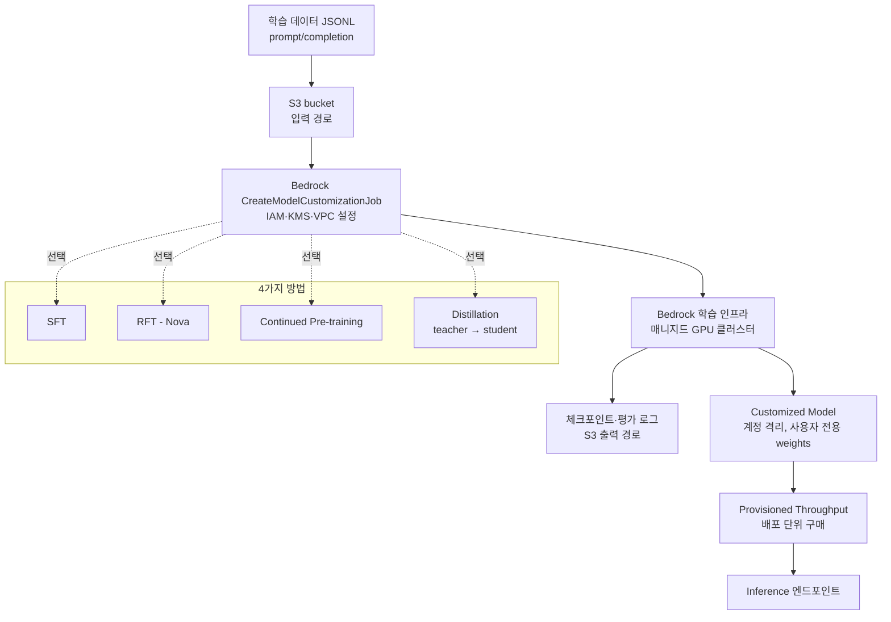
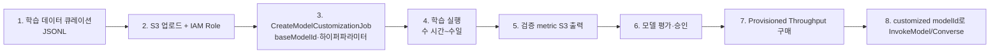

# Bedrock Model Customization

## 핵심 요약

Bedrock Model Customization은 사용자 데이터로 Foundation Model을 도메인 적응시키는 **4가지 매니지드 학습 방법**(SFT, RFT, Continued Pre-training, Distillation)을 제공한다. 사용자는 S3에 데이터만 업로드하면 학습 인프라·하이퍼파라미터 관리 없이 customized 모델을 얻는다. 결과 모델은 Provisioned Throughput으로 배포해야 추론 가능.

- **Supervised Fine-Tuning (SFT)**: prompt-completion 라벨 데이터로 지도 학습
- **Reinforcement Fine-Tuning (RFT)**: reward function 기반 RL(주로 Amazon Nova)
- **Continued Pre-training**: 라벨 없는 대량 도메인 텍스트로 사전학습 연장
- **Distillation**: 큰 teacher 모델의 응답을 작은 student 모델에 압축 전이
- **인프라 추상화**: GPU 클러스터·체크포인트·분산학습을 사용자가 직접 다루지 않음

## 시스템 아키텍처

학습 잡(Job)은 S3 입력 → Bedrock 학습 인프라 → 사용자 계정의 customized model 산출 흐름이다.

## 처리 흐름

SFT 시나리오 기준 customization job의 단계.

## 핵심 기능 및 서비스

| 기능 | 설명 |
|---|---|
| SFT | JSONL `{prompt, completion}` 또는 messages 형식. epoch·learning rate·batch size 일부 설정 |
| Continued Pre-training | 라벨 없는 도메인 코퍼스(법률·의료·내부 문서)로 base 지식 확장 |
| RFT | 보상 함수 또는 evaluator 모델로 정책 학습. Amazon Nova 시리즈에서 지원 |
| Model Distillation | teacher 응답을 합성 데이터로 활용해 student를 SFT. 비용·지연 최적화 목적 |
| 지원 모델 | Nova, Claude(일부), Titan, Llama, Cohere Command 등(시기·리전별 차등) |
| Provisioned Throughput | customized 모델 배포 시 필수. 시간당 model unit 단위 과금 |
| KMS·VPC 격리 | 학습 데이터·결과 weights를 사용자 KMS 키·private VPC 내 격리 |
| 평가 자동 산출 | 검증 데이터셋에 대한 loss·accuracy를 S3에 자동 기록 |

## 과금

> **버전 민감 항목 flag**: 아래 단가는 참고용이며 릴리스 주기에 따라 변경됩니다. 적용 전 [Amazon Bedrock pricing](https://aws.amazon.com/bedrock/pricing/) 및 [Supported models for customization](https://docs.aws.amazon.com/bedrock/latest/userguide/custom-model-supported.html)에서 최신 수치를 반드시 확인하세요.

Customization은 **(1) 학습 잡 비용 + (2) 결과 모델 보관 비용 + (3) 추론을 위한 Provisioned Throughput 호스팅 비용** 3축으로 누적된다. 추론은 PT 외에는 불가하므로 PoC 후 방치 시 비용 폭증 위험이 크다.

| 단계 | 단가 (모델별 변동, 대표값) |
|---|---|
| SFT / Continued Pre-training 학습 | per **1,000 trained tokens** = (dataset tokens × epochs). 예: Cohere Command 학습 $0.004 / 1K tokens(1K tokens × 1 epoch ≈ $0.004) |
| Reinforcement Fine-Tuning (RFT) | **시간당 과금** (GPT-OSS 20B / Qwen3 32B = $80/hour). Nova RFT는 별도 단가, 공식 페이지 참조 |
| Distillation | teacher 응답 합성 토큰 비용(On-Demand) + 결과 student 학습 토큰 비용 |
| Custom model storage | **$1.95 / month / model** (가중치 보관) |
| 추론(Provisioned Throughput) | model unit(MU) 시간당. 예: Cohere Command 1개월 commitment $39.60/MU. **MU 1개는 no-commitment 시간당 단가가 가장 비싸고, 1개월/6개월 commitment 순으로 저렴** |
| On-Demand 추론 | **불가** (custom 모델은 PT 호스팅만 지원) |
| 데이터 입출력 | S3 스토리지 / KMS 표준 단가 |

> **주의**: 학습이 끝나도 모델을 invoke 하려면 즉시 PT를 구매해야 한다 → "학습 비용 = 끝" 이 아니라 **PT 시간당 과금이 곧바로 시작**. 평가만 마치고 모델을 보관할 거라면 PT 해제 + storage $1.95/month만 남기는 패턴이 표준. 합성 데이터 distillation은 teacher 호출 토큰까지 누적되므로 sample 비용으로 사전 산정 필수.

## 유사 기술 비교

| 항목 | Bedrock Customization | SageMaker Training | OpenAI Fine-tuning | LoRA 자체 학습 |
|---|---|---|---|---|
| 특징 | 완전 매니지드, 4개 방법 통합 | 풀 제어, 임의 프레임워크 | OpenAI 호스팅 | 자체 인프라·PEFT |
| 장점 | 인프라 0관리, AWS 거버넌스 | 임의 모델·임의 알고리즘 | OpenAI 모델 직접 튜닝 | 비용·실험 자유도 최대 |
| 단점 | 지원 모델 제한, Provisioned Throughput 비용↑ | DevOps 부담 | OpenAI 락인, 모델 제한 | GPU·MLOps 직접 구축 |
| 적합 케이스 | AWS 중심 도메인 적응 | 연구·non-Bedrock 모델 | OpenAI 단일 스택 | 학술·소규모 실험 |

## 실제 사례

### Nova 모델 도메인 튜닝 (AWS 블로그)
Amazon Nova 모델을 사내 고객 지원 데이터로 SFT 수행한 사례. JSONL 약 5만 건으로 도메인별 응답 정확도와 어조 일관성 향상([AWS ML Blog](https://aws.amazon.com/blogs/machine-learning/customize-amazon-nova-models-with-amazon-bedrock-fine-tuning/)).

### Synthetic Data 기반 Q&A Fine-tuning
원본 도메인 문서가 부족한 경우, teacher 모델(Claude)로 합성 Q&A 데이터를 생성한 뒤 student 모델을 SFT. Distillation 패턴의 변형([AWS ML Blog](https://aws.amazon.com/blogs/machine-learning/fine-tune-llms-with-synthetic-data-for-context-based-qa-using-amazon-bedrock/)).

## 활용 시나리오

### 시나리오 1: 사내 코드 어시스턴트
사내 모놀리식 코드베이스의 코딩 컨벤션을 학습. Continued Pre-training으로 도메인 토큰을 익히고 SFT로 PR 리뷰 응답 형식을 학습. RAG만으로 부족한 "스타일" 학습을 모델 weights에 반영.

### 시나리오 2: 비용 최적화를 위한 Distillation
프로덕션에서 Claude Opus의 응답을 로깅 → 합성 학습 데이터 구성 → 더 작은 Claude Haiku에 distillation. 90% 품질 유지 + 추론 비용 1/10 달성 패턴.

### 시나리오 3: 규제 산업의 격리된 모델 학습
KMS·VPC 격리 옵션으로 환자 데이터·법무 데이터를 외부에 노출하지 않고 학습. 결과 모델은 사용자 계정 내에서만 호출 가능, 다른 AWS 고객에게 weights 공유되지 않음.

## 장단점 및 트레이드오프

| 항목 | 내용 |
|---|---|
| 장점 | (1) GPU 인프라·분산학습 완전 추상화 (2) 4개 학습 방법을 단일 API로 (3) KMS/VPC 격리로 컴플라이언스 |
| 단점 | (1) 하이퍼파라미터 노출 제한적(연구 용도엔 부족) (2) customized 모델 배포에 Provisioned Throughput 필수 → 시간당 과금이 큼 (3) 지원 모델·리전이 시기마다 변동 |
| 트레이드오프 | RAG(빠르고 저렴) vs Fine-tuning(품질·스타일 학습). 사실 업데이트는 RAG, 출력 형식·페르소나는 Fine-tuning이 일반적으로 유리 |

## 함정 및 안티패턴

- **사실 업데이트 목적으로 Fine-tuning**: 모델은 학습 데이터를 외우지 않고 일반화함. 사실은 잘못 재현될 수 있음 → **대안**: 사실은 RAG(Knowledge Base), Fine-tuning은 스타일·구조·도메인 어휘 학습에 한정
- **소량 데이터(<100건)로 Fine-tuning**: overfitting·일반화 능력 파괴 → **대안**: 최소 수천 건 확보 후 진행, 부족하면 합성 데이터·Few-shot prompting 우선
- **Provisioned Throughput 비용 미산정**: customized 모델 배포 즉시 시간당 과금 시작, PoC 후 방치 시 비용 폭증 → **대안**: 실험 끝나면 즉시 PT 해제, 또는 on-demand 평가 후 본격 배포만 PT
- **eval 셋 없이 train 진행**: 학습 후 품질 측정 불가 → **대안**: 검증 데이터셋(별도 JSONL)을 반드시 제공해 metric S3 출력 확인

## 참고 자료

- [Customize your model (AWS Userguide)](https://docs.aws.amazon.com/bedrock/latest/userguide/custom-models.html) — Customization 전체 개요
- [Submit a model customization job (AWS Docs)](https://docs.aws.amazon.com/bedrock/latest/userguide/model-customization-submit.html) — Job 생성·하이퍼파라미터
- [Supported models and Regions for customization (AWS Docs)](https://docs.aws.amazon.com/bedrock/latest/userguide/custom-model-supported.html) — 모델·리전 매트릭스
- [Customize Nova with Bedrock Fine-tuning (AWS Blog)](https://aws.amazon.com/blogs/machine-learning/customize-amazon-nova-models-with-amazon-bedrock-fine-tuning/) — Nova SFT 사례
- [Customize models with fine-tuning and continued pre-training (AWS News)](https://aws.amazon.com/blogs/aws/customize-models-in-amazon-bedrock-with-your-own-data-using-fine-tuning-and-continued-pre-training/) — Customization 공식 발표

## 관련 노트

- [[aws-bedrock-overview]] — Bedrock 플랫폼 전체 개요 (본 노트의 상위 컨텍스트)
- [[aws-bedrock-agents]] — Bedrock Agents: customized model을 에이전트 Action Group에 연결 가능
- [[bedrock-claude-generation-models]] — Distillation의 teacher 모델 후보(Claude Sonnet/Opus). generation 비용 비교 관점
- [[moc-aws-bedrock]] — 본 노트 소속 MOC
