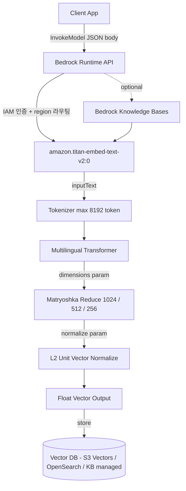
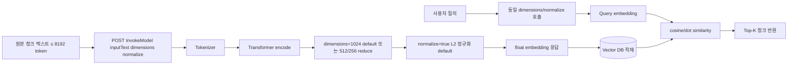

# Amazon Titan Text Embeddings V2

## 핵심 요약

AWS가 2024-04-30 출시한 RAG 최적화 임베딩 모델. **dim 가변(256/512/1024) Matryoshka 구조**로 동일 모델 출력에서 비용·정확도 trade-off 조정 가능. 8192 token / 50,000 char 입력, Bedrock 매니지드. v1(1536 dim, 25+ 언어) 대비 5x 저렴 + 100+ 언어 사전학습 확장. 단 AWS 공식은 cross-language·비영어 retrieval이 sub-optimal하다고 명시 — 다국어 RAG 보장 모델 아님.

- **dim 3단 가변**: 1024 (기본) / 512 (99% accuracy retention) / 256 (97% accuracy retention) — request body의 `dimensions` 파라미터로 선택
- **normalize 옵션**: `normalize: true` (default) — 개선된 unit vector normalization으로 cosine similarity 정확도 향상. RAG 사용 시 default 유지 권장
- **큰 입력 한도**: 8192 token / 50K char — Cohere v3(512 token) 대비 표·코드 청크 친화
- **가격**: $0.02 / 1M input tokens (Bedrock) — v1 대비 5x ↓, Cohere v3 대비 5x ↓ ([요금 페이지](https://aws.amazon.com/bedrock/pricing/) 최신 확인 권장)
- **100+ 언어 학습 + 코드**: cross-language retrieval은 sub-optimal로 AWS가 명시 — 영어 위주 운영 시 가성비 최강

## 시스템 아키텍처

Bedrock 매니지드 모델로 호출자는 `bedrock-runtime` API를 통해 InvokeModel 호출. IAM/VPC PrivateLink 통제, Bedrock KB와의 native 통합 경로가 핵심 구성요소.

## 처리 흐름

dimensions·normalize 파라미터 선택이 retrieval 품질·비용 균형의 1차 결정자. 인덱싱과 질의 시점에 **반드시 동일 파라미터**를 사용해야 한다.

## 핵심 기능 및 서비스

| 기능 | 설명 |
|---|---|
| Output dim 가변 (Matryoshka) | 1024 / 512 / 256 선택. 1024→512: ~99% accuracy. 1024→256: ~97% accuracy. S3 Vectors 비용 직접 절감 가능 |
| Input limit 8192 token / 50K char | 큰 청크 또는 표·코드 다용도. 청킹 전략 결합 시 chunk 크기 자유도 ↑ |
| normalize 파라미터 | `true` (default) — L2 unit vector. cosine similarity 정확도 ↑. RAG 사용 시 거의 항상 true |
| embeddingTypes 파라미터 | `float` (default) |
| 100+ 언어 + 코드 사전학습 | 영어 위주 운영에 최적. cross-language·비영어 retrieval은 AWS가 sub-optimal로 명시 |
| Bedrock KB native | KB의 default embedding 옵션 중 하나. 매니지드 RAG 파이프라인 진입점 |
| 가격 | $0.02 / 1M input tokens (v1 대비 5x↓) — 최신 단가는 [공식 요금 페이지](https://aws.amazon.com/bedrock/pricing/) 확인 |
| Region 가용성 | ap-northeast-2(Seoul) 가용 확인됨 (2026-06 기준). 신규 모델 출시 시 region 매트릭스 재확인 권고 |

## 유사 기술 비교

| 항목 | Titan Text Embeddings V2 | Titan Embeddings G1 (v1) | Cohere Embed Multilingual v3 | OpenAI text-embedding-3-large |
|---|---|---|---|---|
| 특징 | RAG 최적화, dim 가변, Matryoshka | 1세대 Titan 임베딩 | 100+ 언어 cross-lingual, input_type 명시 | Matryoshka, OpenAI 생태계 |
| dim | 1024 / 512 / 256 | 1536 고정 | 1024 고정 (light: 384) | 3072 (축소 가능) |
| Context length | 8192 token | 8000 token | 512 token | 8191 token |
| 언어 사전학습 | 100+ 언어 + 코드 (단, cross-lang sub-optimal AWS 명시) | 25+ 언어 | 100+ 언어 cross-lingual 강점 | 다국어 우수 |
| 가격 (1M tokens) | $0.02 (Bedrock) | $0.10 (v1) | $0.10 (Bedrock) | $0.13 (OpenAI direct) |
| 적합 케이스 | 영어 위주 RAG, 비용·dim 유연성 우선 | deprecated 경로 — v2 마이그레이션 권장 | 다국어/cross-lingual RAG | 영어·다국어 general purpose, OpenAI ecosystem |

## 실제 사례

### AWS 공식 RAG 가이드 (re:Invent · ML blog 시리즈)
AWS 블로그·re:Invent 데모에서 Bedrock KB 기본 임베딩 모델로 Titan v2를 사용한 end-to-end RAG 데모 다수 공개. dim 256으로 적재 → 벡터 인덱스 크기 1/4 + 검색 latency·비용 절감을 보이는 비교 차트가 출시 발표에 포함됐다.

### Bedrock KB 통합 (2024-06)
2024-06부터 Bedrock Knowledge Bases가 Titan v2를 default embedding 옵션 중 하나로 채택. KB 사용자는 콘솔에서 모델 선택 → 자동 청킹·인덱싱·검색 파이프라인 구축. Bedrock KB 사용자 다수의 default 경로.

## 활용 시나리오

### 시나리오 1: 영어 위주 RAG — Cohere 대비 선택 기준
콘텐츠가 영어 비중이 높을 경우 Titan v2가 합리적 선택. 비용이 Cohere v3 대비 5x 저렴하고 dim 256 옵션으로 S3 Vectors 스토리지 비용을 추가로 절감 가능. 한국어 등 비영어 위주 콘텐츠라면 양쪽 동시 sanity test 후 결정 권장.

### 시나리오 2: 대용량 청크 RAG (8192 token 활용)
청킹 전략을 큰 단위(정책서 페이지 전체 또는 H1 섹션 전체)로 가져갈 경우 Titan v2의 8192 token 한도가 native 처리. Cohere v3(512 token)는 페이지를 더 잘게 쪼개야 하므로 청크 수 증가 + 인덱스 폭증. 큰 청크 + parent-child 구조 없이 운영하려면 Titan v2 유리.

### 시나리오 3: Bedrock KB 매니지드 RAG 경로
KB의 default embedding을 Titan v2로 두면 청킹·인덱싱·검색까지 AWS 관리. 단 KB는 청킹 제어 폭이 제한적이므로, 문서 유형별 차별 청킹이 필요한 경우 자체 인덱싱 파이프라인과의 trade-off 검토 필요.

## 장단점 및 트레이드오프

| 항목 | 내용 |
|---|---|
| 장점 | dim 3단 가변 (S3 Vectors 비용 직접 절감), 8192 token 입력 (큰 청크 친화), $0.02/1M tokens 압도적 저렴, Bedrock KB native, normalize 개선으로 retrieval 정확도 ↑ |
| 단점 | AWS 공식 명시: cross-language·비영어 retrieval sub-optimal — 한국어 위주 콘텐츠에 검색 miss 위험. 영어 외 언어 MTEB 벤치마크 공개 자료 적음 — 자체 sanity test 필수 |
| 트레이드오프 | dim 축소(512/256)로 인덱스·query 비용 절감 가능하나 한 번 적재 후 dim 변경 시 전체 재인덱싱. 영어 retrieval 우위와 비영어 콘텐츠 retrieval 손실의 균형은 sample 측정으로만 확인 가능 |

## 함정 및 안티패턴

- **비영어 콘텐츠에 sanity test 없이 v2 채택**: AWS 공식이 비영어 sub-optimal 명시한 상황에서 검색 miss 다발 가능. retrieval precision 측정 없이 비용만 보고 결정하면 사용자 신뢰 손상 → 반드시 5-10 Q-A 페어로 Cohere v3와 비교 후 결정
- **dim 256 적재 후 retrieval 품질 부족 호소**: 256은 1024 대비 ~97% accuracy 보존이지만 "97%"가 곧 "충분"은 아님. 정확성 우선 도메인(정책서 등)에서는 3% 차이가 사용자 경험에 큰 영향 → MVP는 1024로 시작 후 비용 압박 시 512 → 256 단계적 검토
- **`normalize=false`로 적재 후 cosine similarity 사용**: 비정규화 벡터에 cosine similarity는 dot product와 등가성 깨짐. retrieval ranking 무작위 노이즈 증가 → RAG 사용 시 `normalize=true` 항상 유지 (default라 명시 안 해도 됨)
- **dim 변경 시 부분 재인덱싱**: 1024 적재 후 일부만 256으로 재계산하면 vector space 호환 안 됨 (Matryoshka 구조여도 query는 적재 dim과 동일해야 함). 모든 record 재계산 필수
- **v1 → v2 마이그레이션 시 같은 인덱스 혼용**: vector space 다름. v1과 v2 임베딩을 같은 인덱스에 넣고 query하면 ranking 깨짐 → 인덱스 분리 또는 전체 재임베딩 후 swap

## 참고 자료

- [Amazon Titan Text Embeddings models — Bedrock 공식 문서](https://docs.aws.amazon.com/bedrock/latest/userguide/titan-embedding-models.html) — 공식 모델 카드, dimensions/normalize 파라미터 (High)
- [Titan Text Embeddings V2 — model card](https://docs.aws.amazon.com/bedrock/latest/userguide/model-card-amazon-titan-text-embeddings-v2.html) — input/output spec, region 가용성 (High)
- [Amazon Titan Text Embeddings V2 now available — AWS What's New](https://aws.amazon.com/about-aws/whats-new/2024/04/amazon-titan-text-embeddings-v2-amazon-bedrock/) — 2024-04-30 출시 발표 (High)
- [Get started with Amazon Titan Text Embeddings V2 — AWS ML blog](https://aws.amazon.com/blogs/machine-learning/get-started-with-amazon-titan-text-embeddings-v2-a-new-state-of-the-art-embeddings-model-on-amazon-bedrock/) — dim 트레이드오프 (99%/97% accuracy retention) 수치 출처 (High)
- [Titan v2 optimized for improving RAG — AWS blog](https://aws.amazon.com/blogs/aws/amazon-titan-text-v2-now-available-in-amazon-bedrock-optimized-for-improving-rag/) — RAG 최적화 설계 의도 (High)
- [Titan v2 in Bedrock Knowledge Bases — AWS What's New (2024-06)](https://aws.amazon.com/about-aws/whats-new/2024/06/amazon-titan-text-embeddings-v2-bedrock-knowledge-bases/) — KB 통합 시점 (High)
- [Titan Embeddings G1 vs V2 — re:Post](https://repost.aws/questions/QUfVatkZHtRYW8-dNcawCyQA/titan-text-embeddings-v2-vs-titan-embeddings-g1-text) — v1 vs v2 차별점 공식 답변 인용 (High)

## 관련 노트

- [[moc-aws-bedrock]] — AWS Bedrock 생태계 인덱스
- [[aws-bedrock-embedding]] — Bedrock 임베딩 서비스 전반 (Titan V2 서비스 레벨 overview 포함)
