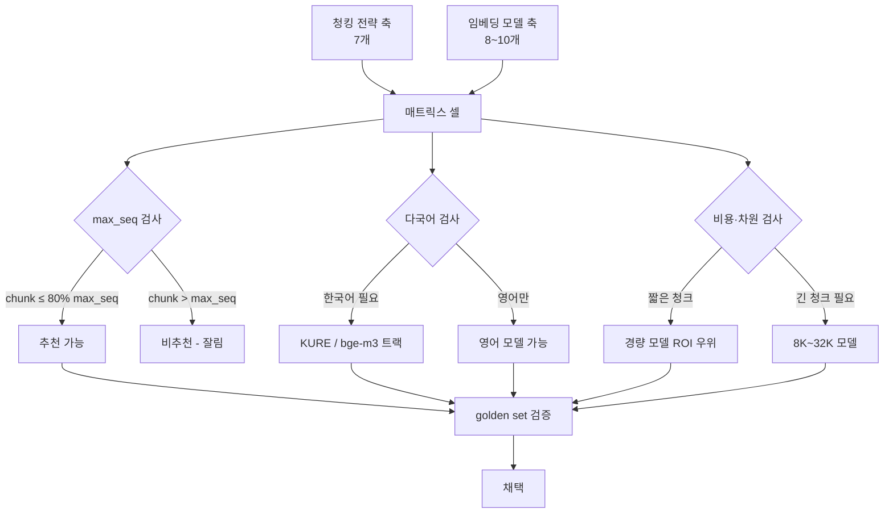
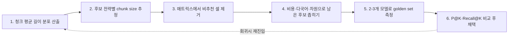

# Chunking × Embedding Model Compatibility Matrix

## 핵심 요약

청킹 전략 선택은 단독으로 retrieval 품질을 결정하지 못한다. **임베딩 모델의 `max_seq`(최대 토큰 컨텍스트), 차원, 다국어 지원 범위와 결합**해서만 최종 결과가 결정된다. 본 노트는 7개 주요 청킹 전략과 8~10개 주요 임베딩 모델의 호환·비추천 조합을 표로 정리하고, 결정 룰 5개를 첨부한다. 새 코퍼스/도메인 도입 시 [[chunking-strategy-methodology]]의 1~2단계 직후 본 매트릭스로 임베딩 후보를 좁힌 다음 golden set으로 최종 검증한다.

- **잘림 = retrieval 품질 실패**: chunk 길이가 임베딩 `max_seq`를 초과하면 토큰이 silently truncate되어 의미 정보 손실.
- **권장 안전 마진**: chunk 평균 길이 ≤ `max_seq` × 80%. overlap·prefix·suffix까지 고려한 후 한도 80% 이내 유지.
- **분포 일치 원칙**: semantic·agentic처럼 분할 자체가 임베딩 거리에 의존하는 전략은 **분할용·인덱싱용 임베딩을 동일 모델로 통일**해야 분포 일치.
- **한국어 RAG의 별도 트랙**: `KURE-v1`·`bge-m3`·`bge-m3-ko` 베이스. 영어 전용(`cohere.embed-english-v3` 등)은 한국어 토큰 효율 저하로 비추천.
- **golden-set 평가 의무**: 본 매트릭스는 후보 좁히기 도구. 최종 채택은 도메인 평가셋에서 P@K·Recall@K로 검증.

## 시스템 아키텍처

매트릭스는 두 축(청킹 전략 × 임베딩 모델)과 세 셀 카테고리(추천 / 비추천 / 보류)로 구성된다. 결정 시 다음 차원으로 셀을 좁힌다.

## 처리 흐름

매트릭스 사용 절차. [[chunking-strategy-methodology]]의 단계 2(전략 후보 선정) 직후 진입.

## 핵심 기능 및 서비스

### 전략별 호환 / 비추천 임베딩 모델 매트릭스

| 청킹 전략 | 추천 임베딩 | 추천되지 않는 임베딩 |
|---|---|---|
| Fixed-size | `text-embedding-3-small`, `bge-m3`, `amazon.titan-embed-text-v2`, `multilingual-e5-large`, `cohere.embed-multilingual-v3`(≤500 token 청크 한정) | `voyage-3-large`(32K 낭비), `KURE-v1`(한국어 강점 미활용), `cohere.embed-english-v3`(영어 전용) |
| Recursive | `text-embedding-3-large/small`, `bge-m3`, `KURE-v1`, `amazon.titan-embed-text-v2`(8K) | `multilingual-e5-large`(512 잘림), `all-MiniLM-L6-v2`(256), `cohere.embed-multilingual-v3`(512 — overlap 포함 시 초과) |
| Semantic | `text-embedding-3-large`, `bge-m3`, `voyage-3-large`, `KURE-v1`, `amazon.titan-embed-text-v2`(8K) | `text-embedding-ada-002`(레거시), `all-MiniLM-L6-v2`, `multilingual-e5-base`, `cohere.embed-multilingual-v3`(512 — 가변 청크 초과 위험) |
| Hierarchical (Parent-Child) | `text-embedding-3-large`(8K), `bge-m3`(8K), `voyage-3-large`, `amazon.titan-embed-text-v2`(8K) | `multilingual-e5-large`(512 — parent 청크 잘림), `cohere.embed-multilingual-v3`(512 — parent 500~2000 tokens 잘림), `cohere.embed-english-v3`(동일 이유) |
| Structure-aware | `text-embedding-3-large`(8K), `voyage-3-large`(32K), `bge-m3`(8K), `jina-embeddings-v3`, `amazon.titan-embed-text-v2`(8K) | `multilingual-e5-large`(512), `cohere.embed-english-v3`(512), `cohere.embed-multilingual-v3`(512), `all-MiniLM-L6-v2` |
| Contextual Retrieval | `voyage-3-large`(Anthropic Cookbook 권장), `text-embedding-3-large`, `bge-m3`, `amazon.titan-embed-text-v2`(8K) | `multilingual-e5-large`(512), `all-MiniLM-L6-v2`, `cohere.embed-multilingual-v3`(512 — 컨텍스트 보강 청크 초과) |
| Sliding-window | `text-embedding-3-small`, `bge-m3`, `multilingual-e5-large`, `KURE-v1`, `amazon.titan-embed-text-v2` | `voyage-3-large`(32K 낭비), `text-embedding-3-large`(차원 과함), `cohere.embed-multilingual-v3`(512 — window 크기에 따라 초과) |
| Agentic | `text-embedding-3-large`, `bge-m3`, `cohere.embed-multilingual-v3`(단문 청크 한정), `KURE-v1`, `amazon.titan-embed-text-v2` | `voyage-3-large`(32K 낭비), `multilingual-e5-base`, `cohere.embed-english-v3`(영어 전용) |

### 결정 룰 (요약)

1. **잘림 방지**: chunk 평균 길이 ≤ 모델 `max_seq` × 80%. overlap·prefix·suffix까지 합산해서 80% 이하 유지.
2. **분포 일치**: semantic·agentic처럼 임베딩 거리로 분할 경계가 정해지는 전략은 **분할용·인덱싱용 모델을 동일하게** 유지.
3. **한국어 RAG**: `KURE-v1` / `bge-m3-ko` / `bge-m3`를 베이스로 고려. 영어 전용 모델은 한국어 토큰 효율 저하로 회피.
4. **비용 효율**: fixed/sliding은 큰 차원·긴 컨텍스트 모델보다 **경량 모델이 ROI 우위**. 32K 모델을 500 token 청크에 쓰는 것은 자원 낭비.
5. **golden-set 평가 의무**: 본 매트릭스는 후보 좁히기 도구. 모델·전략 조합은 도메인 평가셋에서 retrieval recall@k·precision@k로 최종 검증.

## 유사 기술 비교

매트릭스 형태의 의사결정 도구는 vault 내 sibling이 존재한다. 본 노트와의 관계:

| 의사결정 도구 | 입력 축 | 출력 | 결합 방식 |
|---|---|---|---|
| 본 매트릭스 | 청킹 전략 × 임베딩 모델 | 추천 / 비추천 페어 | chunk size 추정 후 1차 필터 |
| [[vector-store-decision-matrix]] | 워크로드 특성 × 벡터 DB | DB 선택 | 임베딩 차원·인덱스 알고리즘과 결합 |
| [[korean-rag-embedding-selection]] | 한국어 도메인 × 임베딩 | 한국어 모델 선택 | 본 매트릭스의 한국어 트랙 deep-dive |

## 활용 시나리오

### 시나리오 1: hierarchical 전략 채택 시 임베딩 선택
**컨텍스트**: 기술 문서 RAG에 hierarchical(parent-child) 채택. 자식 300 tokens / 부모 1500 tokens.
**적용**: 매트릭스 Hierarchical 행 → `multilingual-e5-large`(512), `cohere.embed-multilingual-v3`(512)는 parent 1500 잘림 → 즉시 제외. `text-embedding-3-large`(8K), `bge-m3`(8K), `amazon.titan-embed-text-v2`(8K) 3개로 좁힘 → 비용·다국어 요건으로 1차 선정 후 golden set 측정.

### 시나리오 2: 한국어 사내 위키 RAG의 모델 결정
**컨텍스트**: Confluence(한국어 비중 70%) recursive chunking 450 tokens overlap 50.
**적용**: 결정 룰 #3에 따라 한국어 트랙 우선. Recursive 행에서 `KURE-v1` / `bge-m3` 추천. `cohere.embed-multilingual-v3`는 overlap 포함 chunk 502 → 512 한도 초과 위험으로 회피. `KURE-v1` 우선 후보, `bge-m3` 백업.

### 시나리오 3: 비용 우선 sliding-window QA 검색
**컨텍스트**: 단문 FAQ 검색, chunk 100~200 tokens, QPS 높음.
**적용**: 결정 룰 #4 — `voyage-3-large`(32K)·`text-embedding-3-large`는 차원·컨텍스트 과함으로 ROI 불리. `text-embedding-3-small` / `multilingual-e5-large` / `amazon.titan-embed-text-v2` 경량 후보. 비용 시뮬레이션 후 golden set 측정.

## 장단점 및 트레이드오프

| 항목 | 내용 |
|---|---|
| 장점 | • 청킹 전략 선정 직후 임베딩 모델 후보를 빠르게 좁힘 (수십 → 2~3개) • `max_seq` 잘림 같은 silent failure를 사전에 차단 • 한국어/영어/다국어 트랙을 명시적으로 분리 • 비용 ROI를 결정 룰에 박아 큰 모델 남용 방지 |
| 단점 | • 매트릭스 셀 값은 **모델 릴리스에 따라 변경**(예: `cohere.embed-multilingual-v3.5`는 한도 다를 수 있음) — version-sensitive • 최종 채택은 본 표만으로 불가, golden set 측정 필수 • 신규 임베딩(예: `voyage-3.5`)이 나오면 표 갱신 책임 발생 |
| 트레이드오프 | • **큰 `max_seq` ↔ 비용·차원**: 8K~32K 모델은 긴 청크 가능하나 단위 비용↑·차원↑(검색 지연) • **다국어 ↔ 단일 언어 강점**: 다국어 모델은 보편적이나 한국어 전용 모델 대비 정확도 하락 가능 • **분포 일치 강도**: semantic·agentic은 분할 모델과 인덱싱 모델 동일성이 핵심 ↔ recursive는 무관 |

## 함정 및 안티패턴

- **안티패턴 1: 청크 평균 길이만 보고 `max_seq` 안 봄** — 분포 상위 5%가 `max_seq`를 초과하면 일부 chunk가 silently truncate → 분포 P95 ≤ `max_seq` × 80%로 검증.
- **안티패턴 2: semantic chunking인데 분할용·인덱싱용 임베딩 분리** — 분포가 어긋나 의미 경계가 retrieval과 일치하지 않음 → 동일 모델 사용 강제.
- **안티패턴 3: 32K 모델을 300 token 청크에 사용** — 비용/지연 ROI 손해. fixed-size·sliding-window에는 경량 모델로 충분 → 결정 룰 #4.
- **안티패턴 4: 한국어 RAG에 영어 전용 모델** — `cohere.embed-english-v3` 등은 한국어 토큰을 sub-optimal하게 처리 → 한국어 트랙(`KURE-v1`/`bge-m3`)로 우선 결정.
- **안티패턴 5: 매트릭스만 보고 채택, golden set 측정 생략** — 매트릭스는 후보 좁히기 도구일 뿐 → 결정 룰 #5에 따라 도메인 평가셋 측정 후 최종 확정.
- **안티패턴 6: 모델 버전 명시 없이 운영** — `text-embedding-3-large`가 `v3.5`로 사일런트 업데이트되면 분포가 달라져 기존 인덱스 무효화 위험 → manifest에 모델 버전·차원·`max_seq` 박제.

## 참고 자료

- [Cohere Embed Multilingual v3 모델 카드](https://docs.cohere.com/v2/docs/cohere-embed) — 512 토큰 한도 공식
- [Amazon Titan Text Embeddings v2 — AWS Docs](https://docs.aws.amazon.com/bedrock/latest/userguide/titan-embedding-models.html) — 8K 한도 / 차원
- [BAAI bge-m3 모델 페이지](https://huggingface.co/BAAI/bge-m3) — 8K 다국어, dense/sparse/multi-vector
- [KURE-v1: Korean Universal Retrieval Embedding](https://huggingface.co/nlpai-lab/KURE-v1) — 한국어 특화, max_seq 명세
- [OpenAI Embeddings — text-embedding-3 family](https://platform.openai.com/docs/guides/embeddings) — 8K, 차원·비용 표
- [voyage-3-large 공식 문서](https://docs.voyageai.com/docs/embeddings) — 32K 컨텍스트
- [Anthropic Cookbook: Contextual Retrieval](https://github.com/anthropics/anthropic-cookbook/blob/main/skills/contextual-embeddings/guide.ipynb) — voyage-3-large 권장 사례
- [Jina Embeddings v3 모델 카드](https://huggingface.co/jinaai/jina-embeddings-v3) — 8K 다국어
- [Multilingual E5 모델 카드 (large)](https://huggingface.co/intfloat/multilingual-e5-large) — 512 한도, 다국어
- [all-MiniLM-L6-v2 모델 카드](https://huggingface.co/sentence-transformers/all-MiniLM-L6-v2) — 256 한도, 경량
- [Best Chunking Strategies for RAG (firecrawl)](https://www.firecrawl.dev/blog/best-chunking-strategies-rag) — 전략·모델 결합 사례

## 관련 노트

- [[chunking-strategy-methodology]] — 본 매트릭스가 step 2 직후에 호출되는 상위 방법론
- [[fixed-size-chunking]] / [[recursive-chunking]] / [[semantic-chunking]] / [[sliding-window-chunking]] / [[document-structured-chunking]] / [[agentic-chunking]] — 각 전략의 chunk size 명세
- [[korean-rag-embedding-selection]] — 한국어 트랙의 deep-dive
- [[korean-sentence-boundary-detection]] — 한국어 청크 생성 직전 전처리. sentence split 결과가 임베딩 입력 단위가 됨
- [[titan-text-embeddings-v2]] / [[cohere-embed-multilingual-v3]] / [[aws-bedrock-embedding]] — 매트릭스 행의 임베딩 모델 상세
- [[moc-chunking]] — 본 노트 소속 MOC
