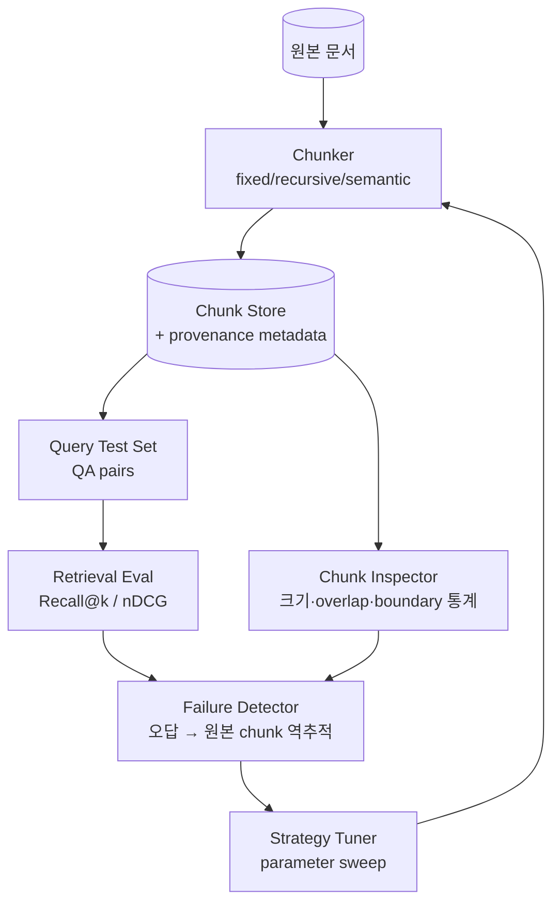
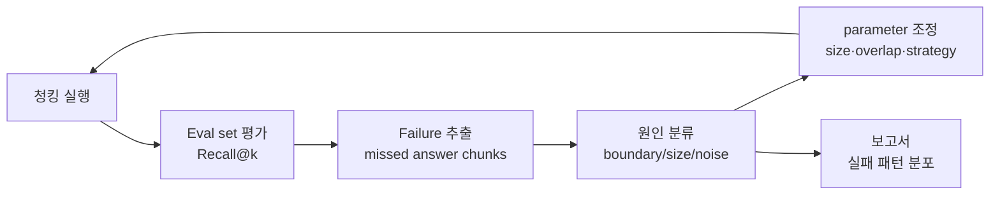

# Chunking Failure Modes

## 핵심 요약

Chunking 실패는 RAG의 가장 흔하지만 가장 진단이 어려운 문제다. 임베딩·벡터DB·리트리벌이 모두 정상인데 답변 품질이 낮다면, 95%는 chunk boundary·크기·메타데이터 문제다. **증상은 retrieval 단에 나타나지만 원인은 ingestion 단**에 있어 root cause 추적이 어렵다.

- **Mid-context loss**: 청크가 정답을 포함하나 핵심 문장이 청크 경계에 잘려 의미 깨짐
- **Context starvation**: 청크는 매칭됐으나 답변 생성에 필요한 주변 맥락 부족
- **Boundary noise**: 동일 의미 단위가 여러 청크로 분산되어 retrieval ranking 분산
- 실패는 **재현 가능하지만 측정 불가능**한 경우가 많아 정량 metric 정의가 1순위
- 청킹·임베딩 mismatch는 가장 흔한 retrieval 실패 원인 → [[chunking-embedding-compatibility-matrix]] 참조

## 시스템 아키텍처

Chunking debugging 시스템은 **Chunk Producer → Chunk Inspector → Failure Detector → Strategy Tuner** 루프로 구성된다. 단순 chunking 코드가 아니라 평가 가능한 실험 환경이 핵심.

## 처리 흐름

QA test set 기반으로 retrieval 정답률을 측정하고, 실패한 쿼리의 정답 chunk와 retrieved chunk를 비교해 boundary·크기·메타데이터 중 어떤 요인이 실패를 만들었는지 분류한다.

## 핵심 기능 및 서비스

| 기능 | 설명 |
|---|---|
| Chunk provenance 추적 | 각 chunk가 어느 문서·페이지·offset에서 나왔는지 metadata로 보존 → 실패 시 역추적 가능 |
| Boundary statistics | chunk 시작/끝이 문장 중간·표 중간에서 끊긴 비율 측정 |
| Size distribution 분석 | token 수 평균·중앙값·꼬리 분포 → 너무 짧은/긴 chunk 비율 점검 |
| Coverage 측정 | 동일 문서의 모든 의미 단위가 최소 1개 chunk에 포함되는지 검증 |
| Eval-driven tuning | golden QA set으로 chunking parameter sweep (size/overlap/strategy 그리드) |
| Diff replay | 새 chunking 적용 후 동일 query의 retrieval 결과 차이 비교 |

## 유사 기술 비교

실패 유형별 전략 취약점. 각 전략의 상세 동작은 sibling 노트 참조.

| 항목 | Fixed-size | Recursive | Semantic | Late Chunking |
|---|---|---|---|---|
| 특징 | 토큰 N개씩 분할 | 구분자 우선순위로 재귀 분할 | 임베딩 유사도 기반 경계 탐지 | 임베딩 후 chunking |
| Mid-context loss 위험 | 높음 — 문장 중간 절단 빈발 | 중간 — 구분자 있으면 보호 | 낮음 — 의미 경계 보존 | 낮음 — 전체 문맥 유지 |
| Context starvation 위험 | 높음 — 고정 크기 | 중간 — 구분자 의존 | 낮음 | 낮음 |
| Boundary noise 위험 | 높음 | 중간 | 낮음 | 낮음 |
| 디버깅 난이도 | 쉬움 — 파라미터 단순 | 중간 | 어려움 — 비결정적 경계 | 어려움 — 모델 의존 |

## 실제 사례

### Anthropic Contextual Retrieval
Anthropic은 2024년 발표에서 chunking 실패의 주요 원인을 "chunk가 원본 문서 컨텍스트를 잃는 것"으로 진단하고, 각 chunk 앞에 LLM 생성 50~100 토큰 prefix를 붙여 boundary noise를 35% 감소시켰다. 이는 chunking 자체를 바꾸지 않고 metadata로 실패를 우회한 사례.

### LlamaIndex Sentence Window Retrieval
LlamaIndex는 mid-context loss 문제 진단 후, 임베딩은 작은 chunk(문장)로 하되 LLM 입력 시 ±N 문장 window로 확장하는 패턴을 도입. retrieval 정확도와 답변 컨텍스트 충분도를 분리 최적화.

### Pinecone Chunking Best Practices 가이드
Pinecone은 자사 가이드에서 chunk size 256/512/1024 토큰 sweep 실험을 공개, **도메인별 최적 size 차이가 2배 이상**임을 보였다(코드: 128, 법률: 1024). single best size는 존재하지 않으며 eval-driven tuning 필수.

## 활용 시나리오

### 시나리오 1: "답변에 절반만 나오는" 증상 디버깅
- **맥락**: 사용자 질문 답변이 중간에 끊김. retrieval recall은 70%로 정상
- **선택**: Chunk provenance 추적으로 정답 chunk가 어디서 잘렸는지 확인
- **적용**: 정답 sentence가 chunk 마지막 50토큰 이내 위치 비율 측정 → 30% 초과 시 overlap 50→150 토큰으로 증가 후 재평가

### 시나리오 2: 표 데이터 retrieval 실패
- **맥락**: 표가 포함된 문서에서 "X열의 Y값" 질의가 항상 실패
- **선택**: Boundary statistics로 표가 여러 chunk에 분산된 비율 측정
- **적용**: 90% 표가 분산됨을 확인 → 표 단위 atomic chunk + 표 summary metadata 추가

### 시나리오 3: chunking parameter sweep 자동화
- **맥락**: 도메인 신규 진입, 최적 chunk size 미지
- **선택**: golden QA 50~100개로 grid search
- **적용**: (size: 256/512/1024) × (overlap: 0/64/128) × (strategy: recursive/semantic) 9~18 조합 평가, Recall@5와 nDCG@10 기준 Pareto front 선택

## 장단점 및 트레이드오프

| 항목 | 내용 |
|---|---|
| 장점 | 정량적 chunking 평가로 추측 제거, 재현 가능, parameter sweep 자동화로 도메인 적응 빠름 |
| 단점 | golden QA set 구축 비용 (수십~수백 시간), eval 자체가 모델 종속(임베딩 변경 시 재평가) |
| 트레이드오프 | **크기 vs 정밀도**(큰 chunk = recall 상승 + precision 하락), **overlap 비용**(저장·임베딩 비용 N배), **automation vs 도메인 지식**(자동 튜닝은 도메인 정답 정의를 대체 못함) |

## 함정 및 안티패턴

- **안티패턴 1**: chunking 변경 후 평가 없이 배포 → retrieval 품질 회귀, 사용자 클레임 후에야 발견 → **대안**: 모든 chunking 변경은 eval set 결과 첨부, regression > 5% 시 차단
- **안티패턴 2**: 동일 chunker로 모든 문서 유형 처리 → 코드/표/긴 문장 혼합 시 모두 차선 결과 → **대안**: document type router (코드 → 함수 단위, 표 → 행 단위, 산문 → recursive)
- **안티패턴 3**: overlap을 무조건 키움 → 저장·임베딩 비용 N배, retrieval 결과 중복 → context window 낭비 → **대안**: overlap은 boundary noise 측정 후 필요 시에만, MMR로 retrieval 시 중복 제거
- **안티패턴 4**: chunk metadata에 원본 위치 정보 안 넣음 → 실패 디버깅 시 원본 문서 역추적 불가 → **대안**: `doc_id`, `page`, `char_start`, `char_end`, `parser_version`, `chunker_config_hash` 필수 기록
- **안티패턴 5**: semantic chunking을 default로 채택 → 임베딩 비용 2x, boundary가 비결정적이라 incremental sync 시 전체 재chunking 발생 → **대안**: 산문 위주 + 비용 여유 있을 때만 도입, recursive를 baseline으로
- **안티패턴 6**: chunk 평가에 단일 query만 사용 → 다른 query 유형에서 회귀 발생 → **대안**: query 카테고리(factoid/multi-hop/summary)별 golden set 분리, 카테고리별 metric 추적

## 참고 자료

- [Anthropic - Introducing Contextual Retrieval](https://www.anthropic.com/news/contextual-retrieval) — chunk context 손실 해결책 사례 (High)
- [LlamaIndex - Sentence Window Retrieval](https://docs.llamaindex.ai/en/stable/examples/node_postprocessor/MetadataReplacementDemo/) — retrieve-small generate-large 패턴 (High)
- [Pinecone - Chunking Strategies for LLM Applications](https://www.pinecone.io/learn/chunking-strategies/) — 도메인별 chunk size sweep (High)
- [Chroma - Evaluating Chunking](https://research.trychroma.com/evaluating-chunking) — chunking eval 방법론 (High)
- [Late Chunking (Jina AI)](https://jina.ai/news/late-chunking-in-long-context-embedding-models/) — 임베딩 후 chunking 접근 (High)
- [Greg Kamradt - 5 Levels of Text Splitting](https://github.com/FullStackRetrieval-com/RetrievalTutorials/blob/main/tutorials/LevelsOfTextSplitting/5_Levels_Of_Text_Splitting.ipynb) — level별 chunking 전략 비교 (Mid)

## 관련 노트

- [[chunking-strategy-methodology]] — 실패 진단 전 설계·품질 사이클 방법론 (상위 프레임워크)
- [[chunking-embedding-compatibility-matrix]] — 청킹-임베딩 mismatch 사전 차단 매트릭스
- [[fixed-size-chunking]] / [[recursive-chunking]] / [[semantic-chunking]] / [[sliding-window-chunking]] — 각 전략의 실패 위험 특성
- [[moc-chunking]] — 본 노트 소속 MOC
