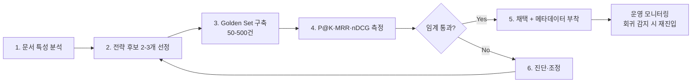

# Chunking Strategy Methodology

## 핵심 요약

RAG 파이프라인에서 원문 문서를 retrieval 단위(chunk)로 분할하는 **전략 설계**와, 그 결과를 정량 지표로 측정하여 반복 개선하는 **품질 사이클**을 결합한 방법론이다. Chunking은 retrieval 품질의 1차 결정 요인이며, 잘못된 결정은 예외 없이 조용히 품질을 떨어뜨린다. 본 노트는 단일 전략의 동작이 아니라 **"어떤 전략을 어떻게 골라 측정·개선할 것인가"**에 답한다.

- **80% 법칙**: RAG 실패의 80%가 LLM이 아니라 ingestion·chunking 레이어에서 발생 — 가장 먼저 점검할 단계.
- **5+α 후보 전략**: fixed-size / recursive / semantic / hierarchical(parent-child) / structure-aware / sliding-window / agentic — 단일 정답 없음. 각 전략 동작은 sibling 노트 참조.
- **품질은 측정해야 보인다**: chunking 변경은 예외/오류를 던지지 않으므로 **golden set 기반 P@K / Recall@K / MRR / nDCG** 정량 비교 필수.
- **2025~2026 트렌드**: hierarchical / parent-child가 production 주류로 자리잡음. small chunk(찾기) + large chunk(이해)의 trade-off를 동시 해결.
- **임베딩 호환성은 별도 매트릭스**: 전략 선택은 임베딩 모델의 `max_seq`·차원과 결합해 최종 retrieval 품질을 결정. 매핑 표는 [[chunking-embedding-compatibility-matrix]].

## 컴포넌트 다이어그램

전략 설계는 splitter · metadata enricher · evaluator · iteration loop의 4 컴포넌트가 golden set과 manifest를 공유하는 구조다. Methodology이므로 데이터 흐름보다 의사결정 컴포넌트 구성을 표시.

```mermaid
graph TD
    A[Source Documents] --> B[Parser<br/>구조 보존]
    B --> C{Splitter<br/>전략 선택}
    C -->|fixed| D[Fixed-size]
    C -->|recursive| E[Recursive Character]
    C -->|semantic| F[Semantic]
    C -->|hierarchical| G[Parent-Child]
    C -->|structure| H[Heading/Table-aware]
    D --> I[Metadata Enricher<br/>heading·section·page·doc_id]
    E --> I
    F --> I
    G --> I
    H --> I
    I --> J[Vector Store / Index]
    J --> K[Retriever]
    K --> L[Evaluator<br/>P@K · Recall@K · MRR · nDCG]
    L -->|회귀/개선 미달| M[Strategy Iteration]
    M -->|조정 후 재배포| C
    N[Golden Set<br/>50-500 Q&A pairs] -.->|평가 입력| L
```

## 적용 단계

전략 설계 → 측정 → 개선의 6단계 절차. 새 코퍼스/도메인 도입 시점부터 운영 중 회귀 감지까지 동일 절차로 순환.



1. **문서 특성 분석**: 도메인(법률/기술/FAQ) · 구조(heading 명확성 · 표/이미지 비율) · 길이 분포 · query 패턴(factoid/analytical).
2. **전략 후보 2-3개 선정**: 무조건 semantic이 정답 아님. 일반적으로 recursive 400-512 tokens를 baseline으로 두고 hierarchical/semantic을 후보로.
3. **Golden Set 구축**: 도메인 Q&A 50~500건. 각 query에 정답 chunk(들)과 정답 응답을 동봉. synthetic(Ragas/ARES) + human review 혼합.
4. **측정**: 후보 전략별로 같은 retriever·embedder로 P@5, Recall@10, MRR, nDCG@10 비교.
5. **채택 + 메타데이터 부착**: source, section heading, page, version, doc_id 등 filtered retrieval / citation의 전제 메타 부착.
6. **진단·조정**: 임계 미달이면 chunk size·overlap·split delimiter·전략 자체를 **한 변수씩** 변경하며 재측정. prompt나 LLM부터 바꾸는 것은 금기 — 회귀 원인이 가려진다.

## 핵심 기능 및 서비스

| 전략 | 동작 | 권장 chunk size | 적합 케이스 |
|---|---|---|---|
| Fixed-size | 토큰/문자 수 고정 분할 | 200~500자 / 200~512 tokens | 균질한 짧은 문서, baseline. 상세 [[fixed-size-chunking]] |
| Recursive Character | 단락→줄→공백 순으로 split (LangChain `RecursiveCharacterTextSplitter` 기본 separators `["\n\n","\n"," ",""]`) | 400~512 tokens + 10~20% overlap | 가장 보편적 default, 일반 RAG. 상세 [[recursive-chunking]] |
| Semantic | 인접 문장 임베딩의 cosine similarity drop 지점에서 분할 | 가변 (의미 경계) | 의미 응집 critical, 임베딩 비용 허용. 상세 [[semantic-chunking]] |
| Hierarchical (Parent-Child) | 동일 문서를 3 수준(문장 ~50 / 단락 ~300 / 섹션 ~1200 tokens) 동시 색인 | 자식 100~500 / 부모 500~2000 tokens | 기술 문서·논문·교육 자료, 2025~2026 production 주류 |
| Structure-Aware | heading/table/list 등 마크업 구조를 split 기준으로 사용 | 자유 (구조 기반) | HTML·Markdown·LaTeX·PDF 구조 명확 문서. 상세 [[document-structured-chunking]] |
| Sliding-window | retrieval 단위와 합성 단위 분리 | 자유 | 단문·QA 검색 분리. 상세 [[sliding-window-chunking]] |
| Agentic | LLM이 문서별 전략·경계 적응 결정 | 자유 | 도메인 특화 규칙 자동화. 상세 [[agentic-chunking]] |
| Topology-aware (연구) | TopoChunker처럼 SIR(Structured Intermediate Representation)으로 cross-segment 의존성 보존 | 자유 | 복잡 cross-reference 문서 (preview) |
| 메타데이터 부착 | 모든 chunk에 source·section·page·doc_id·version 부착 | — | filtered retrieval / citation 필수 |

## 유사 기술 비교

전략 선택 시 1차 비교 매트릭스. 자세한 동작/장단은 sibling 노트 참조.

| 항목 | Recursive Character | Semantic Chunking | Hierarchical (Parent-Child) | Structure-Aware |
|---|---|---|---|---|
| 특징 | delimiter 우선순위로 재귀 분할 | 인접 sentence embedding similarity로 분할 | 동일 문서 다층 색인 | 마크업 구조 활용 |
| 장점 | 빠름·예측 가능·임베딩 비용 0 | 의미 경계 보존, 정확도 lift 큼 | 작은 chunk로 찾고 큰 chunk로 답함 — precision/recall 동시 | 구조화 문서에 최적, 의미 손실 적음 |
| 단점 | 의미 경계 무시, 정형 문서에서 정보 누락 가능 | 분할마다 embedding 호출, 운영 비용 큼 | 색인 크기 2-3배, 운영 복잡 | 비구조 문서에는 무용 |
| 적합 케이스 | 출발선 baseline, 일반 RAG | 의미 응집 critical, 비용 허용 시 | 기술 문서·논문, 2026 production 권장 | HTML·MD·PDF heading 명확 문서 |

## 실제 사례

### Disco — 법률 RAG에서 semantic 채택
미국 법률 테크 스타트업 Disco가 초기 fixed-size chunking에서 의미론적(semantic) 분할로 전환한 후 증거 문서 검색 정확도 **+27%** 향상. 법률 도메인은 chunk 경계가 의미 단위(조항·판례·논거)와 일치해야 retriever가 정확한 인용을 잡아낸다는 점을 보여준 사례.

### KorQuAD 1.0 기반 한국어 RAG 학술 평가
KorQuAD의 위키피디아 문서 612건 + Q&A 1,500쌍으로 chunking 전략을 평가한 한국어 학술 연구. **200자 고정 청킹이 답변 정확도 68.8%로 최고**. chunk 크기 300자 이상에서는 의미 유사도는 올라가지만 답변 정확도가 하락 — "검색 성능 향상이 곧 생성 성능 향상이 아니다"라는 **검색-답변 괴리 현상** 확인. 본 사례는 골든셋 측정의 가치를 직접 입증.

### 국내 핀테크 — fixed-size 한 달 만에 교체
MVP에 fixed-size chunking을 도입했으나 도메인 검색 품질 문제로 한 달 내 전면 교체. 빠른 출시 압박에 chunking 측정·튜닝을 건너뛰면 운영 단계에서 큰 비용으로 돌아온다는 교훈.

### Bell Canada — 평가 layer 결합 hybrid RAG
batch + incremental 운영에 chunking 회귀 평가 layer를 결합. 신규 chunk 적재 시마다 retrieval P@K 회귀 여부를 점검하는 CI 패턴.

## 활용 시나리오

### 시나리오 1: 사내 위키 / 기술 문서 RAG
**컨텍스트**: heading 구조가 명확한 Confluence·Notion·Markdown 문서가 메인.
**선택 이유**: 단순 fixed/recursive는 H2/H3 경계를 무시해 의미를 끊을 수 있음.
**적용**: hierarchical(parent-child) 또는 structure-aware splitter — 자식 200~400 tokens로 retrieval, 부모 1000~1500 tokens로 LLM 컨텍스트. heading·section·page를 metadata로 부착해 filtered retrieval + citation. 임베딩 모델은 [[chunking-embedding-compatibility-matrix]]에서 parent 크기를 수용하는 8K 모델로.

### 시나리오 2: 법률·의료 등 정확도 critical 도메인
**컨텍스트**: 단어·조항 인용 정확성이 비즈니스/안전과 직결.
**선택 이유**: chunk 경계가 의미 단위와 어긋나면 잘못된 인용이 발생.
**적용**: semantic chunking + parent-document retrieval — 작은 chunk로 찾고 큰 부모 section을 LLM에 전달. golden set은 도메인 전문가가 검증, 측정 주기 짧게 (월 1회 이상).

### 시나리오 3: 기존 RAG의 retrieval 품질 회귀 진단
**컨텍스트**: 모델·prompt·corpus를 다 바꿔도 답변 품질이 회복되지 않음.
**선택 이유**: 80% RAG 실패는 chunking 레이어에 기인 — LLM부터 바꾸는 것은 진단 가능성을 해침.
**적용**: ① 기존 chunking 그대로 golden set 측정 (현재 baseline) ② chunk size · overlap · 전략을 **한 변수씩** grid search ③ P@5/MRR 향상 폭이 가장 큰 조합 채택, 다른 변수는 그 다음.

## 장단점 및 트레이드오프

| 항목 | 내용 |
|---|---|
| 장점 | • RAG 품질 개선 ROI가 가장 높은 단일 레이어 — 모델 교체보다 효과 큰 경우 흔함<br/>• 평가 결과가 정량 지표로 명확해 의사결정 합의 쉬움<br/>• 모델·embedder를 바꾸지 않아도 retrieval 개선 가능 (비용·lock-in 무관)<br/>• 도메인별로 다른 전략 채택 가능 (PDF→page chunking, web→recursive, code→code-aware) |
| 단점 | • Hidden — 잘못된 chunking은 오류를 던지지 않음, 측정해야만 보임<br/>• Semantic/hierarchical은 embedding 호출/색인 크기 비용 증가<br/>• Golden set 구축은 도메인 전문가 시간이 필요<br/>• 전략 변경은 사실상 전량 re-chunking + re-embedding — 운영 비용 큼 |
| 트레이드오프 | • **Chunk 크기**: 작음 = precision↑·recall↓ / 큼 = 반대. factoid 64~256 tokens, analytical 512~1024+ tokens<br/>• **Overlap**: 컨텍스트 보존↑ ↔ 색인·임베딩 비용↑. 2026년 1월 SPLADE+Mistral-8B+NQ 분석에서 overlap 효과 미미 보고 — 도메인별 측정 필수<br/>• **Semantic vs Recursive**: 정확도 lift(연구별 +9% ~ +70%) ↔ embedding 호출 누적<br/>• **Hierarchical 색인 크기**: 정확도↑ ↔ 저장 2-3배·검색 latency<br/>• **Structure-aware**: 구조화 문서에 최적 ↔ 비구조 문서에는 무용 |

## 함정 및 안티패턴

- **안티패턴 1: 단일 chunk size로 모든 도메인 통일** — 200자 default를 기술 문서·법률·코드에 똑같이 적용 → 도메인별 query 패턴 분석 후 size·전략 분리 (PDF↔web↔code 라우팅).
- **안티패턴 2: semantic chunking을 무조건 채택** — 한 사례에서 vector 수 4.2배↑, 평균 chunk 38 tokens로 줄어 정확도 12%↓ → recursive를 baseline으로 두고 golden set으로 후보 비교 후 결정.
- **안티패턴 3: chunk가 여러 토픽을 묶음** — vector가 어떤 개념도 명확히 표현 못 함, retrieval precision 희석 → 한 chunk 한 토픽 원칙, 토픽 경계에서 split.
- **안티패턴 4: 메타데이터 누락** — filtered retrieval·citation 불가, version 분리 불능 → source·section·page·doc_id·version을 chunk마다 부착.
- **안티패턴 5: chunking 변경을 측정 없이 진행** — "더 정확할 것이다"는 가정으로 변경, 회귀를 모름 → 변경 전후 P@K/MRR을 golden set으로 비교한 데이터만 신뢰.
- **안티패턴 6: LLM·prompt부터 바꿔 chunking 회귀 진단** — 회귀 원인이 가려져 더 큰 비용으로 우회 → chunking 레이어를 먼저 격리 측정 (단, retrieval 메트릭과 end-to-end 메트릭을 분리 추적).
- **안티패턴 7: overlap을 무조건 늘림** — 비용 증가 대비 효과 미미 가능성 (SPLADE+Mistral-8B+NQ 분석) → overlap 0/10/20% A/B 측정 후 채택.
- **안티패턴 8: 임베딩 모델과의 호환성 무시** — chunk 평균 길이가 임베딩 `max_seq`를 초과해 잘림 → [[chunking-embedding-compatibility-matrix]] 매트릭스로 사전 검증.

## 참고 자료

- [RAG Chunking Strategies: A 2026 Retrieval Playbook (digitalapplied)](https://www.digitalapplied.com/blog/rag-chunking-strategies-2026-retrieval-quality-playbook) — 2026 production-grade 종합 정리
- [Best Chunking Strategies for RAG (firecrawl)](https://www.firecrawl.dev/blog/best-chunking-strategies-rag) — hierarchical 주류화, semantic 70% lift 사례
- [Building Production RAG: Architecture, Chunking, Evaluation & Monitoring (premai)](https://blog.premai.io/building-production-rag-architecture-chunking-evaluation-monitoring-2026-guide/) — production 평가/모니터링 패턴
- [Chunking Strategies for RAG: Methods, Trade-offs & Best Practices (Atlan)](https://atlan.com/know/chunking-strategies-rag/) — 전략별 trade-off 매트릭스
- [Best Chunking Strategies for RAG Pipelines (Redis)](https://redis.io/blog/chunking-strategy-rag-pipelines/) — 공식 블로그, fixed/recursive/semantic 비교
- [Evaluation of RAG Retrieval Chunking Methods (Superlinked VectorHub)](https://superlinked.com/vectorhub/articles/evaluation-rag-retrieval-chunking-methods) — 평가 메트릭(MRR·NDCG·Recall@k) 적용법
- [Evaluating RAG Chunking Strategies in 2026 (FutureAGI)](https://futureagi.com/blog/evaluating-rag-chunking-strategies-2026/) — 평가 프레임워크 가이드
- [RAG Anti-Patterns: 7 Failure Modes (digitalapplied)](https://www.digitalapplied.com/blog/rag-anti-patterns-7-failure-modes-2026-engineering-guide) — 7가지 anti-pattern 카탈로그
- [LangChain RecursiveCharacterTextSplitter Reference](https://reference.langchain.com/python/langchain-text-splitters/character/RecursiveCharacterTextSplitter) — 공식 API
- [LlamaIndex Node Parser Modules (SemanticSplitterNodeParser)](https://developers.llamaindex.ai/python/framework/module_guides/loading/node_parsers/modules/) — 공식 splitter 카탈로그
- [HiChunk: Hierarchical Chunking RAG (arxiv 2509.11552)](https://arxiv.org/pdf/2509.11552) — 계층 chunking 평가/개선 논문
- [TopoChunker: Topology-Aware Agentic Document Chunking (arxiv 2603.18409)](https://arxiv.org/pdf/2603.18409) — 구조 의존성 보존 신규 프레임워크
- [한국어 RAG 청킹 전략 평가 (KorQuAD 1.0)](https://www.kci.go.kr/kciportal/ci/sereArticleSearch/ciSereArtiView.kci?sereArticleSearchBean.artiId=ART003311446) — 국문 학술, 200자 고정 청킹 68.8% 사례

## 관련 노트

- [[chunking-embedding-compatibility-matrix]] — 본 노트와 함께 promote된 sibling. 전략 × 임베딩 호환 매트릭스
- [[fixed-size-chunking]] / [[recursive-chunking]] / [[semantic-chunking]] / [[sliding-window-chunking]] / [[document-structured-chunking]] / [[agentic-chunking]] — 각 전략의 동작·운용 상세
- [[confluence-storage-format-parser]] — 사내 위키 RAG 시 결합되는 포맷별 parser
- [[korean-rag-embedding-selection]] — 한국어 RAG에서의 chunk-임베딩 결합 결정
- [[korean-sentence-boundary-detection]] — sentence-aware 전략의 전처리 단계: 한국어 종결어미 기반 Kss/Kiwi 선택
- [[moc-chunking]] — 본 노트 소속 MOC
